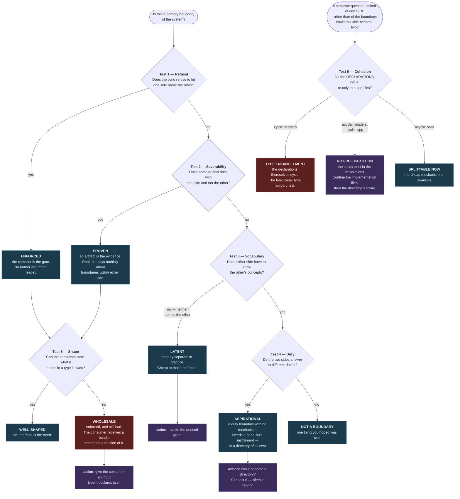
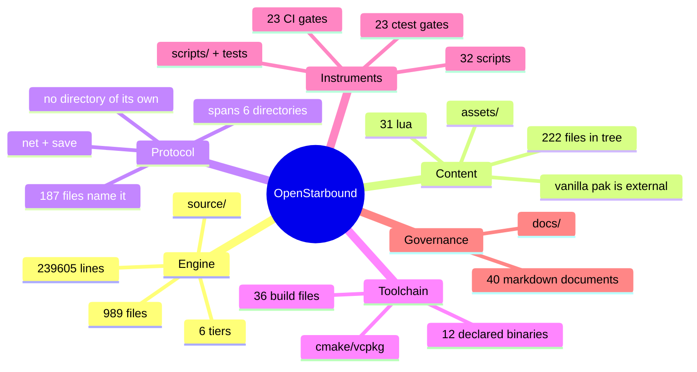
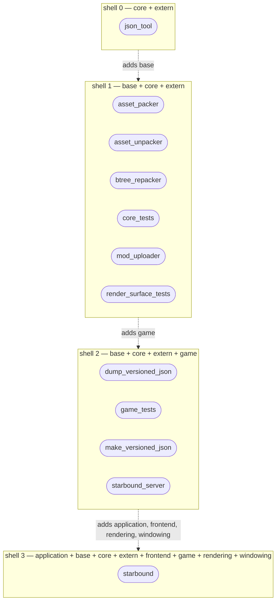
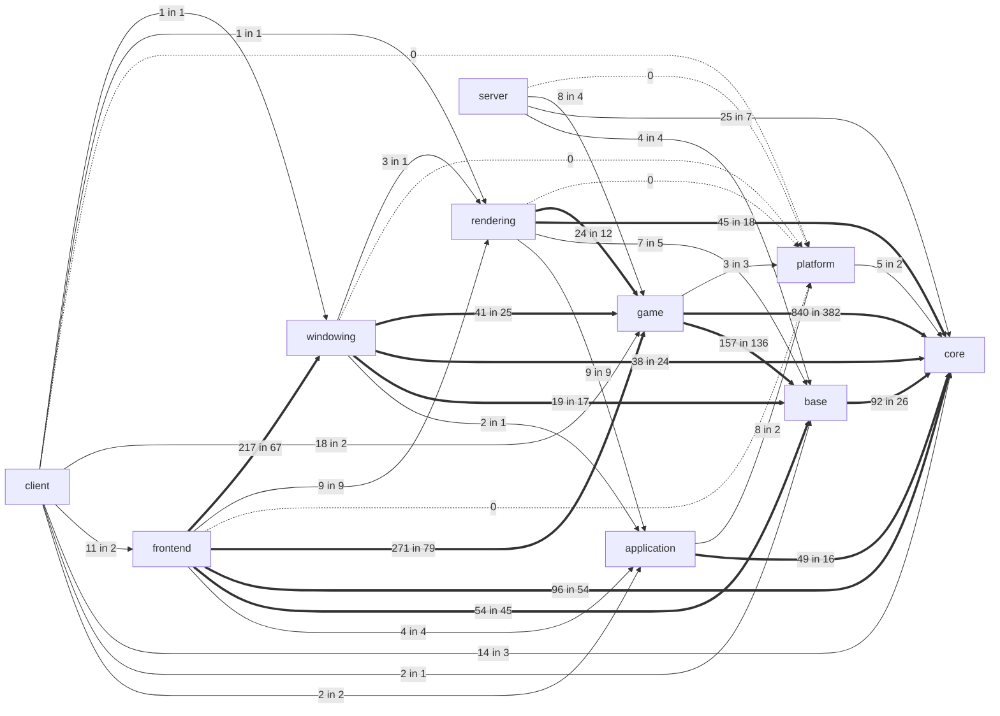
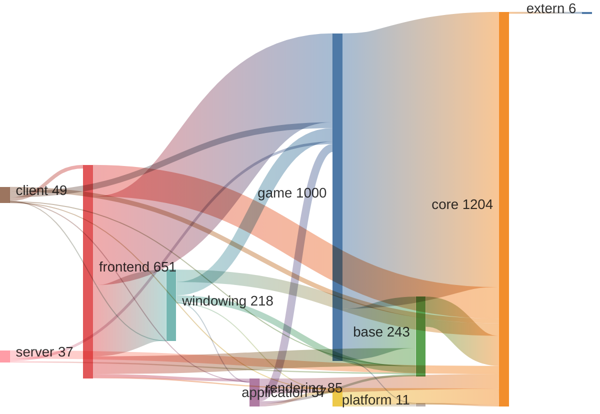
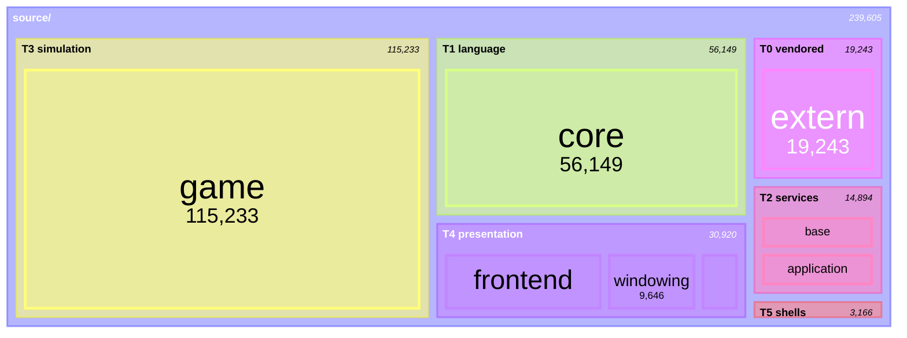
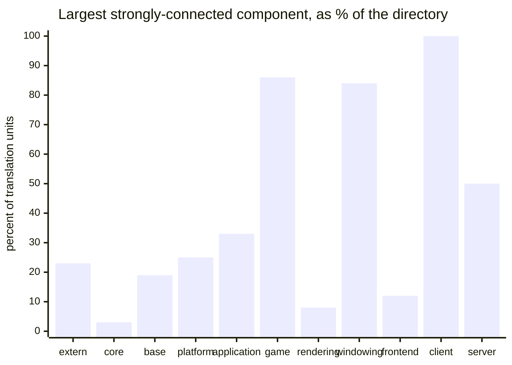
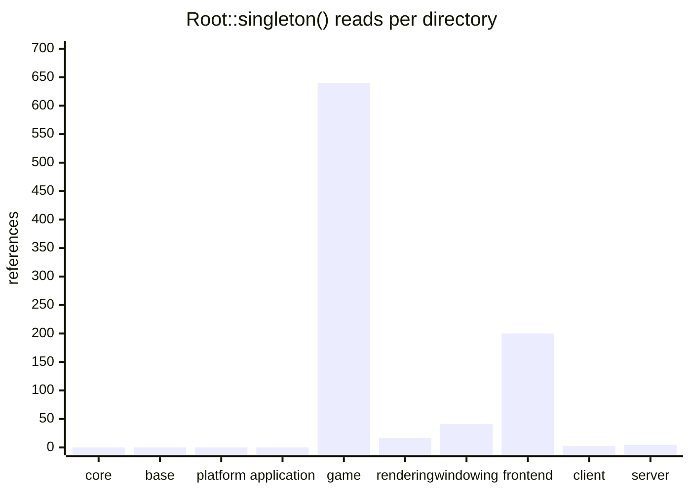
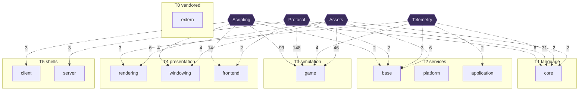
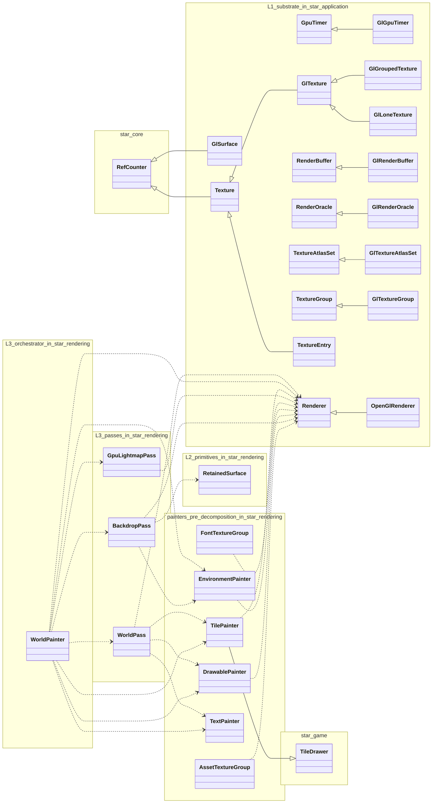

# The system's boundaries, and the evidence for each

**Scope:** the whole of OpenStarbound, not the render subsystem. `docs/render/` describes one tier of one
of the six parts named below; this document is the map that tier sits inside.

**Freshness basis:** every diagram and table below except one is **generated** by
`scripts/arch-graph.py --inject` and gated by the `arch_graph_fresh` ctest and the `Gates` workflow. The
exception is §1's determination method, which is hand-authored, contains no measurable fact, and
deliberately has no marker.

This follows the rule `docs/render/README.md` states and the render campaign learned the hard way:

> No document may state a current-state number that an instrument can measure.

A Mermaid edge labelled with an include count is such a number. So are node sizes, tier memberships,
binary compositions and singleton counts. Everything numeric below comes out of the tree.

---

## 1. How a boundary is determined

### First, the one word this document leans on

**A grant is one line in a directory's `INCLUDE_DIRECTORIES(...)` block.** The term is used throughout
what follows and is not standard vocabulary — it is named here because nothing else in the build names
the thing, and the thing is the authority every test below appeals to.

The top-level `source/CMakeLists.txt` defines a path variable per directory:

```cmake
set(STAR_GAME_INCLUDES
    ${PROJECT_SOURCE_DIR}/game
    ${PROJECT_SOURCE_DIR}/game/interfaces
    ${PROJECT_SOURCE_DIR}/game/items
    ... )
```

Each directory's own `CMakeLists.txt` then opens by listing which of those it wants. This is all of
`source/rendering/CMakeLists.txt`'s declaration of what it may see:

```cmake
INCLUDE_DIRECTORIES (
    ${STAR_EXTERN_INCLUDES}
    ${STAR_CORE_INCLUDES}
    ${STAR_BASE_INCLUDES}
    ${STAR_GAME_INCLUDES}        # <-- one grant
    ${STAR_PLATFORM_INCLUDES}
    ${STAR_APPLICATION_INCLUDES}
    ${STAR_RENDERING_INCLUDES}
  )
```

One line is a **grant**; the block is that directory's **grant list**. Four properties make it worth a
word of its own, and each one is load-bearing somewhere below:

- **Permission, not use.** A grant can be held and never spent — §5 finds five. "Dependency" would be
  the wrong word for those, because nothing depends on anything.
- **Declared, not derived.** Somebody typed the line. It is an architectural decision that happens to
  live in a build file, which is why §1 treats it as an authority rather than an artefact.
- **Enforced by absence.** With no grant, the header is not on the search path, so a `#include` of it
  is a *file not found* compile error. Not a lint, not a warning, not a convention.
- **One-directional, and complete.** `rendering` grants itself sight of `game`; `game` has no
  reciprocal line, which is why cycles are uncompilable. And each list restates everything it wants —
  `rendering` names `core` explicitly rather than inheriting it through `game` — so the block is the
  whole statement, with nothing implicit.

"Include path" names the mechanism but not the meaning; "visibility" sounds automatic. *Grant* carries
that someone decided, and that it can be revoked.

### The tests

**Three questions, not one.** Tests 1–4 ask whether a boundary *exists*, in descending order of
evidential strength. Test 5 asks whether an existing boundary is any *good*, which is the question most
architecture work actually turns on — a boundary can be perfectly enforced and still be badly shaped,
and the first four are blind to that by construction. Test 6 asks something different again, and of a
different subject: not about a boundary at all, but about **one side of one**, and whether a new
boundary could be put inside it.



**Why this order.** Test 1 is authoritative because it is not an opinion: each directory's
`INCLUDE_DIRECTORIES` block names the layers it may see, and a `#include` outside that set is a hard
compile error. Test 2 is next because an artifact that builds is a fact about the world. Tests 3 and 4
are measurements of *pressure* rather than of structure — useful for deciding what to do next, useless
for settling whether a boundary exists.

**Tests 5 and 6 were added after the first four had been applied**, because the first four produced a
recommendation that turned out to be impossible. Test 5 (§6) grades the interface rather than the
permission. Test 6 (§9) is drawn as its own entry point rather than downstream of test 5, because it is
orthogonal: it takes a *directory* as its subject and applies whether or not shape passed.

**Test 6 then had to be corrected too**, which is why it now asks about declarations rather than about
cycles in general. Its first form measured translation units — `Foo.hpp` and `Foo.cpp` as one node —
and concluded that `game` could not be partitioned at all. Separating the two graphs inverted the
answer: the declarations are acyclic, and the cycle is entirely implementation-side. A test that
conflates *what a file declares* with *what it uses* will call a layered system a monolith. This ladder
is a record of being caught, twice, not a taxonomy designed in advance.

**What it does not measure, named rather than left as a hole.** Every test here is a snapshot. Nothing
in this document distinguishes a boundary that has been stable for a decade from one rewritten monthly,
and nothing prices what a boundary costs to move. Two candidate forms, either of which would sit beside
tests 3 and 4 as a pressure measurement rather than a structural one:

- **Churn** — commits touching each side, and commits touching both. Free from git history, and the
  cheapest available proxy for where design pressure actually lives.
- **Blast radius** — how many translation units rebuild when a boundary moves. Computable from the
  include graph already measured in §5, and arguably the better of the two: it prices a boundary rather
  than merely observing it.

Neither is built, so **neither is drawn as a rung.** A test in the diagram that no instrument executes
would make the picture assert a method nobody runs — the same defect as a document stating a number
nobody re-measures. Tests 5 and 6 earned their place by falsifying a recommendation this document had
already made. A seventh gets a node when it has done the same.

The most important consequence sits between tests 1 and 4: **the compiler enforces boundaries between
directories and enforces nothing within one.** Every instrument in `scripts/` is a hand-built substitute
for include visibility, applied below directory granularity, in the two directories where the render
decomposition invented layers the build does not know about.

---

## 2. The system at the top — six parts, one of which is code

<!-- BEGIN GENERATED: scripts/arch-graph.py#taxonomy -->


A mindmap because this genuinely is a tree: six independent children of one root with no cross-links. Five of the six are invisible to any tool that only reads `source/`.
<!-- END GENERATED: taxonomy -->

Only the first is what people mean by "the codebase". The other five are versioned separately, fail
separately, and are invisible to any tool that reads only `source/`. The **protocol** in particular has
no directory anywhere and no owner — see §11.

---

## 3. The engine on disk, and the grant lattice over it

Everything below is about relationships between directories — edges, tiers, layers. This is the one
view of plain **containment**, and it comes first because the rest of the document is unreadable
without knowing what the directories actually are.

<!-- BEGIN GENERATED: scripts/arch-graph.py#tree -->
```
source/
├── extern/          T0    18 files    19,243 lines
│   ├── curve25519/      vendored — excluded from every count here
│   ├── fmt/             vendored — excluded from every count here
│   └── lua/             vendored — excluded from every count here
├── core/            T1   216 files    56,149 lines
│   └── scripting/          2 files       258 lines
├── base/            T2    29 files     7,380 lines
│   └── scripting/          2 files        55 lines
├── platform/        T2     4 files       142 lines
├── application/     T2    25 files     7,372 lines
│   └── discord/         vendored — excluded from every count here
├── game/            T3   500 files   115,233 lines
│   ├── interfaces/        47 files     3,123 lines
│   ├── items/             30 files     4,070 lines
│   ├── objects/           10 files     1,285 lines
│   ├── scripting/         49 files     9,773 lines
│   └── terrain/           26 files       980 lines
├── rendering/       T4    23 files     4,413 lines
├── windowing/       T4    61 files     9,646 lines
├── frontend/        T4   102 files    16,861 lines
├── client/          T5     4 files     2,383 lines
├── server/          T5     7 files       783 lines
├── json_tool/       —      4 files       877 lines   ← outside the tier lattice; measured by nothing here
├── mod_uploader/    —      6 files       544 lines   ← outside the tier lattice; measured by nothing here
├── test/            —     69 files    13,204 lines   ← outside the tier lattice; measured by nothing here
│   └── gtest/           vendored — excluded from every count here
└── utility/         —     17 files     1,849 lines   ← outside the tier lattice; measured by nothing here
```

**Every directory that holds code of ours, at every depth — and no files.** Counts are recursive and exclude vendored subtrees, matching every other number in this document. Vendored trees are named but not descended into, since the whole subtree is out of scope and listing its internals would be noise about code that is not ours. Set those aside and the tree is only 2 levels deep: the engine's structure is flatter than its size suggests, which is itself the finding — `source/game` carries 500 files with exactly five subdirectories and no boundary between them.

Two things this view exists to make impossible to miss. **Subdirectories hide real code** — `arch-graph.py` walked past every one of them until 2026-07-26, and `source/game` alone hid 162 files and 19,230 lines from every number this document published. And **4 top-level directories (96 files) sit outside the tier lattice entirely**: `json_tool`, `mod_uploader`, `test`, `utility`. They are real code that `TIERS` does not name, so no test in this document covers them. That is a scope boundary, and it should be visible rather than inferred from an absence.
<!-- END GENERATED: tree -->

Three things are worth noticing before the edges.

**`game/scripting` is the largest subdirectory in the engine.** The Lua binding surface — which §11
identifies as a subsystem with no home, no owner and no gate — is not a handful of files but a
substantial body of code one level down. That materially raises the priority of §11's open question.

**The shape of the `game` problem becomes concrete.** Five subdirectories, all inside a single grant
list, none of them a boundary. They look like structure and enforce nothing; §9 explains why they
cannot currently be made to.

**Four top-level directories sit outside the tier lattice**, and therefore outside every measurement in
this document. `test` is the substantial one. They are excluded because `TIERS` does not name them —
they are tools and tests rather than engine layers — but that is a scope decision, and a reader should
see it stated rather than have to infer it from an absence.

### What the compiler permits

This is test 1, drawn. Arrows are granted visibility, transitively reduced.

<!-- BEGIN GENERATED: scripts/arch-graph.py#lattice -->


Arrows point from consumer to provider and are **transitively reduced** -- `game` is granted `core` directly, but the edge is implied through `base` and drawing it adds no information. Node fill is `Root::singleton()` density: green is zero, red is over 250.
<!-- END GENERATED: lattice -->

Two things to read off it.

**The graph is acyclic, and that is not discipline.** A reciprocal pair would be uncompilable, so the
absence of cycles across the whole tree is a property of the build, not of anyone's restraint.

**`application` is not a presentation library.** It is granted `core` and `platform` and nothing else —
it cannot see `base`, cannot see `game`. It is a *sibling of `base`*, and the only reason it appears at
the top of every hand-drawn layer diagram in this repository is that nothing except the client needs a
window. The lattice has two incomparable branches at the services tier that only join at `rendering`;
that shape is invisible in a ladder drawing and it is the correct one.

---

## 4. Severability — what ships without what

Test 2. Each shell is a distinct set of object libraries linked by at least one declared executable.

<!-- BEGIN GENERATED: scripts/arch-graph.py#shells -->


12 declared executables fall into **4 distinct link sets**, and they are **strictly nested**. Each shell is what ships without everything below it: the existence of `starbound_server` is the proof that game↔presentation is a primary boundary, and nothing in this tree proves any boundary *within* presentation, because those four libraries appear together in exactly one binary.
<!-- END GENERATED: shells -->

`starbound_server` is the whole argument for game↔presentation being a primary boundary: the simulation
runs to completion with no render code linked at all. Note carefully what the shells do **not** prove.
The presentation libraries appear together in exactly one binary, so severability is silent on every
boundary inside them — which is precisely why the render decomposition had to build its own instruments.

`render_surface_tests` is the deliberate exception: it links the services shell and then splices two
`application` translation units in directly, so that L1 can be exercised without dragging in the
simulation. It is the only artifact in the tree that treats an intra-directory layer as a real boundary.

---

## 5. Granted versus spent

The sharpest diagram here, and the one to act on. Three edge states, three native Mermaid arrow weights.

<!-- BEGIN GENERATED: scripts/arch-graph.py#grantuse -->


Edge labels are `includes in files`. **Dotted** is a granted permission spent zero times -- 5 of them, free to revoke. **Solid** is thin: used in 9 files or fewer, a bounded cut. **Thick** is load-bearing. Counts: 5 unused, 19 thin, 13 load-bearing. Grants of `extern` are omitted -- all are unused, because `extern` is reached through `core`.

| edge | includes | files | state |
|:-----|---------:|------:|:------|
| `client → platform` | 0 | 0 | UNUSED -- revocable |
| `frontend → platform` | 0 | 0 | UNUSED -- revocable |
| `rendering → platform` | 0 | 0 | UNUSED -- revocable |
| `server → platform` | 0 | 0 | UNUSED -- revocable |
| `windowing → platform` | 0 | 0 | UNUSED -- revocable |
| `client → rendering` | 1 | 1 | thin |
| `client → windowing` | 1 | 1 | thin |
| `client → base` | 2 | 1 | thin |
| `windowing → application` | 2 | 1 | thin |
| `windowing → rendering` | 3 | 1 | thin |
| `client → application` | 2 | 2 | thin |
| `platform → core` | 5 | 2 | thin |
| `application → platform` | 8 | 2 | thin |
| `client → frontend` | 11 | 2 | thin |
| `client → game` | 18 | 2 | thin |
| `game → platform` | 3 | 3 | thin |
| `client → core` | 14 | 3 | thin |
| `frontend → application` | 4 | 4 | thin |
| `server → base` | 4 | 4 | thin |
| `server → game` | 8 | 4 | thin |
| `rendering → base` | 7 | 5 | thin |
| `server → core` | 25 | 7 | thin |
| `frontend → rendering` | 9 | 9 | thin |
| `rendering → application` | 9 | 9 | thin |
| `rendering → game` | 24 | 12 | load-bearing |
| `application → core` | 49 | 16 | load-bearing |
| `windowing → base` | 19 | 17 | load-bearing |
| `rendering → core` | 45 | 18 | load-bearing |
| `windowing → core` | 38 | 24 | load-bearing |
| `windowing → game` | 41 | 25 | load-bearing |
| `base → core` | 92 | 26 | load-bearing |
| `frontend → base` | 54 | 45 | load-bearing |
| `frontend → core` | 96 | 54 | load-bearing |
| `frontend → windowing` | 217 | 67 | load-bearing |
| `frontend → game` | 271 | 79 | load-bearing |
| `game → base` | 157 | 136 | load-bearing |
| `game → core` | 840 | 382 | load-bearing |
<!-- END GENERATED: grantuse -->

**Dotted edges are free money.** A granted permission spent zero times costs nothing to revoke and
ratchets the boundary in the one place the compiler will hold it. This is the cheapest enforcement
available anywhere in the system.

**Thin edges are the design questions.** Each is a boundary that is nearly severable already. The
threshold is on *files touched* rather than include count, because files predict the work of cutting an
edge and include counts do not.

---

## 6. Shape — how much of what crosses is actually needed

Test 5, and the one axis §§3–5 are structurally blind to. They ask whether a boundary is *permitted*
and *used*. This asks whether what travels across it is an interface or a bundle.

<!-- BEGIN GENERATED: scripts/arch-graph.py#shape -->
| type | owner | width | consumer | reads | fit | verdict |
|:-----|:------|------:|:---------|------:|----:|:--------|
| `RadioMessage` | `game` | 14 | `frontend/StarChat.cpp` | 1 | 7% | **WHOLESALE** |
| `WorldRenderData` | `game` | 23 | `rendering/StarTilePainter.cpp` | 3 | 13% | **WHOLESALE** |
| `WorldRenderData` | `game` | 23 | `rendering/StarWorldPass.cpp` | 6 | 26% | **WHOLESALE** |
| `RadioMessage` | `game` | 14 | `frontend/StarMainInterface.cpp` | 4 | 29% | **WHOLESALE** |
| `RadioMessage` | `game` | 14 | `frontend/StarRadioMessagePopup.cpp` | 7 | 50% | partial |
| `WorldRenderData` | `game` | 23 | `rendering/StarWorldPainter.cpp` | 20 | 87% | fitted |
| `ItemRecipe` | `game` | 10 | `frontend/StarCraftingInterface.cpp` | 9 | 90% | fitted |
| `RenderTile` | `game` | 16 | `rendering/StarTilePainter.cpp` | 16 | 100% | fitted |

Data-dominant structs of 8+ members, declared outside a foundation library, read by a consumer in a **different tier**. `width` is declared members; `reads` is how many the consumer names via `.` or `->`. 8 crossings measured: **4 wholesale**, 1 partial, 3 fitted.

The filters carry the meaning. **Classes are excluded**: for a class, a consumer using two of fifty-nine members is encapsulation working, not a defect — an earlier cut of this measurement without that filter reported five such "findings" and every one was wrong. Same-tier crossings are excluded because wide sharing inside a tier is the point of being in one.
<!-- END GENERATED: shape -->

**`WorldRenderData` is the exemplar, and it is more interesting than it first looks.** Measured against
`source/rendering` as a whole its fit is 21 of 23 — the render library broadly needs the whole frame
model, and at directory granularity nothing is wrong. The defect only appears per consumer: the
orchestrator reads almost all of it, and then hands the same 23-member aggregate down to passes that
read six and three. Each pass receives the whole frame to do a fraction of the work.

That is exactly what Air-Gap contract ① exists to fix, and the fix pattern is already in the tree —
`WorldPass` declares a four-member `Input` of its own. The metric says how much is left rather than
whether to start.

**A metric that only ever complains is not measuring anything.** This one also finds well-shaped
crossings: `RenderTile` at 16 of 16 into `TilePainter`, `LiquidCellEngineParameters` at 11 of 11. Those
are types shaped to their consumer, and they are the standard the wholesale rows are being held to.

---

## 7. Weighted coupling

The same edges, with magnitude instead of buckets.

<!-- BEGIN GENERATED: scripts/arch-graph.py#sankey -->


**Magnitude only -- this is not a flow.** Sankey implies conservation and include counts do not conserve: `game → core` at 840 and `base → core` at 92 do not "arrive at" core in any meaningful sense. It is here because it is the only form that shows the dynamic range the three-state diagram above deliberately flattens.
<!-- END GENERATED: sankey -->

---

## 8. Mass, and the one directory that is a continent

<!-- BEGIN GENERATED: scripts/arch-graph.py#mass -->


`treemap-beta` is a beta diagram type; the table is the drift-proof fallback and carries the same numbers.

| tier | directory | files | lines | share |
|:-----|:----------|------:|------:|------:|
| T0 vendored | `extern` | 18 | 19,243 | 8.0% |
| T1 language | `core` | 216 | 56,149 | 23.4% |
| T2 services | `base` | 29 | 7,380 | 3.1% |
| T2 services | `platform` | 4 | 142 | 0.1% |
| T2 services | `application` | 25 | 7,372 | 3.1% |
| T3 simulation | `game` | 500 | 115,233 | 48.1% |
| T4 presentation | `rendering` | 23 | 4,413 | 1.8% |
| T4 presentation | `windowing` | 61 | 9,646 | 4.0% |
| T4 presentation | `frontend` | 102 | 16,861 | 7.0% |
| T5 shells | `client` | 4 | 2,383 | 1.0% |
| T5 shells | `server` | 7 | 783 | 0.3% |

`game` is **48% of the engine in one directory** -- one grant list, no sub-`CMakeLists.txt`, and therefore no internal boundary the compiler can enforce.
<!-- END GENERATED: mass -->

**Read these as directories, not layers — they are not the same partition.** The load-bearing example
is the render decomposition. `source/rendering` is exactly L2 + L3 passes + L3 orchestrator + painters,
every file claimed and nothing else in it. But **L1, the GL-owning substrate, is not in that box at
all** — it lives in `source/application`, a different box in a *lower* tier, and one that is only about
half render: the rest is the SDL main loop and the Steam platform services.

So the render decomposition's own layers are **not contiguous in the tier lattice**. L1 sits *below*
`game`; L2 and L3 sit *above* it. That is correct rather than broken — L1 is a GL substrate that must
not see the simulation, while an L3 pass must consume `WorldRenderData`, which is a game type. But it
means "the render subsystem" is not a place in the tree. It is a duty spanning two directories on
opposite sides of the simulation, which is exactly why it needs the hand-built instruments named at the
end of §1, and why §13 labels every layer with the library it actually lives in.

`game` is the structural problem this document exists to name. It is a single directory with a single
grant list and no sub-`CMakeLists.txt`, which means **no boundary inside it is enforceable by test 1**.
Its natural clusters are legible in the filenames — entities and items, world simulation, universe and
networking. Whether those clusters are *separable* is a different question, and §9 answers it.

---

## 9. Cohesion — is there a cut to make at all?

Test 6. The obvious response to §8 is "give `game` sub-directories with their own grant lists". This
section exists because that recommendation was in this document, stated as costing "no behavioural
change at all", and it was wrong. Before proposing a partition, measure whether one exists — and
measure the right graph, because the first version of this section got *that* wrong too and concluded
something stronger than its evidence supported.

<!-- BEGIN GENERATED: scripts/arch-graph.py#cohesion -->


| directory | units | edges | cycle: all edges | share | cycle: headers only | can it be split? |
|:----------|------:|------:|-----------------:|------:|--------------------:|:-----------------|
| `extern` | 13 | 12 | 3 | 23% | 3 | **type-level entanglement** |
| `core` | 154 | 473 | 5 | 3% | 1 | yes, freely |
| `base` | 16 | 11 | 3 | 19% | 1 | partly, as it stands |
| `platform` | 4 | 0 | 1 | 25% | 1 | n/a — too small |
| `application` | 15 | 23 | 5 | 33% | 1 | partly, as it stands |
| `game` | 264 | 1562 | 226 | 86% | 1 | **not by moving files** — see below |
| `rendering` | 12 | 17 | 1 | 8% | 1 | yes, freely |
| `windowing` | 31 | 89 | 26 | 84% | 1 | **not by moving files** — see below |
| `frontend` | 51 | 88 | 6 | 12% | 1 | yes, freely |
| `client` | 2 | 2 | 2 | 100% | 1 | n/a — too small |
| `server` | 4 | 4 | 2 | 50% | 1 | n/a — too small |

A translation unit is `StarFoo.hpp` + `StarFoo.cpp` as one node. **Two graphs over the same nodes, answering different questions.** *All edges* asks whether these files could be moved into sub-directories as they stand — a cycle blocks that, because a grant list cannot be handed to a directory whose files include across the proposed boundary. *Headers only* asks whether the **declarations** are hierarchical, which is what decides whether a decomposition is possible at all.

**The header column is 1 for every directory of our own code.** Not "low" — one node. `source/game`'s declaration graph is entirely acyclic, and so is `windowing`'s. Every cycle in the first column is therefore implementation-side: `A.cpp` includes `B.hpp` while `B.cpp` includes `A.hpp`, which is a cycle between translation units and no cycle at all between types. Where that matters most: `game`, `windowing`.

`extern` is the one header-cyclic row and it is not ours — vendored C libraries with mutually-including headers, which is ordinary for that code and outside the scope of anything here.

That distinction decides the shape of the work. A library boundary is enforced on **headers** — a `.cpp` reaching across a boundary is what a boundary is *for* — so an acyclic declaration graph means the strata already exist and nobody has drawn them. Reading them out and confining each stratum's implementation files is a different and far more tractable problem than breaking a 226-node cycle, and it can be done one stratum at a time with each step provable.
<!-- END GENERATED: cohesion -->

Four things fall out, and the first is a correction to what this section used to say.

**`game` has no *free* partition — which is not the same as no partition.** An earlier version of this
section read the first column alone and concluded that `game`'s cycle had to be broken before anything
could move: "a sustained refactor of the simulation's type graph". That overstated the evidence.
Translation-unit granularity conflates a *declaration* with a *use*, and once the two are separated
the picture inverts: **`game`'s header graph is completely acyclic.** The 226-unit cycle is entirely
`A.cpp` ↔ `B.hpp` traffic — implementation files legitimately using many things, which is what
implementation files do.

So the accurate statement is narrower and much more hopeful. Files cannot be moved into sub-directories
*as they stand*, because a grant list cannot be handed to a directory whose `.cpp` files include across
the proposed boundary. But the strata that a decomposition would need **already exist in the
declarations** — nobody has drawn them. That is a reading-and-confining problem, doable one stratum at
a time with each step provable, not type surgery.

**`windowing` is in the same state**, at smaller scale, and nobody had noticed because nobody had looked.

**The render decomposition succeeded because `rendering` was already acyclic at both levels.** The
campaign's hardest structural achievement — L1/L2/L3, the passes, the sovereign substrate — was
possible because the substrate permitted it. Feasibility was a property of the ground, not of the plan.
That remains true, and it is the reason to measure the ground before promising a plan.

**The instruments are still the only enforcement available today**, because a cut that exists in the
declarations is not a cut the build can be told about until the implementation files are confined.
`layering-lint.py` and its siblings look like substitutes for a cheap mechanism nobody bothered to use;
for `game` and `windowing` they are holding a line the compiler cannot yet be asked to hold.

**Two caveats, since this correction was itself produced in one pass.** `#include` is a coarse proxy: it
cannot see template instantiation across a boundary, and it cannot see runtime coupling through `Root`'s
databases, which is real and which no graph here measures. And removing `Root` from the first graph only
takes `game` from 86% to 66% — the translation-unit entanglement is broad rather than one hub, so
"confining the implementation files" is a large body of work even though it is a tractable kind.

---

## 10. Reach — where the god-object is visible

<!-- BEGIN GENERATED: scripts/arch-graph.py#reach -->


**Read the zeros carefully.** `Root` lives in `source/game`. `core`, `base`, `platform`, `application` read zero because they are not granted `game` and therefore *cannot see it* -- that is a consequence of the grant list, not a property anyone earned. The render campaign's L1 sovereignty is a different and narrower claim: an *internal* split of `source/application` that no compiler checks and `layering-lint.py` does.

| directory | files reading Root | references |
|:----------|-------------------:|-----------:|
| `game` | 136 | 640 |
| `frontend` | 42 | 200 |
| `windowing` | 17 | 41 |
| `rendering` | 4 | 17 |
| `server` | 3 | 4 |
| `client` | 1 | 2 |
| `core` | 0 | 0 |
| `base` | 0 | 0 |
| `platform` | 0 | 0 |
| `application` | 0 | 0 |
<!-- END GENERATED: reach -->

---

## 11. The subsystems with no directory

Tests 1, 2 and 3 are all directory-shaped and structurally cannot see a concern that spans directories.
These are found by reading duty, which is why the vocabulary is declared in the script rather than
discovered by it.

<!-- BEGIN GENERATED: scripts/arch-graph.py#crosscut -->


Edge labels are files naming the concern. Single-file touches are elided (4 of them) to keep the picture legible.

| concern | files | directories | tiers | why it has no home |
|:--------|------:|------------:|------:|:-------------------|
| **Scripting** | 128 | 6 | 5 of 6 | Lua VM is 4 files in core; the binding surface is spread across six directories |
| **Protocol** | 187 | 6 | 5 of 6 | wire format and save format, versioned independently of the code that reads them |
| **Telemetry** | 15 | 6 | 5 of 6 | the measurement substrate the perf campaign runs on |
| **Assets** | 66 | 7 | 5 of 6 | loader in base, consumed everywhere, content lives outside the tree entirely |
<!-- END GENERATED: crosscut -->

Each of these is a real subsystem with a real interface and no home. The scripting surface is the
starkest: the Lua VM is a handful of files in `core`, and the bindings that define what mods can actually
*do* are scattered across the tier stack with no single place to read them.

---

## 12. Inside the presentation tier — three directories, three duties

The lattice treats T4 as one row. It is three directories doing three different jobs, and the
difference is not written down anywhere else in this repository.

<!-- BEGIN GENERATED: scripts/arch-graph.py#presentation -->
| directory | files | lines | duty | names `game` |
|:----------|------:|------:|:-----|-------------:|
| `rendering` | 23 | 4,413 | draws the WORLD — tiles, entities, lighting, parallax, sky | 24 includes in 12 files |
| `windowing` | 61 | 9,646 | a WIDGET TOOLKIT — layout, hit-testing, focus, key bindings, widget trees from JSON | 41 includes in 25 files |
| `frontend` | 102 | 16,861 | THIS GAME'S SCREENS — inventory, crafting, quests, chat, menus, built from widgets | 271 includes in 79 files |

**Two draw paths, not one.** `windowing/StarGuiContext.hpp` holds its own `RendererPtr` alongside a `TextPainterPtr`, `DrawablePainterPtr` and `AssetTextureGroupPtr`. So the frame reaches the GPU twice over: the world through `WorldPainter` and the L3 passes, and the interface through `GuiContext` and the painters. That single file is the entire `windowing → rendering` edge.

Which `source/rendering` headers are consumed from **outside** `source/rendering`:

| header | consumed by | what that means |
|:-------|:------------|:----------------|
| `StarAssetTextureGroup.hpp` | `frontend`, `windowing` | **UI draw path** — shared infrastructure, not render-internal |
| `StarDrawablePainter.hpp` | `windowing` | **UI draw path** — shared infrastructure, not render-internal |
| `StarEnvironmentPainter.hpp` | `frontend` | `frontend` only — mixed; see the note below |
| `StarTextPainter.hpp` | `frontend`, `windowing` | **UI draw path** — shared infrastructure, not render-internal |
| `StarWorldPainter.hpp` | `client`, `frontend` | `frontend` only — mixed; see the note below |

This is the standing answer to a question the render decomposition never resolved. **3 of these serve the UI path as well as the world path**, so they are not render-subsystem-internal and decomposing them into L3 would have broken the interface. The painters were never leftover work; they are a shared service that happens to live in `source/rendering`.

The rows are deliberately not given one verdict, because they are not one thing. `client` **owns** a `WorldPainterPtr` — that is the composition root, and expected. `frontend` mostly passes that pointer through (`MainMixer::setWorldPainter`, `WirePane`'s constructor) rather than reaching into render internals. But `TitleScreen.cpp` constructs an `EnvironmentPainter` outright, which is a genuine second consumer. Include-level measurement cannot separate *passes a handle* from *draws with it*; those three cases are named here rather than flattened into a verdict this instrument has not earned.

Where the `windowing`/`frontend` duty line blurs — toolkit files naming a simulation **noun**. Ambient services (`Root`, `GameTypes`, `ImageMetadataDatabase` and friends) are excluded: `Root` alone appears in seventeen of these files and would bury the signal under the god-object §10 already measures.

| file in `source/windowing` | game types it names |
|:---------------------------|:--------------------|
| `StarItemGridWidget.hpp` | `Item`, `ItemBag` |
| `StarItemSlotWidget.cpp` | `DurabilityItem`, `Item` |
| `StarItemSlotWidget.hpp` | `Animation` |
| `StarLargeCharPlateWidget.cpp` | `Player` |
| `StarPane.cpp` | `ItemDatabase` |
| `StarPane.hpp` | `ItemDatabase` |
| `StarPortraitWidget.hpp` | `Player` |
| `StarWidgetLuaBindings.cpp` | `ItemDatabase` |

**A widget that knows what an `Item` is is not a toolkit widget** — it is a frontend widget in the wrong directory. These 8 files are where the `windowing → game` edge that §5 marks load-bearing actually comes from.

**Before acting on that, read §9.** `windowing` is one strongly-connected component, so these files may be entangled with the toolkit rather than cleanly liftable. Extraction is a different operation from partition and may well be possible — but assuming so without measuring is exactly the mistake §9 exists to stop repeating.
<!-- END GENERATED: presentation -->

The duty line that holds is `rendering` versus the other two: it draws the world and knows nothing
about a widget, a pane or a button. The line that does **not** hold is `windowing` versus `frontend` —
a widget toolkit should name none of the simulation's nouns, and this one names several, with `Pane`
itself (the base class every screen inherits) among them.

---

## 13. The render subsystem, and the one edge that leaves it

The only place in this document where inheritance is the actual relationship, so the only place a
`classDiagram` is the right form. Layers are namespaces; the library each layer lives in is noted in
`docs/render/architecture-3-target-state.md`.

<!-- BEGIN GENERATED: scripts/arch-graph.py#renderclasses -->


`classDiagram` earns its place here and nowhere else in this document, because inheritance is the actual relationship rather than a metaphor for one. `<|--` is inheritance; `..>` is a compile-time dependency between render layers, drawn between each file's representative class.

**28 declared types are not drawn** because they participate in no edge -- vertex PODs, parameter structs and ring buffers. They are listed rather than dropped: L1 substrate: `AtlasPlacement`, `Effect`, `EffectParameter`, `EffectTexture`, `Face`, `FrameSpanRing`, `GlEffects`, `GlPackedVertexData`, `GlPass`, `GlRenderVertex`, `GlTargets`, `GlVertexBuffer`, `GlVertexBufferTexture`, `RenderPoly`, `RenderQuad`, `RenderTriangle`, `RenderVertex`, `Ring`, `TextureAtlas`; L2 primitives: `ContentKey`; L3 passes: `BackdropParams`, `Input`, `LightmapParams`, `LightmapResult`; painters (pre-decomposition): `GlyphTexture`, `LiquidInfo`, `TextPositioning`, `TextureKeyHash`.

Every inheritance edge in the render tree, and where the base class lives:

| child | inherits | child's layer | base declared in | verdict |
|:------|:---------|:--------------|:-----------------|:--------|
| `GlGpuTimer` | `GpuTimer` | L1 substrate | `star_application` | internal |
| `GlGroupedTexture` | `GlTexture` | L1 substrate | `star_application` | internal |
| `GlLoneTexture` | `GlTexture` | L1 substrate | `star_application` | internal |
| `GlRenderBuffer` | `RenderBuffer` | L1 substrate | `star_application` | internal |
| `GlRenderOracle` | `RenderOracle` | L1 substrate | `star_application` | internal |
| `GlSurface` | `RefCounter` | L1 substrate | `star_core` | foundation base -- intended use |
| `GlTexture` | `Texture` | L1 substrate | `star_application` | internal |
| `GlTextureAtlasSet` | `TextureAtlasSet` | L1 substrate | `star_application` | internal |
| `GlTextureGroup` | `TextureGroup` | L1 substrate | `star_application` | internal |
| `OpenGlRenderer` | `Renderer` | L1 substrate | `star_application` | internal |
| `Texture` | `RefCounter` | L1 substrate | `star_core` | foundation base -- intended use |
| `TextureEntry` | `Texture` | L1 substrate | `star_application` | internal |
| `TilePainter` | `TileDrawer` | painters (pre-decomposition) | `star_game` | **leaves the render subsystem for the simulation** |

Of 13 inheritance edges, 10 stay inside the render libraries, 2 take a base from a foundation library (`RefCounter` and friends -- that is what foundations are for), and **1 leaves the subsystem entirely**: `TilePainter : TileDrawer` (`star_game`). That last one is why `WorldPass` cannot finish its input DTO and why the client has no headless expression -- a render class whose base is a simulation class cannot be compiled without the simulation.
<!-- END GENERATED: renderclasses -->

---

## 14. What the measurement says to do

**Ordered by value, not by cost** — an earlier version of this list was ordered cheapest-first, which
put a near-worthless item at the top and buried the only one that matters. Cost is stated separately
because it is a different question from worth. Numbers live in the generated blocks; these are the
judgements.

**1. Break `TilePainter : TileDrawer`.** (§13 · cost: days · the highest value-per-effort in the list.)
One inheritance edge, and it is the single reason `WorldPass` cannot close its input contract and the
client has no headless expression. A render class whose base is a simulation class cannot be compiled
without the simulation. Tracked as #191.

**2. Give the render passes input types they own.** (§6 · cost: days each · unblocks the above.) The
wholesale rows in the shape table are consumers receiving a 23-member frame model to read three or six
fields. `WorldPass::Input` already demonstrates the pattern; the remaining work is applying it, and each
application shrinks what the game↔render boundary has to carry.

**3. Decide whether scripting and protocol get homes.** (§11 · cost: weeks to design, unknown to
execute · largest un-audited surface in the system.) Together they are hundreds of files defining the
mod API and the save/wire compatibility contract, with no directory, no owner and no gate. Nothing here
measures them because no instrument is shaped to. That is a gap in this document, not a low priority.

**4. Draw `game`'s latent strata, then confine them.** (§9 · cost: months · highest ceiling, and less
risky than it looked.) **`game`'s declaration graph is already acyclic** — the strata a decomposition
needs exist today and nobody has read them out. What blocks a partition is not the type graph but the
implementation files: a sub-directory cannot be given a grant list while its `.cpp` files include across
the proposed boundary.

So the work is neither a `CMakeLists.txt` per cluster (that is the *last* step, trivial once the rest is
done) nor breaking a 226-node type cycle (there isn't one). It is: read the header DAG for natural
strata, pick the most peripheral, confine that stratum's implementation includes, and only then give it
a directory. Incremental, one stratum at a time, each step provable — and each step reversible if the
stratum turns out to be wrong.

Two things still make it months rather than weeks. Removing `Root` moves the translation-unit
entanglement from 86% to only 66%, so the confinement work is broad rather than concentrated on one hub.
And `#include` cannot see runtime coupling through `Root`'s databases, which is real and unmeasured —
the first deliverable is still a feasibility study, but now it is a study of *which stratum to start
with* rather than of whether a cut exists at all.

**5. Cut the thinnest edges.** (§5 · cost: hours · small but real.) `windowing → rendering` is three
includes in one file. Each cut removes a grant and makes the lattice shallower. Genuine, minor.

**6. Revoke the unused grants.** (§5, dotted edges · cost: minutes · **hygiene, not progress**.) These
forbid things nobody does. Revoking changes no behaviour, removes no coupling and enables no work; it
only prevents a hypothetical future. Worth doing, worth doing last, and worth not mistaking for
architecture.

### The rule underneath, corrected

The earlier version of this document ended: *"to make a boundary real, make it a directory with its own
grant list — the cheapest enforcement mechanism in the system."* That is true, and §9 shows it is
**unavailable exactly where it would matter most.** `game` and `windowing` cannot be partitioned today
at any price short of breaking their cycles.

So the honest rule has two halves:

> Where a cut exists, make it a directory with its own grant list — the compiler is free and permanent.
> **Where no cut exists, a hand-built instrument is not a workaround; it is the only enforcement
> available**, and the campaign's ratchets are what a boundary looks like when the cheap mechanism is
> out of reach.

---

## Regenerating, and what fails if you don't

```
scripts/arch-graph.py                    # every block to stdout
scripts/arch-graph.py --facts            # machine-readable JSON
scripts/arch-graph.py --inject docs/architecture/system-boundaries.md
scripts/arch-graph.py --check  docs/architecture/system-boundaries.md
```

`--check` runs as the `arch_graph_fresh` ctest and in `.github/workflows/gates.yml`. It compares each
generated block against a freshly measured one and fails if any disagrees.

The generator also refuses to run at all in two situations rather than drawing something misleading:

- **ambiguous header basenames** — include attribution resolves headers by basename, so two files with
  the same name in different directories would silently mis-attribute edges;
- **a tier table contradicting the grants** — `TIERS` in the script is the one editorial claim in the
  structural diagrams, and if a directory's grants ever point up a tier, the script says so instead of
  drawing a lattice that is wrong in a way no reader could detect.

**Related:** `docs/render/README.md` (the render subsystem's own index), `docs/board.md` (task ids cited
in commit messages).
