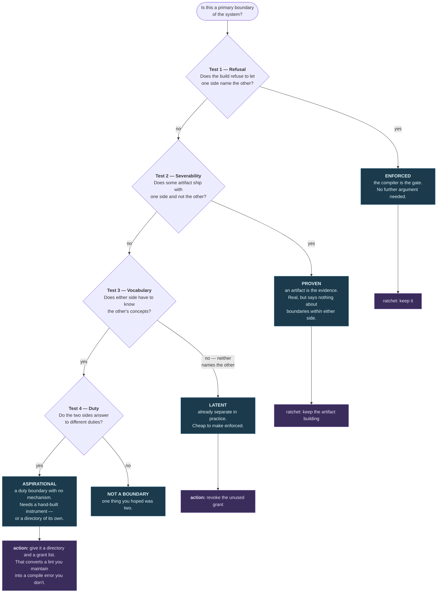
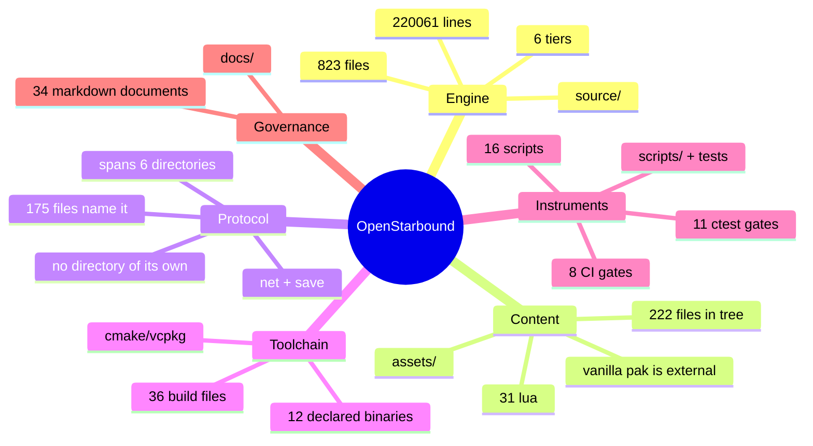
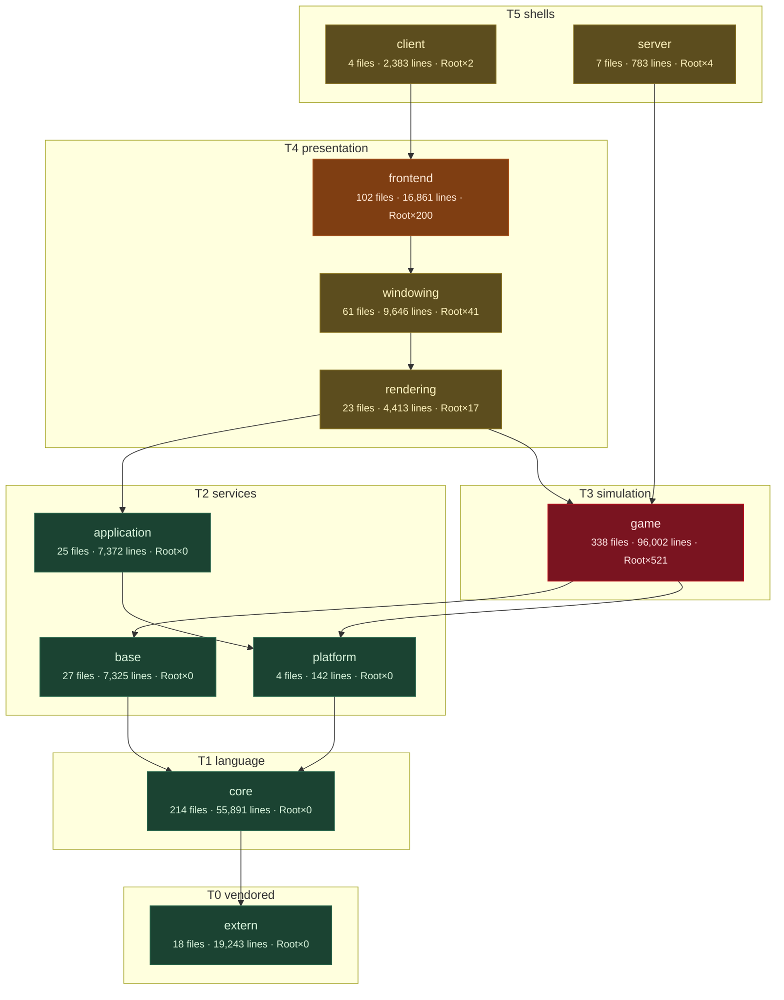
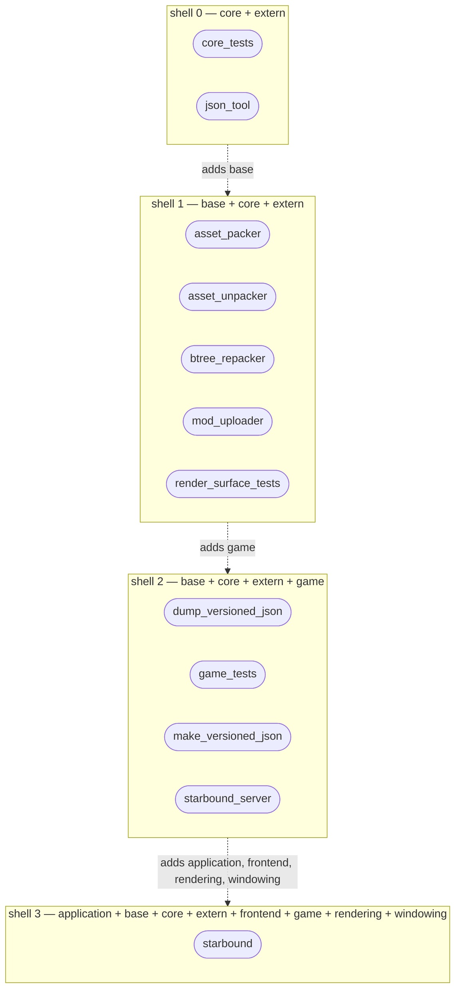
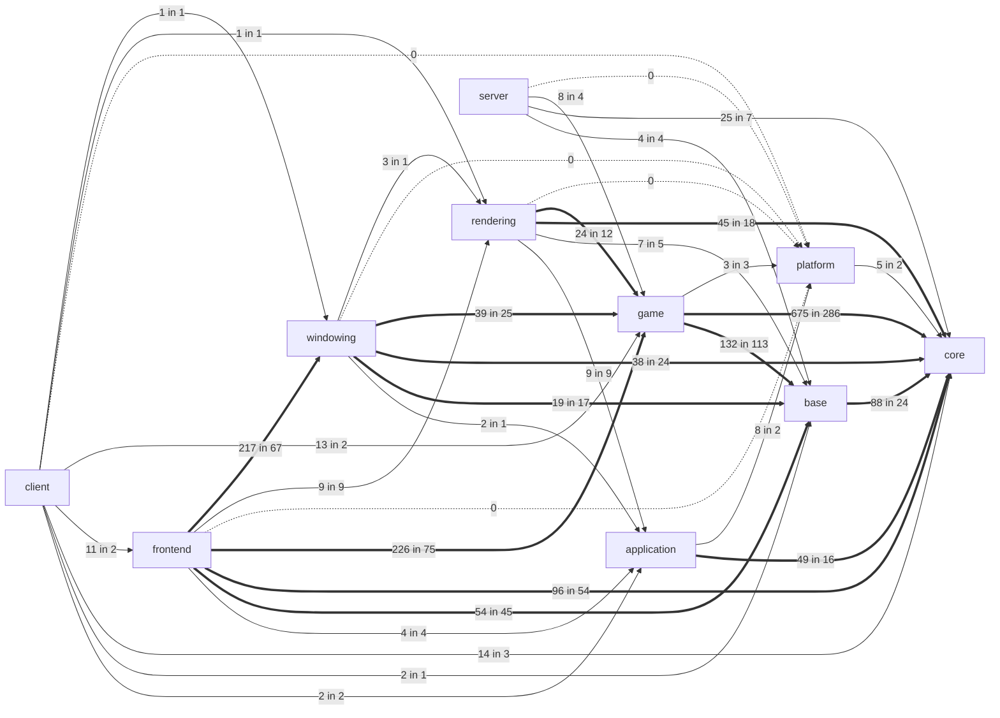
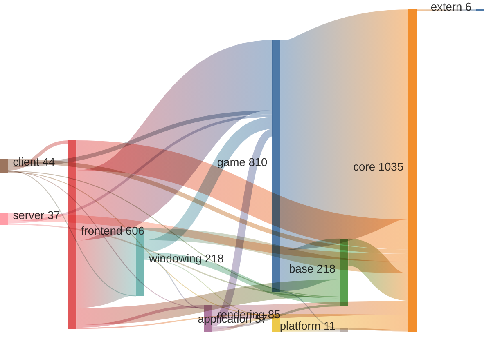
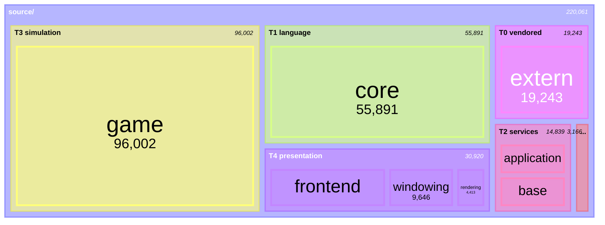
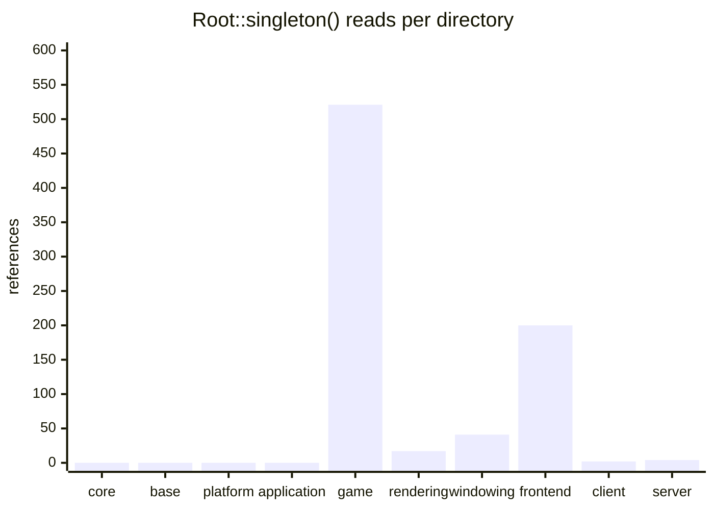
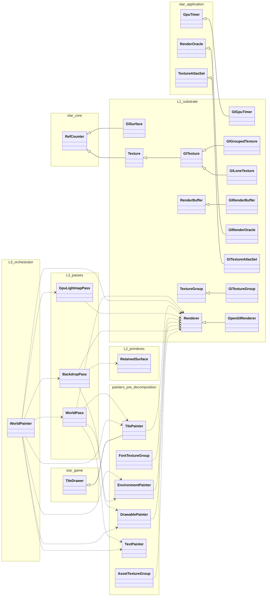

# The system's boundaries, and the evidence for each

**Scope:** the whole of OpenStarbound, not the render subsystem. `docs/render/` describes one tier of one
of the six parts named below; this document is the map that tier sits inside.

**Freshness basis:** nine of the ten diagrams are **generated** by `scripts/arch-graph.py --inject` and
gated by the `arch_graph_fresh` ctest and the `Gates` workflow. The tenth — the determination method —
is hand-authored, contains no measurable fact, and deliberately has no marker.

This follows the rule `docs/render/README.md` states and the render campaign learned the hard way:

> No document may state a current-state number that an instrument can measure.

A Mermaid edge labelled with an include count is such a number. So are node sizes, tier memberships,
binary compositions and singleton counts. Everything numeric below comes out of the tree.

---

## 1. How a boundary is determined

Four tests, in descending order of evidential strength. The order matters: a boundary that passes test 1
needs no argument, and a boundary that only passes test 4 is a proposal rather than a fact.



**Why this order.** Test 1 is authoritative because it is not an opinion: each directory's
`INCLUDE_DIRECTORIES` block names the layers it may see, and a `#include` outside that set is a hard
compile error. Test 2 is next because an artifact that builds is a fact about the world. Tests 3 and 4
are measurements of *pressure* rather than of structure — useful for deciding what to do next, useless
for settling whether a boundary exists.

The most important consequence sits between tests 1 and 4: **the compiler enforces boundaries between
directories and enforces nothing within one.** Every instrument in `scripts/` is a hand-built substitute
for include visibility, applied below directory granularity, in the two directories where the render
decomposition invented layers the build does not know about.

---

## 2. The system at the top — six parts, one of which is code

<!-- BEGIN GENERATED: scripts/arch-graph.py#taxonomy -->


A mindmap because this genuinely is a tree: six independent children of one root with no cross-links. Five of the six are invisible to any tool that only reads `source/`.
<!-- END GENERATED: taxonomy -->

Only the first is what people mean by "the codebase". The other five are versioned separately, fail
separately, and are invisible to any tool that reads only `source/`. The **protocol** in particular has
no directory anywhere and no owner — see §8.

---

## 3. The grant lattice — what the compiler permits

This is test 1, drawn. Arrows are granted visibility, transitively reduced.

<!-- BEGIN GENERATED: scripts/arch-graph.py#lattice -->


Arrows point from consumer to provider and are **transitively reduced** -- `game` is granted `core` directly, but the edge is implied through `base` and drawing it adds no information. Node fill is `Root::singleton()` density: green is zero, red is over 250.
<!-- END GENERATED: lattice -->

Two things to read off it.

**The graph is acyclic, and that is not discipline.** A reciprocal pair would be uncompilable, so the
absence of cycles across the whole tree is a property of the build, not of anyone's restraint.

**`application` is not a presentation library.** It is granted `core` and `platform` and nothing else —
it cannot see `base`, cannot see `game`. It is a *sibling of `base`*, and the only reason it appears at
the top of every hand-drawn layer diagram in this repository is that nothing except the client needs a
window. The lattice has two incomparable branches at the services tier that only join at `rendering`;
that shape is invisible in a ladder drawing and it is the correct one.

---

## 4. Severability — what ships without what

Test 2. Each shell is a distinct set of object libraries linked by at least one declared executable.

<!-- BEGIN GENERATED: scripts/arch-graph.py#shells -->


12 declared executables fall into **4 distinct link sets**, and they are **strictly nested**. Each shell is what ships without everything below it: the existence of `starbound_server` is the proof that game↔presentation is a primary boundary, and nothing in this tree proves any boundary *within* presentation, because those four libraries appear together in exactly one binary.
<!-- END GENERATED: shells -->

`starbound_server` is the whole argument for game↔presentation being a primary boundary: the simulation
runs to completion with no render code linked at all. Note carefully what the shells do **not** prove.
The presentation libraries appear together in exactly one binary, so severability is silent on every
boundary inside them — which is precisely why the render decomposition had to build its own instruments.

`render_surface_tests` is the deliberate exception: it links the services shell and then splices two
`application` translation units in directly, so that L1 can be exercised without dragging in the
simulation. It is the only artifact in the tree that treats an intra-directory layer as a real boundary.

---

## 5. Granted versus spent

The sharpest diagram here, and the one to act on. Three edge states, three native Mermaid arrow weights.

<!-- BEGIN GENERATED: scripts/arch-graph.py#grantuse -->


Edge labels are `includes in files`. **Dotted** is a granted permission spent zero times -- 5 of them, free to revoke. **Solid** is thin: used in 9 files or fewer, a bounded cut. **Thick** is load-bearing. Counts: 5 unused, 19 thin, 13 load-bearing. Grants of `extern` are omitted -- all are unused, because `extern` is reached through `core`.

| edge | includes | files | state |
|:-----|---------:|------:|:------|
| `client → platform` | 0 | 0 | UNUSED -- revocable |
| `frontend → platform` | 0 | 0 | UNUSED -- revocable |
| `rendering → platform` | 0 | 0 | UNUSED -- revocable |
| `server → platform` | 0 | 0 | UNUSED -- revocable |
| `windowing → platform` | 0 | 0 | UNUSED -- revocable |
| `client → rendering` | 1 | 1 | thin |
| `client → windowing` | 1 | 1 | thin |
| `client → base` | 2 | 1 | thin |
| `windowing → application` | 2 | 1 | thin |
| `windowing → rendering` | 3 | 1 | thin |
| `client → application` | 2 | 2 | thin |
| `platform → core` | 5 | 2 | thin |
| `application → platform` | 8 | 2 | thin |
| `client → frontend` | 11 | 2 | thin |
| `client → game` | 13 | 2 | thin |
| `game → platform` | 3 | 3 | thin |
| `client → core` | 14 | 3 | thin |
| `frontend → application` | 4 | 4 | thin |
| `server → base` | 4 | 4 | thin |
| `server → game` | 8 | 4 | thin |
| `rendering → base` | 7 | 5 | thin |
| `server → core` | 25 | 7 | thin |
| `frontend → rendering` | 9 | 9 | thin |
| `rendering → application` | 9 | 9 | thin |
| `rendering → game` | 24 | 12 | load-bearing |
| `application → core` | 49 | 16 | load-bearing |
| `windowing → base` | 19 | 17 | load-bearing |
| `rendering → core` | 45 | 18 | load-bearing |
| `windowing → core` | 38 | 24 | load-bearing |
| `base → core` | 88 | 24 | load-bearing |
| `windowing → game` | 39 | 25 | load-bearing |
| `frontend → base` | 54 | 45 | load-bearing |
| `frontend → core` | 96 | 54 | load-bearing |
| `frontend → windowing` | 217 | 67 | load-bearing |
| `frontend → game` | 226 | 75 | load-bearing |
| `game → base` | 132 | 113 | load-bearing |
| `game → core` | 675 | 286 | load-bearing |
<!-- END GENERATED: grantuse -->

**Dotted edges are free money.** A granted permission spent zero times costs nothing to revoke and
ratchets the boundary in the one place the compiler will hold it. This is the cheapest enforcement
available anywhere in the system.

**Thin edges are the design questions.** Each is a boundary that is nearly severable already. The
threshold is on *files touched* rather than include count, because files predict the work of cutting an
edge and include counts do not.

---

## 6. Weighted coupling

The same edges, with magnitude instead of buckets.

<!-- BEGIN GENERATED: scripts/arch-graph.py#sankey -->


**Magnitude only -- this is not a flow.** Sankey implies conservation and include counts do not conserve: `game → core` at 675 and `base → core` at 88 do not "arrive at" core in any meaningful sense. It is here because it is the only form that shows the dynamic range the three-state diagram above deliberately flattens.
<!-- END GENERATED: sankey -->

---

## 7. Mass, and the one directory that is a continent

<!-- BEGIN GENERATED: scripts/arch-graph.py#mass -->


`treemap-beta` is a beta diagram type; the table is the drift-proof fallback and carries the same numbers.

| tier | directory | files | lines | share |
|:-----|:----------|------:|------:|------:|
| T0 vendored | `extern` | 18 | 19,243 | 8.7% |
| T1 language | `core` | 214 | 55,891 | 25.4% |
| T2 services | `base` | 27 | 7,325 | 3.3% |
| T2 services | `platform` | 4 | 142 | 0.1% |
| T2 services | `application` | 25 | 7,372 | 3.3% |
| T3 simulation | `game` | 338 | 96,002 | 43.6% |
| T4 presentation | `rendering` | 23 | 4,413 | 2.0% |
| T4 presentation | `windowing` | 61 | 9,646 | 4.4% |
| T4 presentation | `frontend` | 102 | 16,861 | 7.7% |
| T5 shells | `client` | 4 | 2,383 | 1.1% |
| T5 shells | `server` | 7 | 783 | 0.4% |

`game` is **44% of the engine in one directory** -- one grant list, no sub-`CMakeLists.txt`, and therefore no internal boundary the compiler can enforce.
<!-- END GENERATED: mass -->

`game` is the structural problem this document exists to name. It is a single directory with a single
grant list and no sub-`CMakeLists.txt`, which means **no boundary inside it is enforceable by test 1**.
Its natural clusters are legible in the filenames — entities and items, world simulation, universe and
networking — and nothing whatsoever holds them apart. It is the same situation as the render painters,
at roughly twenty times the scale.

---

## 8. Reach — where the god-object is visible

<!-- BEGIN GENERATED: scripts/arch-graph.py#reach -->


**Read the zeros carefully.** `Root` lives in `source/game`. `core`, `base`, `platform`, `application` read zero because they are not granted `game` and therefore *cannot see it* -- that is a consequence of the grant list, not a property anyone earned. The render campaign's L1 sovereignty is a different and narrower claim: an *internal* split of `source/application` that no compiler checks and `layering-lint.py` does.

| directory | files reading Root | references |
|:----------|-------------------:|-----------:|
| `game` | 111 | 521 |
| `frontend` | 42 | 200 |
| `windowing` | 17 | 41 |
| `rendering` | 4 | 17 |
| `server` | 3 | 4 |
| `client` | 1 | 2 |
| `core` | 0 | 0 |
| `base` | 0 | 0 |
| `platform` | 0 | 0 |
| `application` | 0 | 0 |
<!-- END GENERATED: reach -->

---

## 9. The subsystems with no directory

Tests 1, 2 and 3 are all directory-shaped and structurally cannot see a concern that spans directories.
These are found by reading duty, which is why the vocabulary is declared in the script rather than
discovered by it.

<!-- BEGIN GENERATED: scripts/arch-graph.py#crosscut -->


Edge labels are files naming the concern. Single-file touches are elided (4 of them) to keep the picture legible.

| concern | files | directories | tiers | why it has no home |
|:--------|------:|------------:|------:|:-------------------|
| **Scripting** | 72 | 6 | 5 of 6 | Lua VM is 4 files in core; the binding surface is spread across six directories |
| **Protocol** | 175 | 6 | 5 of 6 | wire format and save format, versioned independently of the code that reads them |
| **Telemetry** | 15 | 6 | 5 of 6 | the measurement substrate the perf campaign runs on |
| **Assets** | 57 | 7 | 5 of 6 | loader in base, consumed everywhere, content lives outside the tree entirely |
<!-- END GENERATED: crosscut -->

Each of these is a real subsystem with a real interface and no home. The scripting surface is the
starkest: the Lua VM is a handful of files in `core`, and the bindings that define what mods can actually
*do* are scattered across the tier stack with no single place to read them.

---

## 10. The render subsystem, and the one edge that leaves it

The only place in this document where inheritance is the actual relationship, so the only place a
`classDiagram` is the right form. Layers are namespaces; the library each layer lives in is noted in
`docs/render/architecture-3-target-state.md`.

<!-- BEGIN GENERATED: scripts/arch-graph.py#renderclasses -->


`classDiagram` earns its place here and nowhere else in this document, because inheritance is the actual relationship rather than a metaphor for one. `<|--` is inheritance; `..>` is a compile-time dependency between render layers, drawn between each file's representative class.

**26 declared types are not drawn** because they participate in no edge -- vertex PODs, parameter structs and ring buffers. They are listed rather than dropped: L1 substrate: `Effect`, `EffectParameter`, `EffectTexture`, `Face`, `FrameSpanRing`, `GlEffects`, `GlPackedVertexData`, `GlPass`, `GlRenderVertex`, `GlTargets`, `GlVertexBuffer`, `GlVertexBufferTexture`, `RenderPoly`, `RenderQuad`, `RenderTriangle`, `RenderVertex`, `Ring`; L2 primitives: `ContentKey`; L3 passes: `BackdropParams`, `Input`, `LightmapParams`, `LightmapResult`; painters (pre-decomposition): `GlyphTexture`, `LiquidInfo`, `TextPositioning`, `TextureKeyHash`.

Every inheritance edge in the render tree, and where the base class lives:

| child | inherits | child's layer | base declared in | verdict |
|:------|:---------|:--------------|:-----------------|:--------|
| `GlGpuTimer` | `GpuTimer` | L1 substrate | `star_application` | internal |
| `GlGroupedTexture` | `GlTexture` | L1 substrate | `star_application` | internal |
| `GlLoneTexture` | `GlTexture` | L1 substrate | `star_application` | internal |
| `GlRenderBuffer` | `RenderBuffer` | L1 substrate | `star_application` | internal |
| `GlRenderOracle` | `RenderOracle` | L1 substrate | `star_application` | internal |
| `GlSurface` | `RefCounter` | L1 substrate | `star_core` | foundation base -- intended use |
| `GlTexture` | `Texture` | L1 substrate | `star_application` | internal |
| `GlTextureAtlasSet` | `TextureAtlasSet` | L1 substrate | `star_application` | internal |
| `GlTextureGroup` | `TextureGroup` | L1 substrate | `star_application` | internal |
| `OpenGlRenderer` | `Renderer` | L1 substrate | `star_application` | internal |
| `Texture` | `RefCounter` | L1 substrate | `star_core` | foundation base -- intended use |
| `TilePainter` | `TileDrawer` | painters (pre-decomposition) | `star_game` | **leaves the render subsystem for the simulation** |

Of 12 inheritance edges, 9 stay inside the render libraries, 2 take a base from a foundation library (`RefCounter` and friends -- that is what foundations are for), and **1 leaves the subsystem entirely**: `TilePainter : TileDrawer` (`star_game`). That last one is why `WorldPass` cannot finish its input DTO and why the client has no headless expression -- a render class whose base is a simulation class cannot be compiled without the simulation.
<!-- END GENERATED: renderclasses -->

---

## 11. What the measurement says to do

Ordered by cost, cheapest first. Numbers live in the generated blocks above; these are the judgements.

1. **Revoke every unused grant** (§5, dotted edges). Zero risk, zero behaviour change, and it moves the
   boundary from "nobody happens to use it" to "the compiler forbids it".
2. **Cut the thinnest edges** (§5). `windowing → rendering` is the smallest live cross-tier edge in the
   tree by files touched. Each cut removes a grant and makes the lattice shallower.
3. **Break the `TilePainter : TileDrawer` inheritance** (§10). One edge, and it is the reason `WorldPass`
   cannot close its input contract and the client has no headless expression. Tracked as #191.
4. **Give `game` internal boundaries** (§7). Not a refactor — a `CMakeLists.txt` per cluster and a grant
   list each. This is the single highest-leverage structural change available, and it costs no
   behavioural change at all.
5. **Decide whether the cross-cutting subsystems get homes** (§9). Scripting and protocol are the two
   that would benefit; both are currently un-auditable because no instrument is shaped to see them.

The general rule underneath all five: **to make a boundary real, make it a directory with its own grant
list.** That converts a lint we maintain into a compile error we do not. It is the cheapest enforcement
mechanism in the system, and outside the tiers that already exist, nothing uses it.

---

## Regenerating, and what fails if you don't

```
scripts/arch-graph.py                    # every block to stdout
scripts/arch-graph.py --facts            # machine-readable JSON
scripts/arch-graph.py --inject docs/architecture/system-boundaries.md
scripts/arch-graph.py --check  docs/architecture/system-boundaries.md
```

`--check` runs as the `arch_graph_fresh` ctest and in `.github/workflows/gates.yml`. It compares each
generated block against a freshly measured one and fails if any disagrees.

The generator also refuses to run at all in two situations rather than drawing something misleading:

- **ambiguous header basenames** — include attribution resolves headers by basename, so two files with
  the same name in different directories would silently mis-attribute edges;
- **a tier table contradicting the grants** — `TIERS` in the script is the one editorial claim in the
  structural diagrams, and if a directory's grants ever point up a tier, the script says so instead of
  drawing a lattice that is wrong in a way no reader could detect.

**Related:** `docs/render/README.md` (the render subsystem's own index), `docs/board.md` (task ids cited
in commit messages).
