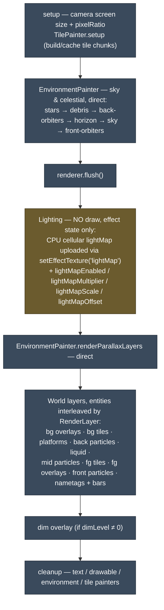
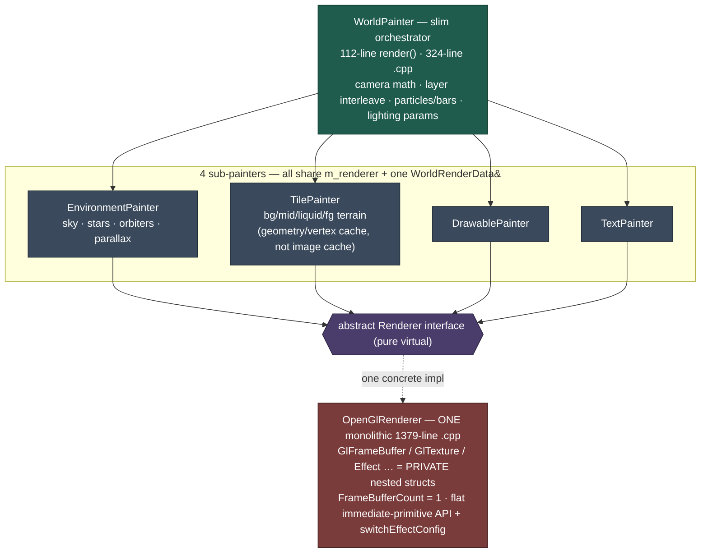

# Render Architecture — Vanilla Baseline

The pristine upstream OpenStarbound render pipeline at commit `2ea33530` ("binds: merge duplicate category ids") — the state **before the entire kubebound campaign**.

**Panel 1 of 3:** 🕰️ vanilla (here) → [🧱 accreted monolith](architecture-2-accreted-monolith.md) → [🏗️ decomposed target](architecture-3-target-state.md).

> ### The decomposition re-extracts *our own* accretion — it does not untangle upstream.
> Pristine `WorldPainter` was **already a slim orchestrator**: a **112-line** `render()`, a **324-line** file, four sub-painters, and **zero** retained caches. The campaign's perf machinery — env + parallax retained caches, the GPU-lightmap dispatch, and the config-read bloat, ~550 added lines — is what fused it into today's **876-line** god-object. Steps 3+ pull that machinery back out into sovereign passes, restoring the orchestrator's original slimness **while keeping every measured perf win.**

---

## The vanilla frame — everything drawn directly, every frame

The lightmap is **CPU-computed on the game thread** (cellular lighting), handed to the frame as `WorldRenderData.lightMap`, and consumed implicitly by the `world` shader. There is **no GPU lighting pass** and **no `lightMapBorder`**.

## The vanilla structure — a slim orchestrator on a monolithic renderer

The only renderer abstraction upstream ships is the `Renderer` interface + its single `OpenGlRenderer`. The API `WorldPainter` uses is essentially **flat immediate-mode** (`immediatePrimitives` / `render(RenderPrimitive)` / `flush`) plus a **global named-effect shader swap** (`switchEffectConfig("world")`). There is **no** `setRenderTarget`, `composite`, `clearRenderTarget`, or `setEffectTextureFromTarget` — those, and the sovereign L1 GL classes, are all campaign additions.

---

## What the campaign added, and what the decomposition does with it

| Concern | Vanilla `2ea33530` | Campaign added (our fork) | Decomposition target |
|---|---|---|---|
| **Orchestrator** | slim `WorldPainter` — 112-line `render()`, 324-line file | bloated to **876 lines** (cache bookkeeping + GPU dispatch + config reads inline) | thin orchestrator again, 5 sovereign modules beneath |
| **Lighting** | CPU cellular lightmap → `lightMap` shader texture | `GpuLightmapPass` (GPU spread + point + cap), `lightMapBorder` | ✅ `LightmapPass` — explicit `LightmapResult` |
| **Sky / env** | drawn direct every frame | `envCache` retained FBO (N-cadence refresh) | `BackdropPass` owns a `RetainedSurface` |
| **Parallax** | drawn direct every frame | `parallaxCache` retained FBO (park + content key) | `BackdropPass` owns a `RetainedSurface` |
| **Renderer substrate** | GL helpers = private nested structs in 1 monolith; `FrameBufferCount=1` | sovereign L1 (`GlTargets`/`GlPass`/`GlEffects`/`GlRenderSurface`), multi-FBO | ✅ L1 (done) |
| **Render-target / compose API** | none — flat primitives + `switchEffectConfig` (shader swap) | `setRenderTarget` · `composite` · `clearRenderTarget` · `setEffectTextureFromTarget` · `gpuTimer` | renderer API, retained |
| **Sub-step hand-off** | shared renderer state + one `WorldRenderData&` + `flush()` | + mutated GL state between the new caches/passes | explicit per-pass DTOs + outputs (Air-Gap) |

## Presence / absence at `2ea33530`

| Concept | State |
|---|---|
| Abstract `Renderer` interface + single `OpenGlRenderer` | **EXISTS** (upstream) |
| Sovereign L1 GL* substrate classes | **ABSENT** — private nested structs in one 1379-line .cpp |
| `GpuLightmapPass` / GPU lighting compute | **ABSENT** — CPU lightmap upload only |
| `lightMapBorder` | **ABSENT** |
| env cache · parallax cache · `RetainedSurface` | **ABSENT** — everything drawn directly each frame |
| `setRenderTarget` · `composite` · `clearRenderTarget` · `setEffectTextureFromTarget` | **ABSENT** |
| per-pass input DTOs · explicit pass output structs | **ABSENT** — one frame-wide `WorldRenderData&`, hand-off via shared state |
| named effect configs / `switchEffectConfig` (shader swap) | **EXISTS** (not render targets) |

*Source: read-only archaeology of the blob tree at `2ea33530`; structural claims (112-line `render()`, abstract-interface presence, absence of the render-target API) spot-verified against the commit.*
