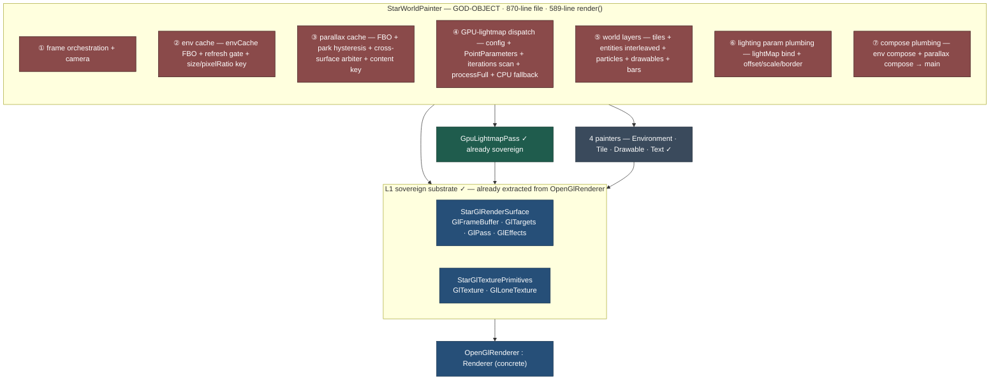

# Render Architecture — The Accreted Monolith

The kubebound fork at the decomposition branch point `75d29067` — **peak optimization, peak tangle**. This is the direct "before" of the decomposition: every perf win the campaign banked is here, all fused into one god-object *orchestrator*.

This is the **middle panel** of three: [vanilla baseline](architecture-1-vanilla-baseline.md) 🕰️ → **this monolith** → [decomposed target](architecture-3-target-state.md) 🏗️.

> ### `WorldPainter::render()` is a **589-line method** (vanilla's was 112).
> The file grew 324 → **870** lines. That growth *is* the banked perf work — env + parallax retained caches, the GPU-lightmap dispatch, the cross-surface refresh arbiter, the compose plumbing — but it all lives inside one method, handing off through **mutated GL state**. The scene renders fast; the code is a knot. **The decomposition unties the knot without dropping a single win** — which is exactly why it's the platform for the *next* wave (compose-merge, per-pass static-skip).

---

## The god-object on an already-sovereign substrate

**The key asymmetry:** the *substrate* (L1) is already sovereign — the GL helpers were pulled out of the 1379-line `OpenGlRenderer` into `StarGlRenderSurface` + `StarGlTexturePrimitives` in earlier campaign work — and `GpuLightmapPass` is a sovereign pass. But the *orchestrator* on top is a god-object: concerns ②–⑦ are fused into one 589-line `render()` that hands off through mutated GL state. **The decomposition extends sovereignty upward** — from the substrate into the passes.

## What each fused concern becomes

| # | Concern (fused in the monolith) | Target module | Status |
|---|---|---|---|
| ① | frame orchestration + camera | `WorldPainter` (thin) | ✅ step 5 — `render()` 427 → 119 lines |
| ② | env cache | `BackdropPass` — owns a `RetainedSurface` | ✅ primitive extracted (1a–1d) |
| ③ | parallax cache | `BackdropPass` — owns a `RetainedSurface` | ✅ primitive extracted (1a–1d) |
| ④ | GPU-lightmap dispatch | `LightmapPass` — explicit `LightmapResult` | 🟡 result tightened; **dispatch prologue still in `WorldPainter`** |
| ⑤ | world layers | `WorldPass` (game-coupled, accepted) | ✅ step 4 |
| ⑥ | lighting param plumbing | `WorldPass` / `WorldPainter` | 🟡 passes extracted; the plumbing itself still spans both |
| ⑦ | compose plumbing | `BackdropPass` — **compose-merge lever lands here** | ✅ step 3 — CM-1 landed |

> **Status column audited 2026-07-25 against tree content at `c9b2b024`.** The *before* picture above
> (870-line file, 589-line `render()`) is correctly pinned to branch point `75d29067` and is not a claim
> about HEAD — leave it as the dated snapshot it is.
>
> Row ④ is deliberately 🟡, not ✅: the *tighten* shipped (explicit `LightmapResult`), but the dispatch itself
> — config reads, `PointParameters` assembly, the O(cells) auto-K emission scan, `shadowCompareFull` — still
> lives in `WorldPainter`, not in the pass.
>
> **Extraction is not the Air-Gap contract.** Every pass above is extracted; none is fully contract-compliant.
> See the [compliance matrix](architecture-3-target-state.md#air-gap-compliance--measured-from-the-tree).

## Why this middle panel matters most

The monolith is the moment the campaign's perf is **banked but trapped**. The decomposition is byte-identical — it adds zero perf — but it converts the *next* wins from god-object surgery into local, composable, independently-testable changes:

- **compose-merge (CM-1, measured ~2 ms/frame)** — concern ⑦ becomes a change *inside* `BackdropPass`.
- **per-pass static-skip** — "backdrop unchanged → skip `BackdropPass`" is a clean guard on a unit, not a tangle of interacting cache flags.
- **isolated optimization + unit tests per pass** — the dividend `RetainedSurface` already proved (9 off-GPU tests).

Slim-but-unoptimized → **optimized-but-tangled (here)** → optimized-and-clean, ready to build on.
