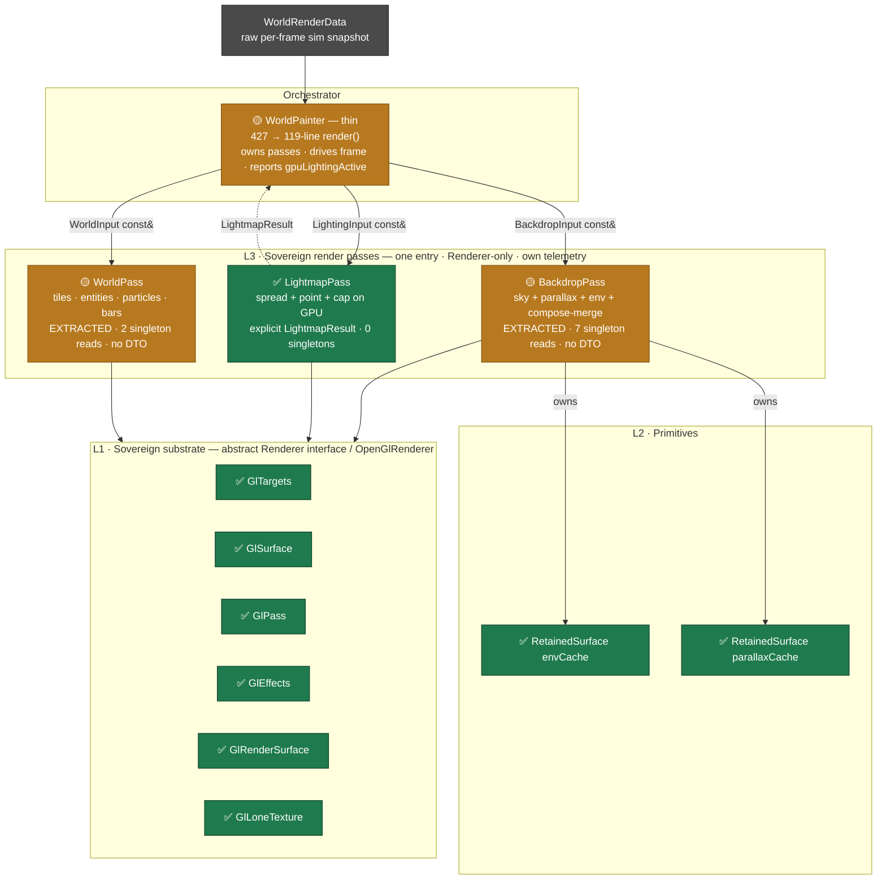
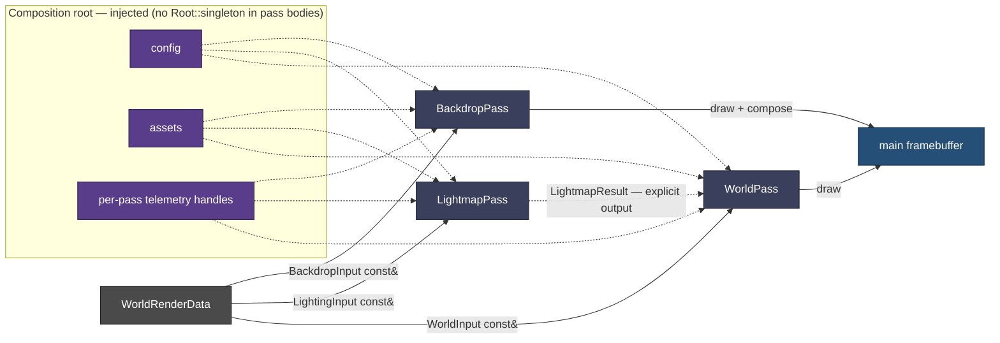

# Render Decomposition — Target-State Architecture

`StarWorldPainter` — once 876 lines fusing 7 concerns, **now 296** — decomposed into six sovereign modules across four layers. It wasn't always a god-object: the [vanilla baseline](architecture-1-vanilla-baseline.md) was a slim 112-line orchestrator, and the campaign's own perf machinery is what bloated it — so this decomposition re-extracts *our* accretion into passes, keeping the perf wins. Two views: the **static** layer/ownership stack, and the **dynamic** frame data-flow that shows the Air-Gap seam making each pass independently buildable.

**Status:** ✅ extracted & sovereign · 🔨 still to extract. Every step byte-identical + oracle-gated; all of it is now on `integration`.

> **EXTRACTION IS NOT THE SAME THING AS THE AIR-GAP CONTRACT, and this doc used to blur them.**
> A pass can be fully *extracted* — its own file, owning its own state and telemetry, with the orchestrator
> thinned around it — while still failing every Air-Gap contract, because it takes the fat struct and reaches
> for `Root::singleton()` inside its body. That is exactly where `BackdropPass` and `WorldPass` sit today.
> Read the [compliance matrix](#air-gap-compliance--measured-from-the-tree) for what is actually left; do not
> read a single ✅ on the rail as "done".
>
> *Audited 2026-07-25 against tree content at `c9b2b024`.* Two prior status errors came from inferring state
> from **structure** (a file exists ⇒ the work is done) or from **git identity** (a branch is gone ⇒ the work
> is lost). The 2026-07-19 reorg rewrote history, so pre-reorg SHAs and branch names prove nothing in either
> direction. **Verify against tree content.**

**Panel 3 of 3:** [🕰️ vanilla baseline](architecture-1-vanilla-baseline.md) → [🧱 accreted monolith](architecture-2-accreted-monolith.md) → 🏗️ decomposed target (here).

---

## View 1 — Layered structure & ownership

---

## View 2 — Frame data-flow & the Air-Gap seam

The seam is what makes a pass compile on its own: a **sliced const-ref view** instead of the fat struct, **injected** config/assets/telemetry instead of `Root::singleton()`, and an **explicit output** instead of a hand-off through mutated GL state.

---

## The four Air-Gap contracts

| Seam | Today (god-object) | Target (buildable pass) |
|---|---|---|
| **Inputs** | fat `WorldRenderData`, `#include`d by every pass | per-pass `const&` DTO *views* — `BackdropInput` / `LightingInput` / `WorldInput` |
| **Config / assets** | `Root::singleton()` reached inside method bodies | injected at construction |
| **Telemetry** | one string-keyed global smear | per-pass telemetry handles |
| **Hand-off** | passes mutate shared GL state for the next | explicit return values — e.g. `LightmapResult` |

Each contract is *simultaneously* the Air-Gap axiom fix **and** the compile-independence: remove the three buildability blockers (fat struct, singleton reads, telemetry smear) and the clean per-layer branches can be regenerated from the decomposed trunk.

### Air-Gap compliance — measured from the tree

Counts are from `c9b2b024`, and this table is the reason the rail's ticks are not the whole story: **every pass is extracted; none is fully contract-compliant.**

| pass | ① sliced input | ② no `Root::singleton` | ③ own telemetry | ④ explicit output |
|---|---|---|---|---|
| `LightmapPass` (`StarGpuLightmapPass`) | ✅ takes `ImageView`/`List` params | ✅ **0** | ✅ 3 handles | ✅ `LightmapResult` |
| `BackdropPass` | ❌ takes `WorldRenderData&` | ❌ **7** | ✅ 5 handles | n/a — draws to main FB |
| `WorldPass` | ❌ takes `WorldRenderData&` | ❌ **2** | 🟡 1 handle | n/a — draws to main FB |

**`BackdropInput` / `LightingInput` / `WorldInput` do not exist anywhere in the tree.** Contract ① is therefore unstarted as a *named type* — but `LightmapPass` already satisfies it **in substance** by taking sliced `ImageView`/`List` parameters rather than the fat struct, so for that pass the DTO is a naming convention, not outstanding work. Do not re-open it as a task.

The remaining work behind contract ② is small and countable: **7 `Root::singleton()` reads in `BackdropPass`, 2 in `WorldPass`**, to be hoisted to constructor injection. That is the concrete residual of #137 — not "extract the passes", which is done.

Contract ④ is marked n/a rather than ❌ for the two drawing passes on purpose: they render into the main framebuffer, so there is no value to hand back. The contract exists to kill *implicit* hand-off through mutated GL state, and `LightmapPass` was the only pass that had one.

## Extraction rail

`0` dead field ✅ → `1` **RetainedSurface** ✅ (1a primitive + tests · 1b env · 1c parallax · 1d exact-sentinel) → `2` **LightmapPass tighten** ✅ (explicit `LightmapResult`) → `3` **BackdropPass** ✅ *(compose-merge fell out here)* → `4` **WorldPass** ✅ → `5` **WorldPainter thins** ✅ (`render()` 427 → 119 lines). Gate each: env `MATCH/0`, parallax bounded-`MATCH ≤1 LSB`, spread `MATCH/0`, + off-GPU per-pass unit tests. Each landed step is byte-identical + oracle-gated + adversarially verified.

**The rail is complete; the Air-Gap contract is not.** Steps 0–5 were about *where the code lives* and they are done. What remains is the seam that makes each pass independently **buildable** — the DTO views and constructor injection in the [compliance matrix](#air-gap-compliance--measured-from-the-tree). Until contract ② is met, the clean per-layer branches still cannot be regenerated from the trunk, which was the whole point.

Residuals that are *not* on this rail and should not be confused with it: `GpuLightmapPass` → `LightmapPass` rename (cosmetic, matches this doc's naming); the lightmap **dispatch prologue** (config reads, `PointParameters` assembly, the O(cells) auto-K emission scan, `shadowCompareFull`) still living in `WorldPainter` rather than the pass; and the rendertest pass-ablation mask, which is deliberate instrumentation, not undone work.
