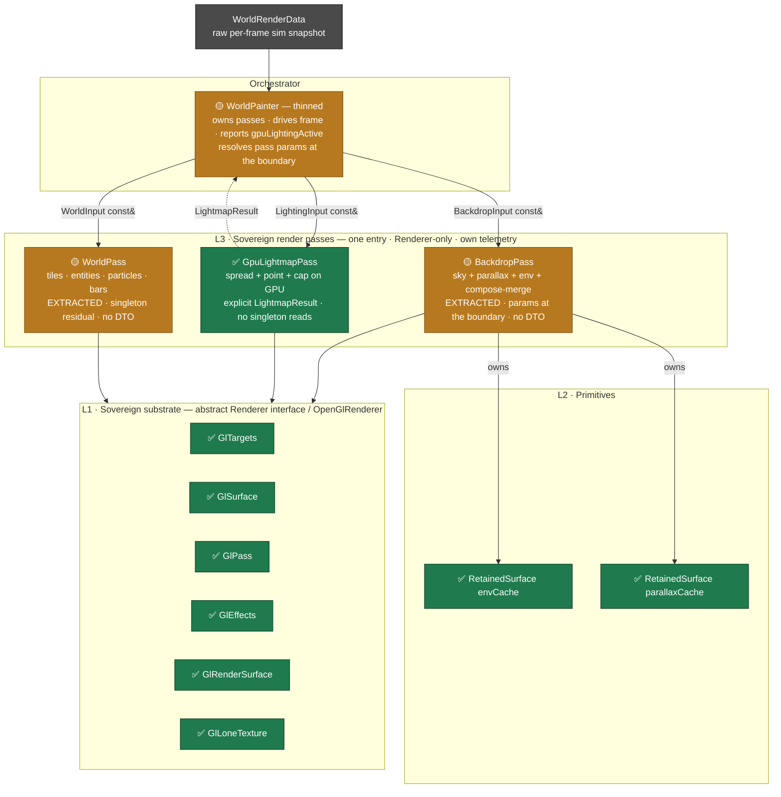
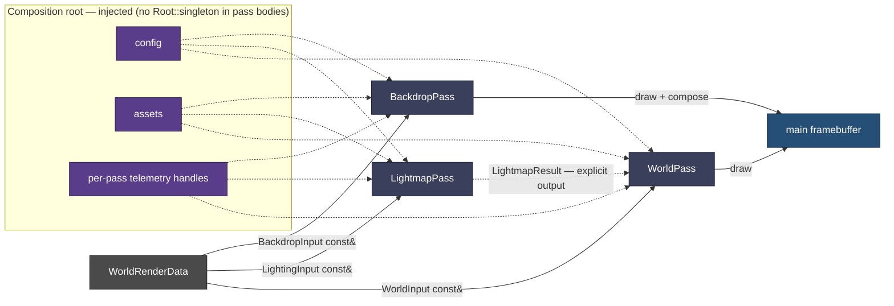

# Render Decomposition — Target-State Architecture

`StarWorldPainter` — once 876 lines fusing 7 concerns — is decomposed into six sovereign modules across four layers. It wasn't always a god-object: the [vanilla baseline](architecture-1-vanilla-baseline.md) was a slim 112-line orchestrator, and the campaign's own perf machinery is what bloated it — so this decomposition re-extracts *our* accretion into passes, keeping the perf wins. Two views: the **static** layer/ownership stack, and the **dynamic** frame data-flow that shows the Air-Gap seam making each pass independently buildable.

**Status:** ✅ extracted & sovereign · 🔨 still to extract. Every step byte-identical + oracle-gated; all of it is now on `integration`.

> **EXTRACTION IS NOT THE SAME THING AS THE AIR-GAP CONTRACT, and this doc used to blur them.**
> A pass can be fully *extracted* — its own file, owning its own state and telemetry, with the orchestrator
> thinned around it — while still failing every Air-Gap contract, because it takes the fat struct and reaches
> for `Root::singleton()` inside its body. `BackdropPass` has since been cured of the second half and still
> fails the first; `WorldPass` fails both. Read the
> [compliance matrix](#air-gap-compliance--measured-from-the-tree) for what is actually left; do not read a
> single ✅ on the rail as "done".
>
> **NO CURRENT-STATE NUMBER IS HAND-TYPED IN THIS FILE, and that rule is now enforced.** Every count this
> doc used to assert had gone stale — it claimed `BackdropPass` held 7 `Root::singleton()` reads against a
> tree measuring 0, and a `WorldPainter` line count ~7% low, within a day of being written. Current counts
> live in the [generated block](#air-gap-compliance--measured-from-the-tree), which
> `scripts/render-inventory.py --check` gates in CI as `render_docs_fresh`. **Historical** numbers (876, 112,
> the 8th read) stay in the prose: they describe past states no instrument can measure and no drift can
> falsify. If you want to add a number about the code as it stands, generate it or leave it out.
>
> Two prior status errors came from inferring state from **structure** (a file exists ⇒ the work is done) or
> from **git identity** (a branch is gone ⇒ the work is lost). The 2026-07-19 reorg rewrote history, so
> pre-reorg SHAs and branch names prove nothing in either direction. **Verify against tree content.**

**Panel 3 of 3:** [🕰️ vanilla baseline](architecture-1-vanilla-baseline.md) → [🧱 accreted monolith](architecture-2-accreted-monolith.md) → 🏗️ decomposed target (here).

**Where this sits:** start from the [📇 index](README.md). The L1 substrate beneath these passes has its own
canonical document, [`layer1-architecture.md`](layer1-architecture.md) — this file stops at the `Renderer`
seam and does not describe what is behind it. What is *wrong* with the current state, and which guardrails
constrain the next change, is in the [🔍 axiom audit](axiom-alignment-audit.md).

---

## View 1 — Layered structure & ownership

---

## View 2 — Frame data-flow & the Air-Gap seam

The seam is what makes a pass compile on its own: a **sliced const-ref view** instead of the fat struct, **injected** config/assets/telemetry instead of `Root::singleton()`, and an **explicit output** instead of a hand-off through mutated GL state.

---

## The four Air-Gap contracts

| Seam | Today (god-object) | Target (buildable pass) |
|---|---|---|
| **Inputs** | fat `WorldRenderData`, `#include`d by every pass | per-pass `const&` DTO *views* — `BackdropInput` / `LightingInput` / `WorldInput` |
| **Config / assets** | `Root::singleton()` reached inside method bodies | injected at construction |
| **Telemetry** | one string-keyed global smear | per-pass telemetry handles |
| **Hand-off** | passes mutate shared GL state for the next | explicit return values — e.g. `LightmapResult` |

Each contract is *simultaneously* the Air-Gap axiom fix **and** the compile-independence: remove the three buildability blockers (fat struct, singleton reads, telemetry smear) and the clean per-layer branches can be regenerated from the decomposed trunk.

### Air-Gap compliance — measured from the tree

**The counts below are generated, and the reason is that every hand-typed one went stale.** This table used to state them inline, pinned to a commit — and was wrong within a day of being written, twice, in opposite directions: it said `BackdropPass` had **7** `Root::singleton()` reads when the tree had **8**, and then went on saying 7 after the tree reached **0**. Nothing could catch either, because a hand-typed number in a document has no relationship to the code it describes.

Three mechanisms now hold this section to the tree:

- **`scripts/render-inventory.py`** *measures*, per file and per layer.
- **`--inject` / `--check`** *writes the measurement into this file* and fails CI when it drifts (`render_docs_fresh`). Measuring beside the doc was not enough: the paste is hand-typed the instant it lands.
- **the `render_layering` ctest** *enforces* a per-file ceiling. It is a **ratchet, not a prohibition**: set at today's counts so the residual cannot grow silently, and lowered as the pay-down lands.

<!-- BEGIN GENERATED: scripts/render-inventory.py --inject -->

**Air-Gap residual — every `Root::singleton()` read in the render subsystem, measured from the tree.** Regenerate with `scripts/render-inventory.py --inject docs/render/architecture-3-target-state.md`; `render_docs_fresh` fails CI if this block and the tree disagree.

| layer | reads | of those, metered by a gate |
|:------|------:|----------------------------:|
| L1 substrate | 0 | 0 |
| L2 primitives | 0 | 0 |
| L3 passes | 0 | 0 |
| L3 orchestrator | 9 | 9 |
| painters (pre-decomposition) | 8 | 8 |
| **total** | **17** | **17** |

Files that carry a read, plus every file the ratchet holds at a ceiling:

| file | layer | reads | `render_layering` ceiling |
|:-----|:------|------:|--------------------------:|
| `StarBackdropPass.cpp` | L3 passes | 0 | 0 |
| `StarWorldPass.cpp` | L3 passes | 0 | 0 |
| `StarGpuLightmapPass.cpp` | L3 passes | 0 | 0 |
| `StarWorldPainter.cpp` | L3 orchestrator | 9 | 9 |
| `StarEnvironmentPainter.cpp` | painters (pre-decomposition) | 0 | 0 |
| `StarTilePainter.cpp` | painters (pre-decomposition) | 3 | 3 |
| `StarDrawablePainter.cpp` | painters (pre-decomposition) | 0 | 0 |
| `StarTextPainter.cpp` | painters (pre-decomposition) | 3 | 3 |
| `StarAnchorTypes.cpp` | painters (pre-decomposition) | 0 | 0 |
| `StarAssetTextureGroup.cpp` | painters (pre-decomposition) | 2 | 2 |
| `StarFontTextureGroup.cpp` | painters (pre-decomposition) | 0 | 0 |

<!-- END GENERATED -->

**The `metered` column used to be the finding; it is now the proof.** Closing the Air-Gap *moves* reads to the composition root — that is the design — so a ratchet covering only the passes was satisfiable by relocation, and it had already been satisfied that way: `BackdropPass` went 8 → 0 without a single read leaving the subsystem. They landed in `WorldPainter`, which no gate touched.

Every file that can *receive* a relocated read now carries a ceiling, so a read moved out of a pass counts against whatever catches it. `EnvironmentPainter` and `DrawablePainter` are held at **0** — prohibitions rather than ratchets, because they are clean and worth keeping so.

The honest target is still "pass bodies are pure functions of their parameters", and the count is only a proxy for it. What changed is that the proxy can no longer be satisfied by moving things — only by removing them.

What stays hand-written is the part a script cannot measure — the *shape* of each pass's compliance:

| pass | ① sliced input | ② no `Root::singleton` | ③ own telemetry | ④ explicit output |
|---|---|---|---|---|
| `GpuLightmapPass` | ✅ takes `ImageView`/`List` params | ✅ clean | 🟡 function-local statics | ✅ `LightmapResult` |
| `BackdropPass` | ❌ takes `WorldRenderData&` | ✅ clean — `BackdropParams` resolved per frame | 🟡 function-local statics | n/a — draws to main FB |
| `WorldPass` | ❌ **consumes** `WorldRenderData&` (`std::move`) | ❌ residual | ✅ descriptor travels with `begin()` | n/a — draws to main FB |

**`BackdropInput` / `LightingInput` / `WorldInput` do not exist anywhere in the tree.** Contract ① is therefore unstarted as a *named type* — but `LightmapPass` already satisfies it **in substance** by taking sliced `ImageView`/`List` parameters rather than the fat struct, so for that pass the DTO is a naming convention, not outstanding work. Do not re-open it as a task.

Three corrections to earlier readings of this matrix, each found by checking the tree rather than the doc:

- **THE NAME `GpuLightmapPass` IS CORRECT AND THIS DOC WAS WRONG TO CALL IT `LightmapPass`.** The rename was carried on the residual list as "cosmetic, matches this doc's naming" — but `Gpu` is load-bearing, not decoration: there is a live **CPU** lightmap path (`renderData.lightMap`, gated by `lightingGpu`, and the pass's own header documents falling back to it when assets are missing). Dropping `Gpu` would stop the type naming *which of the two* it is. The doc has been corrected to the code; the rename is struck, not deferred.
- **`GpuLightmapPass`'s clean sheet is bought, not earned.** `WorldPainter` performs six lighting config reads, an assets JSON read and an O(cells) scan *on the pass's behalf* before calling it. That is the right shape — resolve at the composition root — but it means a per-file count is gameable by relocation. The honest metric is "pass bodies are pure functions of their parameters", not a global tally.
- **Contract ③ was scored backwards.** No pass owns a telemetry handle; all use function-local statics. `WorldPass` was marked amber while holding the *strongest* design in the tree — its descriptor travels with `begin()`, which is better than the contract as written. The contract is wrong, not the code, and enforcing it as stated would push the codebase away from its best pattern. Handle ownership here is cosmetic conformance.
- **Contract ② says "injected at construction", and that prescription would ship a regression.** These knobs are live-tunable mid-session (`/rendercache envrefresh`), so construction-time injection would freeze them. The correct target is a per-frame params struct resolved **at the boundary** — exactly what `WorldPainter` already does for the lightmap pass.

**Enforce before paying down — and the ratchet earned that ordering.** The residual had been *growing*, and the growth came from a correct fix: `BackdropPass`'s 8th read arrived with #177, which fixed a defect visible in game (choppy stars during ship flight). A zero-tolerance gate would have scored that fix as a violation and invited someone to route around the gate. The ratchet let it land while making the *next* author edit a number in `source/test/CMakeLists.txt` — precisely the moment to ask whether the value belongs in a params struct. The next author asked, the answer was yes, and `BackdropParams` took that file to its ceiling of zero. Lower a ceiling when the pay-down lands; raising one is allowed but must be argued in the commit message.

Contract ④ is marked n/a rather than ❌ for the two drawing passes on purpose: they render into the main framebuffer, so there is no value to hand back. The contract exists to kill *implicit* hand-off through mutated GL state, and `LightmapPass` was the only pass that had one.

## Extraction rail

`0` dead field ✅ → `1` **RetainedSurface** ✅ (1a primitive + tests · 1b env · 1c parallax · 1d exact-sentinel) → `2` **LightmapPass tighten** ✅ (explicit `LightmapResult`) → `3` **BackdropPass** ✅ *(compose-merge fell out here)* → `4` **WorldPass** ✅ → `5` **WorldPainter thins** ✅ (`render()` was 427 lines before the rail). Gate each: env `MATCH/0`, parallax bounded-`MATCH ≤1 LSB`, spread `MATCH/0`, + off-GPU per-pass unit tests. Each landed step is byte-identical + oracle-gated + adversarially verified.

**The rail is complete; the Air-Gap contract is not.** Steps 0–5 were about *where the code lives* and they are done. What remains is the seam that makes each pass independently **buildable** — the DTO views and constructor injection in the [compliance matrix](#air-gap-compliance--measured-from-the-tree). Until contract ② is met, the clean per-layer branches still cannot be regenerated from the trunk, which was the whole point.

Residuals that are *not* on this rail and should not be confused with it: the lightmap **dispatch prologue** (config reads, `PointParameters` assembly, the O(cells) auto-K emission scan, `shadowCompareFull`) still living in `WorldPainter` rather than the pass; and the rendertest pass-ablation mask, which is deliberate instrumentation, not undone work.
