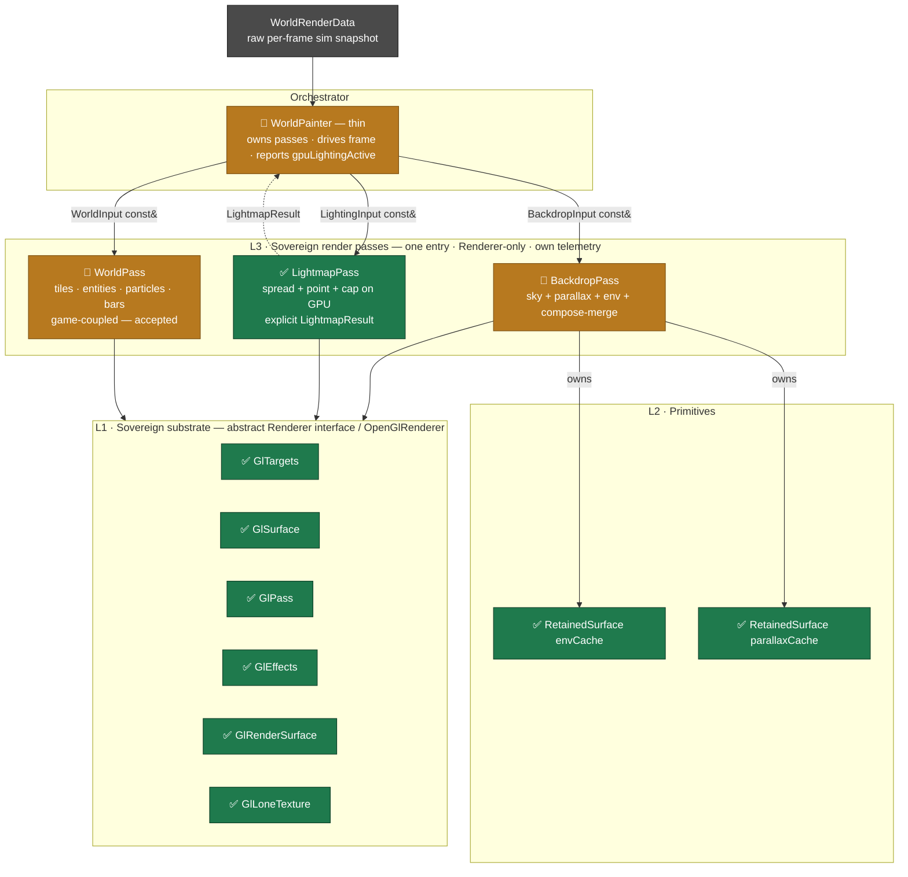
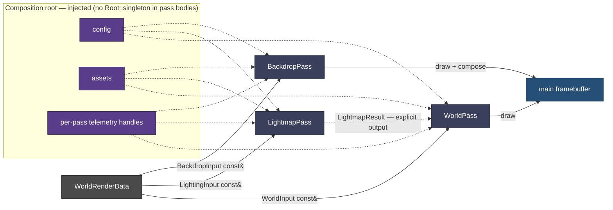

# Render Decomposition — Target-State Architecture

Today's `StarWorldPainter` — 876 lines fusing 7 concerns — decomposed into six sovereign modules across four layers. It wasn't always a god-object: the [vanilla baseline](architecture-1-vanilla-baseline.md) was a slim 112-line orchestrator, and the campaign's own perf machinery is what bloated it — so this decomposition re-extracts *our* accretion into passes, keeping the perf wins. Two views: the **static** layer/ownership stack, and the **dynamic** frame data-flow that shows the Air-Gap seam making each pass independently buildable.

**Status:** ✅ extracted & sovereign · 🔨 still to extract. Branch `render/decomposition`, every step byte-identical + oracle-gated.

**Panel 3 of 3:** [🕰️ vanilla baseline](architecture-1-vanilla-baseline.md) → [🧱 accreted monolith](architecture-2-accreted-monolith.md) → 🏗️ decomposed target (here).

---

## View 1 — Layered structure & ownership

---

## View 2 — Frame data-flow & the Air-Gap seam

The seam is what makes a pass compile on its own: a **sliced const-ref view** instead of the fat struct, **injected** config/assets/telemetry instead of `Root::singleton()`, and an **explicit output** instead of a hand-off through mutated GL state.

---

## The four Air-Gap contracts

| Seam | Today (god-object) | Target (buildable pass) |
|---|---|---|
| **Inputs** | fat `WorldRenderData`, `#include`d by every pass | per-pass `const&` DTO *views* — `BackdropInput` / `LightingInput` / `WorldInput` |
| **Config / assets** | `Root::singleton()` reached inside method bodies | injected at construction |
| **Telemetry** | one string-keyed global smear | per-pass telemetry handles |
| **Hand-off** | passes mutate shared GL state for the next | explicit return values — e.g. `LightmapResult` |

Each contract is *simultaneously* the Air-Gap axiom fix **and** the compile-independence: remove the three buildability blockers (fat struct, singleton reads, telemetry smear) and the clean per-layer branches can be regenerated from the decomposed trunk.

## Extraction rail

`0` dead field ✅ → `1` **RetainedSurface** ✅ (1a primitive + tests · 1b env · 1c parallax · 1d exact-sentinel) → `2` **LightmapPass tighten** ✅ (explicit `LightmapResult`) → `3` BackdropPass 🔨 *(compose-merge falls out here)* → `4` WorldPass 🔨 → `5` WorldPainter thins 🔨. Gate each: env `MATCH/0`, parallax bounded-`MATCH ≤1 LSB`, spread `MATCH/0`, + off-GPU per-pass unit tests. Each landed step is byte-identical + oracle-gated + adversarially verified.
