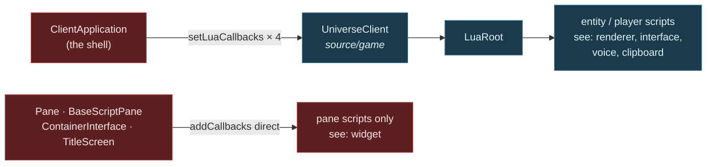

# Sovereign Decoupled Headless Client — Target-State Design

> **STATUS: WORK IN PROGRESS.** Section 1 (where the boundary goes) is Director-approved.
> Sections 2–6 are not yet designed. Written mid-brainstorm at the Director's request so that
> nothing is lost to a context compaction. Do not treat the unwritten sections as omissions —
> they are outstanding work, listed in §7.

**Goal.** Make presentation a replaceable component behind a stated contract, so that a Starbound
client can run with **no presentation linked at all** — and so that a different presentation
implementation (SDL_GPU) becomes a swap rather than a rewrite.

**The unifying frame.** *A headless client is presentation-backend = null.* If presentation is
replaceable behind a contract, "no presentation" is simply one implementation and SDL_GPU is another.
Run it the other way and the same thing holds: if the system runs with nothing on the other side of
the seam, the seam is proven to be an interface rather than a habit.

**Why that single move is the whole design.** You only know a contract is right when two
implementations satisfy it. GL is implementation #1. Null is the cheap #2. SDL_GPU would be #3 — and
it becomes a backend swap precisely because the null case forced the contract to be honest first.

---

## 0. Decisions locked in brainstorm

| # | Decision |
|---|---|
| **D1** | **Purpose — all six.** Architectural forcing function · foundation for distributed Starbound · CI harness · bot/agent client · cleanup of legacy/dead code sitting inside boundaries · swappable presentation components. |
| **D2** | **Scope of THIS spec.** Contract + null implementation + shell + the cleanup the contract exposes. SDL_GPU backend, CI harness, bot driver and distributed decomposition are each **follow-on specs that consume the contract**. |
| **D3** | **Three contracts at natural strengths.** Video = swappable contract. Input = pluggable source. Audio = merely nullable. Each strength is the weakest thing serving a named purpose; nothing over-built. |
| **D4** | **Null behaviour: record.** The null implementation captures what it was asked to do, with a **discard** mode (fast CI bulk runs) and a **strict** mode (dev-time forcing function). One object, three modes. Serves CI assertions and agent perception from the same code. |
| **D5** | **Unify, do not run parallel.** `ClientApplication` is refactored so presentation is *injected*. GL becomes implementation #1 rather than staying privileged. The graphical client is held byte-identical throughout by the existing render and motion gates. This is the only shape in which "swappable" is true. |
| **D6** | **The contract targets T2.** It may name only core, base and presentation-vocabulary types. See §1 and the risk in §6. |

### Why D6 is not a preference

If the contract names game types, **every implementation of it must be granted `game`**. `rendering`
stays coupled to the simulation permanently, and an SDL_GPU backend would still need the simulation to
compile. A T3.5 contract does not merely produce a less tidy result — **it defeats the swap purpose it
exists to serve.**

---

## 1. Where the boundary goes — APPROVED

### The boundary is at *drawing*, not at *UI*

Everything that decides **what** to draw stays on the game side — simulation, UI logic, widget layout.
Everything that turns descriptions into **pixels** is presentation.

`windowing` and `frontend` therefore land on the **game** side of the new boundary. Only the painters,
the passes and L1 sit on the presentation side.

That sounds like a large restructure. It is not, and the measurement in
`docs/architecture/system-boundaries.md` §5 says why:

| edge | includes | files |
|---|---:|---:|
| `windowing → rendering` | 3 | **1** (`GuiContext`) |
| `frontend → rendering` | 9 | 9 |

**Twelve includes across ten files** — the thinnest live cross-tier edge in the entire tree is exactly
the cut this design needs. The UI already does its own layout and already emits `Drawable`s; it simply
hands them to a painter directly today instead of into a stream.

### `RenderCallback` is not part of the contract

This is the simplification that makes everything else work.

`RenderCallback` is how the game **assembles** a frame — entities push into a sink and
`ClientRenderCallback` accumulates. That is game-internal from start to finish. It stays exactly where
it is and crosses nothing.

**The contract begins after assembly:** *here is a finished frame, present it.*

Which is why the video contract is one call per frame with one value, and why it passes the network
test in §5 without redesign.

### The three contracts, as streams

```
game side                          │  contract (T2)     │  presentation side
───────────────────────────────────┼────────────────────┼──────────────────────
world sim, entities                │                    │
  ↓ RenderCallback (internal)      │                    │
frame assembly                     │                    │
UI logic, widget layout            │  present(Frame)  → │  painters, passes, L1
  ↓ emits Drawables                │  play(AudioBatch)→ │  GL / SDL_GPU / null
                                   │  ← poll() Input    │
```

- **Video** — `present(Frame const&)`. One call, one value, per frame.
- **Audio** — `play(AudioBatch const&)`. One-way. Fixes `AudioInstancePtr`: the batch carries values,
  not handles.
- **Input** — `poll() -> InputBatch`. The single permitted round trip, once per frame, returning a batch.

One query per frame in total. That is a boundary a network could pass through.

### The T2 vocabulary

`Frame`, `AudioBatch` and `InputBatch` may name **only core, base and presentation-vocabulary types**.
That constraint is what forces the cleanup, and it is what lets the contract sit at T2 where no
implementation needs `game`.

Two pieces of evidence that this runs with the grain rather than against it:

- **`Drawable` depends on six core headers and nothing else** — `StarString`, `StarDataStream`,
  `StarPoly`, `StarColor`, `StarJson`, `StarAssetPath` — and **already carries `DataStream`
  operators**. It moves down essentially for free and is already wire-ready. That is not a
  coincidence; the vocabulary was always closer to a protocol than to an API.
- **`ImageMetadataDatabase` already lives in `game`** so that layout can know image sizes without a
  GPU. The precedent for *metrics are data, not presentation* is already established in this codebase;
  font metrics follow the same path.

---

## 2. The client Lua surface — context finding

Recorded here because it was the decisive fact behind D4, and because it is documented nowhere else.

**There are two Lua surfaces, not one.**

**Surface A — global, four groups, injected by the shell into the game layer.**
`UniverseClient::setLuaCallbacks(group, callbacks)` → `LuaRoot::addCallbacks`. Every script created
from that root sees them. `ClientApplication` pushes in exactly four:

```cpp
m_universeClient->setLuaCallbacks("voice",     LuaBindings::makeVoiceCallbacks());
m_universeClient->setLuaCallbacks("renderer",  LuaBindings::makeRenderingCallbacks(this));
m_universeClient->setLuaCallbacks("clipboard", LuaBindings::makeClipboardCallbacks(app, ...));
m_universeClient->setLuaCallbacks("interface", LuaBindings::makeInterfaceCallbacks(m_mainInterface.get()));
```

**Surface B — local, created by presentation for scripts presentation owns.**
`makeWidgetCallbacks(Widget*, GuiReader)`, attached directly by `Pane`, `BaseScriptPane`,
`ContainerInterface`, `TitleScreen` and `VoiceSettingsMenu` to their own script components. Only *pane
scripts* ever see it; it never reaches entity or player scripts.



**Consequences.**

- **Surface B is a non-problem.** Those scripts exist only because panes exist. Delete presentation and
  both go together. Nothing to null out.
- **Surface A is the entire headless Lua question, and it is four named groups** — not a sprawling
  surface.
- **The injection point is already dependency injection, already in the game layer.** `UniverseClient`
  exposes a slot; the shell fills it. That is precisely the shape this design wants, and it already
  exists.
- **Caveat.** `makeRenderingCallbacks` binds directly to `ClientApplication` methods and calls
  `app->renderer()`, so that group's shape is tied to the shell class rather than to an interface. It
  needs a non-shell owner before a second shell can provide it. This is cleanup work, not a blocker.

---

## 3. The network constraint — the sharper forcing function

**Director's constraint:** in theory the full render/graphical front end could run on one machine while
client/world/server run on another, separated by a network. Therefore a goal of both the contract and
the logic boundary is to **reduce ping-pongs at that boundary** — chattiness is evidence the boundary
is in the wrong place.

This is a better test than "does it compile without the other side", because it grades the *shape* of
the interface rather than merely its existence. And it is **countable**, so it can be a gate.

### The main path already passes

Every `RenderCallback` method returns `void`, takes by value, and has a batch form:

```cpp
virtual void addDrawable(Drawable drawable, EntityRenderLayer renderLayer) = 0;
void addDrawables(List<Drawable> drawables, EntityRenderLayer, Vec2F translate = Vec2F());
```

Zero round trips, already batched. Nobody designed this for the thought experiment; it survives it.

### Where it fails, and the list is short

- **Pointers crossing.** `addAudio(AudioInstancePtr)` passes a shared handle.
  `WorldRenderData::particles` is a raw `List<Particle> const*`. Neither survives a wire — and neither
  is visible to any existing instrument, because §6 of the boundary document measures *how much* of a
  type is used and nothing measures *whether it could be sent*.
- **Query-shaped Lua callbacks.** Four of the seven in `makeRenderingCallbacks` return values:
  `framesSkipped()`, `postProcessGroupEnabled(String)`, `getEffectParameter(...)`,
  `postProcessGroups()`. Each is a round trip whose frequency is set by mod code.

### Proposed ratchet (design not yet approved)

Countable, so it should become a gate alongside the existing `boundary_ratchet` of 213:

| crossing kind | treatment |
|---|---|
| returns a value | ratchet toward zero — the true ping-pongs |
| passes a pointer or reference | ratchet toward zero — the un-sendables |
| one-way value write | counted, not penalised — these batch |

A boundary that is one-way, by-value and batched is one a network could pass through. The test for
"is this boundary in the right place" becomes **a number that only goes down**.

---

## 4. Structure — NOT YET DESIGNED

Working sketch only, carried forward from the brainstorm. Subject to §6's risk.

- `source/presentation` — interface-only, modelled on `source/platform` (4 headers, 142 lines, zero
  `.cpp`, granted by everyone, implemented by `application`). Target tier T2.
- **The null recorder does not live there.** `platform`'s value is that it has zero implementations; a
  three-mode recorder is real code and needs its own home.
- `source/clientcore` — the shared shell: composition and tick loop, taking injected implementations.
  Granted `game` and `presentation`, **not** `rendering`.
- `source/client` — slims to "construct GL implementations, inject, run".
- `source/client_headless` — new and tiny: "construct nulls, inject, run".

Each new directory gets its own grant list, so the contract becomes **compile-enforced** (test 1 of the
boundary document) rather than a lint.

---

## 5. Verification — NOT YET DESIGNED

Constraints known so far:

- The graphical client must stay **byte-identical** throughout, proven by the existing
  `scripts/render-gate.sh` and `scripts/render-motion.sh`.
- The null client must **link shell 2 only** (`extern + core + base + game` + the contract), which is
  itself the proof that presentation is severable — the same move `render_surface_tests` makes for L1.
- The round-trip ratchet of §3 and the existing `boundary_ratchet` 213 both only go down.

---

## 6. Risks

**The central one.** `RenderTileArray`, `EntityDrawables`, `OverheadBar`, `ParallaxLayer`,
`SkyRenderData` and `Particle` have not been assessed. Some are appearance data wearing a game name and
will move as easily as `Drawable`. Others encode simulation concepts and will need **narrowing rather
than relocation** — that is §6-of-the-boundary-document's shape work, promoted into scope. One or two
may not move at all, which would leave the frame carrying a small game-typed residue and push
`presentation` to T3.5 after all.

**This is the design's central unknown and the first thing implementation must confront rather than
assume.**

**Secondary.** `#include` cannot see template instantiation across a boundary, nor runtime coupling
through `Root`'s databases. The vocabulary assessment cannot be done by include-graph alone.

---

## 7. What remains to be designed

1. **§4 Structure** — directory layout, grant lists, where the recorder lives.
2. **§5 Verification** — gates, oracles, the round-trip ratchet's exact metric and starting ceiling.
3. **The vocabulary assessment** — the six unresolved types in §6; cheap-move vs needs-narrowing vs
   cannot-move.
4. **Sequencing** — the order of extraction, each step provable and reversible.
5. **Out-of-scope statement** — explicit list of what this spec does not cover.
6. **Cleanup ledger** — what the contract exposes as dead, and where it gets removed.

---

## 8. Related

- `docs/architecture/system-boundaries.md` — the measured map this design sits inside. §5 (granted vs
  spent), §6 (shape), §9 (cohesion), §12 (presentation tier's three duties), §13 (the one inheritance
  edge that leaves).
- `scripts/boundary-inventory.py` — the 213 push-sink ratchet this design should drive down.
- Task #199 — the sink-gating groundwork already landed (`WorldClient::setHeadless`,
  `ClientRenderCallback(wantView)`).
- Task #191 — `TilePainter : TileDrawer`, the one inheritance edge leaving the render subsystem.
