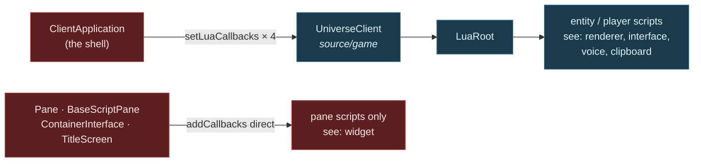

# Sovereign Decoupled Headless Client — Target-State Design

> **STATUS: WORK IN PROGRESS. NOTHING IS APPROVED.** Director's rule, adopted 2026-08-01:
> **approval is aggregate only — no section is approved until the whole can be reasoned with
> together.** Section 1 was stamped approved earlier and has been returned to PROVISIONAL, because
> the model beneath it moved. Sections marked PROVISIONAL are designed and awaiting that aggregate
> review; sections marked NOT YET DESIGNED are outstanding work, listed in Section 7. Do not treat
> either as an omission.

**Goal.** Make presentation a replaceable component behind a stated contract, so that a Starbound
client can run with **no presentation linked at all** — and so that a different presentation
implementation (SDL_GPU) becomes a swap rather than a rewrite.

**The unifying frame.** *A headless client is presentation-backend = null.* If presentation is
replaceable behind a contract, "no presentation" is simply one implementation and SDL_GPU is another.
Run it the other way and the same thing holds: if the system runs with nothing on the other side of
the seam, the seam is proven to be an interface rather than a habit.

**Why that single move is the whole design.** You only know a contract is right when two
implementations satisfy it. GL is implementation #1. Null is the cheap #2. SDL_GPU would be #3 — and
it becomes a backend swap precisely because the null case forced the contract to be honest first.

---

## 0. Decisions locked in brainstorm

| # | Decision |
|---|---|
| **D1** | **Purpose — all six.** Architectural forcing function · foundation for distributed Starbound · CI harness · bot/agent client · cleanup of legacy/dead code sitting inside boundaries · swappable presentation components. |
| **D2** | **Scope of THIS spec.** Contract + null implementation + shell + the cleanup the contract exposes. SDL_GPU backend, CI harness, bot driver and distributed decomposition are each **follow-on specs that consume the contract**. |
| **D3** | **Three contracts at natural strengths.** Video = swappable contract. Input = pluggable source. Audio = merely nullable. Each strength is the weakest thing serving a named purpose; nothing over-built. |
| **D4** | **Null behaviour: record.** The null implementation captures what it was asked to do, with a **discard** mode (fast CI bulk runs) and a **strict** mode (dev-time forcing function). One object, three modes. Serves CI assertions and agent perception from the same code. |
| **D5** | **Unify, do not run parallel.** `ClientApplication` is refactored so presentation is *injected*. GL becomes implementation #1 rather than staying privileged. The graphical client is held byte-identical throughout by the existing render and motion gates. This is the only shape in which "swappable" is true. |
| **D6** | **The contract targets T2.** It may name only core, base and presentation-vocabulary types. See Section 1 and the risk in Section 6. |

### Why D6 is not a preference

If the contract names game types, **every implementation of it must be granted `game`**. `rendering`
stays coupled to the simulation permanently, and an SDL_GPU backend would still need the simulation to
compile. A T3.5 contract does not merely produce a less tidy result — **it defeats the swap purpose it
exists to serve.**

---

## 1. Where the boundary goes — PROVISIONAL

### The boundary is at *drawing*, not at *UI*

Everything that decides **what** to draw stays on the game side — simulation, UI logic, widget layout.
Everything that turns descriptions into **pixels** is presentation.

`windowing` and `frontend` therefore land on the **game** side of the new boundary. Only the painters,
the passes and L1 sit on the presentation side.

That sounds like a large restructure. It is not, and the measurement in
`docs/architecture/system-boundaries.md` Section 5 says why:

| edge | includes | files |
|---|---:|---:|
| `windowing → rendering` | 3 | **1** (`GuiContext`) |
| `frontend → rendering` | 9 | 9 |

**Twelve includes across ten files** — the thinnest live cross-tier edge in the entire tree is exactly
the cut this design needs. The UI already does its own layout and already emits `Drawable`s; it simply
hands them to a painter directly today instead of into a stream.

### `RenderCallback` is not part of the contract

This is the simplification that makes everything else work.

`RenderCallback` is how the game **assembles** a frame — entities push into a sink and
`ClientRenderCallback` accumulates. That is game-internal from start to finish. It stays exactly where
it is and crosses nothing.

**The contract begins after assembly:** *here is a finished frame, present it.*

Which is why the video contract is one call per frame with one value, and why it passes the network
test in Section 5 without redesign.

### The three contracts, as streams

```
game side                          │  contract (T2)     │  presentation side
───────────────────────────────────┼────────────────────┼──────────────────────
world sim, entities                │                    │
  ↓ RenderCallback (internal)      │                    │
frame assembly                     │                    │
UI logic, widget layout            │  present(Frame)  → │  painters, passes, L1
  ↓ emits Drawables                │  play(AudioBatch)→ │  GL / SDL_GPU / null
                                   │  ← poll() Input    │
```

- **Video** — `present(Frame const&)`. One call, one value, per frame.
- **Audio** — `play(AudioBatch const&)`. One-way. Fixes `AudioInstancePtr`: the batch carries values,
  not handles.
- **Input** — `poll() -> InputBatch`. The single permitted round trip, once per frame, returning a batch.

One query per frame in total. That is a boundary a network could pass through.

### The T2 vocabulary

`Frame`, `AudioBatch` and `InputBatch` may name **only core, base and presentation-vocabulary types**.
That constraint is what forces the cleanup, and it is what lets the contract sit at T2 where no
implementation needs `game`.

Two pieces of evidence that this runs with the grain rather than against it:

- **`Drawable` depends on six core headers and nothing else** — `StarString`, `StarDataStream`,
  `StarPoly`, `StarColor`, `StarJson`, `StarAssetPath` — and **already carries `DataStream`
  operators**. It moves down essentially for free and is already wire-ready. That is not a
  coincidence; the vocabulary was always closer to a protocol than to an API.
- **`ImageMetadataDatabase` already lives in `game`** so that layout can know image sizes without a
  GPU. The precedent for *metrics are data, not presentation* is already established in this codebase;
  font metrics follow the same path.

### The pixel side has no name today

Asked what the whole scope on the presentation side is called, the honest answer is that **it has no
name, because it is not a unit.** It is 33 files and 8,704 lines spanning two libraries at two
different tiers:

| part | files | lines | tier |
|---|---:|---:|---|
| all of `source/rendering` — painters, passes, texture groups | 23 | 4,413 | T4 |
| the render half of `source/application` — `Renderer`, the GL backend, L1 | 10 | 4,291 | **T2** |
| *(`source/application` keeps: app/window lifecycle, SDL main, Steam/Discord, P2P)* | *15* | *3,081* | *not presentation* |

Near half by volume on each side of a directory line. **The renderer is not in `source/rendering`:**
the largest presentation file, `StarRenderer_opengl.cpp` at 1,824 lines, and the `Renderer` interface
every painter draws through, both live in `application`.

Consequently the word *presentation* is carrying three different meanings at once:

| the name | what it actually covers | fits the pixel side? |
|---|---|---|
| `star_rendering` (T4) | painters and passes | **half** — misses the renderer itself |
| tier T4 "presentation" | `{rendering, windowing, frontend}` | **wrong both ways** — includes the UI this section just placed on the game side, still misses the GL backend |
| L1 / L2 / L3 | the render decomposition | **L1 straddles the directory line** — which is why `scripts/layering-lint.py` has to name `application/` paths |
| `source/presentation` (Section 4) | the contract, interface-only | **no** — that is the seam, not the side |

Section 4 resolves this by splitting the word rather than stretching it. Two measurements decide how.

**First: `rendering` is granted `game` today.** `source/rendering/CMakeLists.txt` lists
`${STAR_GAME_INCLUDES}` in its `INCLUDE_DIRECTORIES`. Deleting that one line is the entire design
stated as a build rule; everything else in this spec is the work that makes deletion possible.

**Second: `RenderCallback` occurs in 39 files and all 39 are in `source/game`.** The claim above that
it is game-internal frame assembly is not an assertion about intent — it is a measurement, and it
satisfies test 2 (severability) already. Nothing needs to move for it.

**And the GL backend has exactly one consumer outside its own `.cpp`:** `StarMainApplication_sdl.cpp`,
the T2 shell that owns the GL context. Unifying the pixel side takes the backend away from that shell,
which is precisely what D5 requires — so **the naming question and the injection question are the same
question**, and they have to be answered in that order. See Section 4's ordering constraint.

### What supersedes this section

Everything measured above stands. **The contract shape does not.**

`present(Frame const&)` hands the presentation side a finished, camera-resolved frame. That welds the
pixel rate to the assembly rate: presentation can only rasterise what it was given, when it was given
it. Over a network it degrades to frame streaming — bandwidth O(screen), and every hitch in the sim
appears as a hitch on the glass.

Section 4 replaces it with a **scene delta**, which lets the presentation side own its own clock and
resample locally. Under that model:

- **frame assembly moves to the presentation side.** The claim above — *"the contract begins after
  assembly"* — reverses.
- **`present(Frame const&)` becomes the degenerate case**: a scene delta already resolved for one
  camera at one instant, with the delta being "everything". It is the MVP rung of a taller ladder, not
  a wrong answer.
- **`RenderCallback` is unaffected.** The measurement holds — 39 files, all in `game` — it simply
  pushes scene items rather than drawables.

The `windowing`/`frontend` placement, the twelve-includes measurement, and the `Drawable` and
`ImageMetadataDatabase` evidence are all independent of which payload crosses, so they carry forward
unchanged.

---

## 2. The client Lua surface — context finding

Recorded here because it was the decisive fact behind D4, and because it is documented nowhere else.

**There are two Lua surfaces, not one.**

**Surface A — global, four groups, injected by the shell into the game layer.**
`UniverseClient::setLuaCallbacks(group, callbacks)` → `LuaRoot::addCallbacks`. Every script created
from that root sees them. `ClientApplication` pushes in exactly four:

```cpp
m_universeClient->setLuaCallbacks("voice",     LuaBindings::makeVoiceCallbacks());
m_universeClient->setLuaCallbacks("renderer",  LuaBindings::makeRenderingCallbacks(this));
m_universeClient->setLuaCallbacks("clipboard", LuaBindings::makeClipboardCallbacks(app, ...));
m_universeClient->setLuaCallbacks("interface", LuaBindings::makeInterfaceCallbacks(m_mainInterface.get()));
```

**Surface B — local, created by presentation for scripts presentation owns.**
`makeWidgetCallbacks(Widget*, GuiReader)`, attached directly by `Pane`, `BaseScriptPane`,
`ContainerInterface`, `TitleScreen` and `VoiceSettingsMenu` to their own script components. Only *pane
scripts* ever see it; it never reaches entity or player scripts.



**Arrows here are calls, not includes** — the opposite convention to Section 4's dependency graph,
which is why every edge in this one is labelled with the call it represents. The two diagrams answer
different questions: this one asks *who invokes whom at runtime*, Section 4 asks *who may name whom at
compile time*.

**Consequences.**

- **Surface B is a non-problem.** Those scripts exist only because panes exist. Delete presentation and
  both go together. Nothing to null out.
- **Surface A is the entire headless Lua question, and it is four named groups** — not a sprawling
  surface.
- **The injection point is already dependency injection, already in the game layer.** `UniverseClient`
  exposes a slot; the shell fills it. That is precisely the shape this design wants, and it already
  exists.
- **Caveat.** `makeRenderingCallbacks` binds directly to `ClientApplication` methods and calls
  `app->renderer()`, so that group's shape is tied to the shell class rather than to an interface. It
  needs a non-shell owner before a second shell can provide it. This is cleanup work, not a blocker.

---

## 3. The network constraint — the sharper forcing function

**Director's constraint:** in theory the full render/graphical front end could run on one machine while
client/world/server run on another, separated by a network. Therefore a goal of both the contract and
the logic boundary is to **reduce ping-pongs at that boundary** — chattiness is evidence the boundary
is in the wrong place.

This is a better test than "does it compile without the other side", because it grades the *shape* of
the interface rather than merely its existence. And it is **countable**, so it can be a gate.

### The main path already passes

Every `RenderCallback` method returns `void`, takes by value, and has a batch form:

```cpp
virtual void addDrawable(Drawable drawable, EntityRenderLayer renderLayer) = 0;
void addDrawables(List<Drawable> drawables, EntityRenderLayer, Vec2F translate = Vec2F());
```

Zero round trips, already batched. Nobody designed this for the thought experiment; it survives it.

### Where it fails, and the list is short

- **Pointers crossing.** `addAudio(AudioInstancePtr)` passes a shared handle.
  `WorldRenderData::particles` is a raw `List<Particle> const*`. Neither survives a wire — and neither
  is visible to any existing instrument, because Section 6 of the boundary document measures *how much* of a
  type is used and nothing measures *whether it could be sent*.
- **Query-shaped Lua callbacks.** Four of the seven in `makeRenderingCallbacks` return values:
  `framesSkipped()`, `postProcessGroupEnabled(String)`, `getEffectParameter(...)`,
  `postProcessGroups()`. Each is a round trip whose frequency is set by mod code.

### Proposed ratchet (design not yet approved)

Countable, so it should become a gate alongside the existing `boundary_ratchet` of 213:

| crossing kind | treatment |
|---|---|
| returns a value | ratchet toward zero — the true ping-pongs |
| passes a pointer or reference | ratchet toward zero — the un-sendables |
| one-way value write | counted, not penalised — these batch |

A boundary that is one-way, by-value and batched is one a network could pass through. The test for
"is this boundary in the right place" becomes **a number that only goes down**.

---

## 4. Structure and the naming register — PROVISIONAL

These are the names the rest of the work is designed against. Adopting them forces renames,
consolidations and splits; each is listed with its action so nothing arrives by surprise.

### There are two seams, not one

The first draft of this register treated the pixel side as one layer with one boundary. It is two,
and the second boundary **already exists and already works**:

| | seam | declared by | implemented by | status |
|---|---|---|---|---|
| **1** | `FrameSink` · `AudioSink` · `InputSource` — game ↔ presentation | `presentation` | `rendering`, `transcript` | **does not exist** — this design builds it |
| **2** | `Renderer` — pixels ↔ GPU API | `StarRenderer.hpp` | `OpenGlRenderer`, later SDL_GPU | **exists, and measures clean** |

Four measurements say seam 2 is real rather than nominal:

- `Renderer` declares **42 pure virtuals**, and `OpenGlRenderer : public Renderer`.
- `rendering → application` is **`StarRenderer.hpp` × 9 across 9 files and nothing else** — the
  painters and passes see the abstract header and none of the GL implementation.
- `source/rendering` names `OpenGlRenderer` **zero times in code**; the single occurrence is a comment
  in `StarWorldPass.cpp`.
- `game` touches none of it. `windowing`, `frontend` and `client` touch `StarRenderer.hpp` once each.

**Consequence: SDL_GPU is a seam-2 swap and does not need this design at all.** It replaces
`OpenGlRenderer` and keeps every painter and pass. D2 already listed it as a follow-on; the earlier
diagram contradicted that by drawing it as a peer of `rendering`, which would have implied
reimplementing the painters.

### The shape stops being a stack

Today the lattice is a tower: T0 → T1 → T2 → `game` → presentation → shells. Presentation sits
**above** the simulation, which is exactly why it cannot be removed.

In the target state it **forks at seam 1 and forks again at seam 2**.

**Every component carries three fields: name, KIND, duty.** The name is the directory. The kind says
what sort of thing it is, and therefore which rule governs it. The duty is one phrase, canonical — the
same string appears in the diagram, the register and the grant table, and no component appears twice.

| KIND | the rule it carries |
|---|---|
| **FOUNDATION** | depended on by everything above it; names nothing above itself |
| **CONTRACT** | declares an interface and may name only foundation types. Any `.cpp` holds **value-type constructors and trivial defaults only** — never a backend's behaviour — and its size is metered: `platform` 0, `host` 41, `gpu` 89 lines, ratcheting down |
| **BACKEND** | implements a contract; interchangeable with its siblings; named only by an ENTRYPOINT |
| **LIBRARY** | ordinary code, named directly by its consumers, not interchangeable |
| **ENTRYPOINT** | an executable; the only place a backend may be named |

**Kinds are single uppercase words.** A kind is a token: it has to survive being grepped, pasted into
a CMake variable or a lint rule, and wrapped by a line break. `ENTRYPOINT`, never `ENTRY POINT`. The
same rule applies to any kind added later, and to the zones below.

Kind says what a component *is*. **ZONE** says where it sits relative to the seams — the second and
last grouping axis, and the one the clusters in the diagram draw:

| ZONE | the rule it carries |
|---|---|
| **SUBSTRATE** | below every seam; available to both arms and to the shells |
| **SEAM** | a declared boundary — the only components both arms may name |
| **INTERIOR** | inside seam 1; compiles and runs with no presentation linked at all |
| **PERIPHERY** | outside seam 1; meets hardware or a recorder, and is swapped or deleted wholesale |
| **SHELL** | where the two arms rejoin into an executable |

Zone is not a synonym for kind: `platform` is a CONTRACT in the SUBSTRATE, `presentation` is a
CONTRACT in the SEAM, and `host_sdl` is a BACKEND in the SUBSTRATE while `rendering` is a BACKEND
in the PERIPHERY. The two axes are independent by construction, and the register below carries both.

Neither axis reuses **TIER** (T0–T5, `docs/architecture/system-boundaries.md`) or **LAYER** (L1/L2/L3,
the render decomposition). Both words are already load-bearing elsewhere in this repository and mean
something else.

### ALTITUDE — what a box actually is

A **COMPONENT is a directory with its own grant list.** Not a class, file, module or package, and the
reason is mechanical rather than stylistic: `INCLUDE_DIRECTORIES` is per-directory, so the directory is
the smallest unit at which a boundary is a *compile error* rather than an opinion. That is why `gpu` is
a component and `Renderer` — the actual interface — is not: `Renderer` cannot be granted or denied to
anyone, but the directory holding it can.

Some things the design must place are smaller than that, so there is a second altitude:

| ALTITUDE | is | violating its boundary is |
|---|---|---|
| **COMPONENT** | a directory with its own grant list | **a compile error** |
| **ELEMENT** | a named class, interface, type or function inside a component | **a review comment** |

This maps onto the boundary document's existing ENFORCED / PROVEN / ASPIRATIONAL verdicts, and it
supplies the rule for growing this diagram: **an ELEMENT is promoted to a COMPONENT when its boundary
becomes worth a compile error.** Boxes get added by that test, not by feel.

Elements are drawn as rounded, dashed boxes attached to their owner with a dotted line.

**Element naming carries one more rule, and it is load-bearing:**

| suffix | means | owns a cadence |
|---|---|---|
| **`*Loop`** | it has the `while` — it sets the cadence and decides when to stop | **yes** |
| **`*Tick`** | one iteration's body, called by a loop | **no** |

So **the number of `*Loop` elements is the number of clocks this codebase owns**, and the count is
checkable rather than asserted.

An earlier draft of this section claimed the count was one. **It is two today, and I had missed the
second.** Reading `SdlPlatform::run()` line by line:

```cpp
while (true) {                                     // frameLoop      — clock: vsync + swap
    for (event : processEvents())                  //   a DRAIN — no clock, it just empties a queue
        m_application->processInput(event);
    for (int i = 0; i < updatesBehind; ++i) {      //   A LOOP — clock: m_updateTicker @ 60Hz
        m_application->update();                   //     simTick
        m_updateRate = m_updateTicker.tick();
    }
    m_application->render();                       //   presentTick
    SDL_GL_SwapWindow(m_sdlWindow);
    Thread::sleepPrecise(m_updateTicker.spareTime());
}
```

The inner `for` is the classic fixed-timestep accumulator and `TickRateApproacher` is unambiguously a
clock — `targetTickRate()`, `ticksBehind()` (*"how many ticks we should perform so we would be as close
to the target tick rate as possible"*), `ticksAhead()`, `spareTime()`. It iterates, it takes its count
from a clock, it decides when to stop. The rule should have caught it; I named the body and stopped.

The event pump is a third iteration construct that is deliberately **not** a loop by this rule: it
drains a queue and owns no cadence.

Two further facts fall out of reading it closely:

- **The render side has no governing clock at all.** `m_renderTicker` exists but only *measures* —
  nothing gates on `renderTicker.ticksBehind()`. Render cadence is a side effect of vsync inside
  `SDL_GL_SwapWindow`. Giving presentation its own clock is therefore **creating one, not separating
  two**.
- **The frame loop is paced by the simulation's clock** — `sleepPrecise(m_updateTicker.spareTime())`.
  That is the second weld, and it is subtler than the first.

Audio proves the rule rather than breaking it: it is a genuine rate authority, but the loop belongs to
SDL — `SDL_OpenAudioDeviceStream` takes a callback and we supply the body — so `audioTick` is correctly
a tick.

**`A --> B` means A includes B** — that is, B appears in A's grant list. Read `base --> core` as
"base includes core". Arrows therefore point *at* dependencies, so the foundation sits at the bottom
and the executables at the top, and an arrow that has to be added to make something compile is a
dependency that has to be justified.

**The clusters are zones and colour is kind** — one axis per visual channel, so the diagram carries
both taxonomies at once without either being inferred from the other.

```mermaid
flowchart TD
  subgraph Z_SHELL ["SHELL — where the two arms rejoin"]
    shell["<b>client</b><br/>LIBRARY<br/><i>owns the client frame</i>"]
    clienttick(["<b>clientTick</b> · TICK<br/><i>one driver step, sim side</i>"])
    simloop(["<b>simLoop</b> · LOOP<br/><i>fixed-timestep accumulator</i>"])
    simtick(["<b>simTick</b> · TICK<br/><i>one deterministic step</i>"])
    audiotick(["<b>audioTick</b> · TICK<br/><i>fills a buffer for SDL's audio loop</i>"])
    cgl["<b>client_opengl</b><br/>ENTRYPOINT<br/><i>graphical entry point</i>"]
    chl["<b>client_headless</b><br/>ENTRYPOINT<br/><i>headless entry point</i>"]
  end

  subgraph Z_INT ["INTERIOR — runs with no presentation linked"]
    front["<b>frontend</b><br/>LIBRARY<br/><i>this game's screens</i>"]
    win["<b>windowing</b><br/>LIBRARY<br/><i>the widget toolkit</i>"]
    game["<b>game</b><br/>LIBRARY<br/><i>the simulation</i>"]
  end

  subgraph Z_PER ["PERIPHERY — meets hardware or a recorder"]
    rend["<b>rendering</b><br/>BACKEND<br/><i>turns a scene into pixels</i>"]
    presenttick(["<b>presentTick</b> · TICK<br/><i>resample · camera · assemble · paint</i>"])
    tr["<b>transcript</b><br/>BACKEND<br/><i>records instead of drawing</i>"]
    glb["<b>gpu_opengl</b><br/>BACKEND<br/><i>the OpenGL backend</i>"]
    sdlb["<b>gpu_sdl</b><br/>BACKEND<br/><i>the SDL_GPU backend</i>"]
  end

  subgraph Z_SEAM ["SEAM — the declared boundaries"]
    scene["<b>scene</b><br/>CONTRACT<br/><i>what exists, where, moving how</i>"]
    contract["<b>presentation</b><br/>CONTRACT<br/><i>the presentation contract</i>"]
    gpu["<b>gpu</b><br/>CONTRACT<br/><i>the GPU contract</i>"]
  end

  subgraph Z_SUB ["SUBSTRATE — below every seam"]
    hostsdl["<b>host_sdl</b><br/>BACKEND<br/><i>the SDL host implementation</i>"]
    frameloop(["<b>frameLoop</b> · LOOP<br/><i>the PC driver: pump · step · swap · idle</i>"])
    hostnull["<b>host_null</b><br/>BACKEND<br/><i>a host that shows nothing</i>"]
    headlessloop(["<b>headlessLoop</b> · LOOP<br/><i>the null driver</i>"])
    platformpc["<b>platform_pc</b><br/>BACKEND<br/><i>Steam, Discord and P2P services</i>"]
    host["<b>host</b><br/>CONTRACT<br/><i>the host contract</i>"]
    platform["<b>platform</b><br/>CONTRACT<br/><i>platform-service contracts</i>"]
    base["<b>base</b><br/>FOUNDATION<br/><i>shared services</i>"]
    core["<b>core</b><br/>FOUNDATION<br/><i>language and containers</i>"]
  end

  base --> core
  platform --> core
  host --> platform
  hostsdl --> host
  hostsdl --> platformpc
  hostnull --> host
  platformpc --> platform
  win --> host
  shell --> host
  scene --> base
  contract --> scene
  gpu --> base
  game --> base
  game --> scene
  win --> game
  front --> win
  shell --> front
  shell --> contract
  rend --> contract
  rend --> gpu
  tr --> contract
  glb --> gpu
  sdlb --> gpu
  cgl --> shell
  cgl --> rend
  cgl --> glb
  cgl --> hostsdl
  chl --> shell
  chl --> tr
  chl --> hostnull

  hostsdl -.- frameloop
  shell -.- clienttick
  shell -.- simloop
  shell -.- simtick
  shell -.- audiotick
  rend -.- presenttick
  hostnull -.- headlessloop

  classDef kFoundation fill:#23282f,stroke:#4a545e,color:#dfe4ea
  classDef kContract   fill:#4a3a12,stroke:#a8813a,color:#fdf0d5
  classDef kBackend    fill:#5c2020,stroke:#aa3333,color:#ffe5e5
  classDef kLibrary    fill:#1b3a4b,stroke:#2c6e8f,color:#e0f2f9
  classDef kEntrypoint fill:#332a52,stroke:#6d5fa8,color:#e8e2f8
  classDef kElement    fill:#1c1f25,stroke:#6b7482,color:#c2c9d4,stroke-dasharray:4 3
  class core,base kFoundation
  class platform,host,scene,contract,gpu kContract
  class hostsdl,hostnull,platformpc,rend,tr,glb,sdlb kBackend
  class game,win,front,shell kLibrary
  class cgl,chl kEntrypoint
  class frameloop,headlessloop,simloop,clienttick,simtick,audiotick,presenttick kElement
```



The diagram is **transitively reduced**: every component reaches `core` and `base`, but only the
edges that carry information are drawn. `extern` is omitted entirely. The full per-directory statement
is the grant table below, and every grant in it is reachable along these arrows.

**No arrow runs between the simulation side and the presentation backends.** That absence is the
design. `client_opengl` is the only box that touches both arms, which is what makes it the only box
that has to be duplicated to get a headless client.

### Two roles, two names

The word that was doing both jobs now splits:

- **presentation backend** — implements seam 1. `rendering` draws; `transcript` records.
- **GPU backend** — implements seam 2. `gpu_opengl` today; `gpu_sdl` later.

A presentation backend need not have a GPU backend at all: `transcript` has none.

### Seam 1 — the three boundaries

| name | direction | call | strength (D3) |
|---|---|---|---|
| **`FrameSink`** | one-way in | `present(Frame const&)` | swappable contract |
| **`AudioSink`** | one-way in | `play(AudioBatch const&)` | merely nullable |
| **`InputSource`** | one round trip out | `poll() -> InputBatch` | pluggable source |

The sink/source vocabulary is chosen to carry Section 3's network constraint in the name itself: **a sink
never answers, and there is exactly one source, polled once per frame.** A method that returns a value
on something called a *Sink* is a naming error before it is a design error — which makes the constraint
reviewable by reading, not only by counting.

### Seam 2 — the boundary that already exists

`Renderer` needs no design work. It needs a **home and a grant list**, which it does not have today
because it lives inside `application` next to Steam and P2P networking. Splitting it out is a
relocation of already-separated code, and it is independent of seam 1.

### The register — one row per box

Every component in the diagram, in the same reading order.

| name | kind | zone | duty | assembled from | action |
|---|---|---|---|---|---|
| **`core`** | FOUNDATION | SUBSTRATE | language and containers | unchanged (216 files, 56,149 lines) | **KEEP** |
| **`base`** | FOUNDATION | SUBSTRATE | shared services | unchanged (29 files, 7,380 lines) | **KEEP** |
| **`platform`** | CONTRACT | SUBSTRATE | platform-service contracts | unchanged (4 headers, 142 lines, 27 pure virtuals) | **KEEP** — the model the other contract directories copy |
| **`host`** | CONTRACT | SUBSTRATE | the host contract | `StarApplication.hpp`, `StarApplicationController.hpp`, `StarApplication.cpp` — 3 files, 209 lines, out of `application` | **SPLIT OUT** — see below; already has 8 consumers in 3 directories |
| **`host_sdl`** | BACKEND | SUBSTRATE | the SDL host implementation | `StarMainApplication.hpp` + `StarMainApplication_sdl.cpp` — 2 files, 1,491 lines, out of `application` | **SPLIT OUT** — owns `frameLoop` |
| **`host_null`** | BACKEND | SUBSTRATE | a host that shows nothing | — | **NEW** — owns `headlessLoop`; 35 no-ops over an already-abstract interface |
| **`platform_pc`** | BACKEND | SUBSTRATE | Steam, Discord and P2P services | the 10 vendor files — 1,381 lines, out of `application` | **SPLIT OUT** — `application` ceases to exist |
| **`scene`** | CONTRACT | SEAM | what exists, where, moving how | — | **NEW** — the payload vocabulary. Split from `presentation` so the simulation can be granted the vocabulary **without** the interfaces |
| **`presentation`** | CONTRACT | SEAM | the presentation contract | — | **NEW** — headers only, no library target. **Contains no drawing code.** |
| **`game`** | LIBRARY | INTERIOR | the simulation | today's `game` minus the vocabulary below | **SPLIT** — vocabulary moves down; nothing else moves |
| **`windowing`** | LIBRARY | INTERIOR | the widget toolkit | unchanged (61 files, 9,646 lines) | **KEEP** — grant changes only |
| **`frontend`** | LIBRARY | INTERIOR | this game's screens | unchanged (102 files, 16,861 lines) | **KEEP** — grant changes only |
| **`rendering`** | BACKEND | PERIPHERY | turns a scene into pixels | today's `rendering` minus the text-metrics split | **KEEP the name, SPLIT the contents** — and lose the `game` grant |
| **`transcript`** | BACKEND | PERIPHERY | records instead of drawing | — | **NEW** — D4's three-mode recorder. An instrument, not a stub, which is why it is not inside the contract |
| **`gpu`** | CONTRACT | SEAM | the GPU contract | `StarRenderer.hpp/.cpp`, `StarTextureAtlas.hpp`, `StarRenderDiagnostics.hpp` — 4 files, 835 lines, out of `application` | **SPLIT OUT** — gives an existing boundary a grant list |
| **`gpu_opengl`** | BACKEND | PERIPHERY | the OpenGL backend | `StarRenderer_opengl.*`, `StarGlRenderSurface.*`, `StarGlTexturePrimitives.*` — 6 files, 3,456 lines, out of `application` | **SPLIT OUT** |
| **`gpu_sdl`** | BACKEND | PERIPHERY | the SDL_GPU backend | — | **FUTURE** — out of scope here (D2); listed so the register shows where it lands |
| **`client`** | LIBRARY | SHELL | owns the client frame | today's `StarClientApplication` | **SPLIT** — keeps the name, loses all backend knowledge |
| **`client_opengl`** | ENTRYPOINT | SHELL | graphical entry point | today's client entry point | **NEW** — pure wiring: `host_sdl` + `rendering` + `gpu_opengl`. No elements |
| **`client_headless`** | ENTRYPOINT | SHELL | headless entry point | — | **NEW** — pure wiring: `host_null` + `transcript`. No elements |

Twenty components: five CONTRACTs, seven BACKENDs, four LIBRARYs, two FOUNDATIONs, two ENTRYPOINTs.
Every ENTRYPOINT is pure wiring and owns no element — which is the test that the altitude is right.
The kinds are what make the next finding visible.

### Element register

| element | kind | owner | clock | called by |
|---|---|---|---|---|
| **`frameLoop`** | LOOP | `host_sdl` | display / vsync | — it *is* a driver |
| **`headlessLoop`** | LOOP | `host_null` | wall clock or free-run | — it *is* a driver |
| **`simLoop`** | LOOP | `client` | fixed 60 Hz accumulator | `clientTick` |
| **`simTick`** | TICK | `client` | — | `simLoop`, zero-to-N times per driver step |
| **`clientTick`** | TICK | `client` | — | whichever driver this process has |
| **`presentTick`** | TICK | `rendering` | — | whichever driver this process has |
| **`audioTick`** | TICK | `client` | — | SDL's audio loop, which is not ours |

### The driver, and why there is no `presentLoop`

A **driver** is the loop that owns a process's cadence. There is exactly one per process, it comes from
whatever host that process has, and its whole shape is four lines:

```
frameLoop      while (running) { pump(); clientTick(now); presentTick(now); swap(); idle(); }
headlessLoop   while (!done)   {         clientTick(now); presentTick(now);         }
```

**Presentation never owns a clock.** Its cadence always comes from the driver in its process — vsync
today, and when it runs on a separate machine it gets a driver from *its own* host. So `presentTick` is
genuinely a tick and there is no `presentLoop` at any stage. An earlier draft of this section predicted
one; that prediction was wrong.

`simLoop` is the one loop that is not a driver. It has to be a loop because determinism requires a
fixed step while real time does not cooperate: it runs `simTick` zero-to-N times to bring simulated
time level with real time.

### Two welds to cut

Both are one-liners in `StarMainApplication_sdl.cpp`, and both are load-bearing:

| weld | what it does | why it must go |
|---|---|---|
| `max(round(m_updateTicker.ticksBehind()), 1)` | forces **at least one** sim tick per driver step | presentation can never outrun the sim — at 144 Hz the simulation is dragged to 144 ticks/second |
| `Thread::sleepPrecise(m_updateTicker.spareTime())` | the driver idles on the **simulation's** spare time | the pixel cadence stays hostage to the sim's; the driver must idle against its own target |

The second is the subtler of the two and was not visible until the loop body was read line by line.

### Three clocks, of which we own two

| clock | owned by | one per |
|---|---|---|
| **driver** | the host this process happens to have | **process** |
| **sim** | `client` — a fixed-timestep accumulator | client |
| audio | SDL, via `SDL_OpenAudioDeviceStream` @ 44100 Hz | device |

The driver clock being *per process* is the move that makes the network case free: co-located there is
one driver; split across a machine boundary there are two, one on each side, and **no element moves and
none is added**.

| | co-located | split |
|---|---|---|
| sim side | `frameLoop` → `clientTick` → `simLoop` | `headlessLoop` → `clientTick` → `simLoop` → scene delta **out** |
| pixel side | same driver → `presentTick` | its own host's `frameLoop` → `presentTick` ← scene delta **in** |
| the delta is | a memcpy on one thread | a packet |

Same code, different transport. Crossings stay at one push per driver step, one-way and by value, which
is what Section 3 asks for.

**Frame assembly is not a clock** — it has no cadence of its own, it is a transform whose rate is set by
whoever pulls it. Giving it an authority would be inventing a governor with nothing to govern.

### Why this is fully deduplicated

| | `client_opengl` | `client_headless` |
|---|---|---|
| host | `host_sdl` — owns `frameLoop`: pump, step, swap, idle | `host_null` — owns `headlessLoop`, ~10 lines plus 35 no-ops |
| presentation | `rendering` + `gpu_opengl` | `transcript` |
| **everything else** | `client` · `simLoop` · `clientTick` · `simTick` · `audioTick` · `game` · `windowing` · `frontend` · `scene` · `presentation` · `host` · `platform` | **identical** |

The simulation path is **100% shared**, and the frame budget is defined once in `clientTick`, so the
telemetry model cannot fork between the two clients — which was the whole reason the loop question
mattered.

The residual difference is the two drivers, and that is not duplication: pumping SDL versus not pumping
SDL **is** the host's job. Three lines differ.

### The vocabulary that was missing: scene

The reason a sovereign pixel loop looked impossible is that only two vocabularies were named, and
neither works:

| | what it is | interpolatable | names game types |
|---|---|---|---|
| **entity state** | the simulation | yes | **yes** — cannot cross, D6 |
| **scene** | what exists, where, moving how, in which layer, plus the camera target | **yes** | **no** |
| **frame** | a scene resolved for one camera at one instant → screen-space drawables | no, already baked | no |

`Drawable` sits at the frame level. `WorldRenderData` is scene-shaped but carries game types, which is
exactly why it is on the unassessed list in Section 6.

With `scene` named, the seam carries **scene deltas**: presentation resamples at display rate, applies
the camera locally, assembles and paints. D6 holds because scene is a T2 vocabulary.

**And the pattern is already proven in this codebase.** `game/StarInterpolationTracker.{hpp,cpp}` —
held by both `WorldServer` (per client) and `WorldClient` — does exactly this clock reconciliation
between server and client today: `receiveTimeUpdate(remoteTime)`, `interpolationLeadTime()`,
`extrapolationHint()`. Applying it at the client↔presentation seam is the same pattern one seam
further out, not a new invention.

### What the payload choice actually buys

| payload | pixel rate | assembly lives | what can be plugged in | network cost |
|---|---|---|---|---|
| finished `Frame` | == sim rate | game side | **any rasteriser** — GL, SDL_GPU, null | O(screen) |
| **scene delta** | free, resampled | presentation side | **any presentation** — a rasteriser, a text renderer, an audio-only client, a debug visualiser, a bot's perception | **O(change)** |

Because the payload is semantic rather than baked, presentation stops meaning *"something that draws"*
and starts meaning *"something that experiences"*. A transcript of scene deltas is assertable —
*"player at (x,y), facing left"* — where a transcript of drawables is a list of quads nobody can test
against. **The scene model makes D4's recorder genuinely useful rather than merely faithful.**

Co-located, the delta is a memcpy on one thread. Split, it is a packet. Same code, different
transport — which makes the transport a second implementation proving the contract, exactly as null
proves the backend.

**Accepted costs**, recorded rather than glossed: a scene vocabulary and delta encoding; a resampler on
any presentation wanting a free-running rate (an ELEMENT, or a LIBRARY if `transcript` also wants
fixed-rate recording — open); camera resolution moving to the presentation side; and materially more
machinery than `present(Frame)`. The Director waived A3's Earned Exposure for this deliberately: the
payoff is judged worth the forecast surface.

### The pattern already exists — it just has one home out of three

Assigning kinds surfaced something the duty phrases had hidden. **The codebase already uses
contract-and-backend. It does it three times. Only one of the three has a directory.**

| contract | pure virtuals | where it lives today | its backend |
|---|---:|---|---|
| `platform`'s four services | 27 | `source/platform` — **its own directory** | `application` (`PcP2PNetworkingService : public P2PNetworkingService`) |
| `ApplicationController` | 35 | **inside** `application` | an anonymous `struct Controller` inside `StarMainApplication_sdl.cpp` |
| `Renderer` | 42 | **inside** `application` | `OpenGlRenderer` |

`source/application` is a BACKEND that has swallowed two CONTRACTs. That is the whole of the naming
confusion in one sentence, and it means **this design is not introducing a pattern — it is finishing
one the codebase started.** After the split those three pre-existing contracts each have a directory
and a grant list — `platform`, `host`, `gpu` — and `presentation` is the only genuinely new one.

### Why `host` is its own directory and not part of `platform`

A first draft folded `ApplicationController` into `platform`. Two measurements killed that:

- **It is a consumer of `platform`, not a peer.** `StarApplicationController.hpp` includes all four
  platform service headers and returns all four types. Folding it in would put a thing and its own
  dependency inside one directory — dissolving the boundary rather than moving it.
- **`platform`'s duty would have become "host **and** platform services"** — a Law-of-One violation by
  the axiom's own test.

`host` is also not a new component. **`ApplicationController` is already named in 8 files across 3
directories outside `application`:** `client` (2, `applicationInit`), `frontend` (4, clipboard and
audio input), `windowing` (2, cursor and clipboard). What is new is a directory and a grant list.

`Application` moves with it, because the two are halves of one contract: the host runs an
`Application` and hands it an `ApplicationController`, and they share the `WindowMode` enum. Splitting
them would leave a cycle between `host` and `application`. `Application` is also what makes
`client` sovereign: `class ClientApplication : public Application` today, so without the move `client`
would need a grant on `application` and could name SDL.

`StarMainApplication.hpp` stays behind. It is the `STAR_MAIN_APPLICATION` macro that defines
`main()`/`WinMain()` — an entrypoint artifact, not a library one — so it belongs to `client_opengl`,
and `client`'s current dependency on `application` disappears with the split rather than needing a
grant.

### The grant table was wrong, and the reason matters

Before this fix the table granted `host` to nobody, while 8 files needed it. **Section 4 as first
published would not have compiled.**

Every other artifact here was checked against an instrument: the diagram's edges came from a measured
include sweep and are machine-verified against the register. The grant table's contents were derived
from the design instead — and that is precisely where the defect sat. The rule the render work already
runs under, *no document may state a current-state number an instrument cannot measure*, applies to
grants as well as numbers. Section 5 must gate the grant table against a measured sweep.

**The previous draft said CONSOLIDATE for `rendering`** — fold `application`'s 10 render files into it.
That was wrong, and the seam-2 measurement is why: those 10 files are not a spill, they are precisely
the GPU-backend side of a working boundary. Merging them would dissolve a boundary that already passes
in substance, in order to fix a naming problem. The register now splits three ways instead.

`client` splits into three directories rather than one directory with three entry points **because
grant lists are per-directory.** One directory means one grant list, and the rule that matters —
*the shared client may not name a backend* — would stop being compile-enforced. The split is the
enforcement.

### The fine grain — three splits the measurements force

**(1) `rendering` is two things, and the UI consumes one of them.** Measured:

| edge | headers consumed |
|---|---|
| `windowing → rendering` (3 includes, 1 file — `GuiContext`) | `TextPainter`, `DrawablePainter`, `AssetTextureGroup` |
| `frontend → rendering` (9 includes, 9 files) | `TextPainter` ×4, `WorldPainter` ×3, `AssetTextureGroup` ×1, `EnvironmentPainter` ×1 |

Since `windowing` and `frontend` land on the simulation side of seam 1, every one of those has to
resolve. Three of them resolve by themselves and one does not:

- **`DrawablePainter` and `AssetTextureGroup`** — the UI's need disappears when the UI stops drawing
  and starts emitting `Drawable`s into the frame. No split; the consumption simply ends.
- **`WorldPainter` ×3 and `EnvironmentPainter` ×1** — the UI directly driving world drawing, from four
  named files: `StarCraftingInterface.hpp`, `StarWireInterface.cpp`, `StarMainMixer.cpp`,
  `StarTitleScreen.cpp`. Small enough to handle individually rather than architecturally.
- **`TextPainter` genuinely splits.** Its method list is two jobs in one class: `stringWidth`,
  `wrapText`, `wrapTextViews`, `determineTextSize`, `determineLineSize`, `glyphWidth` are **layout**;
  `renderText`, `renderLine`, `renderGlyph`, `renderPrimitives` are **drawing**. Layout goes to the
  simulation side under Section 1's *metrics are data* precedent; rasterisation stays in `rendering`.

**(2) The GPU seam splits `application`'s render half in two**, along a line the includes already
draw — `gpu` (4 files, 835 lines, abstract) and `gpu_opengl` (6 files, 3,456 lines, GL). See the
register.

**(3) Revoking `rendering`'s `game` grant is three jobs, not one.** The edge is 24 includes across 12
files, and the 12 distinct headers cluster by difficulty:

| cluster | headers | why it is that hard |
|---|---|---|
| **vocabulary** | `WorldRenderData` ×4, `WorldCamera` ×4, `Parallax` ×2, `Drawable` ×1, `SkyRenderData` ×1 | moves down into `presentation` — this is the work the vocabulary register describes |
| **assets and config** | `Root` ×4, `MaterialDatabase`, `LiquidsDatabase`, `MaterialRenderProfile`, `ImageMetadataDatabase` | **not a type problem.** Live `Root::singleton()` reads sit in exactly four files — `AssetTextureGroup`, `TextPainter`, `TilePainter`, `WorldPainter` — and every one is `assets()`, `configuration()` or `registerReloadListener`. Resource access, not simulation state, so it can be injected. The L3 passes are already `Root`-free from earlier hardening |
| **game logic** | `TileDrawer` ×2, `Animation` ×2 | the hard residue. `TilePainter : TileDrawer` is task #191, the one inheritance edge leaving the render subsystem |

The middle cluster is the one this spec had not confronted: Section 6 listed `Root` coupling as a *secondary*
risk, and the measurement promotes it. It is tractable — four files, three call shapes — but it is
runtime coupling, and `#include` counts alone would never have surfaced it.

### Vocabulary register

| type | today | target | action |
|---|---|---|---|
| `Drawable` | `game` | `presentation` | **MOVE** — six core includes, already carries `DataStream` operators |
| `WorldCamera` | `game` | `presentation` | **MOVE** — view state, 4 includes from `rendering` |
| text metrics (`stringWidth`, `wrapText`, `determineTextSize`, …) | `rendering/TextPainter` | simulation side | **SPLIT** — layout is data; rasterisation stays |
| `WorldRenderData` | `game` | folded into `Frame` | **RENAME + RESHAPE** — it is already the frame view model |
| `Frame`, `AudioBatch`, `InputBatch` | — | `presentation` | **NEW** |
| `AnchorTypes` | `rendering` (35 lines) | `presentation` | **MOVE** — text anchoring is vocabulary, not drawing |
| `AudioInstancePtr` | crosses as a shared handle | a value inside `AudioBatch` | **RESHAPE** — Section 3: a pointer cannot cross |
| `RenderTileArray`, `EntityDrawables`, `OverheadBar`, `ParallaxLayer`, `SkyRenderData`, `Particle` | `game` | undecided | **BLOCKED on Section 6** — cheap-move vs narrow vs cannot-move is unassessed, and this register is provisional until it is |

### Renamed, and deliberately not renamed

- **`StarRenderingLuaBindings`** (in `client`) — **RESHAPE.** Section 2's caveat: it binds to
  `ClientApplication` methods and calls `app->renderer()`. It must address the contract, not a shell,
  before a second shell can offer the same four Lua groups.
- **The T4 tier label "presentation"** — **RETIRED.** In the target state `windowing`/`frontend` and
  `rendering` no longer share a tier, so `TIERS` in `scripts/arch-graph.py` changes shape, not just
  wording. The boundary document's Section 12 (the presentation tier's three duties) is rewritten by this.
- **`RenderCallback`** — **NOT RENAMED.** It is tempting to rename it away from the contract's
  vocabulary, but the measurement in Section 1 says it occurs in 39 files and all 39 are in `source/game`. It
  never crosses, so there is no boundary reason to touch it, and a rename of 39 files with no
  enforcement value is churn. Recorded here so the decision is visible rather than forgotten.

### What the grant lists say

Each directory's `INCLUDE_DIRECTORIES` block is the complete statement of what it may include, so the
register above is enforced by the build rather than by review:

| directory | granted | the statement it makes |
|---|---|---|
| `platform` | core | vendor services declared, never implemented here |
| `host` | core, platform | the host contract; it returns `platform` types, so it consumes them |
| `host_sdl` | core, host, **platform**, platform_pc | the SDL host; the only place SDL is named. `platform` because `ApplicationController`'s four service accessors return its types |
| `host_null` | core, host, **platform** | a host that can name no device at all — it returns `nullptr` for all four services, but must still name their types to override |
| `platform_pc` | core, platform | the vendor backend; the only place Steam and Discord are named |
| `presentation` | core, base, scene | the interfaces are stated in scene terms — D6, enforced |
| `gpu` | core, base | the GPU contract cannot name a game type either |
| `gpu_opengl` | core, base, gpu, extern | GL is named here and nowhere above |
| `rendering` | core, base, presentation, scene, gpu | **`game` is revoked, and so is the `application` it depends on today** |
| `transcript` | core, base, presentation, scene | the recorder cannot see a GPU at all |
| `scene` | core, base | the payload vocabulary; names no game type and no interface |
| `game` | core, base, **scene** | **the simulation cannot name a presentation interface at all** |
| `windowing`, `frontend` | + game, scene, **host** | they emit into the frame and use clipboard, cursor and audio input; they do not draw |
| `client` | core, base, game, windowing, frontend, presentation, scene, **host** | **names no backend** — not `rendering`, not `transcript`, not `gpu_opengl`, not `host_sdl` |
| `client_opengl` | + rendering, gpu_opengl, host_sdl | the only place GL and SDL are named together |
| `client_headless` | + transcript, host_null | the only place the recorder is named |

**One line carries the design.** `source/rendering/CMakeLists.txt` lists `${STAR_GAME_INCLUDES}`
today. Deleting it is the whole of seam 1, and the moment it is gone the presentation backends are
severable by construction rather than by assertion.

Two grants in that table are deliberately absent rather than forgotten. `rendering` currently holds
`${STAR_PLATFORM_INCLUDES}` and `${STAR_APPLICATION_INCLUDES}`; in the target state it needs neither —
platform services are Steam and P2P, and its only `application` include was `StarRenderer.hpp`, which
becomes `gpu`. Dropping both leaves the drawing code depending on nothing but the foundation and two
contracts.

### Ordering constraint

Separating the two seams separates the ordering, and the useful consequence is that **seam 2 is
unblocked today.**

**Seam 2 — do it first, alone.** Splitting `gpu` and `gpu_opengl` out of `application` is a
relocation of code that is already separated by its includes. Nothing needs injecting: the shell goes
on constructing `OpenGlRenderer` exactly as it does now, and the only edits are grant lists. It does
not depend on the contract, on the vocabulary assessment, or on Section 6. It is the cheapest step in this
spec and it stands on its own merits even if seam 1 is never built.

**Seam 1 — the order is forced.** The GL backend's only external consumer is
`StarMainApplication_sdl.cpp`, the shell that owns the GL context, so taking the backend out of its
reach is correct under D5 but must come last:

1. `presentation` exists and the vocabulary moves down (gated by Section 6's assessment).
2. `Root` reads leave the four painters — injected resource access, not a singleton reach.
3. `client` takes injected backends instead of constructing GL.
4. **Only then** does `${STAR_GAME_INCLUDES}` come out of `rendering`.

Step 2 is new here, and it comes from the fine-grain measurement: the vocabulary can move down
without the painters being able to draw, because they would still be reaching `Root` for assets.
Types and runtime coupling have to be cut in that order.

---

## 5. Verification — NOT YET DESIGNED

Constraints known so far:

- The graphical client must stay **byte-identical** throughout, proven by the existing
  `scripts/render-gate.sh` and `scripts/render-motion.sh`.
- The null client must **link shell 2 only** (`extern + core + base + game` + the contract), which is
  itself the proof that presentation is severable — the same move `render_surface_tests` makes for L1.
- The round-trip ratchet of Section 3 and the existing `boundary_ratchet` 213 both only go down.

---

## 6. Risks

**The central one.** `RenderTileArray`, `EntityDrawables`, `OverheadBar`, `ParallaxLayer`,
`SkyRenderData` and `Particle` have not been assessed. Some are appearance data wearing a game name and
will move as easily as `Drawable`. Others encode simulation concepts and will need **narrowing rather
than relocation** — that is the shape work in the boundary document's Section 6, promoted into scope. One or two
may not move at all, which would leave the frame carrying a small game-typed residue and push
`presentation` to T3.5 after all.

**This is the design's central unknown and the first thing implementation must confront rather than
assume.**

**Secondary.** `#include` cannot see template instantiation across a boundary, nor runtime coupling
through `Root`'s databases. The vocabulary assessment cannot be done by include-graph alone.

---

## 7. What remains to be designed

1. **Aggregate review.** Per the status rule, Sections 1 and 4 are both PROVISIONAL and neither can be
   approved alone. The scene model changed Section 1 after it had been stamped approved, which is the
   reason the rule exists.
2. **Section 5, Verification** — gates, oracles, the round-trip ratchet's exact metric and starting
   ceiling.
3. **The vocabulary assessment** — the six unresolved types in Section 6; cheap-move vs needs-narrowing vs
   cannot-move. **This gates Section 4.**
4. **Sequencing** — the order of extraction, each step provable and reversible.
5. **Out-of-scope statement** — explicit list of what this spec does not cover.
6. **Cleanup ledger** — what the contract exposes as dead, and where it gets removed.

---

## 8. Related

- `docs/architecture/system-boundaries.md` — the measured map this design sits inside. Sections 5
  (granted vs spent), 6 (shape), 9 (cohesion), 12 (presentation tier's three duties) and 13 (the one
  inheritance edge that leaves).
- `scripts/boundary-inventory.py` — the 213 push-sink ratchet this design should drive down.
- Task #199 — the sink-gating groundwork already landed (`WorldClient::setHeadless`,
  `ClientRenderCallback(wantView)`).
- Task #191 — `TilePainter : TileDrawer`, the one inheritance edge leaving the render subsystem.
