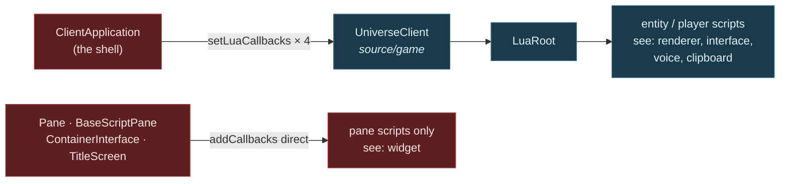
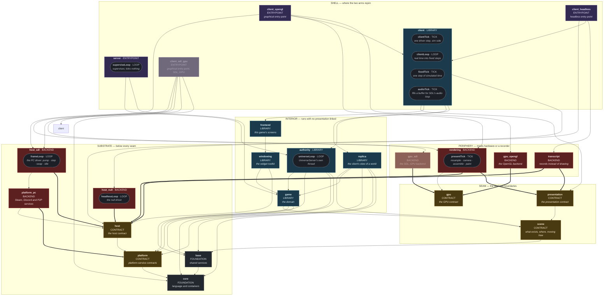
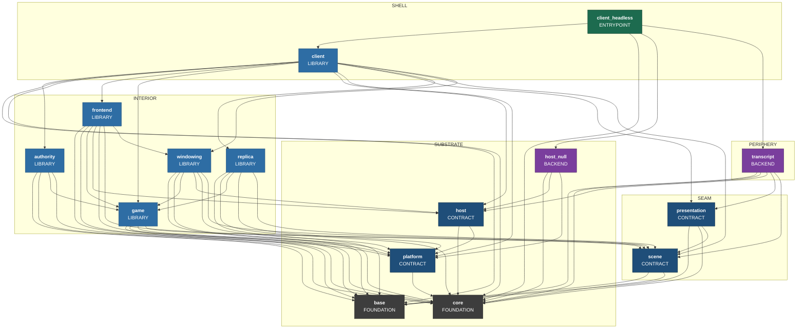
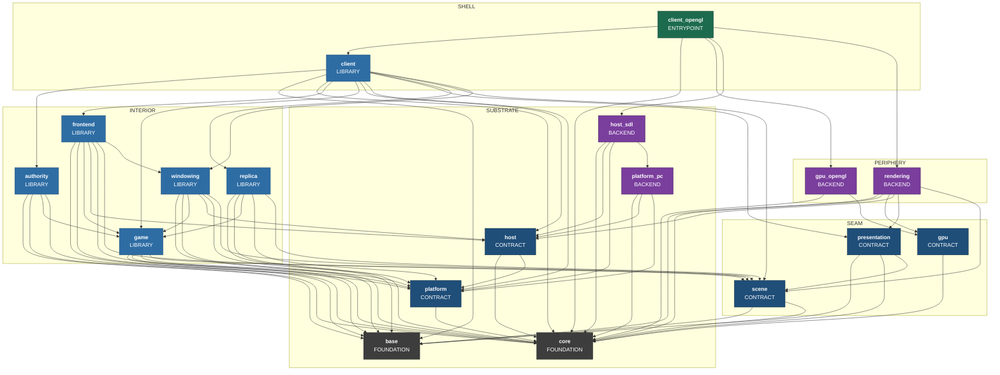
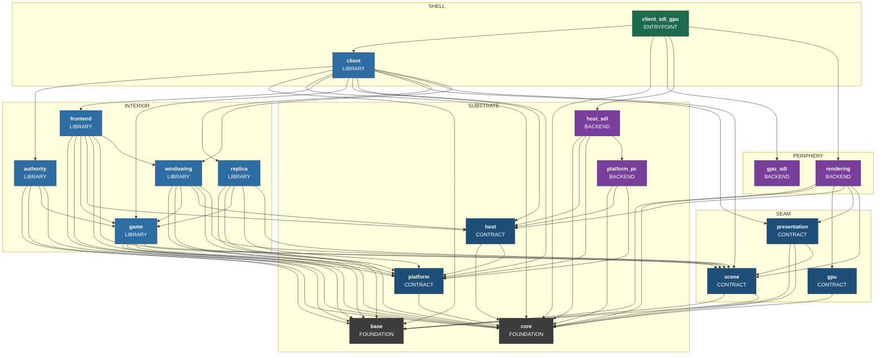
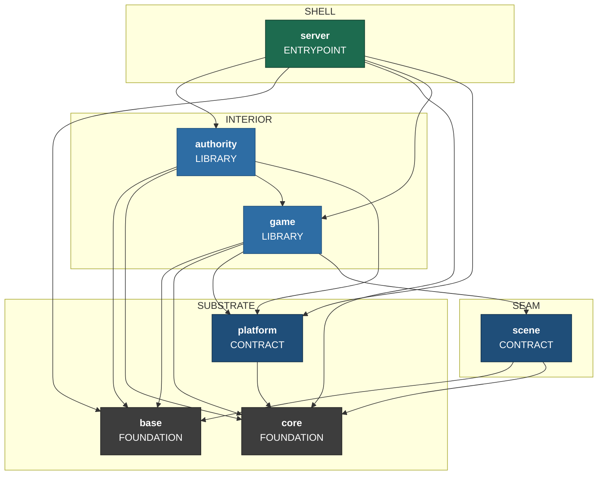
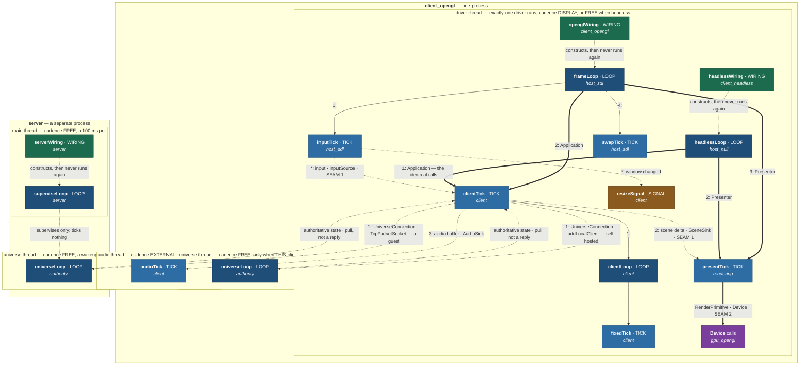

# Sovereign Decoupled Headless Client — Target-State Design

> **STATUS: WORK IN PROGRESS. NOTHING IS APPROVED.** Director's rule, adopted 2026-08-01:
> **approval is aggregate only — no section is approved until the whole can be reasoned with
> together.** Section 1 was stamped approved earlier and has been returned to PROVISIONAL, because
> the model beneath it moved. Sections marked PROVISIONAL are designed and awaiting that aggregate
> review; sections marked NOT YET DESIGNED are outstanding work, listed in Section 8. Do not treat
> either as an omission.

**Goal.** Make presentation a replaceable component behind a stated contract, so that a Starbound
client can run with **no presentation linked at all** — and so that a different presentation
implementation (SDL_GPU) becomes a swap rather than a rewrite.

**The unifying frame.** *A headless client is presentation-backend = null.* If presentation is
replaceable behind a contract, "no presentation" is simply one implementation and SDL_GPU is another.
Run it the other way and the same thing holds: if the system runs with nothing on the other side of
the seam, the seam is proven to be an interface rather than a habit.

**Why that single move is the whole design.** You only know a contract is right when two
implementations satisfy it. GL is implementation #1. Null is the cheap #2. SDL_GPU would be #3 — and
it becomes a backend swap precisely because the null case forced the contract to be honest first.

---

## 0. Decisions locked in brainstorm

| # | Decision |
|---|---|
| **D1** | **Purpose — all six.** Architectural forcing function · foundation for distributed Starbound · CI harness · bot/agent client · cleanup of legacy/dead code sitting inside boundaries · swappable presentation components. |
| **D2** | **Scope of THIS spec.** Contract + null implementation + shell + the cleanup the contract exposes. SDL_GPU backend, CI harness, bot driver and distributed decomposition are each **follow-on specs that consume the contract**. |
| **D3** | **Three contracts at natural strengths.** Video = swappable contract. Input = pluggable source. Audio = merely nullable. Each strength is the weakest thing serving a named purpose; nothing over-built. |
| **D4** | **Null behaviour: record.** The null implementation captures what it was asked to do, with a **discard** mode (fast CI bulk runs) and a **strict** mode (dev-time forcing function). One object, three modes. Serves CI assertions and agent perception from the same code. |
| **D5** | **Unify, do not run parallel.** `ClientApplication` is refactored so presentation is *injected*. GL becomes implementation #1 rather than staying privileged. The graphical client is held byte-identical throughout by the existing render and motion gates. This is the only shape in which "swappable" is true. |
| **D6** | **The contract targets T2.** It may name only core, base and presentation-vocabulary types. See Section 1 and the risk in Section 7. |

### Why D6 is not a preference

If the contract names game types, **every implementation of it must be granted `game`**. `rendering`
stays coupled to the simulation permanently, and an SDL_GPU backend would still need the simulation to
compile. A T3.5 contract does not merely produce a less tidy result — **it defeats the swap purpose it
exists to serve.**

---

## 1. Where the boundary goes — PROVISIONAL

### The boundary is at *drawing*, not at *UI*

Everything that decides **what** to draw stays on the game side — simulation, UI logic, widget layout.
Everything that turns descriptions into **pixels** is presentation.

`windowing` and `frontend` therefore land on the **game** side of the new boundary. Only the painters,
the passes and L1 sit on the presentation side.

That sounds like a large restructure. It is not, and the measurement in
`docs/architecture/system-boundaries.md` Section 5 says why:

| edge | includes | files |
|---|---:|---:|
| `windowing → rendering` | 3 | **1** (`GuiContext`) |
| `frontend → rendering` | 9 | 9 |

**Twelve includes across ten files** — the thinnest live cross-tier edge in the entire tree is exactly
the cut this design needs. The UI already does its own layout and already emits `Drawable`s; it simply
hands them to a painter directly today instead of into a stream.

### `RenderCallback` is not part of the contract

This is the simplification that makes everything else work.

`RenderCallback` is how the game **assembles** a frame — entities push into a sink and
`ClientRenderCallback` accumulates. That is game-internal from start to finish. It stays exactly where
it is and crosses nothing.

**The contract begins after assembly:** *here is a finished frame, present it.*

*(Superseded in part — see the end of this section. Under the scene model there are **two** assemblies:
the simulation assembles a **scene**, presentation assembles a **frame** from it. `RenderCallback` is
still the first one and still crosses nothing.)*

Which is why the video contract is one call per frame with one value, and why it passes the network
test in Section 5 without redesign.

### The three contracts, as streams

```
simulation side                    │  seam 1  (T2)          │  presentation side
───────────────────────────────────┼────────────────────────┼──────────────────────────
world sim, entities                │                        │  resample scene to now
  ↓ RenderCallback (internal)      │                        │    ↓ apply the camera
SCENE assembly                     │  accept(SceneDelta) →  │  FRAME assembly
UI logic, widget layout            │  play(AudioBatch)   →  │    ↓ paint
  ↓ emits scene items              │  ← poll() InputBatch   │  rendering · transcript
```

- **Video** — `accept(SceneDelta const&)`. One call, one value, per driver step. The MVP rung is
  `present(Frame const&)`: the same call with the scene already camera-resolved.
- **Audio** — `play(AudioBatch const&)`. One-way. Fixes `AudioInstancePtr`: the batch carries values,
  not handles.
- **Input** — `poll() -> InputBatch`. The single permitted round trip, once per frame, returning a batch.

One query per frame in total. That is a boundary a network could pass through.

### The T2 vocabulary

`Frame`, `AudioBatch` and `InputBatch` may name **only core, base and presentation-vocabulary types**.
That constraint is what forces the cleanup, and it is what lets the contract sit at T2 where no
implementation needs `game`.

Two pieces of evidence that this runs with the grain rather than against it:

- **`Drawable` depends on six core headers and nothing else** — `StarString`, `StarDataStream`,
  `StarPoly`, `StarColor`, `StarJson`, `StarAssetPath` — and **already carries `DataStream`
  operators**. It moves down essentially for free and is already wire-ready. That is not a
  coincidence; the vocabulary was always closer to a protocol than to an API.
- **`ImageMetadataDatabase` already lives in `game`** so that layout can know image sizes without a
  GPU. The precedent for *metrics are data, not presentation* is already established in this codebase;
  font metrics follow the same path.

### The pixel side has no name today

Asked what the whole scope on the presentation side is called, the honest answer is that **it has no
name, because it is not a unit.** It is 33 files and 8,704 lines spanning two libraries at two
different tiers:

| part | files | lines | tier |
|---|---:|---:|---|
| all of `source/rendering` — painters, passes, texture groups | 23 | 4,413 | T4 |
| the render half of `source/application` — `Renderer`, the GL backend, L1 | 10 | 4,291 | **T2** |
| *(`source/application` keeps: app/window lifecycle, SDL main, Steam/Discord, P2P)* | *15* | *3,081* | *not presentation* |

Near half by volume on each side of a directory line. **The renderer is not in `source/rendering`:**
the largest presentation file, `StarRenderer_opengl.cpp` at 1,824 lines, and the `Renderer` interface
every painter draws through, both live in `application`.

Consequently the word *presentation* is carrying three different meanings at once:

| the name | what it actually covers | fits the pixel side? |
|---|---|---|
| `star_rendering` (T4) | painters and passes | **half** — misses the renderer itself |
| tier T4 "presentation" | `{rendering, windowing, frontend}` | **wrong both ways** — includes the UI this section just placed on the game side, still misses the GL backend |
| L1 / L2 / L3 | the render decomposition | **L1 straddles the directory line** — which is why `scripts/layering-lint.py` has to name `application/` paths |
| `source/presentation` (Section 4) | the contract, interface-only | **no** — that is the seam, not the side |

Section 4 resolves this by splitting the word rather than stretching it. Two measurements decide how.

**First: `rendering` is granted `game` today.** `source/rendering/CMakeLists.txt` lists
`${STAR_GAME_INCLUDES}` in its `INCLUDE_DIRECTORIES`. Deleting that one line is the entire design
stated as a build rule; everything else in this spec is the work that makes deletion possible.

**Second: `RenderCallback` occurs in 39 files and all 39 are in `source/game`.** The claim above that
it is game-internal frame assembly is not an assertion about intent — it is a measurement, and it
satisfies test 2 (severability) already. Nothing needs to move for it.

**And the GL backend has exactly one consumer outside its own `.cpp`:** `StarMainApplication_sdl.cpp`,
the T2 shell that owns the GL context. Unifying the pixel side takes the backend away from that shell,
which is precisely what D5 requires — so **the naming question and the injection question are the same
question**, and they have to be answered in that order. See Section 4's ordering constraint.

### What supersedes this section

Everything measured above stands. **The contract shape does not.**

`present(Frame const&)` hands the presentation side a finished, camera-resolved frame. That welds the
pixel rate to the assembly rate: presentation can only rasterise what it was given, when it was given
it. Over a network it degrades to frame streaming — bandwidth O(screen), and every hitch in the sim
appears as a hitch on the glass.

Section 4 replaces it with a **scene delta**, which lets the presentation side own its own clock and
resample locally. Under that model:

- **frame assembly moves to the presentation side.** The claim above — *"the contract begins after
  assembly"* — reverses.
- **`present(Frame const&)` becomes the degenerate case**: a scene delta already resolved for one
  camera at one instant, with the delta being "everything". It is the MVP rung of a taller ladder, not
  a wrong answer.
- **`RenderCallback` is unaffected.** The measurement holds — 39 files, all in `game` — it simply
  pushes scene items rather than drawables.

The `windowing`/`frontend` placement, the twelve-includes measurement, and the `Drawable` and
`ImageMetadataDatabase` evidence are all independent of which payload crosses, so they carry forward
unchanged.

---

## 2. The client Lua surface — context finding

Recorded here because it was the decisive fact behind D4, and because it is documented nowhere else.

**There are two Lua surfaces, not one.**

**Surface A — global, four groups, injected by the shell into the game layer.**
`UniverseClient::setLuaCallbacks(group, callbacks)` → `LuaRoot::addCallbacks`. Every script created
from that root sees them. `ClientApplication` pushes in exactly four:

```cpp
m_universeClient->setLuaCallbacks("voice",     LuaBindings::makeVoiceCallbacks());
m_universeClient->setLuaCallbacks("renderer",  LuaBindings::makeRenderingCallbacks(this));
m_universeClient->setLuaCallbacks("clipboard", LuaBindings::makeClipboardCallbacks(app, ...));
m_universeClient->setLuaCallbacks("interface", LuaBindings::makeInterfaceCallbacks(m_mainInterface.get()));
```

**Surface B — local, created by presentation for scripts presentation owns.**
`makeWidgetCallbacks(Widget*, GuiReader)`, attached directly by `Pane`, `BaseScriptPane`,
`ContainerInterface`, `TitleScreen` and `VoiceSettingsMenu` to their own script components. Only *pane
scripts* ever see it; it never reaches entity or player scripts.



**Arrows here are calls, not includes** — the opposite convention to Section 4's dependency graph,
which is why every edge in this one is labelled with the call it represents. The two diagrams answer
different questions: this one asks *who invokes whom at runtime*, Section 4 asks *who may name whom at
compile time*.

**Consequences.**

- **Surface B is a non-problem.** Those scripts exist only because panes exist. Delete presentation and
  both go together. Nothing to null out.
- **Surface A is the entire headless Lua question, and it is four named groups** — not a sprawling
  surface.
- **The injection point is already dependency injection, already in the game layer.** `UniverseClient`
  exposes a slot; the shell fills it. That is precisely the shape this design wants, and it already
  exists.
- **Caveat.** `makeRenderingCallbacks` binds directly to `ClientApplication` methods and calls
  `app->renderer()`, so that group's shape is tied to the shell class rather than to an interface. It
  needs a non-shell owner before a second shell can provide it. This is cleanup work, not a blocker.

---

## 3. The network constraint — the sharper forcing function

**Director's constraint:** in theory the full render/graphical front end could run on one machine while
client/world/server run on another, separated by a network. Therefore a goal of both the contract and
the logic boundary is to **reduce ping-pongs at that boundary** — chattiness is evidence the boundary
is in the wrong place.

This is a better test than "does it compile without the other side", because it grades the *shape* of
the interface rather than merely its existence. And it is **countable**, so it can be a gate.

### The main path already passes

Every `RenderCallback` method returns `void`, takes by value, and has a batch form:

```cpp
virtual void addDrawable(Drawable drawable, EntityRenderLayer renderLayer) = 0;
void addDrawables(List<Drawable> drawables, EntityRenderLayer, Vec2F translate = Vec2F());
```

Zero round trips, already batched. Nobody designed this for the thought experiment; it survives it.

### Where it fails, and the list is short

- **Pointers crossing.** `addAudio(AudioInstancePtr)` passes a shared handle.
  `WorldRenderData::particles` is a raw `List<Particle> const*`. Neither survives a wire — and neither
  is visible to any existing instrument, because Section 6 of the boundary document measures *how much* of a
  type is used and nothing measures *whether it could be sent*.
- **Query-shaped Lua callbacks.** Four of the seven in `makeRenderingCallbacks` return values:
  `framesSkipped()`, `postProcessGroupEnabled(String)`, `getEffectParameter(...)`,
  `postProcessGroups()`. Each is a round trip whose frequency is set by mod code.

### Proposed ratchet (design not yet approved)

Countable, so it should become a gate alongside the existing `boundary_ratchet` of 213:

| crossing kind | treatment |
|---|---|
| returns a value | ratchet toward zero — the true ping-pongs |
| passes a pointer or reference | ratchet toward zero — the un-sendables |
| one-way value write | counted, not penalised — these batch |

A boundary that is one-way, by-value and batched is one a network could pass through. The test for
"is this boundary in the right place" becomes **a number that only goes down**.

---

## 4. The target state — PROVISIONAL

**This section describes the target state and nothing else.** No migration, no actions against the
current tree, no history — those live in Section 10, and the delta itself is a separate exercise. Read
every table here as a description of the system we are building, not of the one we have.

### There are two seams, not one

The first draft of this register treated the pixel side as one layer with one boundary. It is two,
and the second boundary **already exists and already works**:

| | seam | declared by | implemented by | status |
|---|---|---|---|---|
| **1** | `SceneSink` · `AudioSink` · `InputSource` — game ↔ presentation | `presentation` | `rendering`, `transcript` | **does not exist** — this design builds it |
| **2** | `Device` — primitives ↔ GPU API (`Renderer` today) | `StarRenderer.hpp` | `OpenGlRenderer`, later SDL_GPU | **exists, and measures clean** |

Four measurements say seam 2 is real rather than nominal:

- `Renderer` declares **42 pure virtuals**, and `OpenGlRenderer : public Renderer`.
- `rendering → application` is **`StarRenderer.hpp` × 9 across 9 files and nothing else** — the
  painters and passes see the abstract header and none of the GL implementation.
- `source/rendering` names `OpenGlRenderer` **zero times in code**; the single occurrence is a comment
  in `StarWorldPass.cpp`.
- `game` touches none of it. `windowing`, `frontend` and `client` touch `StarRenderer.hpp` once each.

**Consequence: SDL_GPU is a seam-2 swap and does not need this design at all.** It replaces
`OpenGlRenderer` and keeps every painter and pass. D2 already listed it as a follow-on; the earlier
diagram contradicted that by drawing it as a peer of `rendering`, which would have implied
reimplementing the painters.

### The shape stops being a stack

Today the lattice is a tower: T0 → T1 → T2 → `game` → presentation → shells. Presentation sits
**above** the simulation, which is exactly why it cannot be removed.

In the target state it **forks at seam 1 and forks again at seam 2**.

**Every component carries three fields: name, KIND, duty.** The name is the directory. The kind says
what sort of thing it is, and therefore which rule governs it. The duty is one phrase, canonical — the
same string appears in the diagram, the register and the grant table, and no component appears twice.

| KIND | the rule it carries |
|---|---|
| **FOUNDATION** | depended on by everything above it; names nothing above itself |
| **CONTRACT** | declares an interface and may name only foundation types. Any `.cpp` holds **value-type constructors and trivial defaults only** — never a backend's behaviour — and its size is metered: `platform` 0, `host` 41, `gpu` 89 lines, ratcheting down |
| **BACKEND** | implements a contract; interchangeable with its siblings; named only by an ENTRYPOINT |
| **LIBRARY** | ordinary code, named directly by its consumers, not interchangeable |
| **ENTRYPOINT** | an executable; the only place a backend may be named |

**Kinds are single uppercase words.** A kind is a token: it has to survive being grepped, pasted into
a CMake variable or a lint rule, and wrapped by a line break. `ENTRYPOINT`, never `ENTRY POINT`. The
same rule applies to any kind added later, and to the zones below.

Kind says what a component *is*. **ZONE** says where it sits relative to the seams — the second and
last grouping axis, and the one the clusters in the diagram draw:

| ZONE | the rule it carries |
|---|---|
| **SUBSTRATE** | below every seam; available to both arms and to the shells |
| **SEAM** | a declared boundary — the only components both arms may name |
| **INTERIOR** | inside seam 1; compiles and runs with no presentation linked at all |
| **PERIPHERY** | outside seam 1; meets hardware or a recorder, and is swapped or deleted wholesale |
| **SHELL** | where the two arms rejoin into an executable |

Zone is not a synonym for kind: `platform` is a CONTRACT in the SUBSTRATE, `presentation` is a
CONTRACT in the SEAM, and `host_sdl` is a BACKEND in the SUBSTRATE while `rendering` is a BACKEND
in the PERIPHERY. The two axes are independent by construction, and the register below carries both.

Neither axis reuses **TIER** (T0–T5, `docs/architecture/system-boundaries.md`) or **LAYER** (L1/L2/L3,
the render decomposition). Both words are already load-bearing elsewhere in this repository and mean
something else.

### ALTITUDE — what a box actually is

A **COMPONENT is a directory with its own grant list.** Not a class, file, module or package, and the
reason is mechanical rather than stylistic: `INCLUDE_DIRECTORIES` is per-directory, so the directory is
the smallest unit at which a boundary is a *compile error* rather than an opinion. That is why `gpu` is
a component and `Device` — the actual interface — is not: `Device` cannot be granted or denied to
anyone, but the directory holding it can.

Some things the design must place are smaller than that, so there is a second altitude:

| ALTITUDE | is | violating its boundary is |
|---|---|---|
| **COMPONENT** | a directory with its own grant list | **a compile error** |
| **ELEMENT** | a named class, interface, type or function inside a component | **a review comment** |

This maps onto the boundary document's existing ENFORCED / PROVEN / ASPIRATIONAL verdicts, and it
supplies the rule for growing this diagram: **an ELEMENT is promoted to a COMPONENT when its boundary
becomes worth a compile error.** Boxes get added by that test, not by feel.

Elements are drawn **inside** their owning component, which becomes a container box. A component
with no named internals stays a plain box — so the diagram distinguishes, at a glance, the
components whose insides the design has something to say about from those it treats as opaque.

**Container components show name and kind only.** Their duty line is dropped because the nested
elements sit where it would render and occlude it; the duty is in the register below, which is the
canonical copy in any case.

**Element naming carries one more rule, and it is load-bearing:**

| suffix | means | owns a cadence |
|---|---|---|
| **`*Loop`** | it has the `while` — it sets the cadence and decides when to stop | **yes** |
| **`*Tick`** | one iteration's body, called by a loop | **no** |

So **the number of `*Loop` elements is the number of clocks this codebase owns**, and the count is
checkable rather than asserted.

An earlier draft of this section claimed the count was one. **It is two today, and I had missed the
second.** Reading `SdlPlatform::run()` line by line:

```cpp
while (true) {                                     // frameLoop      — clock: vsync + swap
    for (event : processEvents())                  //   a DRAIN — no clock, it just empties a queue
        m_application->processInput(event);
    for (int i = 0; i < updatesBehind; ++i) {      //   clientLoop     — clock: m_updateTicker @ 60Hz
        m_application->update();                   //     fixedTick
        m_updateRate = m_updateTicker.tick();
    }
    m_application->render();                       //   presentTick
    SDL_GL_SwapWindow(m_sdlWindow);
    Thread::sleepPrecise(m_updateTicker.spareTime());
}
```

The inner `for` is the classic fixed-timestep accumulator and `TickRateApproacher` is unambiguously a
clock — `targetTickRate()`, `ticksBehind()` (*"how many ticks we should perform so we would be as close
to the target tick rate as possible"*), `ticksAhead()`, `spareTime()`. It iterates, it takes its count
from a clock, it decides when to stop. The rule should have caught it; I named the body and stopped.

The event pump is a third iteration construct that is deliberately **not** a loop by this rule: it
drains a queue and owns no cadence.

Two further facts fall out of reading it closely:

- **The render side has no governing clock at all.** `m_renderTicker` exists but only *measures* —
  nothing gates on `renderTicker.ticksBehind()`. Render cadence is a side effect of vsync inside
  `SDL_GL_SwapWindow`. Giving presentation its own clock is therefore **creating one, not separating
  two**.
- **The frame loop is paced by the simulation's clock** — `sleepPrecise(m_updateTicker.spareTime())`.
  That is the second weld, and it is subtler than the first.

Audio proves the rule rather than breaking it: it is a genuine rate authority, but the loop belongs to
SDL — `SDL_OpenAudioDeviceStream` takes a callback and we supply the body — so `audioTick` is correctly
a tick.

Two arrow kinds, because they mean different things:

| arrow | reads | rule |
|---|---|---|
| `A --> B` | **A includes B** — B is on A's grant list | read `base --> core` as "base includes core" |
| `A ==> B` | **A includes B *and* implements it** — a class in A derives from a base declared in B | **every BACKEND has at least one**, and every one points at a CONTRACT |

**`==>` implies `-->`; it does not replace it.** An implementer has to see the declaration in order to
derive from it, so the grant is still required and `grant-sweep` still checks for it. The thick arrow
classifies *why* a dependency exists — it does not remove one.

**The diagram is compile time, and only compile time.** Every arrow is an `#include` permitted by a
grant list, enforced by `INCLUDE_DIRECTORIES`, and a violation is a compile error. **No arrow means
"calls" and no arrow means "sends data to."** The runtime model is **Section 5**, and nothing in this
section describes it. That separation is deliberate: every attempt to carry both here produced a
contradiction within a day. They are *different graphs* over the same register, and the design's value
lives in the places where they disagree:

| | compile-time graph | runtime graph |
|---|---|---|
| edge means | A may include B | A calls B, or sends data to B |
| lives in | **Section 4** — this diagram and the grant table | **Section 5** — the element register, the driver shape, the execution graph |
| enforced by | `INCLUDE_DIRECTORIES` — a compile error | nothing mechanical; it is a description |
| `client` ↔ `rendering` | **no edge in either direction** | `client` → `rendering`, every frame |
| `host_sdl` ↔ `client` | `host_sdl --> host`, and `client --> host` | `host_sdl`'s `frameLoop` **calls** `client` |
| `client_opengl` | the most edges of any component | **not present at all** after construction |

Those last three rows are the whole design in miniature:

- **A seam is a runtime edge with no compile edge.** `client` grants name no backend and `rendering`
  never names `client`; both point at `presentation` instead. The frame-by-frame flow between them
  crosses a boundary the compiler proves neither side can reach directly. That is what buys the
  network split for free — nothing has to be re-plumbed, because nothing was plumbed.
- **Implements arrows point opposite to the calls.** `host_sdl ==> host` is a compile dependency
  pointing *at* the contract, while the runtime call goes the other way, from the driver into the
  client. Reading `==>` as a call direction inverts the system.
- **Entrypoints are all compile-time and no runtime.** `client_opengl` names five components and
  executes nothing after wiring. A component whose two graphs disagree that completely is doing its
  job — which is why "the entrypoint passes the scene to the backend" is the wrong picture.

**And it is measurable rather than asserted.** An implements edge is an inheritance edge: a class in
the backend deriving from a base declared in the contract. The three that exist today all check out —
`Controller : public ApplicationController`, `OpenGlRenderer : public Renderer`, and four separate
`Pc…`/`Steam…` services deriving from `platform`'s declarations.

One nuance the measurement exposes: **the include need not be direct.**
`StarMainApplication_sdl.cpp` derives from `ApplicationController` while including it only through
`StarMainApplication.hpp`. That is precisely why `grant-sweep` resolves the include closure rather
than counting direct `#include` lines.

Arrows point *at* dependencies, so the foundation sits at the bottom and the executables at the top,
and an arrow that has to be added to make something compile is a dependency that has to be justified.

**The second rule is the Law of One at component altitude, and it is checkable.** A backend with two
`==>` edges is doing two jobs — which is exactly the shape of the `application` this design dissolves:
it implemented `platform` and `host` both, and its duty string hid that behind a single noun.

`gpu_sdl` is drawn faded and dashed: it is declared so the register shows where an SDL_GPU backend
lands, but D2 places it out of scope for this spec.

**The clusters are zones and colour is kind** — one axis per visual channel, so the diagram carries
both taxonomies at once without either being inferred from the other.



The diagram is **transitively reduced**: every component reaches `core` and `base`, but only the
edges that carry information are drawn. `extern` is omitted entirely. The full per-directory statement
is the grant table below, and every grant in it is reachable along these arrows.

**No arrow runs between the simulation side and the presentation backends.** That absence is the
design. `client_opengl` is the only box that touches both arms, which is what makes it the only box
that has to be duplicated to get a headless client.

### `transcript`'s three modes

D4's recorder was specified against a stream of frames. Against a stream of **scenes** it says more,
because a scene is semantic where a frame is baked:

| mode | keeps | serves |
|---|---|---|
| **discard** | nothing; the delta is accepted and dropped | bulk runs, where the point is that the simulation ran at all |
| **record** | the scene deltas, replayable | assertions — *"the player was at (x,y), facing left"* — and an agent's perception |
| **strict** | the deltas, and rejects any naming something outside the scene vocabulary | the forcing function: a contract violation becomes a test failure rather than a review comment |

**strict is what keeps the contract honest.** Without it a type that should not cross can cross for
months and nothing says so.

### Two roles, two names

The word that was doing both jobs now splits:

- **presentation backend** — implements seam 1. `rendering` draws; `transcript` records.
- **GPU backend** — implements seam 2. `gpu_opengl` today; `gpu_sdl` later.

A presentation backend need not have a GPU backend at all: `transcript` has none.

### Seam 1 — the three boundaries

| name | direction | call | strength (D3) |
|---|---|---|---|
| **`SceneSink`** | one-way in | `accept(SceneDelta const&)` | swappable contract |
| **`AudioSink`** | one-way in | `play(AudioBatch const&)` | merely nullable |
| **`InputSource`** | one round trip out | `poll() -> InputBatch` | pluggable source |

The sink/source vocabulary is chosen to carry Section 3's network constraint in the name itself: **a sink
never answers, and there is exactly one source, polled once per frame.** A method that returns a value
on something called a *Sink* is a naming error before it is a design error — which makes the constraint
reviewable by reading, not only by counting.

**`SceneSink` replaces the `FrameSink` an earlier draft named.** `present(Frame const&)` hands over a
finished, camera-resolved frame, which welds the pixel rate to the assembly rate; `accept(SceneDelta)`
does not. Both this table and Section 1 still said `Frame` after the payload had already changed — an
inconsistency inside one document, and exactly what the aggregate-approval rule exists to catch.

### What `scene` actually contains

`scene` is the newest component and the most load-bearing, and naming it is not the same as defining
it. Its contents come from what crosses today — `WorldRenderData`'s members plus the camera — sorted by
the property that decides the delta encoding: **can presentation resample it between updates?**

| group | carries | resamplable |
|---|---|---|
| **camera** | `WorldCamera` — position, zoom, pixel ratio | **yes** — and it matters most; camera motion is what the eye tracks |
| **entities** | `EntityDrawables` — highlight effect, `Map<EntityRenderLayer, List<Drawable>>` | **yes**, given identity and a motion term |
| **particles** | `Particle` | **yes** — they already carry velocity |
| **parallax** | `ParallaxLayer` | **derived** — a function of the camera, so it resamples for free |
| **tiles** | `RenderTileArray` | **no** — a tile grid changes discretely; interpolating it is meaningless |
| **sky** | `SkyRenderData` | **slowly** — interpolatable, rarely worth it |
| **lighting** | emission, obstacle and point-light arrays | **derived** — recomputed from the above |
| **overlays** | nametags, `OverheadBar`, background and foreground `Drawable`s | **follows its anchor** |

**That split is the delta encoding.** Resamplable groups send state plus a motion term and are
interpolated locally; discrete groups send changes and are applied on arrival. Nothing needs a uniform
scheme, which is what makes the payload cheap: at rest, a scene delta is almost empty.

Two consequences worth stating:

- **`scene` owns the camera.** The simulation decides what the camera should *follow*; presentation
  resolves where it *is* at display time. That is what keeps mouse-look and zoom instant when the
  simulation is a network hop away.
- **Lighting is derived, not transported.** It is computed from tiles, entities and sky, all of which
  already cross. Sending a lightmap would be sending a rendered artifact — the frame-streaming mistake
  in miniature.

### Seam 2 — the boundary that already exists

`Device` needs no design work. It needs a **home and a grant list**, which it does not have today
because it lives inside `application` next to Steam and P2P networking. Splitting it out is a
relocation of already-separated code, and it is independent of seam 1.

**It is called `Renderer` today, and the target state renames it to `Device`.** Two reasons, one of
them measured:

- The component `rendering` would otherwise depend on a type called `Renderer` — one word, two
  referents, on opposite sides of a seam. That is the same ambiguity `simLoop` had against
  `universeLoop`, and it fails the same test: these names are read in grep output, telemetry owner
  strings and profile frames, where the other side of the seam is not visible.
- **The measurement says the name is simply wrong.** `RenderVertex` carries a `screenCoordinate` and
  `RenderQuad`'s constructor takes a `minScreen`: vertices arrive at this seam **already projected**.
  The camera transform is applied on the `rendering` side. So the thing called `Renderer` has no
  camera, no scene and no world — it receives screen-space textured primitives and paints them. It
  does not render. `rendering` renders.

`Device` rather than `Rasterizer` because the contract also owns texture creation, framebuffer
targets, blend and scissor state — the whole drawing device, not the rasterisation step alone.

### One diagram per composition — GENERATED

The map above answers *what exists*. It cannot answer *what does this binary actually link*, and that
is the question someone building `client_headless` has. A composition is an ENTRYPOINT plus the
transitive closure of its grant list, so these are **derived from the grant table** by
`scripts/composition-graphs.py` and gated by `composition_graphs`. Three hand-drawn diagrams would be
three more things to drift; nothing below is a new decision.

### Reasoning about a suspicious link

A composition links something surprising because *some edge in its closure* pulls it in. The endpoint
is never the question; the edge is. So the method is three steps, and the third is the one that stops
this becoming taste:

1. **Name the path.** `server` → `game` → `scene`. The question was never about `server`.
2. **Ask whether that edge is correct**, not whether the endpoint is wanted.
3. **If the answer is "component X holds two roles", measure separability before proposing a split.**
   A split that the code cannot support is a worse answer than an honest over-approximation.

Both questions the composition diagrams raised were run through it, and they came out differently.

**`server` links `scene` — the split IS available, and `game` is now three components.** An earlier
draft of this section concluded the repair was impossible. That conclusion came from a bad measurement
and is retracted twice over:

- The replica was rooted at `ClientApplication::update`, which in a **self-hosted** client reaches the
  embedded authority too. It was measuring "replica plus authority" against "authority".
- Symbols emitted into several objects were attributed to whichever object the scan reached first, so a
  file could be *spuriously* reached. Re-run attributing only by symbols with a **unique** definer
  (82% of all symbols), rooted at `WorldServer::update` and `UniverseClient::update`:

| `game` files | count | becomes |
|---|---|---|
| authority-only | **5** — `WorldServer`, `Spawner`, `WireProcessor`, `FallingBlocksAgent`, `LiquidTypes` | **`authority`** |
| replica-only | **43** — `UniverseClient`, sky, parallax, particles, chat, statistics, team | **`replica`** |
| both | **127** | **`game`**, re-scoped to the domain |

So `game` becomes the **domain** — entities, items, tiles, stats, damage, the model both sides share —
with an `authority` and a `replica` orchestrating it. `universeLoop` moves with `WorldServer`: it is
`UniverseServer::run`, and that is the authority, not the domain.

**What the split buys, and what it does not.** `server` stops linking the replica half entirely — the
generated composition above names `replica` in its *not linked* list, which is the whole point. What it
does **not** buy is `scene`: the domain still grants it, because **118 of 500 `game` files name
`Drawable`/`RenderCallback`** — appearance is woven through the entity model, not concentrated.

**Tier 2, named and not attempted here.** `WorldServer.{hpp,cpp}` mention `Drawable`/`RenderCallback`
**zero times** — the authority orchestrator is already clean. The only thing still dragging `scene` onto
an authority is that *an entity knows how it looks*. Separating entity **state** from entity
**appearance** across those 118 files would make the authority free of the presentation vocabulary
entirely. That is a real target with a measured size, not a vague aspiration, and it is the largest
single boundary improvement left in this design.

**`client_headless` links `windowing` and `frontend` — NOT A DEFECT, and the design already resolves
it.** In the target state these are scene producers, not drawers: their grant rows name `scene` and not
`rendering`, and the removal ratchet takes `windowing → rendering` and `frontend → rendering` to zero.
A headless client links them *because it needs what they emit* — a participant has an inventory and a
UI state, and `transcript` records what those produce. The whole-system map made this look suspicious;
the per-composition view plus the target grants make it correct. Measured corroboration: `windowing` is
**0% shared** with the authority — 191 symbols, every one replica-side — which is exactly the clean
separation `game` lacks.

<!-- BEGIN GENERATED: scripts/composition-graphs.py#client_headless -->


**client_headless links 15 of 24 components.** Not linked: `client_opengl`, `client_sdl_gpu`, `gpu`, `gpu_opengl`, `gpu_sdl`, `host_sdl`, `platform_pc`, `rendering`, `server`
<!-- END GENERATED: client_headless -->

<!-- BEGIN GENERATED: scripts/composition-graphs.py#client_opengl -->


**client_opengl links 18 of 24 components.** Not linked: `client_headless`, `client_sdl_gpu`, `gpu_sdl`, `host_null`, `server`, `transcript`
<!-- END GENERATED: client_opengl -->

<!-- BEGIN GENERATED: scripts/composition-graphs.py#client_sdl_gpu -->


**client_sdl_gpu links 18 of 24 components.** Not linked: `client_headless`, `client_opengl`, `gpu_opengl`, `host_null`, `server`, `transcript`
<!-- END GENERATED: client_sdl_gpu -->

<!-- BEGIN GENERATED: scripts/composition-graphs.py#server -->


**server links 7 of 24 components.** Not linked: `client`, `client_headless`, `client_opengl`, `client_sdl_gpu`, `frontend`, `gpu`, `gpu_opengl`, `gpu_sdl`, `host`, `host_null`, `host_sdl`, `platform_pc`, `presentation`, `rendering`, `replica`, `transcript`, `windowing`
<!-- END GENERATED: server -->

### The register — one row per box

Every component in the diagram, in the same reading order.

| name | kind | zone | duty | contents |
|---|---|---|---|---|
| **`core`** | FOUNDATION | SUBSTRATE | language and containers | the language, containers and algorithms everything rests on |
| **`base`** | FOUNDATION | SUBSTRATE | shared services | services shared by the simulation and the shells |
| **`platform`** | CONTRACT | SUBSTRATE | platform-service contracts | `DesktopService`, `P2PNetworkingService`, `StatisticsService`, `UserGeneratedContentService` |
| **`host`** | CONTRACT | SUBSTRATE | the host contract | `Application` and `Presenter` — the two roles a host drives — and `ApplicationController` — what a host provides |
| **`host_sdl`** | BACKEND | SUBSTRATE | the SDL host implementation | an SDL window, the `frameLoop` driver, cursor, clipboard, vsync |
| **`host_null`** | BACKEND | SUBSTRATE | a host that shows nothing | the `headlessLoop` driver and a controller that shows nothing |
| **`platform_pc`** | BACKEND | SUBSTRATE | Steam, Discord and P2P services | the Steam, Discord and P2P implementations of `platform` |
| **`scene`** | CONTRACT | SEAM | what exists, where, moving how | the scene vocabulary and its delta encoding — see below |
| **`presentation`** | CONTRACT | SEAM | the presentation contract | `SceneSink`, `AudioSink`, `InputSource`. **No drawing code.** |
| **`game`** | LIBRARY | INTERIOR | the domain | entities, items, tiles, stats, damage — the model both sides share |
| **`authority`** | LIBRARY | INTERIOR | the simulation that owns truth | `WorldServer` and its agents: spawner, wire processor, falling blocks |
| **`replica`** | LIBRARY | INTERIOR | the client's view of a world | `UniverseClient`, sky, parallax, particles, and the `RenderCallback` sink |
| **`windowing`** | LIBRARY | INTERIOR | the widget toolkit | widgets, layout and `GuiContext` |
| **`frontend`** | LIBRARY | INTERIOR | this game's screens | this game's panes, menus and screens |
| **`rendering`** | BACKEND | PERIPHERY | turns a scene into pixels | painters and passes: resample a scene, apply the camera, assemble a frame, paint it |
| **`transcript`** | BACKEND | PERIPHERY | records instead of drawing | the same scene, written down instead of drawn — three modes below |
| **`gpu`** | CONTRACT | SEAM | the GPU contract | the `Device` interface, the texture atlas, render diagnostics |
| **`gpu_opengl`** | BACKEND | PERIPHERY | the OpenGL backend | the OpenGL implementation of `Device` and its surface substrate |
| **`gpu_sdl`** | BACKEND | PERIPHERY | the SDL_GPU backend | the SDL_GPU implementation of `Device` |
| **`client`** | LIBRARY | SHELL | owns the client frame | composition, `clientLoop`, `clientTick`, `fixedTick`, `audioTick` |
| **`client_opengl`** | ENTRYPOINT | SHELL | graphical entry point | wiring only: `host_sdl` + `rendering` + `gpu_opengl` |
| **`client_headless`** | ENTRYPOINT | SHELL | headless entry point | wiring only: `host_null` + `transcript` |
| **`client_sdl_gpu`** | ENTRYPOINT | SHELL | graphical entry point, SDL_GPU | wiring only: `host_sdl` + `rendering` + `gpu_sdl` |
| **`server`** | ENTRYPOINT | SHELL | hosts a universe for remote players | `main`, `superviseLoop`, and the rcon and server-query threads |

Twenty-four components: five CONTRACTs, seven BACKENDs, six LIBRARYs, two FOUNDATIONs, four
ENTRYPOINTs. An earlier draft claimed **every ENTRYPOINT owns no element**, and offered that as the
test that the altitude was right. It is retracted: each entrypoint owns exactly one `WIRING` element,
and composition is the single most important runtime fact in this design, because it is the *only*
thing that differs between `client_opengl` and `client_headless`. The claim was true only while the
taxonomy had no kind capable of expressing its counterexample — a claim propped up by a blind spot,
which is the fourth time that shape has appeared in this document.
The kinds are what make the next finding visible.

### `server` is not a headless client

The unifying frame — *a headless client is presentation-backend = null* — describes participants. **It
does not describe the server**, and treating the two as the same thing is a category error the earlier
drafts made by omission, since `server` was not in the register at all.

Two orthogonal axes, and "headless" names only the second:

| | role | presentation |
|---|---|---|
| `client_opengl` | **participant, and optionally also an authority** — see below | `rendering` + `gpu_opengl` |
| `client_headless` | **participant** — one player's view of a world | `transcript` |
| `server` | **authority** — hosts a universe for N remote players | **no slot at all** |

The server is not "presentation = null". Presentation is not a concept in that product. Measured, the
two shells share almost nothing:

| | `server` | `client_headless` |
|---|---|---|
| depends on | **core, base, game — three** | eleven components |
| host contract | **never touches it** | `host_null`, for clipboard, cursor and the audio device |
| its loop | **supervision** — `while (isRunning()) { sleep(100); }` | **driver** — `clientTick` then `presentTick` per step |
| what ticks the world | `game`'s `universeLoop`, a thread `UniverseServer` owns | `client`'s `clientLoop`, a fixed-timestep accumulator |
| simulates via | `UniverseServer` — authoritative | `UniverseClient` — a slave view |
| players | N, remote | one, local |

They share exactly one property: **they link `game` and draw nothing.** That is a negative property,
not a shared design, and it is the whole of the resemblance.

**What the server does prove** is the thing this design is trying to make true for the client: that a
shell can link the simulation and have no presentation at all. It has shipped that way for a decade.
`client_headless` is not inventing a shape — it is bringing the participant side up to a bar the
authority side already meets.

**And the server is where the fifth loop was hiding.** `UniverseServer : public Thread` runs
`while (!m_stop)` on its own thread — the authoritative world tick, inside `game`, which the earlier
element register missed entirely because the model was client-centric. `server`'s own loop supervises
and ticks nothing.

### Why this is fully deduplicated

| | `client_opengl` | `client_headless` |
|---|---|---|
| host | `host_sdl` — owns `frameLoop`: pump, step, swap, idle | `host_null` — owns `headlessLoop`, ~10 lines plus 35 no-ops |
| presentation | `rendering` + `gpu_opengl` | `transcript` |
| **everything else** | `client` · `clientLoop` · `clientTick` · `fixedTick` · `audioTick` · `game` · `windowing` · `frontend` · `scene` · `presentation` · `host` · `platform` | **identical** |

The simulation path is **100% shared**, and the frame budget is defined once in `clientTick`, so the
telemetry model cannot fork between the two clients — which was the whole reason the loop question
mattered.

The residual difference is the two drivers, and that is not duplication: pumping SDL versus not pumping
SDL **is** the host's job. Three lines differ.

### The vocabulary that was missing: scene

The reason a sovereign pixel loop looked impossible is that only two vocabularies were named, and
neither works:

| | what it is | interpolatable | names game types |
|---|---|---|---|
| **entity state** | the simulation | yes | **yes** — cannot cross, D6 |
| **scene** | what exists, where, moving how, in which layer, plus the camera target | **yes** | **no** |
| **frame** | a scene resolved for one camera at one instant → screen-space drawables | no, already baked | no |

`Drawable` sits at the frame level. `WorldRenderData` is scene-shaped but carries game types, which is
exactly why it is on the unassessed list in Section 7.

With `scene` named, the seam carries **scene deltas**: presentation resamples at display rate, applies
the camera locally, assembles and paints. D6 holds because scene is a T2 vocabulary.

**And the pattern is already proven in this codebase.** `game/StarInterpolationTracker.{hpp,cpp}` —
held by both `WorldServer` (per client) and `WorldClient` — does exactly this clock reconciliation
between server and client today: `receiveTimeUpdate(remoteTime)`, `interpolationLeadTime()`,
`extrapolationHint()`. Applying it at the client↔presentation seam is the same pattern one seam
further out, not a new invention.

### What the payload choice actually buys

| payload | pixel rate | assembly lives | what can be plugged in | network cost |
|---|---|---|---|---|
| finished `Frame` | == sim rate | game side | **any rasteriser** — GL, SDL_GPU, null | O(screen) |
| **scene delta** | free, resampled | presentation side | **any presentation** — a rasteriser, a text renderer, an audio-only client, a debug visualiser, a bot's perception | **O(change)** |

Because the payload is semantic rather than baked, presentation stops meaning *"something that draws"*
and starts meaning *"something that experiences"*. A transcript of scene deltas is assertable —
*"player at (x,y), facing left"* — where a transcript of drawables is a list of quads nobody can test
against. **The scene model makes D4's recorder genuinely useful rather than merely faithful.**

Co-located, the delta is a memcpy on one thread. Split, it is a packet. Same code, different
transport — which makes the transport a second implementation proving the contract, exactly as null
proves the backend.

**Accepted costs**, recorded rather than glossed: a scene vocabulary and delta encoding; a resampler on
any presentation wanting a free-running rate (an ELEMENT, or a LIBRARY if `transcript` also wants
fixed-rate recording — open); camera resolution moving to the presentation side; and materially more
machinery than `present(Frame)`. The Director waived A3's Earned Exposure for this deliberately: the
payoff is judged worth the forecast surface.

### Why `host` is its own directory and not part of `platform`

A first draft folded `ApplicationController` into `platform`. Two measurements killed that:

- **It is a consumer of `platform`, not a peer.** `StarApplicationController.hpp` includes all four
  platform service headers and returns all four types. Folding it in would put a thing and its own
  dependency inside one directory — dissolving the boundary rather than moving it.
- **`platform`'s duty would have become "host **and** platform services"** — a Law-of-One violation by
  the axiom's own test.

`host` is also not a new component. **`ApplicationController` is already named in 8 files across 3
directories outside `application`:** `client` (2, `applicationInit`), `frontend` (4, clipboard and
audio input), `windowing` (2, cursor and clipboard). What is new is a directory and a grant list.

`Application` moves with it, because the two are halves of one contract: the host runs an
`Application` and hands it an `ApplicationController`, and they share the `WindowMode` enum. Splitting
them would leave a cycle between `host` and `application`. `Application` is also what makes
`client` sovereign: `class ClientApplication : public Application` today, so without the move `client`
would need a grant on `application` and could name SDL.

`StarMainApplication.hpp` stays behind. It is the `STAR_MAIN_APPLICATION` macro that defines
`main()`/`WinMain()` — an entrypoint artifact, not a library one — so it belongs to `client_opengl`,
and `client`'s current dependency on `application` disappears with the split rather than needing a
grant.

### What the grant lists say

Each directory's `INCLUDE_DIRECTORIES` block is the complete statement of what it may include, so the
register above is **intended** to be enforced by the build rather than by review. That enforcement is a
property of the finished system, not of this document — see the coverage note below the table for what
is actually established today.

| directory | granted | the statement it makes |
|---|---|---|
| `platform` | core | vendor services declared, never implemented here |
| `host` | core, platform | the host contract; it returns `platform` types, so it consumes them |
| `host_sdl` | core, host, platform, platform_pc | the SDL host; the only place SDL is named |
| `host_null` | core, host, platform | names no device at all — returns `nullptr` for all four services, but must still name their types to override |
| `platform_pc` | core, platform, host | the vendor backend; the only place Steam and Discord are named |
| `presentation` | core, base, scene | the interfaces are stated in scene terms — D6, enforced |
| `gpu` | core | the GPU contract cannot name a game type either |
| `gpu_opengl` | core, gpu, extern | GL is named here and nowhere above |
| `rendering` | core, base, presentation, scene, gpu, host | **`game` is revoked**; `host` is what lets its driver paint it and its input reach the client |
| `transcript` | core, base, presentation, scene, host | the recorder cannot see a GPU at all; `host` is the same driver role `rendering` takes |
| `scene` | core, base | the payload vocabulary; names no game type and no interface |
| `game` | core, base, platform, **scene** | the domain still names appearance — the tier-2 target below |
| `authority` | core, base, platform, game | **names no `scene`**: `WorldServer` mentions `Drawable`/`RenderCallback` zero times |
| `replica` | core, base, platform, game, scene | **the simulation cannot name a presentation interface at all** |
| `windowing` | core, base, platform, game, scene, host | emits into the frame and uses clipboard and cursor; does not draw |
| `frontend` | core, base, platform, game, windowing, scene, host | this game's screens; does not draw |
| `client` | core, base, platform, game, authority, replica, windowing, frontend, presentation, scene, host | **names no backend**; it grants `authority` because a hosting client *is* one |
| `client_opengl` | core, client, host_sdl, rendering, gpu_opengl | the only place GL and SDL are named together |
| `client_headless` | core, client, host_null, transcript | the only place the recorder is named |
| `client_sdl_gpu` | core, client, host_sdl, rendering, gpu_sdl | identical to `client_opengl` except for the backend — which is the entire point |
| `server` | core, base, game, authority, platform | **no presentation slot, and no `replica`** — that is what the split buys |

**Every row is a complete list.** An earlier draft used `+ …` to mean "in addition to the row
above", which reads fine in prose and is meaningless to a build — `scripts/grant-sweep.py` reported
four such rows as missing the grants they appeared to have. A grant list that is not complete is not
a grant list.

### What is actually checked, and what is only asserted

This section describes a system that does not exist. Nothing here can be verified in the sense that
matters — *would the designed thing work* — and the checks that run against it do three different jobs
that are easy to conflate. Stating them apart, because "all gates green" otherwise reads as far more
than it is:

| | what it establishes | coverage |
|---|---|---|
| **coherence** | the document does not contradict itself — each diagram against its register, drawn edges against the grant table, prose tallies against both, and **every runtime edge against the compile projection** | **all 21 components and all 10 elements.** Gated as `spec_consistency`; says nothing about correctness |
| **anchoring** | where a target name covers files that exist today, the grant row matches a measured *transitive* include closure | **14 of 21 components** |
| **correctness** | the designed system compiles, runs, and does what it claims | **zero.** Not obtainable before it is built |

`spec_consistency` also refuses to pass on a parse that found implausibly little, and hard-fails if
either diagram loses its `%% projection:` marker — a check that cannot find what it is checking must
not report success. Ten injected defects were each confirmed to fire before it was registered.

The seven components with no files — `scene`, `presentation`, `transcript`, `host_null`, `gpu_sdl`,
`client_opengl`, `client_headless` — have grant rows that are **pure assertion**. `grant-sweep` reports
them UNVERIFIABLE rather than passing them, which is the only honest verdict available.

Two limits apply even to the anchored fourteen:

- **The file-to-owner map is itself a design assertion.** Placing 25 of `application`'s files into
  five target components is a decision, not a measurement; a file placed in the wrong box yields
  grants that are wrong in a way the sweep cannot see, because it would measure the wrong thing
  consistently. `REGISTER_COUNTS` cross-checks the counts, which catches a miscount and not a
  misplacement.
- **The measurement is conditional on the revocations landing.** The sweep reads today's tree, in
  which the 43 crossings the ratchet tracks still exist. It establishes that the grant table describes
  the tree *as it will be once those are deleted* — not the tree as it stands.

**So the honest reading of a green run is "no contradiction found", never "the design is correct."**
The UNVERIFIABLE count is the better number to watch: it is the fraction of this section resting on
assertion alone, it stands at **seven components today**, and it should fall to zero as they are built.
That is a ratchet pointing the opposite way from the removal ratchet, and Section 6 should gate both.

**One line carries the design.** `source/rendering/CMakeLists.txt` lists `${STAR_GAME_INCLUDES}`
today. Deleting it is the whole of seam 1, and the moment it is gone the presentation backends are
severable by construction rather than by assertion.

Two grants in that table are deliberately absent rather than forgotten. `rendering` currently holds
`${STAR_PLATFORM_INCLUDES}` and `${STAR_APPLICATION_INCLUDES}`; in the target state it needs neither —
platform services are Steam and P2P, and its only `application` include was `StarRenderer.hpp`, which
becomes `gpu`. Dropping both leaves the drawing code depending on nothing but the foundation and two
contracts.

## 5. Run time — PROVISIONAL

Section 4 answers *who may name whom*: a compile-time question, enforced by `INCLUDE_DIRECTORIES`,
where a violation is a build failure. This section answers a different one — **what executes, on which
thread, in what order, and what it hands to what.** They are different graphs over the same register,
and the design's value lives in the places where they disagree; Section 4's arrow legend tabulates
three such places.

Keeping them apart is not tidiness. Every previous attempt to describe run time in prose alongside the
dependency picture produced a contradiction within a day — most recently a claim that nothing returns
across seam 1, which this section's own contract table had already refuted.

### The driver, and why there is no `presentLoop`

A **driver** is the loop that owns a process's cadence. There is exactly one per process, it comes from
whatever host that process has, and its whole shape is four lines:

```
frameLoop      while (running) { pump(); clientTick(now); presentTick(now); swap(); idle(); }
headlessLoop   while (!done)   {         clientTick(now); presentTick(now);         }
```

**Presentation never owns a clock.** Its cadence always comes from the driver in its process — vsync
today, and when it runs on a separate machine it gets a driver from *its own* host. So `presentTick` is
genuinely a tick and there is no `presentLoop` at any stage. An earlier draft of this section predicted
one; that prediction was wrong.

`clientLoop` is the one loop that is not a driver. It has to be a loop because determinism requires a
fixed step while real time does not cooperate: it runs `fixedTick` zero-to-N times to bring simulated
time level with real time.

That makes the client's three elements a sequence of **time domains**, which is exactly what their
names record:

| element | cadence | one iteration is |
|---|---|---|
| `clientTick` | **real** time, whatever the driver runs at | one driver step |
| `clientLoop` | — | the converter: real time in, fixed steps out |
| `fixedTick` | **simulated** time, fixed 60 Hz | one step of the simulation |

An earlier draft named these `simLoop` and `simTick`. Both were dropped: `universeLoop` is also
simulation, so "sim" never said *which* one — and these names are read in grep output, telemetry owner
strings and profile frames, where the enclosing component is not visible to disambiguate them.

### Three clocks, of which we own two

| clock | owned by | one per |
|---|---|---|
| **driver** | the host this process happens to have | **process** |
| **sim** | `client` — a fixed-timestep accumulator | client |
| audio | SDL, via `SDL_OpenAudioDeviceStream` @ 44100 Hz | device |

The driver clock being *per process* is the move that makes the network case free: co-located there is
one driver; split across a machine boundary there are two, one on each side, and **no element moves and
none is added**.

| | co-located | split |
|---|---|---|
| sim side | `frameLoop` → `clientTick` → `clientLoop` | `headlessLoop` → `clientTick` → `clientLoop` → scene delta **out** |
| pixel side | same driver → `presentTick` | its own host's `frameLoop` → `presentTick` ← scene delta **in** |
| the delta is | a memcpy on one thread | a packet |

Same code, different transport. Crossings stay at one push per driver step, one-way and by value, which
is what Section 3 asks for.

**Frame assembly is not a clock** — it has no cadence of its own, it is a transform whose rate is set by
whoever pulls it. Giving it an authority would be inventing a governor with nothing to govern.

### The runtime taxonomy

Section 4 classifies boxes on three axes — ALTITUDE, KIND, ZONE. Run time needs its own three, and
they have to *graft*: a name that means one thing in one projection and something else in the other is
worse than no name. The graft point is deliberate and singular.

**ALTITUDE — what a runtime box is.**

| altitude | what it is | crossing it costs | contains |
|---|---|---|---|
| **PROCESS** | one address space | a network hop — nothing can be passed by pointer | THREADs |
| **THREAD** | one flow of control; owns **at most one** clock | a handoff — a queue, a lock, or a packet | ELEMENTs |
| **ELEMENT** | a named unit of execution: a loop, or one iteration's body | an ordinary call | — |

**`ELEMENT` is the same word, and the same thing, as Section 4's ELEMENT.** That is the graft: the two
projections share one vertex set and disagree only about what *contains* it. Compile time puts an
element in a COMPONENT; run time puts it in a THREAD. Neither containment implies the other, and the
places they cut across each other are exactly what one view can see and the other cannot — `client`
owns `clientTick` on the driver thread and `audioTick` on SDL's, which the dependency diagram has no
way to show.

There is deliberately **no runtime altitude below ELEMENT**. Statements, branches and expressions
execute too, and modelling them would be a call graph rather than an architecture.

**KIND — what an element is with respect to time.** Four values. An earlier draft had two, and the
`Application` contract this design already depends on refutes that directly: of its ten virtuals, three
are ticks, one is a query, and **six fit neither**.

| kind | what it is | fails by |
|---|---|---|
| **`LOOP`** | owns a clock — it has the `while`, sets the cadence, decides when to stop | never yielding, or the wrong rate |
| **`TICK`** | the **highest-order** call a loop drives; one iteration's body, owning no cadence | being too slow for its loop's budget |
| **`WIRING`** | runs **exactly once per process**, outside every clock; decides what is connected to what | the wrong **order** |
| **`SIGNAL`** | driven by an occurrence rather than a clock; aperiodic and repeatable | not being handled, or **re-entering** |

`WIRING` and `SIGNAL` are separate kinds rather than one because their failure modes are separate,
which is the same test that separated `LOOP` from `TICK`.

**`TICK` is not "any method call".** `WorldClient::update()` runs once a frame and is *not* a tick — it
sits inside `fixedTick`. Highest-order is the whole of the discriminator, and it is the same discipline
as the compile projection, where a class inside a component is not a component. A runtime element
exists where **a cadence or a boundary is decided**, not wherever a call happens.

**`WIRING` is not only startup.** `shutdown()` has the identical shape — once, outside every clock,
order load-bearing — and teardown order is where this codebase's lifetime bugs have actually lived.

**CADENCE — what drives it.** The runtime analogue of ZONE: ZONE places a component relative to the
seams, CADENCE places an element relative to time.

| cadence | driven by | example |
|---|---|---|
| **DISPLAY** | the display's refresh; vsync paces it | `frameLoop` |
| **FIXED** | a fixed simulated timestep, independent of real time | `clientLoop`, `fixedTick` |
| **FREE** | a wall-clock poll or as-fast-as-possible | `headlessLoop`, `universeLoop`, `superviseLoop` |
| **EXTERNAL** | someone else's clock, which we do not own | `audioTick` — SDL's audio thread |
| **DERIVED** | no clock at all; runs when called | `inputTick`, `clientTick`, `presentTick` |
| **ONCE** | not driven at all; runs a single time per process | every `WIRING` element |
| **EVENT** | an occurrence, at no predictable rate | `resizeSignal` |

**EDGE — how one element reaches another.** Three values, and the middle one is where the projections
invert: `CALL` (direct, same thread), `DISPATCH` (virtual, through a contract), `HANDOFF` (a payload
crosses; the producer does not block on the consumer's body).

**ORDER — a fourth thing an edge carries, because a graph alone cannot.** A flowchart's edges are a
*set*: `frameLoop` reaching four elements says nothing about the sequence, and the sequence is
load-bearing. The source says so itself, at the phase this design cannot yet place: *"THE TRUE END OF
THE FRAME… the renderer cannot do this itself: **it does not own this ordering**."* An ordering
constraint owned by the host, in a model with no way to write one down.

So every edge leaving a source that has **more than one** carries a prefix:

| prefix | means |
|---|---|
| `1:` `2:` `3:` … | the sequence, starting at 1, contiguous as a set. **Ties are legal** and mean "same phase" — `clientTick`'s netcode exchange and its fixed step share `1:` because they happen inside one call |
| `*:` | **deliberately unordered.** `inputTick`'s two edges interleave per event; numbering them would assert an order that does not exist |

Mixing the two styles from one source is an error, and so is a gap in the numbering. A source with a
single outgoing edge needs no prefix: there is nothing to order.

The numbers are measured, not assumed. `clientTick`'s came from reading `ClientApplication::update`:
`universeClient->update` (the exchange and the replica step, hence the tie), then `worldPainter->update`,
then `mainMixer->update`.

**What ORDER still cannot express, stated rather than hidden.** `WIRING`'s declared failure mode is
wrong order — but what a `WIRING` element orders is the construction of **components**, and this
graph's vertices are **elements**. The constraint is real, it is the reason teardown must reverse
composition, and it is *not expressible here*. That is a genuine limit of the runtime projection: it
can sequence a frame and cannot sequence a composition. Recorded as a limit rather than forced into a
notation that would only look like coverage.

### The graft rule

> **Every runtime edge must be legal in the compile projection.** For an edge from element *a* to
> element *b*: either they share a component, or *a*'s component grants *b*'s, or both grant a common
> CONTRACT to dispatch through.

This is what makes the two views one design rather than two documents. It is mechanical, it runs in the
standing verification, and its first run rejected two edges — `frameLoop → presentTick` and
`headlessLoop → presentTick` — because no host shared a contract with `rendering`. **The host could
not trigger the paint.** Routing it through `client` instead would have been legal but wrong: in the
split case the client is on another machine and cannot pace a remote display, so the code would have
had to differ between compositions, which is precisely what this design claims never happens. The fix
was compile-side — `rendering` and `transcript` gain `host`, and `host` declares `Presenter` alongside
`Application` as the second role a host drives.

That is the working loop the two projections are for: **a runtime requirement, checked against a
compile-time permission, resolved by changing the permission.**

### Element register

Two container columns, one per projection — the graft, in a table.

| element | kind | cadence | owner *(compile)* | thread *(run)* | duty |
|---|---|---|---|---|---|
| **`frameLoop`** | LOOP | DISPLAY | `host_sdl` | `driver` | drives a process that has a display |
| **`headlessLoop`** | LOOP | FREE | `host_null` | `driver` | drives a process that has none |
| **`clientLoop`** | LOOP | FIXED | `client` | `driver` | converts real time into fixed steps |
| **`universeLoop`** | LOOP | FREE | `authority` | `universe` | supervises worlds and connections on a wakeup interval |
| **`superviseLoop`** | LOOP | FREE | `server` | `main` | waits for shutdown; ticks nothing |
| **`inputTick`** | TICK | DERIVED | `host_sdl` | `driver` | drains the OS event queue |
| **`clientTick`** | TICK | DERIVED | `client` | `driver` | one driver step, sim side |
| **`fixedTick`** | TICK | FIXED | `client` | `driver` | one step of simulated time |
| **`presentTick`** | TICK | DERIVED | `rendering` | `driver` | resample, camera, assemble, paint |
| **`audioTick`** | TICK | EXTERNAL | `client` | `audio` | fills a buffer for SDL's audio loop |
| **`swapTick`** | TICK | DISPLAY | `host_sdl` | `driver` | presents the backbuffer; **where vsync actually blocks** |
| **`resizeSignal`** | SIGNAL | EVENT | `client` | `driver` | the window changed; surfaces must be rebuilt |
| **`openglWiring`** | WIRING | ONCE | `client_opengl` | `driver` | composes `host_sdl` + `client` + `rendering` + `gpu_opengl` |
| **`headlessWiring`** | WIRING | ONCE | `client_headless` | `driver` | composes `host_null` + `client` + `transcript` |
| **`serverWiring`** | WIRING | ONCE | `server` | `main` | composes the universe and its query and rcon threads |

*Called by* was a column here and is now the execution graph's edges, which is the only copy.

**Two things the cadence column makes visible.** `client` owns elements at three different cadences,
so "the client's clock" is not a thing that exists. And **neither modelled server loop is FIXED** —
`universeLoop` sleeps a wakeup interval and `superviseLoop` polls at 100 ms, so the authoritative
fixed tick is `worldServerThread`, which this design does not yet model. That gap is real and named
rather than implied by an empty column.

### The execution graph

Clusters are **threads**, nested inside **processes**. Each node is an ELEMENT, labelled with the
component that owns it, so both views reconcile against the same register.



**Three edge kinds, and the distinction between them is the point:**

| edge | means | why it matters |
|---|---|---|
| `A --> B` | **direct call**, same thread, statically bound | ordinary control flow |
| `A ==> B` | **call dispatched through a contract** — virtual, in-process | the compile arrow points the *other* way; this is where the two graphs invert |
| `A -.-> B` | **handoff** — a payload crosses; the producer does not block on the consumer's body | it may cross a thread, a process, or a machine |

**Seam 1 is a handoff; seam 2 is a call.** That falls out of the network constraint rather than taste:
a scene delta must survive being a packet, so `clientTick` can never synchronously enter `rendering`. A
`RenderPrimitive` never crosses a machine, so `presentTick` calling `Device` can be an ordinary virtual
call. The compile diagram draws both as `-->` and cannot tell them apart.

**The two `universeLoop` edges are one connection and are still two edges.** `UniverseConnection` is
duplex, so the outbound and inbound arrows share a socket — but the inbound one is **not a return
path**, and calling it one would import request/response semantics this design must not have. The
measurement: `push(List<PacketPtr>)` and `pull()` over an explicit `m_sendQueue`, and the client calls
`receiveAny(timeout)`, which **drains whatever has arrived**. It never waits for the answer to what it
sent. What comes back is not a reply; it is whatever the authority has published since last time.

**And that makes seam 1 a second instance of a mechanism this codebase already ships.** Duplex, queued,
neither side blocking on the other's body, working co-located over a loopback and split over a network
with no change of shape — `clientTick ⇄ universeLoop` is `clientTick ⇄ presentTick` already built and
running in production. `InterpolationTracker` was already recorded as the precedent for *resampling*;
this is the precedent for the *transport*, and it is the stronger of the two, because it is the part
that has to survive a machine boundary.

**Three compositions, one pattern, and the third already crosses machines.** The substitution this
design rests on — *exactly one of N exists per run, and the caller cannot tell which* — is not a
proposal. It ships three times over:

| the choice | the alternatives | who is indifferent |
|---|---|---|
| which host drives the process | `host_sdl` · `host_null` | `client`, via `Application` |
| which presentation receives the scene | `rendering` · `transcript` | `client`, via `SceneSink` — **this design's new one** |
| **which universe is authoritative** | embedded · remote over TCP | `client`, via `UniverseConnection` |

The third is the load-bearing precedent, because it is the only one that already spans a machine
boundary in production. `connect(m_universeServer->addLocalClient(), …)` and
`connect(UniverseConnection(TcpPacketSocket::open(…)), …)` are the same method taking the same type,
and nothing downstream of `connect` knows the difference. Seam 1 asks for that shape a second time,
one boundary further out.

### Where the universe lives is a WIRING decision, not an execution mode

There is **no conditional execution model**. `universeLoop` is the same class on the same kind of
thread at the same cadence wherever it runs. `UniverseClient` does not branch, `UniverseConnection`
does not branch, and nothing downstream of `connect()` can tell. Exactly one thing varies, once, in a
`WIRING` element: whether this process constructs a `UniverseServer`, and which `PacketSocket` backend
the resulting pair gets.

**`PacketSocket` is the substitution point** — `LocalPacketSocket` and `TcpPacketSocket` are two
backends of one contract, chosen at composition and invisible afterwards. That is this design's own
pattern, already shipping, one boundary further in.

### The co-located path must not be a cheaper semantics — D8

An earlier draft of this section listed four reasons a dedicated universe process would be expensive.
Three of them were not costs. They were **smells**, and naming them as costs would have argued for
keeping a defect:

| listed as a cost | what it actually is |
|---|---|
| "serialisation is free locally" | `LocalPacketSocket::writeData()` and `readData()` both `return false`, and `sendPackets` moves `PacketPtr` straight into the peer's `Deque`. **The wire format is never exercised in the most common configuration**, and two "sides" share mutable heap objects across what this document calls a boundary |
| "assets and `Root` load twice" | a consequence of `Root` being an undifferentiated singleton, which the Air-Gap ratchet already exists to pay down. A decomposed asset layer would let each process load what it needs |
| "supervision and orphan handling do not exist" | a feature absent today, not a cost of building it. Nothing currently notices if the embedded universe thread dies |

Only launch latency was a real cost, and it is small and solvable.

**The consequence is a design requirement, and seam 1 inherits it.** The co-located backend of a seam
must be *semantically identical* to the split one, not merely faster — otherwise the configuration
almost everyone runs is the one that never tests the boundary, and breakage surfaces only in the rare
configuration. Seam 1's claim that "co-located, the delta is a memcpy" is exactly the shape that
produces this, and `LocalPacketSocket` is the worked example of what goes wrong.

> **D8 — a seam's co-located path is an optimisation, never a different contract.** Either it performs
> the same encode/decode the split path does, or an oracle proves the two produce identical results.
> "It is faster because it skips the boundary" is a boundary that does not exist.

D8 has no instrument yet. It belongs in Section 6 alongside the other two.

Four things this view shows that the dependency view structurally cannot:

- **`universeLoop` appears in both processes, and the client reaches either through one edge.** The
  axis is **not** single-player versus multiplayer — it is *who hosts the universe*, and there are
  three cases: this client hosts it, a dedicated `server` process hosts it, or someone else's client
  hosts it. Both edges are drawn at sequence `1:` because **exactly one exists in any given run**, and
  the client cannot tell which it got: `connect(m_universeServer->addLocalClient(), …)` and
  `connect(UniverseConnection(TcpPacketSocket::open(…)), …)` are the same method taking the same type.
  Measured, not asserted — as is the absence of any process spawn: there is no `fork`, `exec`,
  `CreateProcess` or `starbound_server` reference anywhere in `client/` or `application/`, so a hosted
  universe is **a thread in the client's own process**, never a child process.
- **A hosting client is an authority as well as a participant.** `setListeningTcp`, `maxClients` and
  `addClient(UniverseConnection(P2PPacketSocket::open(…)))` are all called on the *client's* embedded
  server: it accepts remote players. So `client_opengl` straddles the participant/authority split that
  distinguishes `client_headless` from `server` — the two are independent axes, not one. That is
  precisely why `universeLoop` has to be reachable through an identical edge either way: the client
  that hosts and the client that joins run the same code, and neither knows which it is.
- **The host calls the client.** `frameLoop ==> clientTick` runs opposite to `host_sdl --> host` and
  `client --> host`. Reading the compile arrows as call direction inverts the system.
- **Presentation and simulation share a thread today.** Most of the client process sits in one
  cluster. The split-across-machines case is exactly this diagram with that cluster cut in two, and
  nothing else moving.
- **The two client compositions are the same picture.** `frameLoop` and `headlessLoop` are drawn side
  by side because exactly one of them exists in any given process, and both make the *identical two
  calls* into `clientTick` and `presentTick` through the same `Application` contract. `client_headless`
  substitutes `host_null` for `host_sdl` and `transcript` for `rendering`; **no element moves and none
  is added.** That claim was previously asserted in prose; here it is visible.
- **`superviseLoop` supervises nothing it drives.** Its only edge is a dashed label; the authority in
  the server process is `universeLoop`, on another thread.

**The input path, resolved.** An earlier draft drew `inputTick` dashed and red: `InputSource` is
declared by `presentation` and implemented by `rendering` and `transcript`, but input originates at the
**host** and neither backend was granted `host`, so `poll()` had nothing to return. Granting both
backends `host` — the change the paint trigger needed anyway — closed it, and the edge is now ordinary.
`InputSource` stays on seam 1 rather than moving into `host`, because seam 1 is the boundary that
crosses machines and the human sits at the display; routing input through `host` would need a second
network-spanning seam, which D3 forbids.

**One phase still has no legal home: `finishTick`.** The frame loop's own telemetry names five phases
and this register models four of them. The fifth — `cpu.frame.finish.us`, which calls `finishFrame()`
and then lets the overlay draw — is annotated in the source as *"THE TRUE END OF THE FRAME"* and
*"the renderer cannot do this itself: it does not own this ordering."* So the host owns an ordering
constraint over the GPU, and the graft rule rejects every home for it:

```
host_sdl   grants core, host, platform, platform_pc
gpu_opengl grants core, gpu, extern
shared CONTRACTs: none
```

That is the `host_sdl -> gpu` crossing already on the removal ratchet at ceiling 1. It is carried as an
open item rather than given an invented owner — the second defect of exactly this class, and both were
found the same way: by drawing the runtime and asking the compile projection for permission.

### Why `presentTick` is one element and not two

`presentTick` does four things in order — **resample · camera · assemble · paint** — and the first two
are a different job from the last two: resampling is a pure function of the scene, the target time and
the camera, and needs no device at all, while assembling and painting need a `Device`. That is a real
decomposition and `rendering`'s contents record it. It is deliberately **not** two entries in the
element register, for three reasons:

- **The register models cadence, and these share one exactly.** Its columns are *clock* and *called
  by*. There is precisely one resample per paint, by construction, because the resample target *is*
  the paint's timestamp. Two rows would assert a distinction the clock column cannot express.
- **Nothing calls either half alone.** An element earns a row when something can call it
  independently. `transcript` implements the same seam and paints nothing, but it records deltas
  verbatim rather than resampling them, so it is not a second caller of the first half.
- **Splitting the driver-facing call would leak phase order into the host.** `frameLoop` would have to
  know that resample precedes paint. That is a worse boundary than the one the split documents, and it
  is the same inversion rejected when the frame loop was considered for a move into `client`.

The general rule, stated once: an ELEMENT earns a register row when it owns a clock or when something
can call it on its own. Sequential phases inside one tick are contents, not elements.

### The tick is the root of a call tree

Because a TICK is the *highest-order* call a loop drives, everything it reaches executes at that tick's
cadence, on that tick's thread. The tick is therefore not merely a row in a register — it is a **root**,
and the register is a set of roots that between them span every line of code this system executes.

Three things follow, and the last is an instrument this design still lacks.

**Cadence is inherited by reachability.** A function's cadence is not a property it declares; it is
derived from which root reaches it. `WorldClient::update()` has no cadence of its own and runs at FIXED
because `fixedTick` reaches it. Two consequences worth stating: a function reached by roots at
*different* cadences is billed at both, and a function reached by **no** root is not executed at all —
dead, or reachable only from a loop this design does not yet model.

**The tree terminates at exactly three boundaries, and they are the architecture's.**

| the tree stops at | why | what it means |
|---|---|---|
| a **SEAM** | the call is virtual; the callee is whichever backend was composed | the tree **branches per composition** — `client_headless` is the same tree with a different branch taken |
| a **HANDOFF** | the payload crosses a thread or a process; the producer never enters the consumer's body | the consumer is a **separate tree**, rooted at its own element |
| a **SCRIPT** call | Lua; not statically resolvable at all | the one genuinely opaque terminator — its surface is measured in Section 2 |

That is not a coincidence and it is worth stating plainly: **the leaves of the call tree are the design's
boundaries.** A boundary is exactly a place where static reachability stops. If a boundary is not a
leaf, it is not a boundary — it is a habit.

**Two instruments this makes possible. Neither is built.**

1. **The graft rule at full fidelity.** As gated, it checks the edges this document *draws*. Over the
   call closure it would check every call a tick actually makes: for each root, the closure must stay
   inside what its component is granted. That is the difference between verifying a picture and
   verifying the system — and it is the honest successor to `spec_consistency`.
2. **The deduplication measure — the one north-star goal with nothing behind it.** "Why this is fully
   deduplicated" is asserted and unmeasured. But `closure(clientTick) ∩ closure(presentTick)` is
   precisely the code that must exist on *both* machines when the two are split, and the design says
   that intersection should be `scene` plus the foundations and nothing else. Anything else in it is a
   leak, and its size is a number that can only go down. This is the measurement the north star has
   been missing, and it falls straight out of treating ticks as roots.

Both need a real call graph rather than an include graph — `grant-sweep` measures *permission*, and a
closure measures *use*. They are different questions, and the gap between them is where dead grants and
undeclared coupling both hide.

### What actually crosses each seam

The two seams carry different currency, and conflating them is the frame-streaming mistake in another
costume. Naming both precisely is what keeps the split honest:

| | seam 1 — `presentation` | seam 2 — `gpu` |
|---|---|---|
| **currency** | a **scene delta** | a **`RenderPrimitive`** |
| **shape** | what exists, where, moving how, plus the camera *target* | `Variant<RenderTriangle, RenderQuad, RenderPoly>` of `RenderVertex { screenCoordinate, textureCoordinate, color, param1 }` |
| **register** | declarative — names no game type, and is interpolatable | imperative — screen-space, already projected |
| **crosses** | `client` → `rendering` | `rendering` → a `gpu_*` backend |

Two properties of that table are load-bearing:

- **The scene flows one way; the seam does not.** Nothing about the scene comes back — `rendering`
  returns `client` no picture, no frame, no acknowledgement. But `InputSource::poll()` is a round trip
  *out*, so **seam 1 is bidirectional**: scene and audio leave, input returns. An earlier draft of this
  list said "flow is one-way and nothing returns", which contradicted this section's own contract
  table. Seam 2 genuinely is one-way.
- **An entrypoint is never in the frame path.** It wires the components together once at composition
  and then does nothing — which is what its ENTRYPOINT kind means. A `client_*` that relayed data per
  frame would be a component with behaviour, and the kind would be a lie.
- **Projection happens before seam 2, not at it.** This is why `gpu` can stay device-shaped without
  knowing anything about the game, and why swapping a `gpu_*` backend cannot change what is on screen.

---

## 6. Verification — NOT YET DESIGNED

Two candidates are named rather than blank, both falling out of Section 5's call-tree framing and both
requiring a real call graph rather than an include graph:

- **The graft rule at full fidelity** — check each element root's call closure against its component's
  grants, instead of only the edges this document draws.
- **The D8 oracle — a seam's co-located path must be the same contract as its split path.** Today
  `LocalPacketSocket::writeData()` and `readData()` both `return false`: the configuration almost
  everyone runs never exercises the wire format. Seam 1 inherits this the moment "co-located is a
  memcpy" is taken literally. The instrument is either an encode/decode on both paths, or an A/B
  proving the two produce identical results — the same shape as the render subsystem's existing
  bit-identity oracles.
- ~~**The deduplication measure**~~ — **BUILT** (`scripts/dedup-measure.py`, ctest `dedup_measure`).
  Measured from `objdump` relocations rather than includes: *use*, not permission. Today
  `closure(clientTick)` is 8,622 symbols and `closure(presentTick)` is 2,074, of which **1,484 are
  shared — 72% of everything the presentation side executes is also executed by the client side.**
  Of that, 887 are foundations and contracts and are shared by design; **596 are leaks**, ratcheted and
  falling only:

  | component | symbols | |
  |---|---|---|
  | `core` 525, `base` 362, `host` 1 | 888 | shared by design |
  | `game` | 229 | the headline revocation, at symbol granularity |
  | `rendering` 98, `frontend` 79, `gpu_opengl` 72, `host_sdl` 41, `client` 40, `windowing` 19 | 349 | each already an edge on the removal ratchet |
  | `platform_pc` | 18 | **not on the ratchet** — Steam and Discord code reachable from both roots |

  The breakdown corroborates `grant-sweep`'s `REMOVING` list almost edge for edge, which is independent
  evidence that the two instruments measure the same coupling from opposite directions. `platform_pc`
  is the one component the include sweep never flagged, and it is a new finding.

  **The number is a LOWER BOUND.** 62,540 indirect call sites were not followed, because a virtual call
  names no target. That blind spot is not incidental — a virtual call through a contract *is* a seam,
  and this section says the call tree is supposed to stop there. The instrument's limit and the
  design's boundary are the same place.

Everything else in this section is still outstanding.

Constraints known so far:

- The graphical client must stay **byte-identical** throughout, proven by the existing
  `scripts/render-gate.sh` and `scripts/render-motion.sh`.
- The null client must **link shell 2 only** (`extern + core + base + game` + the contract), which is
  itself the proof that presentation is severable — the same move `render_surface_tests` makes for L1.
- The round-trip ratchet of Section 3 and the existing `boundary_ratchet` 213 both only go down.

---

## 7. Risks

### The vocabulary assessment — RESOLVED, and the risk shrank

The six types are now assessed against the tree rather than by name. **Five of six are clean and none
blocks D6.** Every type crossing the seam was measured for virtuals, wire-readiness and its `game`
dependency footprint; all twelve headers have **zero virtuals** — every one is data or a database,
none is an interface.

| type | verdict | evidence |
|---|---|---|
| `EntityDrawables` | **CLEAN** | `{EntityHighlightEffect, Map<EntityRenderLayer, List<Drawable>>}` — names no entity |
| `OverheadBar` | **CLEAN** | same header, same dependency set |
| `SkyRenderData` | **CLEAN** | already carries `DataStream`; one dep (`SkyParameters`) |
| `ParallaxLayer` | **CLEAN** | already carries `DataStream`; one dep — `PlantDatabase`, which is odd and worth a look |
| `Particle` | **CLEAN as a type** | cascades to core: `Particle → Animation → Drawable → core`. Its problem is the raw `List<Particle> const*` pointer, which is a **shape** defect (Section 3), not a vocabulary one |
| `RenderTileArray` | **NEEDS NARROWING** | a clean `typedef MultiArray<RenderTile, 2>` trapped in `StarWorldTiles.hpp`, which drags in `WorldLayout`, `TileSectorArray`, `TileDamage`, `LiquidTypes` — simulation machinery. Extract the typedef and its `RenderTile` into their own header |

**Two headers are already T2-clean today**, depending on `core` and nothing else: `Drawable` (6 core
includes, wire-ready) and `ImageMetadataDatabase` (6 core includes). They move for free.

**And most of the rest is a cascade, not twelve separate jobs.** Move `Drawable` and `GameTypes` down
and `Animation`, `EntityDrawables`, `OverheadBar`, `WorldCamera`, `Particle` and `WeatherTypes` all
become clean behind them. `GameTypes` is the recurring dependency — it is coordinate and geometry
vocabulary, already listed as ambient in `scripts/arch-graph.py`, and it belongs in `scene`.

### A free win: the scariest edge is a dead include

`StarWorldRenderData.hpp` includes `StarEntity.hpp` — the simulation's polymorphic base, and on paper
the single dependency that would kill D6. **It is vestigial.** The struct holds no member naming
`Entity`, and no `Entity` token appears anywhere in the header outside comments and the include line
itself; `EntityDrawables` moved to `StarEntityRenderingTypes.hpp` under task #191, which the header
includes separately.

Deleting one line removes the heaviest header's worst dependency at zero cost. It is the first
sequencing step and it is byte-identical by construction.

### What remains genuinely hard

**Resources, not vocabulary.** `Root`, `MaterialDatabase`, `LiquidsDatabase` and
`MaterialRenderProfile` do not move — they are **injected**. The painters receive what they need
instead of reaching a singleton, which is the `Root` cluster already identified: four files,
three call shapes.

**`TileDrawer`** — a singleton read plus the one inheritance edge leaving the render subsystem
(task #191). Unchanged as the hardest residue.

**`WorldTiles`** — must be split so `RenderTileArray` can leave without dragging the tile simulation
with it.

---

**Superseded.** `RenderTileArray`, `EntityDrawables`, `OverheadBar`, `ParallaxLayer`,
`SkyRenderData` and `Particle` were unassessed when this section was written. Some are appearance data wearing a game name and
will move as easily as `Drawable`. Others encode simulation concepts and will need **narrowing rather
than relocation** — that is the shape work in the boundary document's Section 6, promoted into scope. One or two
may not move at all, which would leave the frame carrying a small game-typed residue and push
`presentation` to T3.5 after all.

**This is the design's central unknown and the first thing implementation must confront rather than
assume.**

**Secondary.** `#include` cannot see template instantiation across a boundary, nor runtime coupling
through `Root`'s databases. The vocabulary assessment cannot be done by include-graph alone.

---

## 8. What remains to be designed

1. **Aggregate review.** Per the status rule, Sections 1 and 4 are both PROVISIONAL and neither can be
   approved alone. The scene model changed Section 1 after it had been stamped approved, which is the
   reason the rule exists.
2. **Section 6, Verification** — gates, oracles, the round-trip ratchet's exact metric and starting
   ceiling.
3. ~~**The input path**~~ — **DONE.** `InputSource::poll()` had nothing to return because no
   presentation backend could reach the host that drained the events. Resolved by granting `rendering`
   and `transcript` the `host` contract — the change the paint trigger required independently, so the
   three candidate fixes collapsed to one for a reason rather than a preference.
4. **`finishTick` has no legal home — a live defect of the same class.** The frame loop's telemetry
   names five phases and the register models four. The fifth, `cpu.frame.finish.us`, calls
   `finishFrame()` and then lets the overlay draw; the source annotates it *"THE TRUE END OF THE
   FRAME"* and *"the renderer cannot do this itself: it does not own this ordering."* So a host owns an
   ordering constraint over the GPU, and the graft rule rejects it: `host_sdl` and `gpu_opengl` share
   no CONTRACT. This is the `host_sdl -> gpu` crossing already on the removal ratchet at ceiling 1.
   **Both defects of this class were found the same way** — by drawing the runtime and asking the
   compile projection for permission — and neither was visible in the dependency graph alone.
3. ~~**The vocabulary assessment**~~ — **DONE.** Five of six clean, one needs narrowing, none blocks
   D6. See Section 7. Section 4 is no longer gated by it.
4. **The delta from today** — Section 10, not yet computed. Section 4 is now target-state only, so the
   move list, the removal ratchet and the cleanup ledger are a separate exercise.
4. **Sequencing** — the order of extraction, each step provable and reversible.
5. **Out-of-scope statement** — explicit list of what this spec does not cover.
6. **Cleanup ledger** — what the contract exposes as dead, and where it gets removed.

---

## 9. Related

- `docs/architecture/system-boundaries.md` — the measured map this design sits inside. Sections 5
  (granted vs spent), 6 (shape), 9 (cohesion), 12 (presentation tier's three duties) and 13 (the one
  inheritance edge that leaves).
- `scripts/boundary-inventory.py` — the 213 push-sink ratchet this design should drive down.
- Task #199 — the sink-gating groundwork already landed (`WorldClient::setHeadless`,
  `ClientRenderCallback(wantView)`).
- Task #191 — `TilePainter : TileDrawer`, the one inheritance edge leaving the render subsystem.

---

## 10. Delta from today — NOT YET COMPUTED

**Section 4 describes the target state and nothing else** — no migration, no actions against the
current tree, no history. Everything about *getting there* lives here, and the delta itself is a
separate exercise.

What a delta document has to produce:

1. **The move list** — which of today's files become which target component, complete and file-level.
   `scripts/grant-sweep.py` already carries a partial mapping and cross-checks its own file counts.
2. **The removal ratchet** — `grant-sweep` measures **43 direct crossings across 10 edges** that the
   target forbids. The delta is finished when that reaches zero.
3. **The ordering** — below, as far as it is currently understood.
4. **The cleanup ledger** — what the contract exposes as dead, and where it is deleted.

### Ordering, as currently understood

Three constraints fix most of the sequence.

**Seam 2 is unblocked and independent.** Splitting `gpu` and `gpu_opengl` out is a relocation of code
already separated by its includes — no injection, no contract, no vocabulary work, only grant lists. It
stands on its own merits even if seam 1 is never built.

**The vocabulary is a cascade, so order it accordingly.** `Drawable` and `GameTypes` come down first;
`Animation`, `EntityDrawables`, `OverheadBar`, `WorldCamera`, `Particle` and `WeatherTypes` follow for
free behind them. Starting anywhere else does the same work several times.

**Seam 1's order is forced by what each step makes possible:**

1. Delete the dead `StarEntity.hpp` include from `StarWorldRenderData.hpp` — byte-identical, and it
   removes the one dependency that looked fatal.
2. `scene` exists and the cascade lands in it.
3. `Root` reads leave the four painters — injected resource access, not a singleton reach. Types can
   move down without this, but the painters still will not compile without `game` until it is done.
4. `presentation` exists **and `client_headless` lands with it**, not after. A3's Earned Exposure: a
   contract shipped without its second consumer calcifies around its first.
5. `host` splits from `application`, then `host_sdl` / `host_null` / `platform_pc`.
6. `client` takes injected backends; the entrypoints become wiring.
7. **Only then** `${STAR_GAME_INCLUDES}` comes out of `source/rendering/CMakeLists.txt`.

Two welds must be cut somewhere in 5–7, and neither is a grant change:
`max(round(m_updateTicker.ticksBehind()), 1)` forces at least one sim tick per driver step, and
`Thread::sleepPrecise(m_updateTicker.spareTime())` paces the driver on the simulation's clock.

### Raw material

The measured findings that produced the target state, kept because they are the delta's inputs and
would otherwise have to be rediscovered.

### Two welds to cut

Both are one-liners in `StarMainApplication_sdl.cpp`, and both are load-bearing:

| weld | what it does | why it must go |
|---|---|---|
| `max(round(m_updateTicker.ticksBehind()), 1)` | forces **at least one** sim tick per driver step | presentation can never outrun the sim — at 144 Hz the simulation is dragged to 144 ticks/second |
| `Thread::sleepPrecise(m_updateTicker.spareTime())` | the driver idles on the **simulation's** spare time | the pixel cadence stays hostage to the sim's; the driver must idle against its own target |

The second is the subtler of the two and was not visible until the loop body was read line by line.

### The pattern already exists — it just has one home out of three

Assigning kinds surfaced something the duty phrases had hidden. **The codebase already uses
contract-and-backend. It does it three times. Only one of the three has a directory.**

| contract | pure virtuals | where it lives today | its backend |
|---|---:|---|---|
| `platform`'s four services | 27 | `source/platform` — **its own directory** | `application` (`PcP2PNetworkingService : public P2PNetworkingService`) |
| `ApplicationController` | 35 | **inside** `application` | an anonymous `struct Controller` inside `StarMainApplication_sdl.cpp` |
| `Renderer` | 42 | **inside** `application` | `OpenGlRenderer` |

`source/application` is a BACKEND that has swallowed two CONTRACTs. That is the whole of the naming
confusion in one sentence, and it means **this design is not introducing a pattern — it is finishing
one the codebase started.** After the split those three pre-existing contracts each have a directory
and a grant list — `platform`, `host`, `gpu` — and `presentation` is the only genuinely new one.

### The grant table was wrong, and the reason matters

Before this fix the table granted `host` to nobody, while 8 files needed it. **Section 4 as first
published would not have compiled.**

The diagram's edges came from a measured include sweep, but the claim once made here — that they were
"machine-verified against the register" — was itself false. Nothing compared the drawn edges to the
grant table until 2026-08-01, and the first run of that comparison found `gpu --> base` drawn against a
row granting `gpu` only `core`. Two artifacts of this section had been contradicting each other in
plain sight. The grant table's contents were derived from the design rather than measured, and that is
where the first two defects sat. The rule the render work already
runs under, *no document may state a current-state number an instrument cannot measure*, applies to
grants as well as numbers. Section 6 must gate the grant table against a measured sweep.

**The previous draft said CONSOLIDATE for `rendering`** — fold `application`'s 10 render files into it.
That was wrong, and the seam-2 measurement is why: those 10 files are not a spill, they are precisely
the GPU-backend side of a working boundary. Merging them would dissolve a boundary that already passes
in substance, in order to fix a naming problem. The register now splits three ways instead.

`client` splits into three directories rather than one directory with three entry points **because
grant lists are per-directory.** One directory means one grant list, and the rule that matters —
*the shared client may not name a backend* — would stop being compile-enforced. The split is the
enforcement.

### The fine grain — three splits the measurements force

**(1) `rendering` is two things, and the UI consumes one of them.** Measured:

| edge | headers consumed |
|---|---|
| `windowing → rendering` (3 includes, 1 file — `GuiContext`) | `TextPainter`, `DrawablePainter`, `AssetTextureGroup` |
| `frontend → rendering` (9 includes, 9 files) | `TextPainter` ×4, `WorldPainter` ×3, `AssetTextureGroup` ×1, `EnvironmentPainter` ×1 |

Since `windowing` and `frontend` land on the simulation side of seam 1, every one of those has to
resolve. Three of them resolve by themselves and one does not:

- **`DrawablePainter` and `AssetTextureGroup`** — the UI's need disappears when the UI stops drawing
  and starts emitting `Drawable`s into the frame. No split; the consumption simply ends.
- **`WorldPainter` ×3 and `EnvironmentPainter` ×1** — the UI directly driving world drawing, from four
  named files: `StarCraftingInterface.hpp`, `StarWireInterface.cpp`, `StarMainMixer.cpp`,
  `StarTitleScreen.cpp`. Small enough to handle individually rather than architecturally.
- **`TextPainter` genuinely splits.** Its method list is two jobs in one class: `stringWidth`,
  `wrapText`, `wrapTextViews`, `determineTextSize`, `determineLineSize`, `glyphWidth` are **layout**;
  `renderText`, `renderLine`, `renderGlyph`, `renderPrimitives` are **drawing**. Layout goes to the
  simulation side under Section 1's *metrics are data* precedent; rasterisation stays in `rendering`.

**(2) The GPU seam splits `application`'s render half in two**, along a line the includes already
draw — `gpu` (4 files, 835 lines, abstract) and `gpu_opengl` (6 files, 3,456 lines, GL). See the
register.

**(3) Revoking `rendering`'s `game` grant is three jobs, not one.** The edge is 24 includes across 12
files, and the 12 distinct headers cluster by difficulty:

| cluster | headers | why it is that hard |
|---|---|---|
| **vocabulary** | `WorldRenderData` ×4, `WorldCamera` ×4, `Parallax` ×2, `Drawable` ×1, `SkyRenderData` ×1 | moves down into `presentation` — this is the work the vocabulary register describes |
| **assets and config** | `Root` ×4, `MaterialDatabase`, `LiquidsDatabase`, `MaterialRenderProfile`, `ImageMetadataDatabase` | **not a type problem.** Live `Root::singleton()` reads sit in exactly four files — `AssetTextureGroup`, `TextPainter`, `TilePainter`, `WorldPainter` — and every one is `assets()`, `configuration()` or `registerReloadListener`. Resource access, not simulation state, so it can be injected. The L3 passes are already `Root`-free from earlier hardening |
| **game logic** | `TileDrawer` ×2, `Animation` ×2 | the hard residue. `TilePainter : TileDrawer` is task #191, the one inheritance edge leaving the render subsystem |

The middle cluster is the one this spec had not confronted: Section 7 listed `Root` coupling as a *secondary*
risk, and the measurement promotes it. It is tractable — four files, three call shapes — but it is
runtime coupling, and `#include` counts alone would never have surfaced it.

### Vocabulary register

| type | today | target | action |
|---|---|---|---|
| `Drawable` | `game` | `presentation` | **MOVE** — six core includes, already carries `DataStream` operators |
| `WorldCamera` | `game` | `presentation` | **MOVE** — view state, 4 includes from `rendering` |
| text metrics (`stringWidth`, `wrapText`, `determineTextSize`, …) | `rendering/TextPainter` | simulation side | **SPLIT** — layout is data; rasterisation stays |
| `WorldRenderData` | `game` | folded into `Frame` | **RENAME + RESHAPE** — it is already the frame view model |
| `Frame`, `AudioBatch`, `InputBatch` | — | `presentation` | **NEW** |
| `AnchorTypes` | `rendering` (35 lines) | `presentation` | **MOVE** — text anchoring is vocabulary, not drawing |
| `AudioInstancePtr` | crosses as a shared handle | a value inside `AudioBatch` | **RESHAPE** — Section 3: a pointer cannot cross |
| `RenderTileArray`, `EntityDrawables`, `OverheadBar`, `ParallaxLayer`, `SkyRenderData`, `Particle` | `game` | undecided | **BLOCKED on Section 7** — cheap-move vs narrow vs cannot-move is unassessed, and this register is provisional until it is |

### Renamed, and deliberately not renamed

- **`StarRenderingLuaBindings`** (in `client`) — **RESHAPE.** Section 2's caveat: it binds to
  `ClientApplication` methods and calls `app->renderer()`. It must address the contract, not a shell,
  before a second shell can offer the same four Lua groups.
- **The T4 tier label "presentation"** — **RETIRED.** In the target state `windowing`/`frontend` and
  `rendering` no longer share a tier, so `TIERS` in `scripts/arch-graph.py` changes shape, not just
  wording. The boundary document's Section 12 (the presentation tier's three duties) is rewritten by this.
- **`RenderCallback`** — **NOT RENAMED.** It is tempting to rename it away from the contract's
  vocabulary, but the measurement in Section 1 says it occurs in 39 files and all 39 are in `source/game`. It
  never crosses, so there is no boundary reason to touch it, and a rename of 39 files with no
  enforcement value is churn. Recorded here so the decision is visible rather than forgotten.
