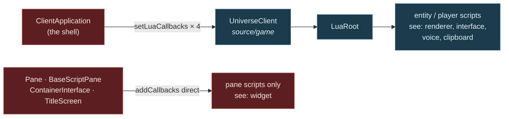
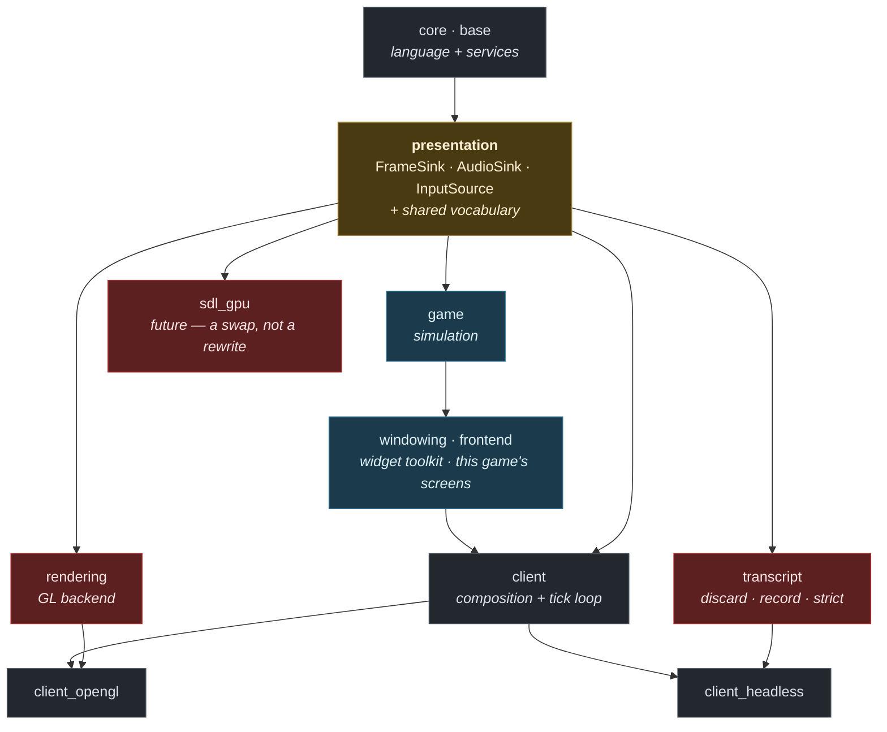

# Sovereign Decoupled Headless Client — Target-State Design

> **STATUS: WORK IN PROGRESS.** Section 1 (where the boundary goes) is Director-approved.
> Sections 2–6 are not yet designed. Written mid-brainstorm at the Director's request so that
> nothing is lost to a context compaction. Do not treat the unwritten sections as omissions —
> they are outstanding work, listed in §7.

**Goal.** Make presentation a replaceable component behind a stated contract, so that a Starbound
client can run with **no presentation linked at all** — and so that a different presentation
implementation (SDL_GPU) becomes a swap rather than a rewrite.

**The unifying frame.** *A headless client is presentation-backend = null.* If presentation is
replaceable behind a contract, "no presentation" is simply one implementation and SDL_GPU is another.
Run it the other way and the same thing holds: if the system runs with nothing on the other side of
the seam, the seam is proven to be an interface rather than a habit.

**Why that single move is the whole design.** You only know a contract is right when two
implementations satisfy it. GL is implementation #1. Null is the cheap #2. SDL_GPU would be #3 — and
it becomes a backend swap precisely because the null case forced the contract to be honest first.

---

## 0. Decisions locked in brainstorm

| # | Decision |
|---|---|
| **D1** | **Purpose — all six.** Architectural forcing function · foundation for distributed Starbound · CI harness · bot/agent client · cleanup of legacy/dead code sitting inside boundaries · swappable presentation components. |
| **D2** | **Scope of THIS spec.** Contract + null implementation + shell + the cleanup the contract exposes. SDL_GPU backend, CI harness, bot driver and distributed decomposition are each **follow-on specs that consume the contract**. |
| **D3** | **Three contracts at natural strengths.** Video = swappable contract. Input = pluggable source. Audio = merely nullable. Each strength is the weakest thing serving a named purpose; nothing over-built. |
| **D4** | **Null behaviour: record.** The null implementation captures what it was asked to do, with a **discard** mode (fast CI bulk runs) and a **strict** mode (dev-time forcing function). One object, three modes. Serves CI assertions and agent perception from the same code. |
| **D5** | **Unify, do not run parallel.** `ClientApplication` is refactored so presentation is *injected*. GL becomes implementation #1 rather than staying privileged. The graphical client is held byte-identical throughout by the existing render and motion gates. This is the only shape in which "swappable" is true. |
| **D6** | **The contract targets T2.** It may name only core, base and presentation-vocabulary types. See §1 and the risk in §6. |

### Why D6 is not a preference

If the contract names game types, **every implementation of it must be granted `game`**. `rendering`
stays coupled to the simulation permanently, and an SDL_GPU backend would still need the simulation to
compile. A T3.5 contract does not merely produce a less tidy result — **it defeats the swap purpose it
exists to serve.**

---

## 1. Where the boundary goes — APPROVED

### The boundary is at *drawing*, not at *UI*

Everything that decides **what** to draw stays on the game side — simulation, UI logic, widget layout.
Everything that turns descriptions into **pixels** is presentation.

`windowing` and `frontend` therefore land on the **game** side of the new boundary. Only the painters,
the passes and L1 sit on the presentation side.

That sounds like a large restructure. It is not, and the measurement in
`docs/architecture/system-boundaries.md` §5 says why:

| edge | includes | files |
|---|---:|---:|
| `windowing → rendering` | 3 | **1** (`GuiContext`) |
| `frontend → rendering` | 9 | 9 |

**Twelve includes across ten files** — the thinnest live cross-tier edge in the entire tree is exactly
the cut this design needs. The UI already does its own layout and already emits `Drawable`s; it simply
hands them to a painter directly today instead of into a stream.

### `RenderCallback` is not part of the contract

This is the simplification that makes everything else work.

`RenderCallback` is how the game **assembles** a frame — entities push into a sink and
`ClientRenderCallback` accumulates. That is game-internal from start to finish. It stays exactly where
it is and crosses nothing.

**The contract begins after assembly:** *here is a finished frame, present it.*

Which is why the video contract is one call per frame with one value, and why it passes the network
test in §5 without redesign.

### The three contracts, as streams

```
game side                          │  contract (T2)     │  presentation side
───────────────────────────────────┼────────────────────┼──────────────────────
world sim, entities                │                    │
  ↓ RenderCallback (internal)      │                    │
frame assembly                     │                    │
UI logic, widget layout            │  present(Frame)  → │  painters, passes, L1
  ↓ emits Drawables                │  play(AudioBatch)→ │  GL / SDL_GPU / null
                                   │  ← poll() Input    │
```

- **Video** — `present(Frame const&)`. One call, one value, per frame.
- **Audio** — `play(AudioBatch const&)`. One-way. Fixes `AudioInstancePtr`: the batch carries values,
  not handles.
- **Input** — `poll() -> InputBatch`. The single permitted round trip, once per frame, returning a batch.

One query per frame in total. That is a boundary a network could pass through.

### The T2 vocabulary

`Frame`, `AudioBatch` and `InputBatch` may name **only core, base and presentation-vocabulary types**.
That constraint is what forces the cleanup, and it is what lets the contract sit at T2 where no
implementation needs `game`.

Two pieces of evidence that this runs with the grain rather than against it:

- **`Drawable` depends on six core headers and nothing else** — `StarString`, `StarDataStream`,
  `StarPoly`, `StarColor`, `StarJson`, `StarAssetPath` — and **already carries `DataStream`
  operators**. It moves down essentially for free and is already wire-ready. That is not a
  coincidence; the vocabulary was always closer to a protocol than to an API.
- **`ImageMetadataDatabase` already lives in `game`** so that layout can know image sizes without a
  GPU. The precedent for *metrics are data, not presentation* is already established in this codebase;
  font metrics follow the same path.

### The pixel side has no name today

Asked what the whole scope on the presentation side is called, the honest answer is that **it has no
name, because it is not a unit.** It is 33 files and 8,704 lines spanning two libraries at two
different tiers:

| part | files | lines | tier |
|---|---:|---:|---|
| all of `source/rendering` — painters, passes, texture groups | 23 | 4,413 | T4 |
| the render half of `source/application` — `Renderer`, the GL backend, L1 | 10 | 4,291 | **T2** |
| *(`source/application` keeps: app/window lifecycle, SDL main, Steam/Discord, P2P)* | *15* | *3,081* | *not presentation* |

Near half by volume on each side of a directory line. **The renderer is not in `source/rendering`:**
the largest presentation file, `StarRenderer_opengl.cpp` at 1,824 lines, and the `Renderer` interface
every painter draws through, both live in `application`.

Consequently the word *presentation* is carrying three different meanings at once:

| the name | what it actually covers | fits the pixel side? |
|---|---|---|
| `star_rendering` (T4) | painters and passes | **half** — misses the renderer itself |
| tier T4 "presentation" | `{rendering, windowing, frontend}` | **wrong both ways** — includes the UI this section just placed on the game side, still misses the GL backend |
| L1 / L2 / L3 | the render decomposition | **L1 straddles the directory line** — which is why `scripts/layering-lint.py` has to name `application/` paths |
| `source/presentation` (§4) | the contract, interface-only | **no** — that is the seam, not the side |

§4 resolves this by splitting the word rather than stretching it. Two measurements decide how.

**First: `rendering` is granted `game` today.** `source/rendering/CMakeLists.txt` lists
`${STAR_GAME_INCLUDES}` in its `INCLUDE_DIRECTORIES`. Deleting that one line is the entire design
stated as a build rule; everything else in this spec is the work that makes deletion possible.

**Second: `RenderCallback` occurs in 39 files and all 39 are in `source/game`.** The claim above that
it is game-internal frame assembly is not an assertion about intent — it is a measurement, and it
satisfies test 2 (severability) already. Nothing needs to move for it.

**And the GL backend has exactly one consumer outside its own `.cpp`:** `StarMainApplication_sdl.cpp`,
the T2 shell that owns the GL context. Unifying the pixel side takes the backend away from that shell,
which is precisely what D5 requires — so **the naming question and the injection question are the same
question**, and they have to be answered in that order. See §4's ordering constraint.

---

## 2. The client Lua surface — context finding

Recorded here because it was the decisive fact behind D4, and because it is documented nowhere else.

**There are two Lua surfaces, not one.**

**Surface A — global, four groups, injected by the shell into the game layer.**
`UniverseClient::setLuaCallbacks(group, callbacks)` → `LuaRoot::addCallbacks`. Every script created
from that root sees them. `ClientApplication` pushes in exactly four:

```cpp
m_universeClient->setLuaCallbacks("voice",     LuaBindings::makeVoiceCallbacks());
m_universeClient->setLuaCallbacks("renderer",  LuaBindings::makeRenderingCallbacks(this));
m_universeClient->setLuaCallbacks("clipboard", LuaBindings::makeClipboardCallbacks(app, ...));
m_universeClient->setLuaCallbacks("interface", LuaBindings::makeInterfaceCallbacks(m_mainInterface.get()));
```

**Surface B — local, created by presentation for scripts presentation owns.**
`makeWidgetCallbacks(Widget*, GuiReader)`, attached directly by `Pane`, `BaseScriptPane`,
`ContainerInterface`, `TitleScreen` and `VoiceSettingsMenu` to their own script components. Only *pane
scripts* ever see it; it never reaches entity or player scripts.



**Consequences.**

- **Surface B is a non-problem.** Those scripts exist only because panes exist. Delete presentation and
  both go together. Nothing to null out.
- **Surface A is the entire headless Lua question, and it is four named groups** — not a sprawling
  surface.
- **The injection point is already dependency injection, already in the game layer.** `UniverseClient`
  exposes a slot; the shell fills it. That is precisely the shape this design wants, and it already
  exists.
- **Caveat.** `makeRenderingCallbacks` binds directly to `ClientApplication` methods and calls
  `app->renderer()`, so that group's shape is tied to the shell class rather than to an interface. It
  needs a non-shell owner before a second shell can provide it. This is cleanup work, not a blocker.

---

## 3. The network constraint — the sharper forcing function

**Director's constraint:** in theory the full render/graphical front end could run on one machine while
client/world/server run on another, separated by a network. Therefore a goal of both the contract and
the logic boundary is to **reduce ping-pongs at that boundary** — chattiness is evidence the boundary
is in the wrong place.

This is a better test than "does it compile without the other side", because it grades the *shape* of
the interface rather than merely its existence. And it is **countable**, so it can be a gate.

### The main path already passes

Every `RenderCallback` method returns `void`, takes by value, and has a batch form:

```cpp
virtual void addDrawable(Drawable drawable, EntityRenderLayer renderLayer) = 0;
void addDrawables(List<Drawable> drawables, EntityRenderLayer, Vec2F translate = Vec2F());
```

Zero round trips, already batched. Nobody designed this for the thought experiment; it survives it.

### Where it fails, and the list is short

- **Pointers crossing.** `addAudio(AudioInstancePtr)` passes a shared handle.
  `WorldRenderData::particles` is a raw `List<Particle> const*`. Neither survives a wire — and neither
  is visible to any existing instrument, because §6 of the boundary document measures *how much* of a
  type is used and nothing measures *whether it could be sent*.
- **Query-shaped Lua callbacks.** Four of the seven in `makeRenderingCallbacks` return values:
  `framesSkipped()`, `postProcessGroupEnabled(String)`, `getEffectParameter(...)`,
  `postProcessGroups()`. Each is a round trip whose frequency is set by mod code.

### Proposed ratchet (design not yet approved)

Countable, so it should become a gate alongside the existing `boundary_ratchet` of 213:

| crossing kind | treatment |
|---|---|
| returns a value | ratchet toward zero — the true ping-pongs |
| passes a pointer or reference | ratchet toward zero — the un-sendables |
| one-way value write | counted, not penalised — these batch |

A boundary that is one-way, by-value and batched is one a network could pass through. The test for
"is this boundary in the right place" becomes **a number that only goes down**.

---

## 4. Structure and the naming register — PROPOSED

These are the names the rest of the work is designed against. Adopting them forces renames,
consolidations and splits; each is listed with its action so nothing arrives by surprise.

### The shape stops being a stack

Today the lattice is a tower: T0 → T1 → T2 → `game` → presentation → shells. Presentation sits
**above** the simulation, which is exactly why it cannot be removed — everything above depends on
everything below.

In the target state the lattice **forks**. Below the fork: language and services. At the fork: the
contract. Above it, two arms that cannot see each other, rejoined only at a shell.



Arrows point downstream: `A --> B` means B is granted A. **No arrow runs between the two arms.** That
absence is the design; deleting either arm leaves the other compiling.

### The three boundaries

| name | direction | call | strength (D3) |
|---|---|---|---|
| **`FrameSink`** | one-way in | `present(Frame const&)` | swappable contract |
| **`AudioSink`** | one-way in | `play(AudioBatch const&)` | merely nullable |
| **`InputSource`** | one round trip out | `poll() -> InputBatch` | pluggable source |

The sink/source vocabulary is chosen to carry §3's network constraint in the name itself: **a sink
never answers, and there is exactly one source, polled once per frame.** A method that returns a value
on something called a *Sink* is a naming error before it is a design error — which makes the constraint
reviewable by reading, not only by counting.

**The role name for the whole pixel side is "a presentation backend".** `rendering` is one; `transcript`
is the second; SDL_GPU would be the third. That is the name §1 found missing.

### Component register

| target name | duty | side | assembled from | action |
|---|---|---|---|---|
| **`presentation`** | the contract: three interfaces and the shared vocabulary | the joint | — | **NEW** — interface-only, modelled on `platform` (4 files, 142 lines, no library target) |
| **`rendering`** | the GL presentation backend: painters, passes, L1, and the `Renderer` itself | pixel | today's `rendering` (23 files, 4,413 lines) **+** the 10 render files in `application` (4,291 lines) | **CONSOLIDATE** — the name survives, its meaning becomes true |
| **`application`** | platform services and app/window lifecycle — nothing that draws | services | today's `application` minus those 10 files | **SPLIT** — sheds 4,291 lines, keeps 3,081 |
| **`transcript`** | the recording presentation backend: discard · record · strict | pixel | — | **NEW** — D4's recorder. It is an instrument, not a stub, which is why it does not live inside the contract |
| **`client`** | the client itself: composition root and tick loop, backend-agnostic | shell | today's `StarClientApplication` | **SPLIT** — keeps the name, loses all GL knowledge |
| **`client_opengl`** | construct GL backends, inject, run | shell | today's client entry point | **NEW** — thin |
| **`client_headless`** | construct transcript and scripted input, inject, run | shell | — | **NEW** — thin |
| **`windowing`** | the widget toolkit | sim | unchanged (61 files, 9,646 lines) | **KEEP** — grant changes only |
| **`frontend`** | this game's screens | sim | unchanged (102 files, 16,861 lines) | **KEEP** — grant changes only |
| **`game`** | the simulation | sim | today's `game` minus the vocabulary below | **SPLIT** — vocabulary moves down; nothing else moves |

`client` splits into three directories rather than one directory with three entry points **because
grant lists are per-directory.** One directory means one grant list, and the rule that matters —
*the shared client may not name a backend* — would stop being compile-enforced. The split is the
enforcement.

### Vocabulary register

| type | today | target | action |
|---|---|---|---|
| `Drawable` | `game` | `presentation` | **MOVE** — six core includes, already carries `DataStream` operators |
| `WorldRenderData` | `game` | folded into `Frame` | **RENAME + RESHAPE** — it is already the frame view model |
| `Frame`, `AudioBatch`, `InputBatch` | — | `presentation` | **NEW** |
| `AnchorTypes` | `rendering` (35 lines) | `presentation` | **MOVE** — text anchoring is vocabulary, not drawing |
| `AudioInstancePtr` | crosses as a shared handle | a value inside `AudioBatch` | **RESHAPE** — §3: a pointer cannot cross |
| `RenderTileArray`, `EntityDrawables`, `OverheadBar`, `ParallaxLayer`, `SkyRenderData`, `Particle` | `game` | undecided | **BLOCKED on §6** — cheap-move vs narrow vs cannot-move is unassessed, and this register is provisional until it is |

### Renamed, and deliberately not renamed

- **`StarRenderingLuaBindings`** (in `client`) — **RESHAPE.** §2's caveat: it binds to
  `ClientApplication` methods and calls `app->renderer()`. It must address the contract, not a shell,
  before a second shell can offer the same four Lua groups.
- **The T4 tier label "presentation"** — **RETIRED.** In the target state `windowing`/`frontend` and
  `rendering` no longer share a tier, so `TIERS` in `scripts/arch-graph.py` changes shape, not just
  wording. The boundary document's §12 (the presentation tier's three duties) is rewritten by this.
- **`RenderCallback`** — **NOT RENAMED.** It is tempting to rename it away from the contract's
  vocabulary, but the measurement in §1 says it occurs in 39 files and all 39 are in `source/game`. It
  never crosses, so there is no boundary reason to touch it, and a rename of 39 files with no
  enforcement value is churn. Recorded here so the decision is visible rather than forgotten.

### What the grant lists say

Each directory's `INCLUDE_DIRECTORIES` block is the complete statement of what it may include, so the
register above is enforced by the build rather than by review:

| directory | granted | the statement it makes |
|---|---|---|
| `presentation` | core, base | the contract cannot name a game type — D6, enforced |
| `rendering` | core, base, platform, presentation | **`game` is revoked** |
| `transcript` | core, base, presentation | the recorder cannot see GL either |
| `game` | core, base, presentation | the simulation may speak the vocabulary, never a backend |
| `windowing`, `frontend` | + game, presentation | they emit into the frame; they do not draw |
| `client` | core, base, game, windowing, frontend, presentation | **not `rendering`** — the shell cannot know which backend it holds |
| `client_opengl` | + rendering, application | the only place GL is named |
| `client_headless` | + transcript | the only place the recorder is named |

**One line carries the design.** `source/rendering/CMakeLists.txt` lists `${STAR_GAME_INCLUDES}`
today. Deleting it is the whole boundary, and the moment it is gone the pixel arm is severable by
construction rather than by assertion.

### Ordering constraint

The consolidation cannot come first. The GL backend's only external consumer is
`StarMainApplication_sdl.cpp` — the T2 shell that owns the GL context — so moving the backend to the
pixel side takes it out of that shell's reach. That is the correct outcome under D5, but it fixes the
order:

1. `presentation` exists and the vocabulary moves down (gated by §6's assessment).
2. `client` takes injected backends instead of constructing GL.
3. **Only then** do the 10 files move and `${STAR_GAME_INCLUDES}` come out.

Naming and injection are one move, and the naming cannot land first.

---

## 5. Verification — NOT YET DESIGNED

Constraints known so far:

- The graphical client must stay **byte-identical** throughout, proven by the existing
  `scripts/render-gate.sh` and `scripts/render-motion.sh`.
- The null client must **link shell 2 only** (`extern + core + base + game` + the contract), which is
  itself the proof that presentation is severable — the same move `render_surface_tests` makes for L1.
- The round-trip ratchet of §3 and the existing `boundary_ratchet` 213 both only go down.

---

## 6. Risks

**The central one.** `RenderTileArray`, `EntityDrawables`, `OverheadBar`, `ParallaxLayer`,
`SkyRenderData` and `Particle` have not been assessed. Some are appearance data wearing a game name and
will move as easily as `Drawable`. Others encode simulation concepts and will need **narrowing rather
than relocation** — that is §6-of-the-boundary-document's shape work, promoted into scope. One or two
may not move at all, which would leave the frame carrying a small game-typed residue and push
`presentation` to T3.5 after all.

**This is the design's central unknown and the first thing implementation must confront rather than
assume.**

**Secondary.** `#include` cannot see template instantiation across a boundary, nor runtime coupling
through `Root`'s databases. The vocabulary assessment cannot be done by include-graph alone.

---

## 7. What remains to be designed

1. **§4's naming register** — written and awaiting Director approval, and provisional until item 3
   lands: the six unassessed types could add rows or move `presentation` to T3.5.
2. **§5 Verification** — gates, oracles, the round-trip ratchet's exact metric and starting ceiling.
3. **The vocabulary assessment** — the six unresolved types in §6; cheap-move vs needs-narrowing vs
   cannot-move. **This gates §4.**
4. **Sequencing** — the order of extraction, each step provable and reversible.
5. **Out-of-scope statement** — explicit list of what this spec does not cover.
6. **Cleanup ledger** — what the contract exposes as dead, and where it gets removed.

---

## 8. Related

- `docs/architecture/system-boundaries.md` — the measured map this design sits inside. §5 (granted vs
  spent), §6 (shape), §9 (cohesion), §12 (presentation tier's three duties), §13 (the one inheritance
  edge that leaves).
- `scripts/boundary-inventory.py` — the 213 push-sink ratchet this design should drive down.
- Task #199 — the sink-gating groundwork already landed (`WorldClient::setHeadless`,
  `ClientRenderCallback(wantView)`).
- Task #191 — `TilePainter : TileDrawer`, the one inheritance edge leaving the render subsystem.
