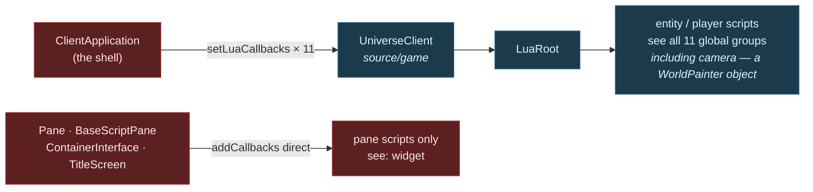
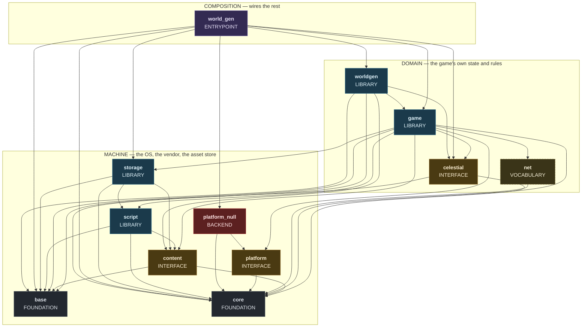
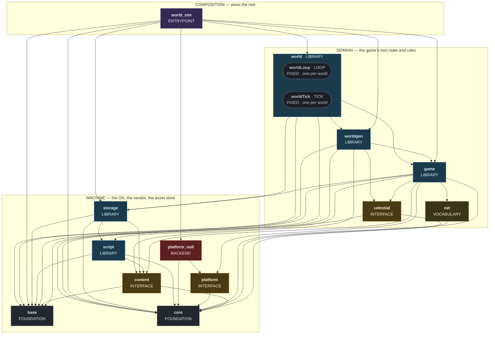
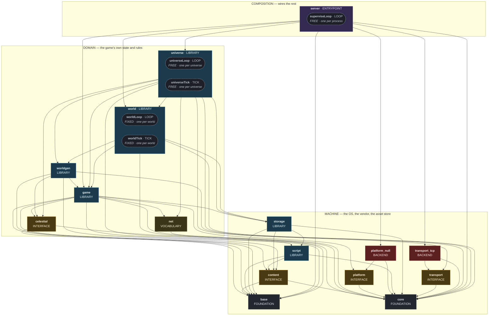
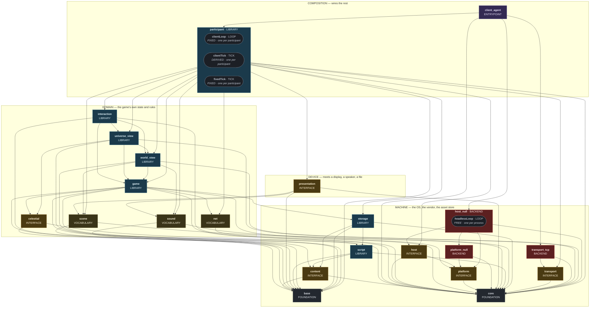

# Target State System Architecture

> **STATUS: WORK IN PROGRESS. NOTHING IS APPROVED.** Director's rule, adopted 2026-08-01:
> **approval is aggregate only — no section is approved until the whole can be reasoned with
> together.** Sections seal individually — a sealed section is certified enough to build on, not
> frozen — and a sealed section re-opens on a named trigger, per A8's Law of Fallback. Outstanding
> work is listed in Section 18; its absence from a section is not an omission.

**Goal.** Describe the **perfect target state of the Starbound client**: every duty owned by exactly
one component, every dependency declared and enforceable, every composition a choice rather than an
inheritance. 45 components in four zone directories, with the boundaries drawn where they *belong* —
not where the current tree makes them cheap. This is a refactor of the shape of the whole program,
not a change to one seam.

**The forcing function.** *A headless client is presentation-backend = null.* Presentation is where
this started, because a seam only proves itself when something runs with nothing on the other side of
it. You only know a contract is right when two implementations satisfy it: GL is implementation #1,
null is the cheap #2, SDL_GPU is #3 — and #3 is a backend swap precisely because #2 forced the
contract to be honest first.

**That one move generated the method, and the method is the design.** State the duty. Name the
contract. Compose the participant. Applied once it yields a headless client; applied to the whole
program it yields this document. **The presentation seam is the origin of the design, not its
scope** — `content`, `storage`, `net`, `script`, `celestial`, `interaction`, `universe`, `world` and
`worldgen` all arrived by running the same method past the seam that started it.

**What "target state" means here (D7).** No boundary in this document is justified by what the code
does today, and none is gated on what it would cost to reach. Cost is a consequence, recorded in
Section 17.

**How every claim below is justified.** The document argues in one direction, and each layer may cite
only the layers above it: **the domain** (Section 1) is what Starbound is · **axioms** (Section 2) are
facts, adopted or observed, that hold whatever we build · **the north star** (Section 3) is what we
want · **principles** (Section 4) are the invariants that follow · **decisions** (Section 5) are the
choices left over once all of that is satisfied · and **the model** (Part II onward) is what those
decisions produce. A boundary that cites none of them is not a boundary, it is a preference.

**Who this is written for.** The primary consumer is an **agentic technical designer building a
detailed implementation plan from this document**. That sets the completeness bar rather than the
length limit: a human who hits a gap notices it and asks, whereas an agent that lacks context does not
know it lacks context — it infers, plausibly, and the fiction propagates. So every rule lands in a
register or a table where an instrument can read it, and nothing normative lives in prose alone. No
other reader is traded off against that one; where they conflict the document expands rather than
choosing.

---

### Who this serves

| | cares that | the architecture answers with |
|---|---|---|
| **engine contributor** | a change can be made without breaking something unrelated | **A3**, **P1** — one duty per component, and a boundary the build enforces |
| **mod author** | their content and script keep working, and they can see what they may call | **F4**, **D13** and `content`; the composition's declared Lua surface |
| **server operator** | it runs unattended, and a busy world does not sink the rest | **D9**, **N1.b** — a world runs because something requires it, and a world is the unit of placement |
| **CI / agent harness** | the game runs with no display, deterministically, and can be asserted against | **F1**, **D12** — perception is optional (a verified fact) and determinism is chosen (a decision with a price) |
| **player** | it is smooth, it loads, and their save survives | the budgets below, and `storage` |

The mod author is first among these in one specific sense: a fork whose reason to exist is Frackin
Universe answers to mods before it answers to elegance.


---

# Part I — Foundations


---

## 1. What OpenStarbound is

**This section describes the domain, not the design.** Nothing here is a choice anyone made about
software: it is what Starbound *is*, and it would remain true if every line of the engine were thrown
away and rewritten. It seals first because everything above it cites it — the domain facts in Section
2 are facts *about these nouns*.

**The register does not draw its names from this section, and the rule that binds is narrower than it
first looks.** These nouns are what the *system* is made of; components are what the *code* is made
of, and the two vocabularies are deliberately different — `core`, `net`, `storage` and `gpu` name no
domain noun and are not meant to. The rule is about **reuse**:

> Where the register reuses a word this section defines, it must mean what this section means by it.

That is the rule worth having, because the expensive failures have all been collisions rather than
inventions. Nobody was ever confused by `gpu`. The four words below are the whole exposure, and the
list is not a matter of taste — it is the intersection of this section's nouns with the register's
names, so a component named `entity` or `player` tomorrow adds a row or fails the SHARED_WORD check.

<!-- TABLE: shared-words -->

| the word | what this section means | what the register means | are they the same thing? |
|---|---|---|---|
| **`universe`** | the star map entire — every system, every world that could be visited | the component that decides which worlds exist and who is where | **no** — the domain noun is the *thing*, the component is its *authority*. One universe, one `universe` authority owning it |
| **`world`** | a terrain simulation with entities in it | the component that ticks one of them and can be placed alone | **no**, and identically: the noun is the simulated thing, the component is the unit that owns and advances it |
| **`participant`** | a view-holder — a prediction of some world plus the right to ask its authority for changes | the component that *is* that view-holder | **yes.** This is the one word where the domain noun and the component are the same thing, which is why `player` versus `participant` is the near-collision that has cost the most |
| **`content`** | materials, items, species, dungeons, biomes, monsters, recipes — declared as data | the component that indexes them without knowing what they mean | **no** — the noun is the data, the component is the index over it |

<!-- END TABLE: shared-words -->

**Three of the four are a thing and its owner, and saying so is the point.** A reader who assumes
`world` the component *is* `world` the noun will look for terrain in it; a reader who assumes they are
unrelated will not know where the terrain went. Only `participant` is genuinely one thing under one
name, and that is exactly the word the document has already had to defend twice.

Read the rest as a vocabulary with consequences. Each noun below is load-bearing somewhere later, and
where two nouns are nearly the same thing the difference is stated explicitly, because every one of
those near-collisions has already produced a defect in this document.

### The universe, and what is inside it

OpenStarbound simulates a **universe**: a persistent star map, generated from a seed, that outlives
any process observing it.

| noun | what it is | how many | persists? |
|---|---|---|---|
| **universe** | the star map entire — every system, every world that could be visited | exactly one | yes |
| **system** | a star and the bodies orbiting it; itself simulated, on a slower cadence than a world | many per universe | yes |
| **world** | a terrain simulation with entities in it — a planet's surface, a moon, a ship interior, a dungeon instance | many per system | yes, once visited |
| **entity** | a thing *in* a world — a player, monster, NPC, object, projectile, plant, vehicle, item drop | many per world | depends on kind |

A world is generated from a seed rather than stored, which is why a universe can be vast and a save
file small: **a world that has never been visited does not exist yet, and costs nothing.** Once
visited it is ticked, mutated and persisted, and from then on it is data.

The distinction between *system* and *world* is not cosmetic. They run on different clocks — a system
advances far more slowly than the worlds inside it, because a system simulates orbits and a world
simulates a player swinging a pickaxe. Section 11 gives both a name and a rate; here it is enough to
know they are two kinds of simulation, not one kind at two speeds.

### The three roles, and why they are three words

Three kinds of thing relate to a universe. The whole architecture turns on keeping them apart.

| role | what it does | how many | needs the others? |
|---|---|---|---|
| **authority** | owns the truth of a world or of the universe, and answers to nobody about it | one per world, one per universe | no |
| **participant** | holds a *view* of a world, predicts against it, and asks the authority to change it | zero or more, and they come and go | needs an authority |
| **device** | a display, a speaker, a file, a recorder — something outside the simulation entirely | zero or more, per participant | needs a participant |

**An authority requires neither of the others.** That is not an aspiration; it is the property that
makes a dedicated server possible at all, and Section 2 states it as a domain fact rather than a
design goal. A universe with no participants is not degraded, idle or waiting — it is simply a
universe, ticking.

**A participant is not a person and not a process.** It is a *view-holder*: the thing that carries a
prediction of some world and the right to make requests of that world's authority. One process may
compose several; a process may compose none.

### `player` and `participant` are different nouns

This is the near-collision that has cost the most, so it is stated flatly:

| | `player` | `participant` |
|---|---|---|
| what it is | an **entity**, living in a world | a **view-holder**, living in a process |
| owned by | the world's authority | the process that composed it |
| persists | yes — it is in the save file | no — it dies with the process |
| survives the other? | **yes** — a player remains when its participant disconnects | no |
| how many | one per player-character in a world | one per view |

A player is a thing the world contains, like a monster or a chest. A participant is a thing that
*watches and asks*. They are usually paired — a person plays by having a participant that drives a
player — but the pairing is a runtime relationship, not an identity, and the two ends have different
lifetimes.

**A server has neither.** It composes an authority and nothing else: no participant, because it holds
no view, and no player, because a player is an entity that belongs to a world rather than to a
process. Worlds a server owns may contain player entities — persisted, unattended, or driven by
participants in other processes entirely — and that is a fact about those *worlds*, not about the
server. Any design that gives a server a participant has confused watching with owning, and will
eventually ask an authority to correct itself.

### Content, and the mod surface

Two more things are first-class rather than incidental, because they are what makes this Starbound
and not a physics demo.

| | what it is | what the engine knows about it |
|---|---|---|
| **content** | materials, items, species, dungeons, biomes, monsters, recipes — declared as data | that it exists, its declared shape, and how to index it. **Not what it means.** |
| **the mod surface** | Lua, running against a declared set of bindings | which bindings a host offers. Not what a script will do with them. |

A mod is content plus script. **The bindings a script may call are a function of what its host
composed** — a script running where there is no display cannot ask about a display, not because it is
forbidden but because there is nothing there to bind. That single sentence is why the mod surface
belongs in this section rather than in a later one about scripting: it is a property of composition,
and composition is the next noun.

### Composition is the point

A **process** is one running program. It contains no roles inherently; it *composes* them.

```
authority  ──┐
participant ─┼──►  a composition  ──►  a process that does a particular job
device     ──┘        (chosen by an entry point, at wiring time)
```

This is the load-bearing idea of the whole document, and it is easy to read past. **"Client" and
"server" are not kinds of thing.** They are names for particular compositions that turned out to be
useful enough to name:

| the familiar name | what it actually composes |
|---|---|
| a graphical client | a participant, a display device, a speaker device |
| a dedicated server | an authority, and nothing else |
| a listen server | an authority *and* a participant, in one process |
| a headless client | a participant, and no device at all |
| a recorder | a participant, and a file device |
| an agent | a participant, and no device — the same shape as a headless client, different consumer |

Read down that right-hand column and the taxonomy dissolves. There is no client/server *dichotomy* —
there is a small set of roles, and the useful combinations get names after the fact. A listen server
is not a hybrid of two things; it is one process that composed two roles. A headless client is not a
client with its rendering removed; it is a composition that never had a display in it.

**The consequence is that "which side does X live on?" is usually a malformed question.** The right
question is *which role owns X* — and then any composition containing that role has it. This document
asks the second question everywhere, and Section 7 turns it into a placement rule.

### What this section does not settle

The domain says there are authorities, participants and devices. It does **not** say how many
processes there are, which machine each runs on, or what crosses between them. Those are design
questions, answered against the north star in Section 3 and the decisions in Section 5. A reader who
finds a placement claim in this section has found a defect.


---

## 2. Axioms

Two kinds of thing are accepted here without being argued for: **adopted axioms**, which are standing
engineering commitments that hold for any system this organisation builds, and **domain facts**, which
are properties of Starbound itself. Neither is a choice. Everything downstream cites them by name.

**The test that separates a fact from a decision, and why it matters.**

> If an implementation can violate the claim and still be Starbound, the claim is **not** a fact. It is
> a decision, and it belongs in Section 5 with a cost beside it.

That test is stated first because it is load-bearing and because it is easy to fail. A claim can be
true of every design *we would want to build*, obviously right, and still not be a fact — and filing
it as one hides the cost of choosing it. The consequence is concrete: five claims that read as
self-evident properties of the domain are in Section 5 instead, each with the price of choosing it
named. Section 5 says which and why.

### Adopted axioms

These come from the organisation's canonical set and are adopted by **domain of validity** — a system
is bound by an axiom if and only if its architecture satisfies that axiom's tags. Both the
architecture described here and the practice of describing it satisfy `any-system`, so the
unconditional set is in force for both.

| | axiom | why it binds this system | what it forbids here |
|---|---|---|---|
| **A0** | **Sovereign Intelligence Engine** | umbrella | additions with no line of descent back to stated intent |
| **A3** | **Sovereign Composition** — one concern per module, composed without leaking internals | `any-system` | god objects, dual-purpose modules, "and"/"also" in a duty |
| **A4** | **Zero-Loss Knowledge** — expansion over summarisation, structure over prose | `any-system` | compressing a derivation to save space; prose that carries a rule no instrument can read |
| **A8** | **Gated Recursive Integrity** — nothing ascends to layer N+1 until layer N is sealed | `any-system` | "mostly verified"; patching a symptom without auditing the layer beneath it |
| **A9** | **Chaos-Validated Deployment** — unproven under injected adversity means it does not exist | `any-system` | a seam with no stated failure behaviour |
| **A14** | **Compounding Learning** — capture the insight at the moment of discovery | `any-system` | a finding that lives only in a conversation |
| **A1** | **Sovereign State Transparency** — no unit holds private, opaque or transient truth | `stateful` | a process-global that some component mutates on another's behalf |
| **A2** | **Isomorphic Specification** — the declaration is the master | `declarative` | a rule that exists in prose and nowhere a machine can read |

**A3's Law of One and A8's Gated Ascension do the most work below.** The first is why every component
has exactly one duty and why a duty containing "and" is a defect rather than a wording problem; the
second is why sections seal in dependency order and why a sealed layer is *certified*, not frozen.

**The multi-agent axioms are deliberately absent.** A5–A7 and A10–A13 bind systems with multiple
agents, an LLM in the loop, or autonomy. They govern how this document is *made*, not what it
describes, and importing them here would put method into a document about architecture.

### Domain facts

Properties of Starbound, each verified against a real implementation rather than assumed. Where a
narrower statement is what survives verification, the narrow one is what is stated — an overclaimed
fact is worse than no fact, because everything citing it inherits the overclaim silently.

| | the fact | how it is known | what it forbids |
|---|---|---|---|
| **F1** | **Devices are optional.** No display, speaker or input device is required for a simulation to advance. | proven at link time: the simulation libraries link and tick with no rendering, windowing or application objects present at all | a simulation that cannot be built without a display |
| **F2** | **Physical time is local.** No two independent clock sources share a time base — neither two processes, nor a process and a device. Every clock is a monotonic tick source of unspecified origin, local to whatever owns it. | verified in two halves, because the fact is cited at both widths. **Across processes:** no wire message is ever interpreted in the receiver's clock domain — remote timestamps are echoed to their originator or consumed purely as differences. **Across a device boundary in one process:** the device is the party that asks. `SDL_OpenAudioDeviceStream` takes a callback we fill, so the sound card's sample clock decides when mixing happens; `SDL_GL_SwapWindow` blocks on the display's refresh, so the panel decides when a frame lands. Neither rate is readable from the simulation's clock, and both run when they run | a seam that compares two machines' raw timestamps — and equally, a producer that drives a device from its own cadence |
| **F3** | **Simulation advances in discrete, counted steps.** Cadence, wake scheduling and timers key on an integer step counter, not on elapsed real time. | verified in the step loop; the counter, not the clock, is what subsystems are scheduled against | a subsystem scheduled on wall-clock inside a stepped simulation |
| **F4** | **Content instances are opaque, with three named exceptions.** The engine indexes materials, items, species, monsters, dungeons and biomes by names it never enumerates — except where it must survive that content's *absence*. | verified by sweep: no material, liquid, monster, object, dungeon or biome instance name appears in the game sources. **Three do**, and all three are fallbacks — `human` (the species of an identity built from a config that omits one), `money` (the currency the quest-reward path names), `perfectlygenericitem` (the item-recovery fallback) | an engine that must be recompiled to add a rock |

**F1 and F2 are why a distributed Starbound is reachable at all.** If a simulation needed a display,
there would be nothing to place on a headless machine; if two processes shared a clock, no seam
between them could be honest. They are the two facts N1 stands on, and neither is a design
achievement — both are already true.

**F3 says less than it appears to, and the gap is deliberate.** It says the step *mechanism* is
discrete and counted. It does **not** say the step *content* is a pure function of state and inputs —
that is a far stronger claim, it is false of the implementation this fact was verified against, and it
is therefore a decision with a real price. Section 5 states it as one.

**F4 is similarly narrow, and for the same reason.** Content *instances* are opaque; content *kinds*
are not. The engine owns a closed, compiled vocabulary of kinds — item types, object types, dungeon
brushes, a metamaterial band, a handful of stat names with engine-defined meaning. Adding an instance
of a known kind is a content change; adding a *kind* is an engine change. Any design that assumes
otherwise is assuming the half of this fact that is false.

---


---

## 3. North star

Three goals. Every decision in Section 5 is justified against at least one of them by name, and a
decision that serves none of them does not belong in this document. Goals are what we *want* — unlike
the facts in Section 2, a goal can be abandoned, and abandoning one would change the architecture
rather than merely disappoint someone.

#### N1 — A modern distributed Starbound

The universe, its worlds and its participants can run **on different machines**. Not as a mode, not
behind a flag: the architecture has no seam that assumes co-residence, so placement is a deployment
choice rather than a rewrite.

**N1 is demanding in four specific ways, and they are labelled because the rest of the document cites
them individually.** A warrant that says "N1" without saying which clause has not said much; these
four are what N1 actually costs.

| | the clause | what it forbids | how you would know it failed |
|---|---|---|---|
| **N1.a** | **Every payload crossing a seam is a value.** Never a pointer, never a handle, never a reference into another component's memory. | a shared handle in a payload — it compiles, it works co-located, and it is a machine boundary that cannot be crossed | a payload type that cannot be serialised without following a pointer |
| **N1.b** | **Every unit of placement is nameable.** You can place *the many*, not *the one*: a component existing once per world is placeable; one existing once per process is not. | a design whose only placeable unit is "the whole program" | asking to put one world on another machine and having no noun for it |
| **N1.c** | **A co-located path is an optimisation of the split path, never a cheaper semantics.** Same encode, same decode, or an oracle proves the two agree. | a fast path that skips validation the slow path performs — the defect appears only once you distribute | the two paths producing different results for one input |
| **N1.d** | **A seam is not chatty.** Crossings per unit of work are bounded and counted; a boundary needing many round trips per frame is in the wrong place. | an interface that is technically distributable and practically useless | round trips per frame growing with scene complexity |

**N1.d grades the shape of an interface rather than merely its existence**, which makes it a stronger
test than "does it compile without the other side". A seam can satisfy every other clause and still be
unusable across a network if it demands twenty round trips per frame. It is also **countable** — and
that is what makes it gateable rather than aspirational, because a count can ratchet.

**F1 and F2 are why N1 is reachable at all**, and it is worth being exact about why that matters. If
a simulation required a display there would be nothing to place on a headless machine; if two
processes shared a physical clock, no seam between them could be honest about time. Both were
*verified* rather than assumed. **N1 is therefore an engineering problem rather than a research one** —
a considerably stronger position than this document could claim before those two were checked.

#### N2 — A sovereign, comprehensible engine

Every duty is owned by exactly one component. Every dependency is declared, and the declaration is
enforced by the build rather than by discipline. No god objects, no ambient singletons, no component
whose name is a noun covering three jobs.

The test is not aesthetic. It is: **can one person hold a component in their head, change it, and know
what they have not broken?** A boundary that cannot be enforced is a convention, and conventions decay
at exactly the rate the team turns over.

**N2 has four clauses, for the same reason N1 does.** Its title names two properties, not one —
*sovereign* and *comprehensible* — and the warrants citing it below divide cleanly along that line.
Two clauses are what sovereignty costs, two are what comprehension costs.

| | the clause | what it forbids | how you would know it failed |
|---|---|---|---|
| **N2.a** | **One fact has one writer.** For any value the system holds, *"what sets this?"* has exactly one answer, and the answer is a component's name. | N co-equal writers of one fact. It compiles, it works, and it is a protocol nobody wrote down | asking who sets a value and having to answer *"it depends which path ran"* |
| **N2.b** | **No component is the bottleneck for another's ambition.** A component owns its duty; it does not also hold the vocabulary someone else must extend to express something new. | a closed compiled list, held by one component, that every new capability must pass through | an ambition whose first step is an engine change rather than a content or wiring change |
| **N2.c** | **A mechanism carries no history it does not need.** Prefer the rule stated once over the rule that is correct only in the light of what came before. | a subsystem whose behaviour cannot be stated without narrating the states that preceded it | needing a *sequence* rather than a *rule* to say what a component does |
| **N2.d** | **A defect reproduces.** The same inputs give the same answer, so a failure can be hunted rather than waited for. | a defect reachable only by luck — which is indistinguishable, to a reader, from no defect | a bug report that cannot be turned back into a run |

**N2.a and N2.b are the sovereign half; N2.c and N2.d the comprehensible half.** The split is worth
naming because the two halves fail differently: a sovereignty breach is visible in the register — some
component's duty grew a second noun — whereas a comprehension breach is visible only to whoever next
has to change the thing, which is to say *after* the cost has been paid.

**No instrument reads these four clauses, and that is written here rather than left to silence.**
A3's Law of One overlaps N2.a and is read by `spec_consistency`, but it is checking the axiom, not the
clause. N2.b, N2.c and N2.d have **none** — they are reviewable and not gated. A goal whose clauses are
enumerated looks checked, which is precisely why the absence has to be stated beside them.

#### N3 — Aggregate functionality comes from composition

The payoff of a modular system is not tidiness. It is that **components combine into aggregate
functions that nobody wrote a code path for**. A client is one such aggregate. A server is another.
Neither is the taxonomy of the system — they are two witnesses that the components compose, and if
they were the only two the property would not be worth claiming.

So the components are the vocabulary and the compositions are sentences. The document enumerates the
vocabulary exhaustively and the sentences only by example, because an architecture that can express a
fixed list of aggregates has not achieved anything a build flag could not.

**N3 has three clauses, and they were found by reading its own citations rather than by design.**
Twenty-six warrants below cite N3, and they are making three different arguments: *this contract has a
second implementation*, *this component can be left out*, and *this component may not hold the list of
what composes with it*. All three are N3 and none implies another — a contract can have two
implementations and still be mandatory, and a component can be omissible while still enumerating its
peers.

| | the clause | what it forbids | how you would know it failed |
|---|---|---|---|
| **N3.a** | **A contract has two implementations.** One is a habit with an interface drawn around it; the second is what demonstrates the boundary is at a real joint. | an INTERFACE whose only implementation is the one it was extracted from | being asked to name the second thing that satisfies it, and having no answer |
| **N3.b** | **Nothing is linked that the composition did not ask for.** A component arrives because an entry point named it, never because a peer wanted it and dragged it in. | a dependency that a composition acquires without naming — the route by which "optional" subsystems become mandatory | a binary containing a subsystem its composition never named |
| **N3.c** | **No component holds the list of what composes with it.** What a composition offers is computed at the wiring from what got composed, not enumerated in advance by any participant in it. | a component that names its peers, or an aggregate list that a new capability must be added to | adding a capability by editing a list rather than by writing a composition |

**N3.b is the clause the null objects exist to satisfy**, and it is the reason a null is not automatic
charity. A null implementation is warranted exactly when a call *will be made* and some composition has
nothing real to answer it with; where no call is made, a null is a component nobody asked for, which is
N3.b failing in the other direction. Section 5 states the same rule for the Lua surface, in the
sentence this one generalises — *"delete presentation and both go together. Nothing to null out"* —
and the derivations that turned on it carry it in their **falsified** facets.

**N3.b is measured rather than gated.** `link_sweep` attributes every symbol in a built binary back to
a component, which is precisely a test of what a composition asked for — but it reads a build tree, so
it is an instrument this document reports rather than a gate that can ratchet. Section 15 says so in
the row that owns it.

**The test is falsifiable, and it is the one that matters.** Name a capability the system does not
have. Ask whether it needs new *components* or only new *wiring*. A few, none of which is a shipped
entry point today:

| you want | it composes | new components needed |
|---|---|---|
| a dedicated shard for one busy world | one `world` authority + `net`, placed alone | none |
| a load generator: 500 participants, no devices | `participant` × N, no `device` at all | none |
| a replay verifier | `world` authority + `transcript`, no participant | none |
| an offline map renderer | `worldgen` + `world_view` + `rendering`, nothing ticking | none |
| a save-migration tool | `storage` + `content`, no simulation whatever | none |

If the answer to that question is "new code" every time, the modularity is decorative. Every row
above is wiring, and that — not the count of components — is what the target state is *for*.

**N1 and N3 are one property seen at two scales.** Composition is placement inside one process;
distribution is placement across several. Both demand exactly the same thing of a component: a
declared boundary and a payload that is a value. Satisfy N3 honestly and N1 costs a deployment
decision; satisfy it dishonestly — with components that only compose in the arrangements someone
anticipated — and N1 is a rewrite wearing a config file.

---

**The hardest placement N1 must survive**, stated concretely because it is the case that decides the
presentation seam's shape: the whole graphical front end on one machine, the participant and the
authority on another, a network between them. Everything crossing that line is subject to all four
clauses at once — values only (N1.a), a nameable unit on each side (N1.b), a co-located path that is
the same contract (N1.c), and few enough crossings per frame to be worth doing (N1.d).

That case is the reason the presentation seam is where this design started. **A seam only proves
itself when something runs with nothing on the other side of it**, and a seam that survives being
stretched across a network has proved rather more than one that merely compiles apart.


---

## 4. Principles

A principle is an **invariant the model must satisfy** — not a goal (that is Section 3) and not a
choice (that is Section 5). A violation is a defect regardless of which decision produced it, and
regardless of whether anyone minds.

That definition is strict, and applying it strictly leaves **two**.

| | the invariant | the failure it forbids | who enforces it |
|---|---|---|---|
| **P1** | **Dependencies point down and are declared.** Every component names what it may include; the grant graph is a DAG with no upward edge. | A boundary that is a convention rather than a build rule reverts to a suggestion within a release. | the build — `INCLUDE_DIRECTORIES`, so a violation is a compile error rather than a review comment |
| **P2** | **Placement is wiring.** Which process a component runs in is decided by the composition that assembled it, never by the component itself. | A component that knows where it lives cannot be moved, and its knowing is invisible until you try. | the register — a component whose duty mentions a process has failed this before it is built |

**P1 is the one that makes everything else enforceable**, and it is worth saying why it is a principle
rather than a decision: no version of this model works without it. A grant graph with an upward edge
is not a worse architecture, it is not an architecture — the layering it claims cannot be checked, and
every other rule here is downstream of being checkable. **P2 is its runtime twin**: P1 says a
component may not *name* what is above it, P2 says it may not *know where it is*.

### What used to be here, and where it went

Five entries have been removed from this section. **None was wrong**; each was a true statement filed
one layer from where it belongs, and leaving them here made the document state the same rule twice —
which is the drift this section is supposed to forbid.

| was a principle | now lives at | why it moved |
|---|---|---|
| One duty per component | **A3**, Law of One | an adopted axiom already says it, in stronger form: *"and"/"also" in a description is a violation*. Restating it here made the document, not the axiom, the authority |
| A payload crossing a seam is a value | **N1.a** | it is not an invariant, it is what the distribution goal *costs*. Filed as a principle it looked unconditional; filed under N1 it is visibly the price of a goal we chose |
| What ticks does not depend on who is watching | **D9** | verification showed this is not free — it must replace four separate uses of participant view rectangles. A thing with a price is a decision |
| One writer per fact | **A1** + **A2** | A1 forbids private, opaque or transient truth; A2 makes the declaration the master. Together they say it about systems generally, not just about this one |
| An instrument that cannot fail proves nothing | **A8**, Binary Certification | *"gates are pass/fail only; there is no partial credit and no mostly-verified credit"* |

**The reduction is the layer discipline working, not a loss.** Seven claims are still in force; five are
now stated once, at the altitude where they are true, by the layer entitled to state them. A principle
that restates an axiom gives a reader two places to look and two things to keep in sync — and when
they drift, nothing catches it, because both are prose.

**Principles are cited by gates, not by component warrants**, and that asymmetry is deliberate rather
than an omission. A component exists *because of* a goal, a fact or a decision — that is what its
warrant records. A principle is not a reason for a component to exist; it is a property every
component must have. So the register cites A / F / N / D, and P1 and P2 are checked over the whole
model at once:

| | instrument | what it reads |
|---|---|---|
| **P1** | `grant_sweep`, `render_layering` | the measured include closure against the grant table, and the layer boundary in the build |
| **P2** | `spec_consistency`'s `PLACEMENT` verdict | every component's duty and contents, for a process, thread or machine it may not name |

**P2's instrument is the row above made executable**, and the two exemptions are the rule rather than
holes in it: an **ENTRYPOINT** is exempt by kind, because composition *is* placement and an entrypoint
that could not say "process" could not describe what it composes; `colocation` is exempt by name,
because it is the one component whose duty is placement — deciding whether the authority runs in the
participant's process is D8's entire subject. Every other component names neither, and the day one
does, the gate says so.

---


---

## 5. Decisions

### Decisions

| # | Decision |
|---|---|
| **D1** | **Purpose — a full target-state refactor.** Clean boundaries, decoupled components, sovereign duties, composable entry points. The six original drivers — architectural forcing function · foundation for distributed Starbound · CI harness · bot/agent client · cleanup of legacy and dead code sitting inside boundaries · swappable presentation components — are the **symptoms that made the need visible**, not six separate features. Each is satisfied *by* the target state rather than pursued beside it. |
| **D2** | **Scope of THIS spec: the whole target state.** Every component, contract, clock and composition in the registers — including `client_sdl_gpu`, `client_agent`, `world_sim`, `world_gen` and `colocation`. **What is deferred is sequencing, not scope.** Section 17 records the order and the delta; follow-on *plans* consume this spec, and there are no follow-on *specs* for anything architectural. If it belongs in the perfect shape, it belongs here. |
| **D3** | **Three contracts at natural strengths.** Video = swappable contract. Input = pluggable source. Audio = **swappable contract** — *upgraded from "merely nullable"*: the register grew `sound`, `mixing`, `audio` and `audio_sdl`, and a modality with a backend is not a nullable afterthought. Each strength is the weakest thing serving a named purpose; nothing over-built. |
| **D4** | **Null behaviour: record.** The null implementation captures what it was asked to do, with a **discard** mode (fast CI bulk runs) and a **strict** mode (dev-time forcing function). One object, three modes. **It records the scene, which is appearance** — faithful, replayable, and not the same thing as an assertable account of what happened. What a recorder can assert about a world is owed, and recorded against `transcript`. |
| **D5** | **Unify, do not run parallel.** `ClientApplication` is refactored so presentation is *injected*. GL becomes implementation #1 rather than staying privileged. The graphical client is held byte-identical throughout by the existing render and motion gates. This is the only shape in which "swappable" is true. |
| **D6** | **The contract targets T2.** It may name only core, base and the payload vocabularies themselves — `scene` and `sound`. See Section 10 and the risk in Section 16. |
| **D7** | **The target state is not derived from the tree.** This document describes the perfect shape of the next Starbound, with time, effort and resources unconstrained. **Measurement reveals facts and bounds cost; it never chooses the target.** A boundary is right because it is right, not because it is cheap or close to what exists. No design question here waits on an estimate, and "this is how the code does it today" is evidence about today, never a justification for tomorrow. Cost is a consequence, recorded in Section 17. |
| **D8** | **A seam's co-located path is an optimisation, never a different contract.** Either it performs the same encode and decode as the split path, or an oracle proves the two agree. Owned by `colocation`. Stated in full in Section 13. |
| **D9** | **What ticks must not be derived from who is watching.** A world runs because something *requires* it — residency is an explicit input, not a count of observers. Stated in full in Section 10, and derived below. |
| **D10** | **One authority per world, and it re-derives.** Exactly one authority decides what is true in a world; a participant's every effect on that world is a *request*, re-derived by the authority against its own state. No participant authors world truth. |
| **D11** | **A view is a prediction, corrected by replacement.** A participant runs ahead locally to hide latency, and is corrected when truth arrives. Correction is whole-value replacement, not rollback-and-replay. |
| **D12** | **Step content is deterministic.** The same state and the same inputs give the same next state: no wall-clock inside a step, no ambient random stream, no work-shedding that changes outcomes. |
| **D13** | **Content extends the engine's kinds, not only its instances.** A new kind of thing is a content change, not an engine change. |

### D9 to D13 — the five that read as facts and are not

Each of these five reads like a property of Starbound. Each fails the test in Section 2: an
implementation violates it and is still Starbound. So each is a **choice**, and a choice has a price
the chooser owes the reader. What follows states, for each: what is chosen, what is rejected, which
goal it serves, **what it costs**, and the history that makes the cost credible rather than
theoretical.

The history matters here more than anywhere else in the document. These five are the places where the
obvious-looking answer is expensive, and the only reason we know *how* expensive is that a real
implementation chose the other way and left its reasoning in the source.

#### D10 — One authority per world, and it re-derives

| | |
|---|---|
| **chosen** | Exactly one authority decides what is true in a world. Every effect a participant has on that world is a request, re-derived by the authority against its own state before it becomes true. |
| **rejected** | Authority partitioned by entity ownership — each participant masters the entities in its own id range, and the authority mirrors them as replicas without re-deriving them. |
| **serves** | **N1.c** — a seam whose trust model changes with placement is a co-located path with cheaper semantics, which is the one thing that clause forbids. **N1.b** — and the consequence is a naming failure: if authority is partitioned, moving a participant to another machine moves *authority* with it, so the participant was never the placeable unit it appeared to be. **N2.a** — one writer per fact is comprehensible; N co-equal writers is a system nobody can hold in their head. It is also the domain instance of **A1**: a partitioned design leaves world truth in a place no single unit owns. |
| **costs** | **Input latency, paid on every action.** The rejected design exists precisely to avoid this. |

**What it costs, precisely.** If a participant masters its own player entity, that player responds to
input in zero time — the local machine *is* the authority for it, so there is nothing to wait for.
Under D10 that is gone: the authority is elsewhere, and responsiveness has to be bought back with
local prediction (D11) rather than had for free. **This decision does not remove latency; it moves it
from a correctness problem to a perception problem**, and D11 is the bill.

**The history, which is why the cost is credible.** The implementation this document supersedes chose
the rejected option deliberately and documented it in the source: combat adjudication is distributed
across machines, with player-versus-environment damage decided on the *participant* doing the hitting,
and the authority applying the resulting damage verbatim without re-deriving it. The participant is
the master of its own player; the authority holds the lagging copy. Entity spawns, world-property
writes and interactions with participant-owned entities take the same shape — a request that is
applied rather than adjudicated.

**And the consequence of that choice is instructive**: there is no position validation anywhere in
that design, and no anti-cheat surface. Not because it was overlooked — **because there is nowhere it
could go.** A design in which the participant is authoritative for its player has no seat from which
to disagree with it. That is what "authority is a topology property, not a component property" costs
when you find out late, and it is the sharpest available argument for deciding it early and once.

#### D11 — A view is a prediction, corrected by replacement

| | |
|---|---|
| **chosen** | A participant runs ahead of confirmed truth to hide the latency D10 introduces, and converges when truth arrives. Correction is **whole-value replacement**: the authority's value wins, and the view stops predicting that fact. |
| **rejected** | **Rollback-and-replay** — retain local input history, and on correction rewind to the authoritative state and re-apply inputs. |
| **serves** | **N2.c** — replacement is one rule with no history to keep; rollback requires every predicted subsystem to be re-runnable and every input retained. **F3** — replay is only sound if the step is a pure function, which is D12, and D12 is not free either. |
| **costs** | **Visible correction.** A replaced value can jump. Rollback hides that; replacement does not. |

**Why replacement rather than replay**, stated as a dependency: rollback-and-replay is only correct if
re-running the same inputs from the same state reproduces the same result — it *presupposes* D12. So
choosing replay would make D12 load-bearing for basic correctness rather than for verification, and a
determinism defect would stop being a reproducibility nuisance and start being a gameplay bug. **The
cheaper correction rule is chosen so that the expensive determinism guarantee stays a verification
property rather than a runtime dependency.**

**The history.** The superseded implementation has no rollback machinery at all — a search of the
simulation and core sources finds no resimulation, no replay, and no reconciliation in that sense.
What it has is interpolation between received points, bounded blind extrapolation when a delta is
missing, and whole-value overwrite on arrival — and interpolation is *configuration-gated*, defaulting
off when its key is absent. The design chosen here is that shape, made unconditional and stated.

#### D12 — Step content is deterministic

| | |
|---|---|
| **chosen** | The same state and the same inputs give the same next state. No wall-clock reading inside a step; no ambient random stream; no work-shedding that changes outcomes rather than only timing. |
| **rejected** | Best-effort stepping, in which a step may consult real time, draw from a process-global random source, and shed work adaptively under load. |
| **serves** | **N1.c** — two machines that must agree about a world cannot agree if the same inputs give different answers, which is that clause's own failure symptom read across a network rather than across two code paths. **N2.d** — a defect that reproduces is a defect that can be found. **A9** — chaos validation compares runs, and comparing runs requires runs to be comparable. |
| **costs** | **An adaptive-fidelity governor becomes illegal**, and every random draw must be threaded from a seeded, owned stream rather than reached for. |

**The cost is larger than it looks and is worth stating plainly.** Shedding work under load is how a
simulation degrades gracefully; if shedding may not change outcomes, then under load the only legal
responses are to run slower or to shed work that provably cannot affect state. That is a real
constraint on the simulation's own design, and it is the reason this is a decision rather than a fact.

**The history is unusually strong here, because we have already paid for the knowledge.** In the
superseded implementation the step is discrete and counted — F3 — but its *content* is not a pure
function, in at least three independent ways: a weather subsystem discards the fixed step and
substitutes wall-clock elapsed time; gameplay randomness is drawn from a process-global stream that a
maintenance thread re-seeds on a wall-clock schedule; and an adaptive governor driven by measured
spare time changes which subsystems run on which step. **And this project already recorded the
consequence, in its own render documentation: a cross-run golden hash is unusable, because two runs
of the same scene diverge.** The render verification harness was redesigned around an in-process A/B
of two code paths for exactly that reason. Determinism is not an aspiration this document invented;
it is a property we have already been billed for lacking.

#### D13 — Content extends the engine's kinds, not only its instances

| | |
|---|---|
| **chosen** | A new *kind* of thing is a content change. The engine's understanding of what kinds exist is data it loads, not a vocabulary it compiles. |
| **rejected** | A closed compiled vocabulary of kinds, with content free to add instances of the kinds that already exist. |
| **serves** | **N2.b** — a closed vocabulary makes the engine the bottleneck for every content ambition. **F4** — the instance half of content opacity is already true; this extends the same property one level up. |
| **costs** | **Every kind-specific behaviour must become declarative**, which is a large body of work and a real expressiveness question. |

**What is actually at stake.** F4 records that content *instances* are opaque apart from three named
fallbacks. What is closed is the set of *kinds*: item types with a compiled class each, object types, dungeon
brushes, a metamaterial band whose connectivity and collision rules are compiled in, and a handful of
stat names with engine-defined meaning. Adding an item *kind* means touching an enum, a name map, an
extension map and a factory chain.

**This is the decision most likely to be revisited, and it is stated so that revisiting it is
possible.** The cost is not a detail — making kind behaviour declarative is a scripting-surface
question as much as an architecture one, and a design that assumes D13 without paying for it will
discover the compiled vocabulary at the worst moment. If this is later downgraded to "instances only",
the register changes shape, and it should change here first.

#### D9 — what ticks is not derived from who is watching

D9 is stated in the table above; this is the evidence that makes it a decision with a price rather
than a platitude.

**What is rejected is not "using observers as a hint".** It is a design in which a participant's
declared region of interest is the *only* thing that activates simulation. In the superseded
implementation that region — derived from the render camera — is what activates and generates
terrain sectors, what keeps them from unloading, what activates monster spawn cells (and *despawns*
those monsters when the cell deactivates), what gates weather-projectile spawning entirely, and what
sets liquid processing limits. A world with no participants is not idle; it is torn down.

**So D9 costs a replacement, not a deletion.** Residency has to supply what four separate mechanisms
currently take from view rectangles, and "a world runs because something requires it" is only half a
design until that requirement input exists and says *which regions*. Section 10 owes that; this
section owes the honesty that it is owed.

**One nuance worth keeping, because it is easy to lose.** The dependency in the superseded design is
not on a *display* — the region of interest is a plain rectangle, and headless tests set one directly
with no camera in existence. That is what makes D9 reachable: the thing simulation depends on is
already an abstract declaration, not a device. **F1 is safe; D9 is the work.**

### Why D6 is not a preference

If the contract names game types, **every implementation of it must be granted `game`**. `rendering`
stays coupled to the simulation permanently, and an SDL_GPU backend would still need the simulation to
compile. A T3.5 contract does not merely produce a less tidy result — **it defeats the swap purpose it
exists to serve.**

---

Recorded here because it was the decisive fact behind D4, and because it is documented nowhere else.

**There are two Lua surfaces, not one.**

**Surface A — global, 11 groups, injected by the shell into the game layer.**
`UniverseClient::setLuaCallbacks(group, callbacks)` → `LuaRoot::addCallbacks`. Every script created
from that root sees them. `ClientApplication` pushes in 11, and what each one *binds* is the part that
matters — the second column is the target-state component that would have to supply it:

| group | what the shell hands it | supplied by |
|---|---|---|
| `input` | nothing — `makeInputCallbacks()` | `host` (the input source) |
| `voice` | nothing, but defined in `source/frontend` | `frontend` |
| `camera` | **`&m_worldPainter->camera()`** | **`world_view`** — a *presentation* object |
| `renderer` | **`this`, the shell itself** | **`rendering`** |
| `clipboard` | the `Application` | `platform` |
| `http` | an enable flag | `net` |
| `interface` | `m_mainInterface.get()` | `frontend` |
| `chat` | `m_mainInterface.get()` + `m_universeClient.get()` | `frontend` + `participant` |
| `celestial` | `m_universeClient.get()` | `celestial` |
| `team` | `m_universeClient->teamClient().get()` | `participant` |
| `world` | `m_universeClient->worldClient().get()` | `world_view` |

**Eleven is the number that matters, and the tempting subset is four.** Read only the groups whose
names sound presentational — `voice`, `renderer`, `clipboard`, `interface` — and the surface looks
like a presentation concern that removing presentation would remove. The full 11 say something
stronger and less comfortable: **`camera` binds a `WorldCamera` owned by the `WorldPainter` into the
*global* script root**, so every entity and player script in the game can reach a presentation
object. That is not a hazard the design invented; it is the sharpest single instance of the coupling
this design exists to remove, and it is invisible to any reading that counts four.

It also makes the obligation below concrete rather than prudent. Reading the *supplied by* column
against each composition's grant closure gives the surface each one can actually offer:

| composition | groups it can supply | missing |
|---|---:|---|
| `client_opengl` | **11 / 11**, transport_tcp | — |
| `client_headless` | **10 / 11**, transport_tcp | `renderer` |
| `client_agent` | **7 / 11**, transport_tcp | `renderer`, `interface`, `chat`, `voice` |

**The surface is not a fixed list the shell owns — it is a function of what got composed**, and the
three numbers fall straight out of the grant table without anyone choosing them. Note the shape of
what `client_agent` loses: every missing group is a *presentation or UI* group. It keeps `camera` and
`world`, because a participant with no devices still needs to know where it is looking — which is the
same conclusion the `interaction` component reached from the other direction.

**Surface B — local, created by presentation for scripts presentation owns.**
`makeWidgetCallbacks(Widget*, GuiReader)`, attached directly by `Pane`, `BaseScriptPane`,
`ContainerInterface`, `TitleScreen` and `VoiceSettingsMenu` to their own script components. Only *pane
scripts* ever see it; it never reaches entity or player scripts.



**Arrows here are calls, not includes** — the opposite convention to Section 9's dependency graph,
which is why every edge in this one is labelled with the call it represents. The two diagrams answer
different questions: this one asks *who invokes whom at runtime*, Section 9 asks *who may name whom at
compile time*.

**Consequences.**

- **Surface B is a non-problem.** Those scripts exist only because panes exist. Delete presentation and
  both go together. Nothing to null out.
- **Surface A is the entire headless Lua question, and it is eleven named groups** — a bounded list,
  not a sprawling surface, and the headless delta within it is **one group**: `client_headless`
  supplies 10 of 11 and loses only `renderer`. The four-group loss belongs to `client_agent`, which
  is a different composition answering a different question.

### This section already answered the mod-API question the register later raised — RESOLVED

Adopting `script` raised an open decision: the Lua surface is per-component, so the bindings a mod can
call depend on which components a composition links. `client_agent` has no `widget.*`, `interface.*`,
`clipboard.*` or `voice.*`; `server` and `world_sim` also lose `renderer.*`. Accept it, guarantee a
core surface, or stub the absentees?

**Accept it — and this section is why.** The argument for Surface B generalises exactly:

> Those scripts exist only because panes exist. Delete presentation and both go together. Nothing to
> null out.

That is not special pleading about panes. It is the general rule: **a binding is the public surface of
a component, so a composition that does not link the component does not have the binding — for the
same reason it does not have the component's headers.** A stub would be worse than absence: it would
let a mod believe an interface exists in a binary that cannot honour it, and fail at the point of use
instead of the point of composition.

The diagram above is the shape of it. `setLuaCallbacks × 11` is the shell injecting exactly the
groups its composition can supply; a different shell injects a different set, and the table above
says which. **The mod surface is
composed, like everything else in this design** — which makes it consistent rather than exceptional.

What this *does* require, and it is now a named obligation rather than a discovered surprise: **a
composition must be able to state its Lua surface**, so a mod can declare what it needs and fail at
load with a clear reason rather than at first call with `attempt to index a nil value`. That belongs
in Section 15 as a verification duty, and it is added there.
- **The injection point is already dependency injection, already in the game layer.** `UniverseClient`
  exposes a slot; the shell fills it. That is precisely the shape this design wants, and it already
  exists.
- **Caveat.** `makeRenderingCallbacks` binds directly to `ClientApplication` methods and calls
  `app->renderer()`, so that group's shape is tied to the shell class rather than to an interface. It
  needs a non-shell owner before a second shell can provide it. This is cleanup work, not a blocker.

---


---

## 6. Requirements and given constraints

Who depends on this architecture, what it must be good at, and what it had no freedom over. A design
that cannot be judged too slow, too big or too closed cannot be judged at all — so the figures below
exist to be measured against, and a row with no number is marked as owing one.

### What it must be good at

**The two simulation rates are CHOICES, not observations.** Calling them facts because the numbers
appear in today's source fails twice over: the source figure is a *mutable process-global* rather than
a constant — Section 14 says so, of the same variable — and a fact nobody chose is a fact nobody may
change, which is the opposite of what a rate needs to be. The rates below are target-state decisions
with reasons attached; the symbols they resemble in today's tree are evidence about today and belong
in Section 17.

| | budget | why this value | owner |
|---|---|---|---|
| **world step** | **60 Hz — 16.67 ms**, fixed | a fixed step is required by the determinism fact; 60 Hz is chosen to match the rate the content was authored and balanced against, so vanilla compatibility survives | each world, as a construction parameter |
| **system-world step** | **20 Hz — 50 ms**, fixed | orbital and system-scale state changes slowly; a third of the world rate is the coarsest step that still resolves the content's own cadences | each system-world |
| **frame** | the device's rate, not ours | a frame is produced when a device is ready for one; the presentation clock is owned by the device and is not a simulation budget at all | the device |
| **headless throughput** | **N simulated seconds complete in ≤ N wall-clock seconds**, no participant attached | this is what "perception is optional" has to mean *operationally*; a simulation that only keeps up when watched has coupled the two | the composition under test |

**Both rates are per-instance construction parameters, not globals.** A world is given its step when
it is built; nothing writes another world's cadence, and there is no process-global to write. This is
the target-state statement of a defect Section 14 records in full, and it is the reason the "owner"
column exists in this table at all.

**Three steps to one, and the ratio is load-bearing.** A world advances three times for every
system-world step. A design that assumes a single simulation cadence has not modelled the
system-world at all — and the honest statement of the consequence is not a percentage but a
structural one: **the system-world has no element and no cardinality anywhere in Part III.** The
owner is not in doubt — it is `universe`, which is the component that decides what exists at system
scale — so this is a missing element rather than a missing decision, and it is recorded against
`universe` in the generated owed ledger, where the ratification rule can see it.

#### The owed figures, split by why they are owed

A previous draft called four figures owed and gave one excuse for all of them. The excuse was wrong
for half: two of these are measurable **today**, against a binary that already exists, and have
nothing to do with distribution.

| figure | why owed | who can close it |
|---|---|---|
| worlds resident per universe | **not yet measured.** Measurable now, against a running server — this is a missing measurement, not an unknowable | an anchoring instrument, per Section 15 |
| participants per universe | **not yet measured.** As above | an anchoring instrument, per Section 15 |
| split-path latency | **not yet measurable.** No split deployment has ever run; there is nothing to measure | only a real split |
| split-path bandwidth | **not yet measurable.** As above | only a real split |

**"Owed" is an authoring state, not a document feature.** A ratified section carries zero owed rows:
the first pair is closed by measuring, the second by building the thing that can be measured, and
until both are closed this section is not sealed. Marking a gap is honest; *shipping* the mark is not.

**The acceptance test, stated so it can fail.** A test that asserts only *the simulation advanced* is
not a test of the budget above it — an empty loop advances. The budget is a **ratio**, so the test
measures one:

> Load a world containing Frackin Universe automation. Attach no participant, no display, no audio
> device. Tick it for **N** simulated seconds and record wall-clock elapsed. **Assert wall-clock ≤ N.**
> Assert the machines advanced — same start state, same tick count, same end state on a re-run.

The ratio assertion is what makes the throughput row falsifiable; the machines-advanced assertion is
what makes it about *Starbound* rather than about an empty loop. Together they exercise determinism,
content-opacity and optional-perception at once, and no composition that fails this is a target state.

### What could not be chosen

A constraint is a fact about the world or the toolchain. **A fact about the current directory tree is
never a constraint** — that is inertia wearing a constraint's hat, and it is the route by which a
target state quietly becomes a description of today.

| | the constraint | why it is one |
|---|---|---|
| **a fork, not a product** | upstream keeps moving and its changes must remain mergeable | a fact about the world; nothing here can change it |
| **vanilla compatibility** | assets, protocol and saves keep loading | the players exist and their saves are real |
| **Lua is the mod language** | not a choice this document may reopen | the mods exist |
| **the platforms are inherited** | the fork carries upstream's build targets: Windows, Linux x64 and arm64, macOS Intel and Apple Silicon | a fact about the fork's origin. It bounds what may be *assumed* about a platform; it is not a workflow this document depends on |
| **OBJECT libraries link whole** | every object of a library enters every consumer; there is no per-object pruning | a fact about CMake, and the reason **a component is enforceable if and only if it is its own directory** |

That last row is the one constraint that shapes the model rather than merely bounding it, which is
why it is repeated beside the directory tree where it does its work. It is also the reason the
component count and the directory count are the same number: in this toolchain, a boundary that is
not a directory is not enforceable, and an unenforceable boundary is a convention.

#### Observability, and who owns it

**A split deployment is one system, so it is traceable as one system.** Under N1 a participant and its
authority may be on different machines; a trace that stops at the seam describes half a program. So
the target state carries an identity that survives a seam crossing, and a tick on one machine can be
related to the tick that caused it on another.

**The tracer's dependencies point down like everything else** (P1). This is the constraint that makes
observability an architectural obligation rather than a feature request: an instrument is a component,
it appears in the register, and it may not be granted something its subject is not. An architecture
whose own diagnosis requires a boundary violation cannot be diagnosed in the target state — it can
only be diagnosed in a tree that has already stopped being the target state.

| what it requires | what it forbids |
|---|---|
| one identity that survives a crossing | a trace that restarts at each process |
| every declared instrument owned by a named component | telemetry as an ambient global that anything may reach |
| the instrument's grants a subset of its subject's | an instrument that sees what its subject may not name |

The duty and its owner are named in the register; this section states only that the obligation exists
and what shape it takes.

---


---

# Part II — The model


---

## 7. Altitude and zones

### The pixel side has no name today

Asked what the whole scope on the presentation side is called, the honest answer is that **it has no
name, because it is not a unit.** It is 33 files and 8,704 lines spanning two libraries at two
different tiers:

| part | files | lines | tier |
|---|---:|---:|---|
| all of `source/rendering` — painters, passes, texture groups | 23 | 4,413 | T4 |
| the render half of `source/application` — `Renderer`, the GL backend, L1 | 10 | 4,291 | **T2** |
| *(`source/application` keeps: app/window lifecycle, SDL main, Steam/Discord, P2P)* | *15* | *3,081* | *not presentation* |

Near half by volume on each side of a directory line. **The renderer is not in `source/rendering`:**
the largest presentation file, `StarRenderer_opengl.cpp` at 1,824 lines, and the `Renderer` interface
every painter draws through, both live in `application`.

Consequently the word *presentation* is carrying three different meanings at once:

| the name | what it actually covers | fits the pixel side? |
|---|---|---|
| `star_rendering` (T4) | painters and passes | **half** — misses the renderer itself |
| tier T4 "presentation" | `{rendering, windowing, frontend}` | **wrong both ways** — includes the UI this section just placed on the game side, still misses the GL backend |
| L1 / L2 / L3 | the render decomposition | **L1 straddles the directory line** — which is why `scripts/layering-lint.py` has to name `application/` paths |
| `source/presentation` (Section 9) | the contract, interface-only | **no** — that is the seam, not the side |

Section 7 resolves this by splitting the word rather than stretching it. Two measurements decide how.

**First: `rendering` is granted `game` today.** `source/rendering/CMakeLists.txt` lists
`${STAR_GAME_INCLUDES}` in its `INCLUDE_DIRECTORIES`. Deleting that one line states **this seam** as a
build rule, and the rest of Section 8 is the work that makes the deletion possible. It is not the
whole design — the target state deletes an equivalent line for every one of the 45 components, and
`tree-map.py` exists to make that the same kind of statement everywhere rather than a special
argument about presentation.

**Second: `RenderCallback` occurs in 39 files and all 39 are in `source/game`.** The claim above that
it is game-internal frame assembly is not an assertion about intent — it is a measurement, and it
satisfies test 2 (severability) already. Nothing needs to move for it.

**And the GL backend has exactly one consumer outside its own `.cpp`:** `StarMainApplication_sdl.cpp`,
the T2 shell that owns the GL context. Unifying the pixel side takes the backend away from that shell,
which is precisely what D5 requires — so **the naming question and the injection question are the same
question**, and they have to be answered in that order. See Section 7's ordering constraint.

### The shape stops being a stack

Today the lattice is a tower: T0 → T1 → T2 → `game` → presentation → shells. Presentation sits
**above** the simulation, which is exactly why it cannot be removed.

In the target state it **forks at seam 1 and forks again at seam 2**.

**Every component carries three fields: name, KIND, duty.** The name is the directory. The kind says
what sort of thing it is, and therefore which rule governs it. The duty is one phrase, canonical — the
same string appears in the diagram, the register and the grant table, and no component appears twice.

| KIND | the rule it carries |
|---|---|
| **FOUNDATION** | depended on by everything above it; names nothing above itself |
| **CONTRACT** | declares an interface and may name only foundation types. Any `.cpp` holds **value-type constructors and trivial defaults only** — never a backend's behaviour — and its size is metered: `platform` 0, `host` 41, `gpu` 89 lines, ratcheting down |
| **BACKEND** | implements a contract; interchangeable with its siblings; named only by an ENTRYPOINT |
| **LIBRARY** | ordinary code, named directly by its consumers, not interchangeable |
| **ENTRYPOINT** | an executable; the only place a backend may be named |

**Kinds are single uppercase words.** A kind is a token: it has to survive being grepped, pasted into
a CMake variable or a lint rule, and wrapped by a line break. `ENTRYPOINT`, never `ENTRY POINT`. The
same rule applies to any kind added later, and to the zones below.

Kind says what a component *is*. **ZONE** says where it sits relative to the seams — the second and
last grouping axis, and the one the clusters in the diagram draw:

| ZONE | the rule it carries |
|---|---|
| **MACHINE** | below every seam; available to both arms and to the shells |
| **DOMAIN** | inside seam 1; compiles and runs with no presentation linked at all |
| **DEVICE** | outside seam 1; meets hardware or a recorder, and is swapped or deleted wholesale |
| **COMPOSITION** | where the two arms rejoin into an executable |

Zone is not a synonym for kind, but it is close enough that the closeness had to be measured:
`platform` is a CONTRACT in `machine/` while `scene` is a CONTRACT in `domain/`, and `host_sdl` is a
BACKEND in `machine/` while `rendering` is a BACKEND in `device/`. **ZONE is 80% determined by KIND —
only 8 of 45 components deviate from their kind's default**, and the axis earns its place on those
eight. That measurement is why the zones were cut from five to four; see the zone section below.

Neither axis reuses **TIER** (T0–T5, `docs/architecture/system-boundaries.md`) or **LAYER** (L1/L2/L3,
the render decomposition). Both words are already load-bearing elsewhere in this repository and mean
something else.

### ALTITUDE — what a box actually is

A **COMPONENT is a directory with its own grant list.** Not a class, file, module or package, and the
reason is mechanical rather than stylistic: `INCLUDE_DIRECTORIES` is per-directory, so the directory is
the smallest unit at which a boundary is a *compile error* rather than an opinion. That is why `gpu` is
a component and `Device` — the actual interface — is not: `Device` cannot be granted or denied to
anyone, but the directory holding it can.

Some things the design must place are smaller than that, so there is a second altitude:

| ALTITUDE | is | violating its boundary is |
|---|---|---|
| **COMPONENT** | a directory with its own grant list | **a compile error** |
| **ELEMENT** | a named class, interface, type or function inside a component | **a review comment** |

This maps onto the boundary document's existing ENFORCED / PROVEN / ASPIRATIONAL verdicts, and it
supplies the rule for growing this diagram: **an ELEMENT is promoted to a COMPONENT when its boundary
becomes worth a compile error.** Boxes get added by that test, not by feel.

Elements are drawn **inside** their owning component, which becomes a container box. A component
with no named internals stays a plain box — so the diagram distinguishes, at a glance, the
components whose insides the design has something to say about from those it treats as opaque.

**Container components show name and kind only.** Their duty line is dropped because the nested
elements sit where it would render and occlude it; the duty is in the register below, which is the
canonical copy in any case.

**Element naming carries one more rule, and it is load-bearing:**

| suffix | means | owns a cadence |
|---|---|---|
| **`*Loop`** | it has the `while` — it sets the cadence and decides when to stop | **yes** |
| **`*Tick`** | one iteration's body, called by a loop | **no** |

So **the number of `*Loop` elements is the number of clocks this codebase owns**, and the count is
checkable rather than asserted.

**There are two loops in `SdlPlatform::run()`, not one, and the second is easy to read past** — it is
four lines, nested inside the first, and it is the fixed-timestep clock the whole simulation side
hangs off. Reading the function line by line:

```cpp
while (true) {                                     // frameLoop      — clock: vsync + swap
    for (event : processEvents())                  //   a DRAIN — no clock, it just empties a queue
        m_application->processInput(event);
    for (int i = 0; i < updatesBehind; ++i) {      //   clientLoop     — clock: m_updateTicker @ 60Hz
        m_application->update();                   //     fixedTick
        m_updateRate = m_updateTicker.tick();
    }
    m_application->render();                       //   presentTick
    SDL_GL_SwapWindow(m_sdlWindow);
    Thread::sleepPrecise(m_updateTicker.spareTime());
}
```

The inner `for` is the classic fixed-timestep accumulator and `TickRateApproacher` is unambiguously a
clock — `targetTickRate()`, `ticksBehind()` (*"how many ticks we should perform so we would be as close
to the target tick rate as possible"*), `ticksAhead()`, `spareTime()`. It iterates, it takes its count
from a clock, it decides when to stop — three clauses, all satisfied. **The rule catches it only if
the rule is applied to the construct rather than to the name**: this loop has no name of its own, it
is a `for` with a body, and reading for named loops finds one where there are two.

The event pump is a third iteration construct that is deliberately **not** a loop by this rule: it
drains a queue and owns no cadence.

Two further facts fall out of reading it closely:

- **The render side has no governing clock at all.** `m_renderTicker` exists but only *measures* —
  nothing gates on `renderTicker.ticksBehind()`. Render cadence is a side effect of vsync inside
  `SDL_GL_SwapWindow`. Giving presentation its own clock is therefore **creating one, not separating
  two**.
- **The frame loop is paced by the simulation's clock** — `sleepPrecise(m_updateTicker.spareTime())`.
  That is the second weld, and it is subtler than the first.

Audio proves the rule rather than breaking it: it is a genuine rate authority, but the loop belongs to
SDL — `SDL_OpenAudioDeviceStream` takes a callback and we supply the body — so `audioTick` is correctly
a tick.

Two arrow kinds, because they mean different things:

| arrow | reads | rule |
|---|---|---|
| `A --> B` | **A includes B** — B is on A's grant list | read `base --> core` as "base includes core" |
| `A ==> B` | **A includes B and implements the contract that says what A *is*** — its identity | **every BACKEND has exactly one**, and it points at a CONTRACT |
| `A --o B` | **A includes B and implements a *role* B declares, through which something else drives A** | unbounded — being driven is not a job |

**Both thick forms imply `-->`; neither replaces it.** An implementer has to see the declaration in
order to derive from it, so the grant is still required and `grant-sweep` still checks for it. The
arrows classify *why* a dependency exists — they do not remove one.

**Why `--o` exists, and it is the Law of One's own doing.** Until 2026-08-02 there was one thick
arrow, and `rendering` and `transcript` each carried two of them — `==> presentation` and `==> host`.
Both are genuine derivations, so both were drawn the same way, and the rule below then read as
violated by the design's two most important backends. **The defect was the notation, not the design.**
`rendering ==> presentation` says *rendering is a presentation backend*; `rendering --o host` says
*the host drives rendering through the `Presenter` role it declares*. One is identity, the other is
invocation, and collapsing them lost the distinction the rule depends on.

**The diagram is compile time, and only compile time.** Every arrow is an `#include` permitted by a
grant list, enforced by `INCLUDE_DIRECTORIES`, and a violation is a compile error. **No arrow means
"calls" and no arrow means "sends data to."** The runtime model is **Part III**, and nothing in this
section describes it. That separation is deliberate: every attempt to carry both here produced a
contradiction within a day. They are *different graphs* over the same register, and the design's value
lives in the places where they disagree:

| | compile-time graph | runtime graph |
|---|---|---|
| edge means | A may include B | A calls B, or sends data to B |
| lives in | **Sections 7 and 9** — this diagram and the grant table | **Part III** — the element register, the driver shape, the execution graph |
| enforced by | `INCLUDE_DIRECTORIES` — a compile error | nothing mechanical; it is a description |
| `participant` ↔ `rendering` | **no edge in either direction** | `participant` → `rendering`, every frame |
| `host_sdl` ↔ `participant` | `host_sdl --> host`, and `client --> host` | `host_sdl`'s `frameLoop` **calls** `participant` |
| `client_opengl` | the most edges of any component | **not present at all** after construction |

Those last three rows are the whole design in miniature:

- **A seam is a runtime edge with no compile edge.** `participant` grants name no backend and `rendering`
  never names `participant`; both point at `presentation` instead. The frame-by-frame flow between them
  crosses a boundary the compiler proves neither side can reach directly. That is what buys the
  network split for free — nothing has to be re-plumbed, because nothing was plumbed.
- **Implements arrows point opposite to the calls.** `host_sdl ==> host` is a compile dependency
  pointing *at* the contract, while the runtime call goes the other way, from the driver into the
  client. Reading `==>` as a call direction inverts the system.
- **Entrypoints are all compile-time and no runtime.** `client_opengl` names five components and
  executes nothing after wiring. A component whose two graphs disagree that completely is doing its
  job — which is why "the entrypoint passes the scene to the backend" is the wrong picture.

**And it is measurable rather than asserted.** An implements edge is an inheritance edge: a class in
the backend deriving from a base declared in the contract. The three that exist today all check out —
`Controller : public ApplicationController`, `OpenGlRenderer : public Renderer`, and four separate
`Pc…`/`Steam…` services deriving from `platform`'s declarations.

One nuance the measurement exposes: **the include need not be direct.**
`StarMainApplication_sdl.cpp` derives from `ApplicationController` while including it only through
`StarMainApplication.hpp`. That is precisely why `grant-sweep` resolves the include closure rather
than counting direct `#include` lines.

Arrows point *at* dependencies, so the foundation sits at the bottom and the executables at the top,
and an arrow that has to be added to make something compile is a dependency that has to be justified.

**The second rule is the Law of One at component altitude, and it is checkable.** A backend with two
`==>` edges is doing two jobs — which is exactly the shape of the `application` this design dissolves:
it implemented `platform` and `host` both, and its duty string hid that behind a single noun. That is
a true two-identity component, and it is precisely what `--o` exists *not* to be confused with:
`application` is not *driven through* `platform`, it **is** a platform backend as well as a host one.

**"Checkable" is now literal.** `spec_consistency`'s IMPLEMENTS_ARITY verdict asserts that every
BACKEND has exactly one `==>` and that it points at a CONTRACT. That check did not exist when the rule
was written, which is the whole reason two backends sat at arity 2 through every green run — **not**
because the instruments cannot see subgraph-drawn components, since they read both forms, but because
nothing counted. A rule stated as checkable and left uncounted is a rule in name only.

`gpu_sdl` is drawn like any other BACKEND, because in the target state it *is* one. It was previously
faded to mark it as future work; that is a fact about today's tree and D7 forbids the target state
from carrying one. Which backend gets written first is sequencing, and sequencing lives in Section 17.

**The clusters are zones and colour is kind** — one axis per visual channel, so the diagram carries
both taxonomies at once without either being inferred from the other.

```mermaid
%% projection: compile
flowchart TD
  subgraph Z_COMPOSITION ["COMPOSITION — wires the other three; every binary is here"]
    cagent["<b>client_agent</b><br/>ENTRYPOINT<br/><i>a participant with no devices</i>"]
    chl["<b>client_headless</b><br/>ENTRYPOINT<br/><i>headless entry point</i>"]
    cgl["<b>client_opengl</b><br/>ENTRYPOINT<br/><i>graphical entry point</i>"]
    csg["<b>client_sdl_gpu</b><br/>ENTRYPOINT<br/><i>graphical entry point, SDL_GPU</i>"]
    subgraph shell ["<b>participant</b> · LIBRARY"]
      clienttick(["<b>clientTick</b> · TICK<br/><i>one driver step, sim side</i>"])
      clientloop(["<b>clientLoop</b> · LOOP<br/><i>real time into fixed steps</i>"])
      fixedtick(["<b>fixedTick</b> · TICK<br/><i>one step of simulated time</i>"])
    end
    subgraph srv ["<b>server</b> · ENTRYPOINT"]
      superviseloop(["<b>superviseLoop</b> · LOOP<br/><i>supervises; ticks nothing</i>"])
    end
    wgn["<b>world_gen</b><br/>ENTRYPOINT<br/><i>generates terrain and never ticks it</i>"]
    wsim["<b>world_sim</b><br/>ENTRYPOINT<br/><i>ticks one world with no participant</i>"]
  end

  subgraph Z_DEVICE ["DEVICE — meets a display, a speaker, a file"]
    audiodev["<b>audio</b><br/>INTERFACE<br/><i>the audio-device contract</i>"]
    audiosdl["<b>audio_sdl</b><br/>BACKEND<br/><i>the SDL audio backend</i>"]
    gpu["<b>gpu</b><br/>INTERFACE<br/><i>the GPU contract</i>"]
    glb["<b>gpu_opengl</b><br/>BACKEND<br/><i>the OpenGL backend</i>"]
    sdlb["<b>gpu_sdl</b><br/>BACKEND<br/><i>the SDL_GPU backend</i>"]
    subgraph mixing ["<b>mixing</b> · BACKEND<br/><i>turns sound into samples</i>"]
      audiotick(["<b>audioTick</b> · TICK<br/><i>fills a buffer for SDL's audio loop</i>"])
    end
    contract["<b>presentation</b><br/>INTERFACE<br/><i>the presentation contract</i>"]
    subgraph rend ["<b>rendering</b> · BACKEND"]
      presenttick(["<b>presentTick</b> · TICK<br/><i>resample · camera · assemble · paint</i>"])
    end
    tr["<b>transcript</b><br/>BACKEND<br/><i>records instead of drawing</i>"]
  end

  subgraph Z_DOMAIN ["DOMAIN — the game's own state and rules; touches no device"]
    celest["<b>celestial</b><br/>INTERFACE<br/><i>the star map's vocabulary and its lookup interface</i>"]
    coloc["<b>colocation</b><br/>LIBRARY<br/><i>runs the authority in the participant's own process</i>"]
    front["<b>frontend</b><br/>LIBRARY<br/><i>this game's screens</i>"]
    game["<b>game</b><br/>LIBRARY<br/><i>the domain</i>"]
    inter["<b>interaction</b><br/>LIBRARY<br/><i>how a participant acts on the world</i>"]
    net["<b>net</b><br/>VOCABULARY<br/><i>what a replicated field is</i>"]
    scene["<b>scene</b><br/>VOCABULARY<br/><i>what exists, where, moving how</i>"]
    sound["<b>sound</b><br/>VOCABULARY<br/><i>what is audible, where, how loud</i>"]
    subgraph auth ["<b>universe</b> · LIBRARY"]
      universeloop(["<b>universeLoop</b> · LOOP<br/><i>UniverseServer's own thread</i>"])
    end
    uview["<b>universe_view</b><br/>LIBRARY<br/><i>one participant's connection and star map</i>"]
    win["<b>windowing</b><br/>LIBRARY<br/><i>the widget toolkit</i>"]
    world["<b>world</b><br/>LIBRARY<br/><i>decides what happens inside one world</i>"]
    wview["<b>world_view</b><br/>LIBRARY<br/><i>one participant's picture of one world</i>"]
    wgen["<b>worldgen</b><br/>LIBRARY<br/><i>turns a seed into terrain</i>"]
  end

  subgraph Z_MACHINE ["MACHINE — the OS, the vendor, the asset store, the disk"]
    base["<b>base</b><br/>FOUNDATION<br/><i>shared services</i>"]
    content["<b>content</b><br/>INTERFACE<br/><i>what a mod can change: data</i>"]
    core["<b>core</b><br/>FOUNDATION<br/><i>language and containers</i>"]
    host["<b>host</b><br/>INTERFACE<br/><i>the host contract</i>"]
    subgraph hostnull ["<b>host_null</b> · BACKEND"]
      headlessloop(["<b>headlessLoop</b> · LOOP<br/><i>the null driver</i>"])
    end
    subgraph hostsdl ["<b>host_sdl</b> · BACKEND"]
      frameloop(["<b>frameLoop</b> · LOOP<br/><i>the PC driver: pump · step · swap · idle</i>"])
    end
    platform["<b>platform</b><br/>INTERFACE<br/><i>platform-service contracts</i>"]
    platformpc["<b>platform_pc</b><br/>BACKEND<br/><i>Steam, Discord and P2P services</i>"]
    platformnull["<b>platform_null</b><br/>BACKEND<br/><i>platform services that do nothing</i>"]
    transport["<b>transport</b><br/>INTERFACE<br/><i>how packets cross</i>"]
    transportlocal["<b>transport_local</b><br/>BACKEND<br/><i>the co-located packet pair</i>"]
    transporttcp["<b>transport_tcp</b><br/>BACKEND<br/><i>the wire</i>"]
    script["<b>script</b><br/>LIBRARY<br/><i>hosts Lua; owns no bindings</i>"]
    storage["<b>storage</b><br/>LIBRARY<br/><i>durable state, and migrating it forward</i>"]
  end

  base --> core
  platform --> core
  host --> platform
  hostsdl ==> host
  hostsdl --> platformpc
  hostnull ==> host
  hostnull --> platformnull
  platformpc ==> platform
  platformpc --> host
  platformnull ==> platform
  platformnull --> core
  transportlocal ==> transport
  transportlocal --> core
  transporttcp ==> transport
  transporttcp --> core
  transport --> core
  shell --> transport
  auth ==> celest
  uview ==> celest
  auth --> transport
  coloc --> transportlocal
  cgl --> transporttcp
  csg --> transporttcp
  chl --> transporttcp
  cagent --> transporttcp
  srv --> transporttcp
  game --> platform
  win --> host
  shell --> host
  scene --> base
  contract --> scene
  game --> base
  win --> game
  auth --> core
  auth --> base
  auth --> game
  auth --> world
  world --> core
  world --> base
  world --> game
  world --> wgen
  wgen --> core
  wgen --> base
  wgen --> game
  wview --> core
  wview --> base
  wview --> game
  wview --> scene
  uview --> core
  uview --> base
  uview --> game
  uview --> wview
  coloc --> core
  coloc --> base
  coloc --> game
  coloc --> auth
  coloc --> world
  coloc --> uview
  cgl --> coloc
  csg --> coloc
  chl --> coloc
  shell --> uview
  shell --> wview
  front --> win
  front --> inter
  shell --> inter
  inter --> core
  inter --> base
  inter --> game
  inter --> wview
  inter --> uview
  cgl --> win
  cgl --> front
  csg --> win
  csg --> front
  chl --> win
  chl --> front
  cagent --> core
  cagent --> shell
  cagent --> hostnull
  shell --> contract
  rend ==> contract
  mixing ==> contract
  mixing --> sound
  mixing --> audiodev
  mixing --> core
  mixing --> base
  audiosdl ==> audiodev
  audiosdl --> core
  sound --> core
  sound --> base
  audiodev --> core
  celest --> core
  celest --> base
  game --> celest
  game --> net
  game --> script
  game ==> content
  game --> storage
  storage --> core
  storage --> base
  storage --> content
  storage --> script
  world --> storage
  auth --> storage
  shell --> storage
  content --> core
  content --> base
  script --> content
  wgen --> content
  win --> content
  front --> content
  net --> core
  script --> core
  script --> base
  auth --> wgen
  wgen --> celest
  auth --> celest
  uview --> celest
  wgn --> celest
  rend --o host
  rend --> gpu
  tr ==> contract
  tr --o host
  glb ==> gpu
  sdlb ==> gpu
  csg --> core
  csg --> shell
  csg --> hostsdl
  csg --> rend
  csg --> sdlb
  cgl --> shell
  cgl --> rend
  cgl --> glb
  cgl --> hostsdl
  chl --> shell
  chl --> tr
  chl --> hostnull
  srv --> game
  srv --> auth
  srv --> world
  wsim --> core
  wsim --> base
  wsim --> game
  wsim --> world
  wsim --> wgen
  wgn --> core
  wgn --> base
  wgn --> game
  wgn --> wgen

  classDef kFoundation fill:#23282f,stroke:#4a545e,color:#dfe4ea
  classDef kContract   fill:#4a3a12,stroke:#a8813a,color:#fdf0d5
  classDef kVocabulary fill:#3a3418,stroke:#8a7a3a,color:#f5efd8,stroke-dasharray:5 3
  classDef kBackend    fill:#5c2020,stroke:#aa3333,color:#ffe5e5
  classDef kLibrary    fill:#1b3a4b,stroke:#2c6e8f,color:#e0f2f9
  classDef kEntrypoint fill:#332a52,stroke:#6d5fa8,color:#e8e2f8
  classDef kElement    fill:#1c1f25,stroke:#6b7482,color:#c2c9d4,stroke-dasharray:4 3
  class core,base kFoundation
  class platform,host,transport,contract,gpu,audiodev,celest,content kContract
    class scene,sound,net kVocabulary
  class hostsdl,hostnull,platformpc,platformnull,transportlocal,transporttcp,rend,tr,glb,sdlb,mixing,audiosdl kBackend
  class game,auth,world,wgen,uview,wview,win,front,inter,coloc,script,storage,shell kLibrary
  class cgl,chl,csg,cagent,wsim,wgn,srv kEntrypoint
  class frameloop,headlessloop,clientloop,superviseloop,universeloop,clienttick,fixedtick,audiotick,presenttick kElement
  shell --> net
  auth --> net
```



The diagram is **transitively reduced**: every component reaches `core` and `base`, but only the
edges that carry information are drawn. `extern` is omitted entirely. The full per-directory statement
is the grant table below, and every grant in it is reachable along these arrows.

**No arrow runs between the simulation side and the presentation backends.** That absence is the
design, and what each composition reaches into `device/` is the whole story:

| composition | what it reaches in `device/` |
|---|---|
| `client_opengl` · `client_sdl_gpu` | `presentation`, `rendering`, `gpu`, a GPU backend, `audio`, `audio_sdl`, `mixing` |
| `client_headless` | `presentation` and `transcript` — a backend that meets a **file**, not hardware |
| `client_agent` | `presentation` **only**: the contract, and no implementation of it — because nothing is assembled to send |
| `server` · `world_sim` · `world_gen` | nothing — they do not enter `device/` |

**Four compositions touch both arms, and the gradient between them is the design working.** With one
client the interesting fact is that a single box touches both; with four it is the shape of the
staircase — `client_agent` reaches the contract and no implementation of it, `client_headless` reaches
a backend that is a file, the two graphical clients reach hardware. Each rung removes one thing and
the composition still stands, which is what "severable" has to mean if it means anything.

### Two roles, two names

The word that was doing both jobs now splits:

- **presentation backend** — implements seam 1. `rendering` draws; `transcript` records.
- **GPU backend** — implements seam 2. `gpu_opengl` and `gpu_sdl` are peers; neither is privileged.

A presentation backend need not have a GPU backend at all: `transcript` has none.

### ZONE is a directory, and the four are a layering

<!-- HISTORICAL -->
The zones used to be five and they mixed three metaphors: SUBSTRATE/SHELL is vertical, INTERIOR/
PERIPHERY is radial, SEAM is topological. Three of the five did not parse on reading, and measurement
found the deeper problem: **ZONE was 80% determined by KIND** — only 8 of 45 components deviated from
their kind's default, so the axis was mostly restating something already stated.
<!-- END HISTORICAL -->

The four that replace them each answer the same question — **what does this component face?**

| zone | faces | n |
|---|---|---|
| **`machine/`** | the OS, the vendor, the asset store, the disk | 10 |
| **`domain/`** | nothing outside; the game's own state and rules | 14 |
| **`device/`** | a display, a speaker, a file, a recorder | 9 |
| **`composition/`** | the other three; it wires them | 8 |

**SEAM is gone, and no `boundary/` directory replaces it.** A CONTRACT already declares that it is a
boundary, so a directory saying it again would be the second-declaration defect this document has
removed repeatedly. The rule instead:

> **A contract lives in the zone of what it abstracts, not in a zone of its own.**

`host`, `platform` and `content` abstract the machine. `scene`, `sound`, `net` and `celestial` are the
domain describing itself. `gpu`, `audio` and `presentation` abstract devices and their sinks. That
also keeps each interface beside its implementations — `gpu` next to `gpu_opengl` and `gpu_sdl` is the
entire point of a swappable backend, and a `boundary/` directory would have put them in different
trees.

**Every grant edge points down that order, at zero exceptions across 45 components**, checked by
`spec_consistency`'s `ZONE_ORDER` verdict. That is what makes zones directories rather than labels:
`domain/ must not include device/` becomes a statement about paths, checkable without parsing C++.

**The layering earned its keep before it was even written down.** The first four-zone assignment had
exactly one upward edge — `storage` (machine) granting `script` (domain). That was not a placement to
paper over. `script` grants only `core`, `base` and `content` and names **no domain type at all**: it
is the Lua interpreter host, infrastructure like the allocator. It had been filed in the domain by
association with `game/scripting/`, which is where the files sit *today* — a D7 violation made without
noticing, and caught by the layering rather than by reading.

### The vocabulary that was missing: scene

The reason a sovereign pixel loop looked impossible is that only two vocabularies were named, and
neither works:

| | what it is | interpolatable | names game types |
|---|---|---|---|
| **entity state** | the simulation | yes | **yes** — cannot cross, D6 |
| **scene** | what exists, where, moving how, in which layer, plus the camera target | **yes** | **no** |
| **frame** | a scene resolved for one camera at one instant → screen-space drawables | no, already baked | no |

`Drawable` sits at the frame level. `WorldRenderData` is scene-shaped but carries game types, which is
the risk Section 16 assesses as R1 — and the assessment is that five of the six move cleanly and one
needs a header split first.

With `scene` named, the seam carries **scene deltas**: presentation resamples at display rate, applies
the camera locally, assembles and paints. D6 holds because scene is a T2 vocabulary.

**And the pattern is already proven in this codebase.** `game/StarInterpolationTracker.{hpp,cpp}` —
held by both `WorldServer` (per client) and `WorldClient` — does exactly this clock reconciliation
between server and client today: `receiveTimeUpdate(remoteTime)`, `interpolationLeadTime()`,
`extrapolationHint()`. Applying it at the client↔presentation seam is the same pattern one seam
further out, not a new invention.


---

## 8. Seams and what crosses them

### The boundary is at *drawing*, not at *UI*

Everything that decides **what** to draw stays on the game side — simulation, UI logic, widget layout.
Everything that turns descriptions into **pixels** is presentation.

`windowing` and `frontend` therefore land on the **game** side of the new boundary. Only the painters,
the passes and L1 sit on the presentation side.

That sounds like a large restructure. It is not, and the measurement in
`docs/architecture/system-boundaries.md` Section 5 says why:

| edge | includes | files |
|---|---:|---:|
| `windowing → rendering` | 3 | **1** (`GuiContext`) |
| `frontend → rendering` | 9 | 9 |

**Twelve includes across ten files** — the thinnest live cross-tier edge in the entire tree is exactly
where *this* seam wants to be cut. The UI already does its own layout and already emits `Drawable`s;
it simply hands them to a painter directly today instead of into a stream. Per D7 the thinness is
not why the boundary belongs here — it is why this boundary happens to be cheap, which is a Section 17
fact that arrived for free.

### `RenderCallback` is not part of the contract

This is the simplification that makes everything else work.

`RenderCallback` is how the game **assembles** a frame — entities push into a sink and
`ClientRenderCallback` accumulates. That is game-internal from start to finish. It stays exactly where
it is and crosses nothing.

**The contract begins after assembly:** *here is a finished frame, present it.*

*(Superseded in part — see the end of this section. Under the scene model there are **two** assemblies:
the simulation assembles a **scene**, presentation assembles a **frame** from it. `RenderCallback` is
still the first one and still crosses nothing.)*

Which is why the video contract is one call per frame with one value, and why it passes the network
constraint in Section 3 without redesign.

### The three contracts, as streams

```
simulation side                    │  seam 1  (T2)          │  presentation side
───────────────────────────────────┼────────────────────────┼──────────────────────────
world sim, entities                │                        │  resample scene to now
  ↓ RenderCallback (internal)      │                        │    ↓ apply the camera
SCENE assembly                     │  accept(SceneDelta) →  │  FRAME assembly
UI logic, widget layout            │  play(AudioBatch)   →  │    ↓ paint
  ↓ emits scene items              │  ← poll() InputBatch   │  rendering · transcript
```

- **Video** — `accept(SceneDelta const&)`. One call, one value, per driver step. The MVP rung is
  `present(Frame const&)`: the same call with the scene already camera-resolved.
- **Audio** — `play(AudioBatch const&)`. One-way. Fixes `AudioInstancePtr`: the batch carries values,
  not handles.
- **Input** — `poll() -> InputBatch`. The single permitted round trip, once per frame, returning a batch.

One query per frame in total. That is a boundary a network could pass through.

### There are two seams, not one

The first draft of this register treated the pixel side as one layer with one boundary. It is two,
and the second boundary **already exists and already works**:

| | seam | declared by | implemented by | status |
|---|---|---|---|---|
| **1** | `SceneSink` · `AudioSink` · `InputSource` — game ↔ presentation | `presentation` | `rendering`, `transcript` | **does not exist** — this design builds it |
| **2** | `Device` — primitives ↔ GPU API (`Renderer` today) | `StarRenderer.hpp` | `OpenGlRenderer`, later SDL_GPU | **exists, and measures clean** |

Four measurements say seam 2 is real rather than nominal:

- `Renderer` declares **42 pure virtuals**, and `OpenGlRenderer : public Renderer`.
- `rendering → application` is **`StarRenderer.hpp` × 9 across 9 files and nothing else** — the
  painters and passes see the abstract header and none of the GL implementation.
- `source/rendering` names `OpenGlRenderer` **zero times in code**; the single occurrence is a comment
  in `StarWorldPass.cpp`.
- `game` touches none of it. `windowing`, `frontend` and `participant` touch `StarRenderer.hpp` once each.

**Consequence: SDL_GPU enters *below* seam 2, not beside `rendering`.** It replaces `OpenGlRenderer`
and keeps every painter and pass, so in the target state it costs exactly one BACKEND (`gpu_sdl`) and
one composition (`client_sdl_gpu`) — both of which are in the register and in scope per D2. An earlier
diagram drew it as a peer of `rendering`, which would have implied reimplementing the painters; that
is the claim this measurement refutes.

### Seam 1 — the three boundaries

| name | direction | call | strength (D3) |
|---|---|---|---|
| **`SceneSink`** | one-way in | `accept(SceneDelta const&)` | swappable contract |
| **`AudioSink`** | one-way in | `play(AudioBatch const&)` | swappable contract |
| **`InputSource`** | one round trip out | `poll() -> InputBatch` | pluggable source |

The sink/source vocabulary is chosen to carry Section 3's network constraint in the name itself: **a sink
never answers, and there is exactly one source, polled once per frame.** A method that returns a value
on something called a *Sink* is a naming error before it is a design error — which makes the constraint
reviewable by reading, not only by counting.

**The sink is named for its payload, and `SceneSink` rather than `FrameSink` is the whole argument in
one word.** `present(Frame const&)` hands over a finished, camera-resolved frame, which welds the
pixel rate to the assembly rate; `accept(SceneDelta const&)` does not. A sink named for the frame
would carry that welding in its type name, where every reader would learn it and no instrument would
question it — so the payload's name is the one thing in this design that may not drift, and every
register that names it is checked against this one.

### What `scene` actually contains

`scene` is the newest component and the most load-bearing, and naming it is not the same as defining
it. Its contents come from what crosses today — `WorldRenderData`'s members plus the camera — sorted by
the property that decides the delta encoding: **can presentation resample it between updates?**

| group | carries | resamplable |
|---|---|---|
| **camera** | `WorldCamera` — position, zoom, pixel ratio | **yes** — and it matters most; camera motion is what the eye tracks |
| **entities** | `EntityDrawables` — highlight effect, `Map<EntityRenderLayer, List<Drawable>>` | **yes**, given identity and a motion term |
| **particles** | `Particle` | **yes** — they already carry velocity |
| **parallax** | `ParallaxLayer` | **derived** — a function of the camera, so it resamples for free |
| **tiles** | `RenderTileArray` | **no** — a tile grid changes discretely; interpolating it is meaningless |
| **sky** | `SkyRenderData` | **slowly** — interpolatable, rarely worth it |
| **lighting** | emission, obstacle and point-light arrays | **derived** — recomputed from the above |
| **overlays** | nametags, `OverheadBar`, background and foreground `Drawable`s | **follows its anchor** |

**That split is the delta encoding.** Resamplable groups send state plus a motion term and are
interpolated locally; discrete groups send changes and are applied on arrival. Nothing needs a uniform
scheme, which is what makes the payload cheap: at rest, a scene delta is almost empty.

Two consequences worth stating:

- **`scene` owns the camera.** The simulation decides what the camera should *follow*; presentation
  resolves where it *is* at display time. That is what keeps mouse-look and zoom instant when the
  simulation is a network hop away.
- **Lighting is derived, not transported.** It is computed from tiles, entities and sky, all of which
  already cross. Sending a lightmap would be sending a rendered artifact — the frame-streaming mistake
  in miniature.

### The host owns a window; the backend owns everything drawn to it

`client_opengl` and `client_sdl_gpu` differ by one grant, and the register said that difference was
"the entire point". **It was not true, and `grant_sweep` could not see why.**

The sweep measures coupling between *our* components, via includes. It scores `host_sdl → gpu` at 1
and `host_sdl → gpu_opengl` at 1, both already on the removal ratchet. Meanwhile `host_sdl` contains:

| in the SDL host today | count |
|---|---|
| `SDL_GL_CONTEXT*` attribute constants | 11 |
| `SDL_GL_SetAttribute` — pinning a 3.2 core profile | 8 |
| `SDL_GL_SetSwapInterval` | 3 |
| `SDL_GL_SwapWindow` | 2 |
| `SDL_WINDOW_OPENGL` in the window flags | 2 |
| `SDL_GL_CreateContext` / `DestroyContext` / `SDL_GLContext` | 3 |

**15 references, counted as 1.** The coupling is real but it is routed through *SDL's GL sub-API* — a
third party — and no include sweep can see through that. Delete `make_shared<OpenGlRenderer>()` and
the ratchet reads zero while the host still creates a GL context and swaps GL buffers. Compose
`gpu_sdl` instead and nothing changes: same window flags, same context, same present. **The second
backend, which this design names as its proof of swappability, would not work.**

**The rule.** `host_sdl` owns the window **as an OS object** — creation, size, title, events, cursor,
clipboard. It owns nothing about how that window is drawn to. Everything else belongs to the backend:

| moves to | what |
|---|---|
| `gpu_opengl` | the context, its eight attributes, its swap interval, its present |
| `gpu_sdl` | claiming the window for a GPU device, and presenting through it |
| **wiring** | the window creation flags — the entrypoint names both host and backend, so it supplies them, exactly as it supplies `headlessLoop`'s pacing |

**`swapTick` moves from `host_sdl` to `gpu`, and that is the deduplication.** Present is a device
operation, so the CONTRACT owns the element and each backend implements it: `SDL_GL_SwapWindow` in
one, a device present in the other. **One element, one name, two implementations** — rather than a
`glSwapTick` and a `gpuSwapTick` that would have to be kept in step by hand.

**The graft rule then rejects the obvious wiring, which is the useful part.** With `swapTick` owned by
`gpu`, the runtime edge `frameLoop --> swapTick` is illegal: `host_sdl` has no grant to `gpu`, and
adding one would restore the very edge the ratchet exists to delete. What the rule forces instead is
better than what it rejected:

> **The host does not drive the swap. `presentTick` does.** Painting ends in presenting, both reached
> through seam 2, and the host merely calls the presenter and waits however long that takes.

`frameLoop` loses an ordered edge and gains nothing; `rendering` already grants `gpu`, so the chain is
legal by construction. It also explains `headlessLoop`'s pacing problem exactly: swap `rendering` for
`transcript` and the same chain ends in `recordTick`, which blocks on nothing — so a headless driver
must be told what to yield on.

**Instrument limit, now named because it will recur.** `grant_sweep` is blind to any coupling
expressed through a third-party API. A new ratchet, `host_api_neutral`, counts GL coupling inside the
SDL host with a ceiling of **18**, falling to zero. Its needle is a regex — `SDL_GL|SDL_WINDOW_OPENGL`
— because **the coupling has three spellings and the first version of this ratchet could only see
one.** It counted `SDL_GL_` and scored 15, while the seam-2 table immediately above names "the
context" and "the window creation flags" as exactly the couplings a neutral host must not have:
`SDL_GLContext` and `SDL_WINDOW_OPENGL`, neither of which contains `SDL_GL_`. An instrument invented
because include sweeps cannot see through a vendor API was itself missing three sites, on a list its
own paragraph had already written down. It uses the same `layering-lint` needle machinery
the render arc built for `Root::singleton` — the second time that instrument has been the only one
able to see a coupling, and both times because the coupling ran through something the include graph
does not model.

### Seam 2 — the boundary that already exists

`Device` needs no design work. It needs a **home and a grant list**, which it does not have today
because it lives inside `application` next to Steam and P2P networking. Splitting it out is a
relocation of already-separated code, and it is independent of seam 1.

**It is called `Renderer` today, and the target state renames it to `Device`.** Two reasons, one of
them measured:

- The component `rendering` would otherwise depend on a type called `Renderer` — one word, two
  referents, on opposite sides of a seam. That is the same ambiguity `simLoop` had against
  `universeLoop`, and it fails the same test: these names are read in grep output, telemetry owner
  strings and profile frames, where the other side of the seam is not visible.
- **The measurement says the name is simply wrong.** `RenderVertex` carries a `screenCoordinate` and
  `RenderQuad`'s constructor takes a `minScreen`: vertices arrive at this seam **already projected**.
  The camera transform is applied on the `rendering` side. So the thing called `Renderer` has no
  camera, no scene and no world — it receives screen-space textured primitives and paints them. It
  does not render. `rendering` renders.

`Device` rather than `Rasterizer` because the contract also owns texture creation, framebuffer
targets, blend and scissor state — the whole drawing device, not the rasterisation step alone.

### What the payload choice actually buys

| payload | pixel rate | assembly lives | what can be plugged in | network cost |
|---|---|---|---|---|
| finished `Frame` | == sim rate | game side | **any rasteriser** — GL, SDL_GPU, null | O(screen) |
| **scene delta** | free, resampled | presentation side | **any presentation** — a rasteriser, a text renderer, an audio-only client, a debug visualiser, a bot's perception | **O(change)** |

Because the payload is semantic rather than baked, presentation stops meaning *"something that draws"*
and starts meaning *"something that experiences"*. A transcript of scene deltas is assertable —
*"player at (x,y), facing left"* — where a transcript of drawables is a list of quads nobody can test
against. **The scene model makes D4's recorder genuinely useful rather than merely faithful.**

Co-located, the delta is a memcpy on one thread. Split, it is a packet. Same code, different
transport — which makes the transport a second implementation proving the contract, exactly as null
proves the backend.

**Accepted costs**, recorded rather than glossed: a scene vocabulary and delta encoding; a resampler on
any presentation wanting a free-running rate (an ELEMENT, or a LIBRARY if `transcript` also wants
fixed-rate recording — open); camera resolution moving to the presentation side; and materially more
machinery than `present(Frame)`. The Director waived A3's Earned Exposure for this deliberately: the
payoff is judged worth the forecast surface.

### What actually crosses each seam

The two seams carry different currency, and conflating them is the frame-streaming mistake in another
costume. Naming both precisely is what keeps the split honest:

| | seam 1 — `presentation` | seam 2 — `gpu` |
|---|---|---|
| **currency** | a **scene delta** | a **`RenderPrimitive`** |
| **shape** | what exists, where, moving how, plus the camera *target* | `Variant<RenderTriangle, RenderQuad, RenderPoly>` of `RenderVertex { screenCoordinate, textureCoordinate, color, param1 }` |
| **register** | declarative — names no game type, and is interpolatable | imperative — screen-space, already projected |
| **crosses** | `participant` → `rendering` | `rendering` → a `gpu_*` backend |

Two properties of that table are load-bearing:

- **The scene flows one way; the seam does not.** Nothing about the scene comes back — `rendering`
  returns `participant` no picture, no frame, no acknowledgement. But `InputSource::poll()` is a round trip
  *out*, so **seam 1 is bidirectional**: scene and audio leave, input returns. "Flow is one-way and
  nothing returns" is true of the scene and false of the seam, and the contract table three
  subsections up is what settles it — two sinks and one source. Seam 2 genuinely is one-way.
- **An entrypoint is never in the frame path.** It wires the components together once at composition
  and then does nothing — which is what its ENTRYPOINT kind means. A `client_*` that relayed data per
  frame would be a component with behaviour, and the kind would be a lie.
- **Projection happens before seam 2, not at it.** This is why `gpu` can stay device-shaped without
  knowing anything about the game, and why swapping a `gpu_*` backend cannot change what is on screen.

---


---

## 9. The register

### One diagram per composition — GENERATED

The map above answers *what exists*. It cannot answer *what does this binary actually link*, and that
is the question someone building `client_headless` has. A composition is an ENTRYPOINT plus the
transitive closure of its grant list, so these are **derived from the grant table** by
`scripts/composition-graphs.py` and gated by `composition_graphs`. Three hand-drawn diagrams would be
three more things to drift; nothing below is a new decision.

**One counting convention, stated once.** *Links N of 41* is the closure INCLUDING the entrypoint —
`server` links 13 because it is itself plus 12 dependencies. Prose that counts dependencies instead
says so in the sentence, and the two readings differ by exactly one. Both figures are true and the
document uses both; what it may not do is leave the reader to guess which is meant, because a
one-component discrepancy between two true statements is indistinguishable from a stale number.

```mermaid
%% composition: client_opengl
flowchart TD
  subgraph Z_MACHINE ["MACHINE — the OS, the vendor, the asset store"]
    base["<b>base</b><br/>FOUNDATION"]
    content["<b>content</b><br/>INTERFACE"]
    core["<b>core</b><br/>FOUNDATION"]
    host["<b>host</b><br/>INTERFACE"]
    subgraph host_sdl ["<b>host_sdl</b> · BACKEND"]
      host_sdl_frameLoop(["<b>frameLoop</b> · LOOP<br/><i>DISPLAY · one per process</i>"])
      host_sdl_inputTick(["<b>inputTick</b> · TICK<br/><i>DERIVED · one per process</i>"])
    end
    platform["<b>platform</b><br/>INTERFACE"]
    platform_pc["<b>platform_pc</b><br/>BACKEND"]
    script["<b>script</b><br/>LIBRARY"]
    storage["<b>storage</b><br/>LIBRARY"]
    transport["<b>transport</b><br/>INTERFACE"]
    transport_local["<b>transport_local</b><br/>BACKEND"]
    transport_tcp["<b>transport_tcp</b><br/>BACKEND"]
  end
  subgraph Z_DOMAIN ["DOMAIN — the game's own state and rules"]
    celestial["<b>celestial</b><br/>INTERFACE"]
    colocation["<b>colocation</b><br/>LIBRARY"]
    frontend["<b>frontend</b><br/>LIBRARY"]
    game["<b>game</b><br/>LIBRARY"]
    interaction["<b>interaction</b><br/>LIBRARY"]
    net["<b>net</b><br/>VOCABULARY"]
    scene["<b>scene</b><br/>VOCABULARY"]
    sound["<b>sound</b><br/>VOCABULARY"]
    subgraph universe ["<b>universe</b> · LIBRARY"]
      universe_universeLoop(["<b>universeLoop</b> · LOOP<br/><i>FREE · one per universe</i>"])
      universe_universeTick(["<b>universeTick</b> · TICK<br/><i>FREE · one per universe</i>"])
    end
    universe_view["<b>universe_view</b><br/>LIBRARY"]
    windowing["<b>windowing</b><br/>LIBRARY"]
    subgraph world ["<b>world</b> · LIBRARY"]
      world_worldLoop(["<b>worldLoop</b> · LOOP<br/><i>FIXED · one per world</i>"])
      world_worldTick(["<b>worldTick</b> · TICK<br/><i>FIXED · one per world</i>"])
    end
    world_view["<b>world_view</b><br/>LIBRARY"]
    worldgen["<b>worldgen</b><br/>LIBRARY"]
  end
  subgraph Z_DEVICE ["DEVICE — meets a display, a speaker, a file"]
    audio["<b>audio</b><br/>INTERFACE"]
    audio_sdl["<b>audio_sdl</b><br/>BACKEND"]
    subgraph gpu ["<b>gpu</b> · INTERFACE"]
      gpu_swapTick(["<b>swapTick</b> · TICK<br/><i>DISPLAY · one per process</i>"])
    end
    gpu_opengl["<b>gpu_opengl</b><br/>BACKEND"]
    subgraph mixing ["<b>mixing</b> · BACKEND"]
      mixing_audioTick(["<b>audioTick</b> · TICK<br/><i>EXTERNAL · one per device</i>"])
    end
    presentation["<b>presentation</b><br/>INTERFACE"]
    subgraph rendering ["<b>rendering</b> · BACKEND"]
      rendering_presentTick(["<b>presentTick</b> · TICK<br/><i>DERIVED · one per process</i>"])
    end
  end
  subgraph Z_COMPOSITION ["COMPOSITION — wires the rest"]
    client_opengl["<b>client_opengl</b><br/>ENTRYPOINT"]
    subgraph participant ["<b>participant</b> · LIBRARY"]
      participant_clientLoop(["<b>clientLoop</b> · LOOP<br/><i>FIXED · one per participant</i>"])
      participant_clientTick(["<b>clientTick</b> · TICK<br/><i>DERIVED · one per participant</i>"])
      participant_fixedTick(["<b>fixedTick</b> · TICK<br/><i>FIXED · one per participant</i>"])
    end
  end
  audio --> core
  audio_sdl --> audio
  audio_sdl --> core
  celestial --> base
  celestial --> core
  client_opengl --> audio_sdl
  client_opengl --> colocation
  client_opengl --> core
  client_opengl --> frontend
  client_opengl --> gpu_opengl
  client_opengl --> host_sdl
  client_opengl --> mixing
  client_opengl --> participant
  client_opengl --> rendering
  client_opengl --> transport_tcp
  client_opengl --> windowing
  colocation --> base
  colocation --> core
  colocation --> game
  colocation --> transport_local
  colocation --> universe
  colocation --> universe_view
  colocation --> world
  content --> base
  content --> core
  frontend --> base
  frontend --> content
  frontend --> core
  frontend --> game
  frontend --> host
  frontend --> interaction
  frontend --> platform
  frontend --> scene
  frontend --> windowing
  game --> base
  game --> celestial
  game --> content
  game --> core
  game --> net
  game --> platform
  game --> script
  game --> storage
  gpu --> core
  gpu_opengl --> core
  gpu_opengl --> gpu
  host --> core
  host --> platform
  host_sdl --> core
  host_sdl --> host
  host_sdl --> platform
  host_sdl --> platform_pc
  interaction --> base
  interaction --> core
  interaction --> game
  interaction --> universe_view
  interaction --> world_view
  mixing --> audio
  mixing --> base
  mixing --> core
  mixing --> presentation
  mixing --> sound
  net --> core
  participant --> base
  participant --> core
  participant --> game
  participant --> host
  participant --> interaction
  participant --> net
  participant --> presentation
  participant --> scene
  participant --> sound
  participant --> storage
  participant --> transport
  participant --> universe_view
  participant --> world_view
  platform --> core
  platform_pc --> core
  platform_pc --> host
  platform_pc --> platform
  presentation --> base
  presentation --> core
  presentation --> scene
  presentation --> sound
  rendering --> base
  rendering --> core
  rendering --> gpu
  rendering --> host
  rendering --> presentation
  rendering --> scene
  scene --> base
  scene --> core
  script --> base
  script --> content
  script --> core
  sound --> base
  sound --> core
  storage --> base
  storage --> content
  storage --> core
  storage --> script
  transport --> core
  transport_local --> core
  transport_local --> transport
  transport_tcp --> core
  transport_tcp --> transport
  universe --> base
  universe --> celestial
  universe --> core
  universe --> game
  universe --> net
  universe --> storage
  universe --> transport
  universe --> world
  universe --> worldgen
  universe_view --> base
  universe_view --> celestial
  universe_view --> core
  universe_view --> game
  universe_view --> world_view
  windowing --> base
  windowing --> content
  windowing --> core
  windowing --> game
  windowing --> host
  windowing --> scene
  world --> base
  world --> core
  world --> game
  world --> storage
  world --> worldgen
  world_view --> base
  world_view --> core
  world_view --> game
  world_view --> scene
  world_view --> sound
  worldgen --> base
  worldgen --> celestial
  worldgen --> content
  worldgen --> core
  worldgen --> game
  classDef kFoundation fill:#23282f,stroke:#4a545e,color:#dfe4ea
  classDef kContract fill:#4a3a12,stroke:#a8813a,color:#fdf0d5
  classDef kVocabulary fill:#3a3418,stroke:#8a7a3a,color:#f5efd8,stroke-dasharray:5 3
  classDef kBackend fill:#5c2020,stroke:#aa3333,color:#ffe5e5
  classDef kLibrary fill:#1b3a4b,stroke:#2c6e8f,color:#e0f2f9
  classDef kEntrypoint fill:#332a52,stroke:#6d5fa8,color:#e8e2f8
  classDef kElement fill:#1c1f25,stroke:#6b7482,color:#c2c9d4,stroke-dasharray:4 3
  class base,core kFoundation
  class audio,celestial,content,gpu,host,platform,presentation,transport kContract
  class net,scene,sound kVocabulary
  class audio_sdl,gpu_opengl,host_sdl,mixing,platform_pc,rendering,transport_local,transport_tcp kBackend
  class colocation,frontend,game,interaction,participant,script,storage,universe,universe_view,windowing,world,world_view,worldgen kLibrary
  class client_opengl kEntrypoint
  class gpu_swapTick,host_sdl_frameLoop,host_sdl_inputTick,mixing_audioTick,participant_clientLoop,participant_clientTick,participant_fixedTick,rendering_presentTick,universe_universeLoop,universe_universeTick,world_worldLoop,world_worldTick kElement
```

<!-- BEGIN GENERATED: scripts/composition-graphs.py#client_opengl -->


**client_opengl links 35 of 45 components.** Not linked: `client_agent`, `client_headless`, `client_sdl_gpu`, `gpu_sdl`, `host_null`, `platform_null`, `server`, `transcript`, `world_gen`, `world_sim`
<!-- END GENERATED: client_opengl -->

<!-- BEGIN GENERATED: scripts/composition-graphs.py#client_sdl_gpu -->


**client_sdl_gpu links 35 of 45 components.** Not linked: `client_agent`, `client_headless`, `client_opengl`, `gpu_opengl`, `host_null`, `platform_null`, `server`, `transcript`, `world_gen`, `world_sim`
<!-- END GENERATED: client_sdl_gpu -->

<!-- BEGIN GENERATED: scripts/composition-graphs.py#world_gen -->


**world_gen links 12 of 45 components.** Not linked: `audio`, `audio_sdl`, `client_agent`, `client_headless`, `client_opengl`, `client_sdl_gpu`, `colocation`, `frontend`, `gpu`, `gpu_opengl`, `gpu_sdl`, `host`, `host_null`, `host_sdl`, `interaction`, `mixing`, `participant`, `platform_pc`, `presentation`, `rendering`, `scene`, `server`, `sound`, `transcript`, `transport`, `transport_local`, `transport_tcp`, `universe`, `universe_view`, `windowing`, `world`, `world_sim`, `world_view`
<!-- END GENERATED: world_gen -->

<!-- BEGIN GENERATED: scripts/composition-graphs.py#world_sim -->


**world_sim links 13 of 45 components.** Not linked: `audio`, `audio_sdl`, `client_agent`, `client_headless`, `client_opengl`, `client_sdl_gpu`, `colocation`, `frontend`, `gpu`, `gpu_opengl`, `gpu_sdl`, `host`, `host_null`, `host_sdl`, `interaction`, `mixing`, `participant`, `platform_pc`, `presentation`, `rendering`, `scene`, `server`, `sound`, `transcript`, `transport`, `transport_local`, `transport_tcp`, `universe`, `universe_view`, `windowing`, `world_gen`, `world_view`
<!-- END GENERATED: world_sim -->

<!-- BEGIN GENERATED: scripts/composition-graphs.py#server -->


**server links 16 of 45 components.** Not linked: `audio`, `audio_sdl`, `client_agent`, `client_headless`, `client_opengl`, `client_sdl_gpu`, `colocation`, `frontend`, `gpu`, `gpu_opengl`, `gpu_sdl`, `host`, `host_null`, `host_sdl`, `interaction`, `mixing`, `participant`, `platform_pc`, `presentation`, `rendering`, `scene`, `sound`, `transcript`, `transport_local`, `universe_view`, `windowing`, `world_gen`, `world_sim`, `world_view`
<!-- END GENERATED: server -->

<!-- BEGIN GENERATED: scripts/composition-graphs.py#client_agent -->


**client_agent links 22 of 45 components.** Not linked: `audio`, `audio_sdl`, `client_headless`, `client_opengl`, `client_sdl_gpu`, `colocation`, `frontend`, `gpu`, `gpu_opengl`, `gpu_sdl`, `host_sdl`, `mixing`, `platform_pc`, `rendering`, `server`, `transcript`, `transport_local`, `universe`, `windowing`, `world`, `world_gen`, `world_sim`, `worldgen`

```mermaid
%% composition: client_headless
flowchart TD
  subgraph Z_MACHINE ["MACHINE — the OS, the vendor, the asset store"]
    base["<b>base</b><br/>FOUNDATION"]
    content["<b>content</b><br/>INTERFACE"]
    core["<b>core</b><br/>FOUNDATION"]
    host["<b>host</b><br/>INTERFACE"]
    subgraph host_null ["<b>host_null</b> · BACKEND"]
      host_null_headlessLoop(["<b>headlessLoop</b> · LOOP<br/><i>FREE · one per process</i>"])
    end
    platform["<b>platform</b><br/>INTERFACE"]
    platform_null["<b>platform_null</b><br/>BACKEND"]
    script["<b>script</b><br/>LIBRARY"]
    storage["<b>storage</b><br/>LIBRARY"]
    transport["<b>transport</b><br/>INTERFACE"]
    transport_local["<b>transport_local</b><br/>BACKEND"]
    transport_tcp["<b>transport_tcp</b><br/>BACKEND"]
  end
  subgraph Z_DOMAIN ["DOMAIN — the game's own state and rules"]
    celestial["<b>celestial</b><br/>INTERFACE"]
    colocation["<b>colocation</b><br/>LIBRARY"]
    frontend["<b>frontend</b><br/>LIBRARY"]
    game["<b>game</b><br/>LIBRARY"]
    interaction["<b>interaction</b><br/>LIBRARY"]
    net["<b>net</b><br/>VOCABULARY"]
    scene["<b>scene</b><br/>VOCABULARY"]
    sound["<b>sound</b><br/>VOCABULARY"]
    subgraph universe ["<b>universe</b> · LIBRARY"]
      universe_universeLoop(["<b>universeLoop</b> · LOOP<br/><i>FREE · one per universe</i>"])
      universe_universeTick(["<b>universeTick</b> · TICK<br/><i>FREE · one per universe</i>"])
    end
    universe_view["<b>universe_view</b><br/>LIBRARY"]
    windowing["<b>windowing</b><br/>LIBRARY"]
    subgraph world ["<b>world</b> · LIBRARY"]
      world_worldLoop(["<b>worldLoop</b> · LOOP<br/><i>FIXED · one per world</i>"])
      world_worldTick(["<b>worldTick</b> · TICK<br/><i>FIXED · one per world</i>"])
    end
    world_view["<b>world_view</b><br/>LIBRARY"]
    worldgen["<b>worldgen</b><br/>LIBRARY"]
  end
  subgraph Z_DEVICE ["DEVICE — meets a display, a speaker, a file"]
    presentation["<b>presentation</b><br/>INTERFACE"]
    subgraph transcript ["<b>transcript</b> · BACKEND"]
      transcript_recordTick(["<b>recordTick</b> · TICK<br/><i>DERIVED · one per process</i>"])
    end
  end
  subgraph Z_COMPOSITION ["COMPOSITION — wires the rest"]
    client_headless["<b>client_headless</b><br/>ENTRYPOINT"]
    subgraph participant ["<b>participant</b> · LIBRARY"]
      participant_clientLoop(["<b>clientLoop</b> · LOOP<br/><i>FIXED · one per participant</i>"])
      participant_clientTick(["<b>clientTick</b> · TICK<br/><i>DERIVED · one per participant</i>"])
      participant_fixedTick(["<b>fixedTick</b> · TICK<br/><i>FIXED · one per participant</i>"])
    end
  end
  celestial --> base
  celestial --> core
  client_headless --> colocation
  client_headless --> core
  client_headless --> frontend
  client_headless --> host_null
  client_headless --> participant
  client_headless --> transcript
  client_headless --> transport_tcp
  client_headless --> windowing
  colocation --> base
  colocation --> core
  colocation --> game
  colocation --> transport_local
  colocation --> universe
  colocation --> universe_view
  colocation --> world
  content --> base
  content --> core
  frontend --> base
  frontend --> content
  frontend --> core
  frontend --> game
  frontend --> host
  frontend --> interaction
  frontend --> platform
  frontend --> scene
  frontend --> windowing
  game --> base
  game --> celestial
  game --> content
  game --> core
  game --> net
  game --> platform
  game --> script
  game --> storage
  host --> core
  host --> platform
  host_null --> core
  host_null --> host
  host_null --> platform
  host_null --> platform_null
  interaction --> base
  interaction --> core
  interaction --> game
  interaction --> universe_view
  interaction --> world_view
  net --> core
  participant --> base
  participant --> core
  participant --> game
  participant --> host
  participant --> interaction
  participant --> net
  participant --> presentation
  participant --> scene
  participant --> sound
  participant --> storage
  participant --> transport
  participant --> universe_view
  participant --> world_view
  platform --> core
  platform_null --> core
  platform_null --> platform
  presentation --> base
  presentation --> core
  presentation --> scene
  presentation --> sound
  scene --> base
  scene --> core
  script --> base
  script --> content
  script --> core
  sound --> base
  sound --> core
  storage --> base
  storage --> content
  storage --> core
  storage --> script
  transcript --> base
  transcript --> core
  transcript --> host
  transcript --> presentation
  transcript --> scene
  transcript --> sound
  transport --> core
  transport_local --> core
  transport_local --> transport
  transport_tcp --> core
  transport_tcp --> transport
  universe --> base
  universe --> celestial
  universe --> core
  universe --> game
  universe --> net
  universe --> storage
  universe --> transport
  universe --> world
  universe --> worldgen
  universe_view --> base
  universe_view --> celestial
  universe_view --> core
  universe_view --> game
  universe_view --> world_view
  windowing --> base
  windowing --> content
  windowing --> core
  windowing --> game
  windowing --> host
  windowing --> scene
  world --> base
  world --> core
  world --> game
  world --> storage
  world --> worldgen
  world_view --> base
  world_view --> core
  world_view --> game
  world_view --> scene
  world_view --> sound
  worldgen --> base
  worldgen --> celestial
  worldgen --> content
  worldgen --> core
  worldgen --> game
  classDef kFoundation fill:#23282f,stroke:#4a545e,color:#dfe4ea
  classDef kContract fill:#4a3a12,stroke:#a8813a,color:#fdf0d5
  classDef kVocabulary fill:#3a3418,stroke:#8a7a3a,color:#f5efd8,stroke-dasharray:5 3
  classDef kBackend fill:#5c2020,stroke:#aa3333,color:#ffe5e5
  classDef kLibrary fill:#1b3a4b,stroke:#2c6e8f,color:#e0f2f9
  classDef kEntrypoint fill:#332a52,stroke:#6d5fa8,color:#e8e2f8
  classDef kElement fill:#1c1f25,stroke:#6b7482,color:#c2c9d4,stroke-dasharray:4 3
  class base,core kFoundation
  class celestial,content,host,platform,presentation,transport kContract
  class net,scene,sound kVocabulary
  class host_null,platform_null,transcript,transport_local,transport_tcp kBackend
  class colocation,frontend,game,interaction,participant,script,storage,universe,universe_view,windowing,world,world_view,worldgen kLibrary
  class client_headless kEntrypoint
  class host_null_headlessLoop,participant_clientLoop,participant_clientTick,participant_fixedTick,transcript_recordTick,universe_universeLoop,universe_universeTick,world_worldLoop,world_worldTick kElement
```

<!-- END GENERATED: client_agent -->

<!-- BEGIN GENERATED: scripts/composition-graphs.py#client_headless -->


**client_headless links 30 of 45 components.** Not linked: `audio`, `audio_sdl`, `client_agent`, `client_opengl`, `client_sdl_gpu`, `gpu`, `gpu_opengl`, `gpu_sdl`, `host_sdl`, `mixing`, `platform_pc`, `rendering`, `server`, `world_gen`, `world_sim`
<!-- END GENERATED: client_headless -->

### The register — one row per box

Every component in the diagram, in the same reading order.

<!-- TABLE: components -->
| name | kind | zone | duty | warrant | contents |
|---|---|---|---|---|---|
| **`core`** | FOUNDATION | MACHINE | language and containers | — | the language, containers and algorithms everything rests on |
| **`base`** | FOUNDATION | MACHINE | shared services | — | services shared by the simulation and the shells |
| **`platform`** | INTERFACE | MACHINE | platform-service contracts | **N3.b** — vendor services behind a contract, so a build without them still links | `DesktopService`, `P2PNetworkingService`, `StatisticsService`, `UserGeneratedContentService` |
| **`host`** | INTERFACE | MACHINE | the host contract | **N3.a** — a composition picks its host; SDL and null are peers | `Application` and `Presenter` — the two roles a host drives — and `ApplicationController` — what a host provides |
| **`host_sdl`** | BACKEND | MACHINE | the SDL host implementation | **N3.a** — one of two host implementations; two are what prove a contract | an SDL window, the `frameLoop` driver, cursor, clipboard |
| **`host_null`** | BACKEND | MACHINE | a host that shows nothing | **F1** — devices are optional, so a host that drives no device is legal | the `headlessLoop` driver and a controller that shows nothing |
| **`platform_pc`** | BACKEND | MACHINE | Steam, Discord and P2P services | **N3.b** — the vendor half, separable so a composition may omit it | the Steam, Discord and P2P implementations of `platform` |
| **`platform_null`** | BACKEND | MACHINE | platform services that do nothing | **N3.a** — the second implementation, so no consumer discovers a vendor by its absence | do-nothing `DesktopService`, `P2PNetworkingService`, `StatisticsService` and `UserGeneratedContentService` |
| **`transport`** | INTERFACE | MACHINE | how packets cross | **N1.b** — a participant and its authority may be on different machines, so what carries a packet is a substitution point rather than an assumption | `push(List<PacketPtr>)` and `pull()`. **Nothing about what crosses** — that is `net`'s vocabulary and this contract never names it |
| **`transport_local`** | BACKEND | MACHINE | the co-located packet pair | **N1.c** — the co-located path is an optimisation of the split path, so it is a *backend*, never a shortcut around the seam | the socket pair `colocation` wires when both ends of the seam were composed together |
| **`transport_tcp`** | BACKEND | MACHINE | the wire | **N3.a** — two implementations are what prove a contract, and these two are the whole distributed claim | `TcpPacketSocket` — the same push and pull, over a network |
| **`scene`** | VOCABULARY | DOMAIN | what exists, where, moving how | **N1.a** — what to draw crosses as a value, so a painter may be elsewhere | the scene vocabulary and its delta encoding — see below |
| **`sound`** | VOCABULARY | DOMAIN | what is audible, where, how loud | **N1.a** — audible facts cross as values, so a mixer may be elsewhere | `AudioInstance` and its batch encoding — the audio twin of `scene`, **but not yet wire-ready**; see below |
| **`net`** | VOCABULARY | DOMAIN | what a replicated field is | **D11** — a view is a prediction, so replication needs a vocabulary of its own | the 11 `NetElement*` headers — an abstract base domain types **derive from**, already domain-free and already in `core` |
| **`content`** | INTERFACE | MACHINE | what a mod can change: data | **F4** — the engine names the store, never what a mod put in it | `RootBase` — `assets()`, `configuration()`, and target-state `toStoragePath()` / `registerReloadListener()`. **`game`'s `Root` implements it** |
| **`storage`** | LIBRARY | MACHINE | durable state, and migrating it forward | **N1.b** — a placed authority carries its own store; persistence is never global | `BTreeDatabase` and `VersioningDatabase` — the store and the schema migration that keeps old saves loadable |
| **`presentation`** | INTERFACE | DEVICE | the presentation contract | **F1** — devices are optional, so the sink is an interface whose implementations need not own one | `SceneSink`, `AudioSink`, `InputSource`. **No drawing code.** |
| **`game`** | LIBRARY | DOMAIN | the domain | **D10 + D11** — authority and view share one entity vocabulary; only ownership differs | entities, items, tiles, stats, damage — **state, not appearance** |
| **`universe`** | LIBRARY | DOMAIN | decides which worlds exist and who is where | **D10** — the universe has its own authority; worlds are its residents | `UniverseServer` — world lifecycle, connections, celestial, warping |
| **`world`** | LIBRARY | DOMAIN | decides what happens inside one world | **D10** — one world, one authority: the unit that ticks and can be placed | `WorldServer`, its agents (spawner, wire processor, falling blocks) and `StarWorldGeneration`'s world-side adapters |
| **`worldgen`** | LIBRARY | DOMAIN | turns a seed into terrain | **D12** — generation is deterministic from a seed, so it need never tick | `WorldTemplate`, `DungeonGenerator`, and the 26-file `terrain/` selector tree |
| **`celestial`** | INTERFACE | DOMAIN | the star map's vocabulary and its lookup interface | **N1.b** — a star map is looked up, so the lookup may cross a machine | `CelestialCoordinate`, `CelestialTypes`, `CelestialParameters`, `WorldParameters`, and the **abstract** `CelestialDatabase` — no implementation |
| **`universe_view`** | LIBRARY | DOMAIN | one participant's connection and star map | **D11** — one participant's connection and star map, distinct from the authority's | `UniverseClient`, chat, team, statistics |
| **`world_view`** | LIBRARY | DOMAIN | one participant's picture of one world | **D11** — a prediction is owned separately from the truth it predicts | `WorldClient`, sky, parallax, particles, and **every entity's appearance** |
| **`windowing`** | LIBRARY | DOMAIN | the widget toolkit | **N3.b** — the toolkit is composed in, so a headless participant omits it | widgets, layout and `GuiContext` |
| **`interaction`** | LIBRARY | DOMAIN | how a participant acts on the world | **N3.b** — verbs without UI, so an agent may act with no screen | `ContainerInteractor` and the 35 UI-free command handlers — verbs, never widgets |
| **`script`** | LIBRARY | MACHINE | hosts Lua; owns no bindings | **N3.c** — the binding surface is a function of what got composed, so the interpreter cannot own it | `LuaRoot`, `ScriptableThread`, `LuaComponents` — the interpreter's lifecycle, **not** the mod-facing API |
| **`colocation`** | LIBRARY | DOMAIN | runs the authority in the participant's own process | **N1.c** — the co-located path is an optimisation of the split one, not a shortcut | the embedded `UniverseServer`, the local socket pair, and the D8 encode/decode parity it owes |
| **`frontend`** | LIBRARY | DOMAIN | this game's screens | **N3.b** — screens are a composition's choice; a participant may link none | this game's panes, menus and screens |
| **`rendering`** | BACKEND | DEVICE | turns a scene into pixels | **N3.a** — one presentation implementation; `transcript` is the second that proves it | painters and passes: resample a scene, apply the camera, assemble a frame, paint it |
| **`mixing`** | BACKEND | DEVICE | turns sound into samples | **F1** — sample production is device-side; a silent composition omits it | `Mixer` and the `Audio` decoder, plus `MainMixer` and `Voice` — both measured UI-free and both currently misfiled in `frontend` |
| **`transcript`** | BACKEND | DEVICE | records instead of drawing | **F1** — recording is perception without hardware, and the cheap second implementation | the same scene, written down instead of drawn — three modes below |
| **`gpu`** | INTERFACE | DEVICE | the GPU contract | **N3.a** — two backends satisfy it; one implementation would prove nothing | the `Device` interface, the texture atlas, render diagnostics |
| **`audio`** | INTERFACE | DEVICE | the audio-device contract | **F1** — a composition may have no ears; the device sits behind a contract | the `AudioDevice` interface: a sample format and a pull |
| **`gpu_opengl`** | BACKEND | DEVICE | the OpenGL backend | **N3.a** — one of two GPU backends; a contract two implementations satisfy | the OpenGL implementation of `Device` and its surface substrate |
| **`gpu_sdl`** | BACKEND | DEVICE | the SDL_GPU backend | **N3.a** — the second GPU backend; without it `gpu` is a habit, not a contract | the SDL_GPU implementation of `Device` |
| **`audio_sdl`** | BACKEND | DEVICE | the SDL audio backend | **N3.b** — the vendor audio device, separable from the mixing that feeds it | the SDL implementation of `AudioDevice` — the only place an audio device is opened |
| **`participant`** | LIBRARY | COMPOSITION | owns the participant's clock and composes its parts | **D11** — the view's clock and parts: one participant, one prediction | `clientLoop`, `clientTick`, `fixedTick`, and `resizeSignal` — **and no audio tick**; the device pulls `mixing` directly. Holds no UI, no authority, no backend |
| **`client_opengl`** | ENTRYPOINT | COMPOSITION | graphical entry point | **N3.b** — a participant with sight and sound; embedded authority optional | wiring only: `host_sdl` + `rendering` + `gpu_opengl` |
| **`client_headless`** | ENTRYPOINT | COMPOSITION | headless entry point | **F1** — a participant that records instead of drawing: perception without hardware | wiring only: `host_null` + `transcript` + the UI it records |
| **`client_agent`** | ENTRYPOINT | COMPOSITION | a participant with no devices | **N3.b** — a participant with no devices, which is what proves a device is composed in rather than assumed | wiring only: `host_null`; an AI player that acts, and whose view sinks discard |
| **`client_sdl_gpu`** | ENTRYPOINT | COMPOSITION | graphical entry point, SDL_GPU | **N3.a** — the same participant on a different GPU backend, which proves the swap | wiring only: `host_sdl` + `rendering` + `gpu_sdl` |
| **`server`** | ENTRYPOINT | COMPOSITION | hosts a universe for remote players | **D10** — an authority with no participant; its players are entities, not peers | `main`, `superviseLoop`, and the rcon and server-query threads |
| **`world_sim`** | ENTRYPOINT | COMPOSITION | ticks one world with no participant | **N1.b** — one world placed alone: the unit of placement made into a binary | wiring only: `world` + a configured residency |
| **`world_gen`** | ENTRYPOINT | COMPOSITION | generates terrain and never ticks it | **D12** — deterministic generation with nothing ticking; `worldgen` is severable | wiring only: `worldgen`; replaces two dead utilities |
<!-- END TABLE: components -->

### The target directory structure — GENERATED

One directory per component, grouped by zone. Derived from the register above, because a hand-written
tree beside a 41-row table is a second declaration of the same fact.

**Two facts stack to make this enforceable rather than aspirational.** A component is enforceable if
and only if it is its own directory — the OBJECT-library finding, since every Star library links all
of its objects into every consumer. And every grant points down the zone order. Together they turn the
architecture into something an `#include` can violate and a lint can catch.

<!-- BEGIN GENERATED: scripts/tree-map.py -->
```
source/
  machine/       # 14 components
    ├── base/            FOUNDATION
    ├── content/         INTERFACE
    ├── core/            FOUNDATION
    ├── host/            INTERFACE
    ├── host_null/       BACKEND
    ├── host_sdl/        BACKEND
    ├── platform/        INTERFACE
    ├── platform_null/   BACKEND
    ├── platform_pc/     BACKEND
    ├── script/          LIBRARY
    ├── storage/         LIBRARY
    ├── transport/       INTERFACE
    ├── transport_local/ BACKEND
    └── transport_tcp/   BACKEND
  domain/        # 14 components
    ├── celestial/       INTERFACE
    ├── colocation/      LIBRARY
    ├── frontend/        LIBRARY
    ├── game/            LIBRARY
    ├── interaction/     LIBRARY
    ├── net/             VOCABULARY
    ├── scene/           VOCABULARY
    ├── sound/           VOCABULARY
    ├── universe/        LIBRARY
    ├── universe_view/   LIBRARY
    ├── windowing/       LIBRARY
    ├── world/           LIBRARY
    ├── world_view/      LIBRARY
    └── worldgen/        LIBRARY
  device/        # 9 components
    ├── audio/           INTERFACE
    ├── audio_sdl/       BACKEND
    ├── gpu/             INTERFACE
    ├── gpu_opengl/      BACKEND
    ├── gpu_sdl/         BACKEND
    ├── mixing/          BACKEND
    ├── presentation/    INTERFACE
    ├── rendering/       BACKEND
    └── transcript/      BACKEND
  composition/   # 8 components
    ├── client_agent/    ENTRYPOINT
    ├── client_headless/ ENTRYPOINT
    ├── client_opengl/   ENTRYPOINT
    ├── client_sdl_gpu/  ENTRYPOINT
    ├── participant/     LIBRARY
    ├── server/          ENTRYPOINT
    ├── world_gen/       ENTRYPOINT
    └── world_sim/       ENTRYPOINT

source/extern/     # vendored third-party sources we do not architect: lua, fmt, xxhash, rpmalloc
source/test/       # the gates and unit tests; links whatever it measures
scripts/           # the instruments -- every gate in Section 6 lives here
assets/            # content, which `content` abstracts and no C++ component owns
```

**45 components in 4 zone directories.** Reading top to bottom is reading the dependency order: every grant points down this list, checked by `spec_consistency`'s ZONE_ORDER verdict at zero exceptions.
<!-- END GENERATED: tree-map -->


Forty-five components: eight INTERFACEs, three VOCABULARYs, twelve BACKENDs, thirteen LIBRARYs,
two FOUNDATIONs, seven ENTRYPOINTs. **Each entrypoint owns exactly one element, and it is a `WIRING`** — not zero, which is
the tempting rule and the wrong one. Composition is the single most important runtime fact in this
design, because it is the *only* thing that differs between `client_opengl` and `client_headless`; a
taxonomy in which entrypoints own nothing cannot say that, and would read as clean precisely because
it had no kind capable of expressing its own counterexample. **A rule that holds only while the
vocabulary is too small to state its exception is propped up by a blind spot, not by evidence** — a
shape this document has produced four times, and the reason `WIRING` is a kind at all.

### Why this is fully deduplicated

| | `client_opengl` | `client_headless` |
|---|---|---|
| host | `host_sdl` — owns `frameLoop`: pump, step, swap, idle | `host_null` — owns `headlessLoop`, ~10 lines plus 35 no-ops |
| presentation | `rendering` + `gpu_opengl` | `transcript` |
| **everything else** | `participant` · `clientLoop` · `clientTick` · `fixedTick` · `game` · `windowing` · `frontend` · `scene` · `presentation` · `host` · `platform` | **identical** |

The simulation path is **100% shared**, and the frame budget is defined once in `clientTick`, so the
telemetry model cannot fork between the two clients — which was the whole reason the loop question
mattered.

The residual difference is the two drivers, and that is not duplication: pumping SDL versus not pumping
SDL **is** the host's job. Three lines differ.

### Why `host` is its own directory and not part of `platform`

Folding `ApplicationController` into `platform` is the obvious economy — both are vendor-adjacent,
both live at the machine's edge. Two measurements refuse it:

- **It is a consumer of `platform`, not a peer.** `StarApplicationController.hpp` includes all four
  platform service headers and returns all four types. Folding it in would put a thing and its own
  dependency inside one directory — dissolving the boundary rather than moving it.
- **`platform`'s duty would have become "host **and** platform services"** — a Law-of-One violation by
  the axiom's own test.

`host` is also not a new component. **`ApplicationController` is already named in 8 files across 3
directories outside `application`:** `participant` (2, `applicationInit`), `frontend` (4, clipboard and
audio input), `windowing` (2, cursor and clipboard). What is new is a directory and a grant list.

`Application` moves with it, because the two are halves of one contract: the host runs an
`Application` and hands it an `ApplicationController`, and they share the `WindowMode` enum. Splitting
them would leave a cycle between `host` and `application`. `Application` is also what makes
`participant` sovereign: `class ClientApplication : public Application` today, so without the move `participant`
would need a grant on `application` and could name SDL.

`StarMainApplication.hpp` stays behind. It is the `STAR_MAIN_APPLICATION` macro that defines
`main()`/`WinMain()` — an entrypoint artifact, not a library one — so it belongs to `client_opengl`,
and `participant`'s current dependency on `application` disappears with the split rather than needing a
grant.

### What the grant lists say

Each directory's `INCLUDE_DIRECTORIES` block is the complete statement of what it may include, so the
register above is **intended** to be enforced by the build rather than by review. That enforcement is a
property of the finished system, not of this document — see the coverage note below the table for what
is actually established today.

<!-- TABLE: grants -->
| directory | granted | the statement it makes |
|---|---|---|
| `platform` | core | vendor services declared, never implemented here |
| `host` | core, platform | the host contract; it returns `platform` types, so it consumes them |
| `host_sdl` | core, host, platform, platform_pc | the SDL host. It owns the window **as an OS object** and nothing about how that window is drawn to. **NOT the only place SDL is named** — a backend that draws through SDL names it too |
| `host_null` | core, host, platform, platform_null | names no device at all. It returns `platform_null`'s four services rather than `nullptr`, so a consumer is handed something in every composition and never tests for one |
| `platform_pc` | core, platform, host | the vendor backend; the only place Steam and Discord are named |
| `platform_null` | core, platform | the second implementation. Names no `host` — it answers, and answering needs nothing but the shape of the asking |
| `transport` | core | a socket contract names nothing but the substrate; it carries packets and never inspects one |
| `transport_local` | core, transport | the co-located pair; names no `universe` and no `participant` — a transport that knew its endpoints could not be swapped for the other one |
| `transport_tcp` | core, transport | the wire; same exclusion, same reason |
| `presentation` | core, base, scene, sound | the interfaces are stated in scene and sound terms — D6, enforced |
| `gpu` | core | the GPU contract cannot name a game type either |
| `audio` | core | nor can the audio-device contract — a sample format is not a domain type |
| `gpu_opengl` | core, gpu, extern | GL is named here and nowhere above — **including the context, its eight attributes, its swap interval and its present**, all of which sit in `host_sdl` today |
| `gpu_sdl` | core, gpu, extern | claims the window for a GPU device and presents through it. **No GL context exists in this composition** — which is the whole test of whether the backend is really swappable |
| `audio_sdl` | core, audio, extern | `SDL_OpenAudioDeviceStream` is named here and nowhere above |
| `rendering` | core, base, presentation, scene, gpu, host | **`game` is revoked**; `host` is what lets its driver paint it and its input reach the client |
| `mixing` | core, base, presentation, sound, audio | implements `AudioSink`; **no `host`** — the device pulls it, nothing paints it |
| `transcript` | core, base, presentation, scene, sound, host | the recorder cannot see a GPU at all; `host` is the same driver role `rendering` takes. It names `sound` for the same reason `presentation` does — `AudioSink::play` takes an `AudioBatch`, and a backend that cannot name the type cannot answer the call |
| `scene` | core, base | the payload vocabulary; names no game type and no interface |
| `sound` | core, base | the same rule, one modality over: audible form, named without a mixer |
| `net` | core | replication vocabulary; **names no domain type** — 10 of its 11 headers already name none |
| `content` | core, base | the data seam; names `Assets` and `Configuration`, both already in `base` and both domain-free |
| `storage` | core, base, content, script | **names no domain type** — `BTreeDatabase` and `VersioningDatabase` both score zero for World/Entity/Player. It names `script` because **migrations are Lua**, which is independent evidence that `script` belongs below the domain |
| `game` | core, base, platform, celestial, net, script, content, storage | **no `scene`** — tier 2 moved appearance out. It names `net` because entities replicate and `script` because they run Lua; both are below it. **It is the only component that may name `Root`** — the 38 content databases are its private table, and it publishes them by *implementing* `content` |
| `celestial` | core, base | a CONTRACT names only foundations and other contracts; measured — the four headers name `StarRect`, `StarJson`, `StarVector`, `StarOrderedMap`, `StarEither`, `StarWeightedPool`, `StarThread`, `StarBTreeDatabase`, `StarTtlCache`, `StarPerlin`, all `core` |
| `worldgen` | core, base, game, celestial, content | **names no `world`** — generation knows nothing that ticks |
| `world` | core, base, game, worldgen, storage | **names no `scene`**; it calls generation lazily, per region |
| `universe` | core, base, game, net, world, worldgen, celestial, storage, transport | it manages worlds, so it names `world`; `world` never names it back. **Implements `CelestialMasterDatabase`**, and holds `CelestialGraphics` — which needs `worldgen`'s biome and terrain databases |
| `world_view` | core, base, game, scene, sound | **the simulation cannot name a presentation interface at all** — it names the vocabulary, never the sink |
| `universe_view` | core, base, game, world_view, celestial | it decides which world you are in, so it constructs one. **Implements `CelestialSlaveDatabase`** — the same contract, the replica side |
| `windowing` | core, base, game, scene, host, content | emits into the frame and uses clipboard and cursor; does not draw |
| `script` | core, base, content | **names no `game`.** Measured: `LuaRoot`'s only tie to `game` is `Root::singleton()` used as a service locator — configuration, a storage path, a reload listener and `assets()`. Not one domain type, and all four are `content`'s job |
| `interaction` | core, base, game, world_view, universe_view | **names no `windowing` and no `frontend`** — acting on the world is not a UI concern |
| `colocation` | core, base, game, world, universe, universe_view, transport_local | **the only component that names both an authority and a view**; it exists to join them in one process, and D8 governs it |
| `frontend` | core, base, platform, game, windowing, scene, host, interaction, content | this game's screens; does not draw, and drives the verbs rather than owning them |
| `participant` | core, base, game, world_view, universe_view, interaction, net, presentation, scene, sound, host, storage, transport | **a participant, and nothing else.** Names no backend, no UI, and — now — **no `world` and no `universe`**: a client that cannot name an authority cannot accidentally embed one |
| `client_opengl` | core, participant, colocation, host_sdl, windowing, frontend, rendering, gpu_opengl, mixing, audio_sdl, transport_tcp | the only place GL and SDL are named together; composes in the authority, the UI, the pixels and the sound |
| `client_headless` | core, participant, colocation, host_null, windowing, frontend, transcript, transport_tcp | the only place the recorder is named; it keeps the UI **because it records what the UI produces**, and `colocation` so it can record a single-player session |
| `client_agent` | core, participant, host_null, transport_tcp | the smallest participant that can still play: no UI, no recorder, no sound — and **no authority**, so it must connect to one over the wire |
| `client_sdl_gpu` | core, participant, colocation, host_sdl, windowing, frontend, rendering, gpu_sdl, mixing, audio_sdl, transport_tcp | identical to `client_opengl` except for the backend — which is the entire point |
| `server` | core, base, game, world, universe, platform_null, transport_tcp | **no presentation slot, no view, and after tier 2 no `scene` either.** It names the null vendor backend because it links `game`, and `game` names `platform`: a composition that reaches a contract supplies an implementation of it |
| `world_sim` | core, base, game, world, worldgen, storage, platform_null | **no `universe` either** — residency comes from configuration, not from participants. Names the null vendor backend for the same reason `server` does |
| `world_gen` | core, base, game, worldgen, celestial, storage, platform_null | **no `world`** — it cannot tick anything, and that is enforced rather than promised. Names the null vendor backend for the same reason `server` does |
<!-- END TABLE: grants -->

**Every row is a complete list**, and the elision that would shorten it is banned. Writing `+ …` to
mean "in addition to the row above" reads fine in prose and is meaningless to a build: a linker
resolves what is named, not what was implied by adjacency. `scripts/grant-sweep.py` reads these rows
as literal lists, so an elided row measures as missing the grants it appears to have. **A grant list
that is not complete is not a grant list.**


---

## 10. Component derivations

Section 9 declares *what the components are*. This section derives *why each boundary is where it
is*, and those are different jobs — which is why they are different sections. A register row can be
complete and still leave the only interesting question unanswered.

**A derivation is a set of questions answered, not a length.** Six of them, in a fixed order, so a
reader who has read one derivation can skim the next without re-learning its shape. Five further
facets — kind, zone, duty, warrant, contents — live in Section 9's register and are deliberately not
repeated here, because one fact gets one writer.

| facet | the question it answers | why it is load-bearing |
|---|---|---|
| **boundary** | why *here* — not one step out, not one step in | **this is the derivation.** Everything else is description |
| **rejected** | the alternative placement, named | without it a boundary reads as inevitable when it was in fact chosen |
| **excludes** | what it may not name, and why each exclusion holds | a boundary is defined as much by what it keeps out as by what it contains |
| **falsified** | how you would know the boundary was wrong | a component with no falsifier is decoration — the instrument rule, one level down |
| **history** | evidence that bears on it, or an explicit *none* | warrant, never anchor: history may justify a boundary, it may never place one |
| **owes** | what is unresolved, or an explicit *nothing* | zero at ratification |

**Length is a consequence of the questions, never a target.** `core` answers the boundary question in
a sentence — it is the substrate, there is no inward step. `presentation` needs a page, because its
boundary is the one this design turns on. A BACKEND genuinely has less to say than a CONTRACT, and a
fixed shape shows that as brevity rather than hiding it as an omission.

**Why this is counted rather than asserted.** Nothing could previously tell a derived component from
an underived one: `spec_consistency` checks that a warrant exists and cites something, so a warranted
row looks finished. Thirty-two components had a duty, a warrant and nothing else, and no instrument
could say so — which is the silent-gap class this document is written against, because an agentic
reader cannot detect a derivation that was owed and never written. The ledger below is generated by
`scripts/spec-derivations.py`, gated by `spec_derivations`, so the gap is a number rather than a
claim. **Ratification requires every cell to read yes.**

<!-- BEGIN GENERATED: scripts/spec-derivations.py#ledger -->

**45 of 45 components fully derived · 270 of 270 facets answered.** A component is derived when all six are answered; the five register facets (kind, zone, duty, warrant, contents) are counted in Section 9 and deliberately not repeated here.

| component | kind | boundary | rejected | excludes | falsified | history | owes |
|---|---|---|---|---|---|---|---|
| `audio_sdl` | BACKEND | yes | yes | yes | yes | yes | yes |
| `gpu_opengl` | BACKEND | yes | yes | yes | yes | yes | yes |
| `gpu_sdl` | BACKEND | yes | yes | yes | yes | yes | yes |
| `host_null` | BACKEND | yes | yes | yes | yes | yes | yes |
| `host_sdl` | BACKEND | yes | yes | yes | yes | yes | yes |
| `mixing` | BACKEND | yes | yes | yes | yes | yes | yes |
| `platform_null` | BACKEND | yes | yes | yes | yes | yes | yes |
| `platform_pc` | BACKEND | yes | yes | yes | yes | yes | yes |
| `rendering` | BACKEND | yes | yes | yes | yes | yes | yes |
| `transcript` | BACKEND | yes | yes | yes | yes | yes | yes |
| `transport_local` | BACKEND | yes | yes | yes | yes | yes | yes |
| `transport_tcp` | BACKEND | yes | yes | yes | yes | yes | yes |
| `client_agent` | ENTRYPOINT | yes | yes | yes | yes | yes | yes |
| `client_headless` | ENTRYPOINT | yes | yes | yes | yes | yes | yes |
| `client_opengl` | ENTRYPOINT | yes | yes | yes | yes | yes | yes |
| `client_sdl_gpu` | ENTRYPOINT | yes | yes | yes | yes | yes | yes |
| `server` | ENTRYPOINT | yes | yes | yes | yes | yes | yes |
| `world_gen` | ENTRYPOINT | yes | yes | yes | yes | yes | yes |
| `world_sim` | ENTRYPOINT | yes | yes | yes | yes | yes | yes |
| `base` | FOUNDATION | yes | yes | yes | yes | yes | yes |
| `core` | FOUNDATION | yes | yes | yes | yes | yes | yes |
| `audio` | INTERFACE | yes | yes | yes | yes | yes | yes |
| `celestial` | INTERFACE | yes | yes | yes | yes | yes | yes |
| `content` | INTERFACE | yes | yes | yes | yes | yes | yes |
| `gpu` | INTERFACE | yes | yes | yes | yes | yes | yes |
| `host` | INTERFACE | yes | yes | yes | yes | yes | yes |
| `platform` | INTERFACE | yes | yes | yes | yes | yes | yes |
| `presentation` | INTERFACE | yes | yes | yes | yes | yes | yes |
| `transport` | INTERFACE | yes | yes | yes | yes | yes | yes |
| `colocation` | LIBRARY | yes | yes | yes | yes | yes | yes |
| `frontend` | LIBRARY | yes | yes | yes | yes | yes | yes |
| `game` | LIBRARY | yes | yes | yes | yes | yes | yes |
| `interaction` | LIBRARY | yes | yes | yes | yes | yes | yes |
| `participant` | LIBRARY | yes | yes | yes | yes | yes | yes |
| `script` | LIBRARY | yes | yes | yes | yes | yes | yes |
| `storage` | LIBRARY | yes | yes | yes | yes | yes | yes |
| `universe` | LIBRARY | yes | yes | yes | yes | yes | yes |
| `universe_view` | LIBRARY | yes | yes | yes | yes | yes | yes |
| `windowing` | LIBRARY | yes | yes | yes | yes | yes | yes |
| `world` | LIBRARY | yes | yes | yes | yes | yes | yes |
| `world_view` | LIBRARY | yes | yes | yes | yes | yes | yes |
| `worldgen` | LIBRARY | yes | yes | yes | yes | yes | yes |
| `net` | VOCABULARY | yes | yes | yes | yes | yes | yes |
| `scene` | VOCABULARY | yes | yes | yes | yes | yes | yes |
| `sound` | VOCABULARY | yes | yes | yes | yes | yes | yes |

<!-- END GENERATED: derivation-ledger -->

### `core` — the substrate, and the only component with nothing beneath it

| facet | |
|---|---|
| **boundary** | There is no inward step. `core` is what remains once every duty has been named and moved out: the language, the containers, the algorithms. Its boundary is not chosen — it is the residue of choosing all the others. |
| **rejected** | Nothing. A foundation is the one component with no alternative placement, because "one step further in" is not a location that exists. |
| **excludes** | Names **nothing** — zero grants, by construction, and that is what makes it a foundation rather than a very low library. All forty other components name it; it names none of them. |
| **falsified** | If anything in it carries a domain meaning. A container that knows what a tile is has stopped being core, and the give-away is that it would need `game` to compile. |
| **history** | none. |
| **owes** | nothing. |

### `base` — shared services, and the one duty string that hides a question

| facet | |
|---|---|
| **boundary** | Above `core`, below everything with a duty: what both the simulation and the shells need that is not the language itself. The boundary is defined by **plurality of consumer** — a service belongs here when two components that do not name each other both need it. |
| **rejected** | Two alternatives, rejected for the same reason. Folding it into `core` puts services beside containers and loses the distinction between the language and what is built with it. Distributing each service to its consumer duplicates it — and duplication across a seam is drift with a delay. |
| **excludes** | Names **nothing**, as `core` does. Twenty-four components name it. |
| **falsified** | **If any service here has exactly one consumer.** A "shared" service with one user is not shared — it is that user's, misfiled one layer down, and the layering hides the coupling rather than removing it. This is the sharpest falsifier in the register, and nothing counts it yet. |
| **history** | `base/StarMixer.hpp` holds `AudioInstance` beside `Mixer` — a contract's vocabulary sharing a file with an unrelated implementation. Second instance of the pattern that also blocks `celestial`. |
| **owes** | "Shared services" is the vaguest duty in the register: it names a *property* rather than a *duty*, so it cannot fail the Law of One by containing "and" — it fails by containing nothing. The falsifier above is the concrete form of that question and is owed a count. |

### `platform` — vendor services, so a build without them still links

| facet | |
|---|---|
| **boundary** | At the vendor's edge. Each service is something a store or platform offers — desktop integration, peer networking, statistics, user-generated content — and the contract is the shape of the *asking*, never of the answering. |
| **rejected** | Linking vendor SDKs at the point of use. Rejected because a build configured without Steam would then fail to **link** rather than merely lack a feature, which makes an optional dependency mandatory by accident. |
| **excludes** | Names only `core`. May not name `game`, `host` or any composition — a statistics service that knows what a statistic *means* has joined the domain. |
| **falsified** | If a build with no platform services fails to link, or if any component must test for a service's presence rather than be handed a null one. **Both clauses hold**: `platform_null` is the second implementation, and every composition that reaches this contract is granted one of the two — `platform_pc` through `host_sdl`, `platform_null` through `host_null` or directly. A consumer that could tell which it was given would falsify `platform_null` rather than this contract, which is where that falsifier lives. |
| **history** | Its vendor backend, `platform_pc`, bundles **Steam, Discord and P2P** — three duties behind one name, and one of the duty strings that still trips the Law of One. The contract is clean; that implementation is not, and the asymmetry is exactly what a contract is for. The tree also hands out `nullptr` and lets every consumer check, which is the arrangement `platform_null` exists to end — **evidence, not warrant**: the second implementation is required by N3.a and by this component's own falsifier, and would be here had the tree never done it that way. |
| **owes** | nothing. |

### `host` — who owns `main`, and the split that named a defect

| facet | |
|---|---|
| **boundary** | Between the program and the operating system's idea of a program: who owns `main`, who owns the window, who pumps events, who decides when the process ends. Above it, roles that do work; below it, an OS. |
| **rejected** | A shell that owns everything — main *and* the window *and* the render loop *and* the vendor services. That is the arrangement this design started from, and rejecting it is what produced both this contract and `platform`. |
| **excludes** | Names `core` and `platform` only. It drives two roles — `Application` and `Presenter` — and provides an `ApplicationController`; it may not name what runs inside either. A host that names `game` has become the program rather than its shell. |
| **falsified** | If a composition needs a host that is neither SDL nor null, and the contract must grow to express what that third host needs. |
| **history** | **`application` implemented a platform *and* a host, and its duty string hid that behind one noun.** The first Law-of-One violation this design found, and the one that demonstrated a duty string can conceal a defect rather than reveal it. |
| **owes** | nothing. |

### `net` — what a replicated field is, and nothing about transport

| facet | |
|---|---|
| **boundary** | At the **vocabulary** of replication, not at the wire. A `NetElement` declares that a field is replicated and versioned; it says nothing about sockets, framing or peers. |
| **rejected** | Leaving replication inside `game`, beside the domain types that derive from it. Rejected because every consumer of a replicated field would then name the entire domain to obtain one base class — and a vocabulary that drags a domain behind it is not a vocabulary. |
| **excludes** | Names only `core`. Critically it may not name `game`: domain types derive **from** `net`, never the reverse, and an upward edge here would make the domain a prerequisite of replication rather than a user of it. |
| **falsified** | If a replicated field needs to know its transport, or if `net` ever needs a domain type to express what a field is. |
| **history** | The eleven `NetElement*` headers are **already domain-free and already in `core`**. The seam is in the code and the register was simply not describing it — the same shape as `celestial`, where the tree made the split before the document noticed. |
| **owes** | nothing. |

### `scene` — what exists, where, moving how

| facet | |
|---|---|
| **boundary** | At what a painter needs and not one thing more: what exists, where it is, how it is moving, how it looks. Not the entity that *has* those properties — a scene item is a description, and the thing described stays behind the seam. |
| **rejected** | Shipping drawables. A `Drawable` is already resolved for one camera at one instant, so a contract carrying drawables welds the pixel rate to the assembly rate and reduces the presentation side to a passive rasteriser. |
| **excludes** | Names `base` and `core` only. May not name `game`: the moment a scene item *is* an entity, every painter needs the domain and the seam is decorative. |
| **falsified** | If a painter has to ask a question — if presentation ever needs a round trip in order to draw. One value per step, one direction, or the boundary is misplaced (N1.d). |
| **history** | `Drawable` depends on six core headers and nothing else, and **already carries `DataStream` operators**. The vocabulary was always closer to a protocol than to an API; this contract names what was already true rather than inventing it. |
| **owes** | nothing. |

### `sound` — the audio twin of scene, and the one that is not ready

| facet | |
|---|---|
| **boundary** | Exactly `scene`'s boundary, one modality over: what is audible, where, how loud. The symmetry is the point — if the two modalities need differently-shaped boundaries, one of them is wrong. |
| **rejected** | Shipping `AudioInstancePtr`. A handle is a pointer into another component's memory, which N1.a forbids outright: it compiles, it works co-located, and it is a machine boundary that cannot be crossed. |
| **excludes** | Names `base` and `core` only. May not name a device, a mixer, or `game`. |
| **falsified** | If a mixer must reach back through the seam for anything the batch did not carry. |
| **history** | The symmetry with `scene` is **asserted and not yet earned**: `Drawable` carries `DataStream` operators and `AudioInstance` does not. The symmetry of the two names is exactly what makes the asymmetry of the two types easy to miss — tier 3 is not tier 2 with the nouns swapped, and reading it as such is a defect the `owes` row below exists to hold open. |
| **owes** | **The batch encoding.** This contract is declared wire-ready and is not, because its payload type cannot serialise itself. Until `AudioInstance` gains what `Drawable` already has, `sound` satisfies N1.a on paper only. |

### `audio` — the device contract, and why the device pulls

| facet | |
|---|---|
| **boundary** | At the point where samples leave the program. Below it a vendor API; above it, sample production. The interface is a sample format and a **pull**. |
| **rejected** | A push interface, in which the mixer writes to the device whenever it has samples ready. Rejected because it forces the producer to know the consumer's cadence, which joins two clocks — and F2 says time is local. A sound card runs on its own clock and must therefore be the party that asks. |
| **excludes** | Names only `core`. May not name `sound`, `mixing`, or any domain type: this contract carries a format and a pull and knows nothing about what the samples mean. |
| **falsified** | If a backend needs to know what it is playing. The moment `audio` names an `AudioInstance` it has stopped being a device contract and become a mixer. |
| **history** | none bearing on the pull direction, which is the ordinary shape of audio hardware. The only history that touches it is the shared-header pattern recorded under `base`. |
| **owes** | **A second implementation.** `audio_sdl` is the only one, and this document's own standard is that a contract is proven honest by two — GL and null for `presentation`, SDL and null for `host`, two backends for `gpu`. One implementation means the interface is fitted to that implementation and nobody can tell. The candidate is a null audio device: a format and a pull that consumes on a timer and produces silence, which a headless composition needs anyway if it is ever to exercise the mixing path. |

### `gpu` — the last vendor-neutral point

| facet | |
|---|---|
| **boundary** | At the last place that is still vendor-neutral. Above it, *what* to draw; below it, how one particular API draws it. It carries the `Device` interface, the texture atlas and render diagnostics. |
| **rejected** | One implementation with conditional compilation per API. Rejected by N3.a on a specific argument rather than a stylistic one: **a contract satisfied by one implementation has never been tested as a contract**, and every assumption that implementation makes is baked in invisibly. |
| **excludes** | Names only `core`. May not name `scene`, `rendering` or any domain type — it takes primitives, never meanings. |
| **falsified** | **If `gpu_sdl` needs something `gpu_opengl` does not and the contract must grow to admit it.** That is why two backends exist rather than one: the second implementation *is* the test, and a contract that has to change to accept it was fitted to the first. |
| **history** | The render arc built this seam before it had a name. `StarRenderer_opengl.cpp` — at 1,824 lines the largest presentation file — lived in `application` beside the `Renderer` interface every painter drew through. The abstraction and its single implementation in one place is what made "swap the backend" sound harder than it is. |
| **owes** | Whether the texture atlas is vendor-neutral or per-backend is unsettled. It is declared here as contract content; if an atlas turns out to need API-specific residency rules it belongs below this line, and the contract shrinks. |

### `game` — the domain, and the boundary everybody trips over

| facet | |
|---|---|
| **boundary** | Around **state, not appearance**: entities, items, tiles, stats, damage. What a thing *is* and what happens to it — never what it looks or sounds like. That single cut is what lets one entity vocabulary serve both an authority and a view, because ownership differs between them and the vocabulary does not. |
| **rejected** | **Splitting the domain by owner** — a `game_server` and a `game_client` with parallel entity types. Rejected because it duplicates every type across a seam, and two definitions of "what an item is" drift silently: the authority and the view would then agree by convention rather than by construction. Also rejected: keeping appearance here, which is the arrangement `world_view` exists to end. |
| **excludes** | Names `base`, `celestial`, `content`, `core`, `net`, `platform`, `script`, `storage`. May name **no view, no authority and no device** — not `world`, not `world_view`, not `rendering`. Thirteen components name `game` and it names none of them: the most-depended-upon library in the register must be the least dependent. |
| **falsified** | If a type here needs to know whether it is mastered locally. The moment an entity's definition branches on ownership, D10 and D11 have leaked into the vocabulary and the cut has failed. |
| **history** | This is the component the whole decomposition circles — named by thirteen others, and the one nobody could previously derive. The `Root` god object, reachable from everywhere, is what made its boundary invisible: when anything can reach anything, no boundary is anywhere. Its warrant cites D10 *and* D11 because those two decisions together are what let one vocabulary serve both roles. |
| **owes** | nothing. |

### `world` — the unit that ticks, and the unit that can be placed

| facet | |
|---|---|
| **boundary** | Around **one world's authority**: what happens inside a single world, ticked, and movable to another machine as a unit. Not the universe above it; not the view of it below. |
| **rejected** | A world-manager owning every world in a process. Rejected by N1.b — if the placeable unit is "all worlds" you can place the one and not the many, and a busy world cannot leave a struggling machine without taking every other world with it. |
| **excludes** | Names `base`, `core`, `game`, `storage` and `worldgen`. May not name `universe` — a universe knows its worlds, never the reverse — nor `world_view`, `scene` or `sound`. |
| **falsified** | If ticking one world requires another to exist, or if a world's step depends on a process-wide value. Either means the unit is the process, not the world. |
| **history** | The second failure is live today: a process-global timestep, written through a misnamed setter, silently retunes every world in the process across a thread boundary. That is what "the unit is the process" looks like in practice, and it is why this component's step is a construction parameter rather than a global. |
| **owes** | nothing. |

### `universe` — which worlds exist, and who is where

| facet | |
|---|---|
| **boundary** | Around the decisions no single world can make: which worlds exist, which are resident, who is connected, where a participant goes when it warps. A world knows what happens inside it; the universe knows which worlds there are. |
| **rejected** | Folding these duties into `world` — letting the world a participant currently occupies own the transfer to the next. Rejected because it makes every world a router, and a world that can name other worlds cannot be placed alone. |
| **excludes** | Names `base`, `celestial`, `core`, `game`, `net`, `storage`, `transport`, `world` and `worldgen`. May not name `universe_view` or any participant: an authority does not name views of itself. |
| **falsified** | If a participant's arrival is what causes a world to become resident. That is D9 at universe scale — residency is an input this component receives, never a count it maintains. |
| **history** | The superseded implementation tears a world down when it has no clients and starts one when a client arrives, so world lifetime is a function of observation. This boundary is reachable only because D9 replaces that with an explicit residency input — which is the clearest illustration of why D9 is a decision with a cost rather than a platitude. |
| **owes** | **The system-world's clock.** Section 6 sets a system-world step of **20 Hz**, one third of a world's, and names *each system-world* as its owner — and no element in the register carries it. Section 11's clock table has four clocks we own and none of them is this one. A rate with a number, a reason and no element is a cadence nobody runs: it belongs to this component, because deciding what exists at system scale is this component's duty and a system-world is the thing a universe contains. **The gap is a missing element, not a missing decision** — the rate is chosen, the owner is named, and what is absent is the row in Section 12 that would let an instrument see either. |

### `world_view` — one participant's picture of one world

| facet | |
|---|---|
| **boundary** | Around **one participant's prediction of one world, and every entity's appearance**. Twin of `world`, and the asymmetry is the design: `world` owns what is true, `world_view` owns what is believed and what it looks like. |
| **rejected** | Letting entities carry their own appearance in `game`. Rejected because appearance is the one part of an entity a headless composition never needs, and leaving it in the domain makes every authority link a renderer's worth of vocabulary. |
| **excludes** | Names `base`, `core`, `game`, `scene` and `sound`. May not name `world`: a view names the *vocabulary* of truth, never the authority holding it. |
| **falsified** | If it needs a pointer into the authority's state. Under N1.a a view receives values; the moment it holds a reference the two cannot be on different machines. |
| **history** | Tier 2 moves the seventeen `render()` bodies out of the entities and into this component; tier 3 owes the same move for audio, and `sound`'s own `owes` row records why it cannot make it yet. The ordering between them is Section 17's, not this component's. |
| **owes** | nothing. |

### `universe_view` — one participant's connection and star map

| facet | |
|---|---|
| **boundary** | Around a participant's side of the universe: its connection, its copy of the star map, and the cross-world state — chat, team, statistics — that belongs to a participant rather than to any single world. |
| **rejected** | Attaching connection state to `world_view`. Rejected because a participant survives changing worlds: its connection, chat and team do not restart when it warps, so they cannot live in a component whose lifetime is one world. |
| **excludes** | Names `base`, `celestial`, `core`, `game` and `world_view`. May not name `universe` — same authority/view direction as `world`/`world_view`. |
| **falsified** | If warping between worlds forces this component to be rebuilt. That would prove its state is per-world and belongs one level down. |
| **history** | `celestial` splits into an abstract database with master and slave implementations, and the slave belongs here. The tree drew this line before the register described it. |
| **owes** | nothing. |

### `worldgen` — a seed becomes terrain, and nothing ticks

| facet | |
|---|---|
| **boundary** | Around the function from a seed and parameters to terrain. It runs and finishes; **it never ticks**, which is precisely what allows an entry point that generates worlds and simulates nothing. |
| **rejected** | Generation as a phase inside `world`. Rejected because it welds a one-shot computation to a component that must run forever, and makes "generate a world offline" impossible without linking a simulation. |
| **excludes** | Names `base`, `celestial`, `content`, `core` and `game`. May not name `world` or `storage`: generation produces terrain; it does not decide where terrain is kept. |
| **falsified** | **If generating the same seed twice produces different terrain.** D12 applied here, and the falsifier that matters most — a generator whose output drifts makes a shared universe impossible rather than merely untidy. |
| **history** | `WorldTemplate` already takes a `CelestialDatabasePtr` rather than a concrete database, so this component already depends on the contract alone. That is what made `celestial`'s contract form derivable at all. |
| **owes** | nothing. |

### `storage` — durable state, and the duty string that argues with itself

| facet | |
|---|---|
| **boundary** | Around persistence *and* the schema migration that keeps yesterday's file readable today. The claim is that these are one duty, not two: a store that cannot migrate breaks on the next release, so versioning is not an extra feature but what makes durability mean anything. |
| **rejected** | A process-wide save system. Rejected by N1.b — a placed authority carries its own store, or moving a world to another machine means moving a global database with it. |
| **excludes** | Names `base`, `content`, `core`, `script`. May not name `game`, `world` or `universe`: a store persists bytes under keys and does not know what a world is. |
| **falsified** | If two placed authorities must share one store. That makes persistence global again and placeability a fiction. |
| **history** | none. |
| **owes** | Its duty string reads "durable state, and migrating it forward" — one of the eight that trip the Law of One. The boundary paragraph above argues the two are one duty, and **needing that argument is itself the finding**: a duty string should not require a defence. Either it is rewritten to name the single duty, or the component splits. Unresolved. |

### `script` — the interpreter's lifecycle, and none of the bindings

| facet | |
|---|---|
| **boundary** | Around the Lua interpreter's *lifecycle* — roots, threads, components — and deliberately **not** the mod-facing API. What a script may call is a property of what its host composed, so it cannot be owned by the thing that merely runs the script. |
| **rejected** | An interpreter that owns the standard binding set. Rejected because it makes the binding surface a fixed list held by one component, contradicting N3.c directly: an agent composition and a graphical one must offer different surfaces without either being a stripped-down build of the other. |
| **excludes** | Names `base`, `content` and `core`. May not name `game`, `world`, any view — or `platform`: an interpreter that can reach a vendor service has a second duty nobody granted it. |
| **falsified** | If any of the eleven groups is registered by `script` itself rather than by the component that supplies it. That is the countable form, and it is one grep. The composed form of the same test: two compositions whose closures differ **in a binding-contributing component** must differ in surface. The qualifier is load-bearing — `client_opengl` and `client_sdl_gpu` differ only in a GPU backend, which contributes no bindings, so their identical surfaces are this boundary holding rather than failing, and a falsifier that fired on the pair the design *requires* to exist would be testing nothing. |
| **history** | There are **two** Lua surfaces, not one, and the global one is injected by the shell rather than owned by the interpreter — measured evidence that the split this boundary asserts is the one already in use. |
| **owes** | nothing. |

### `windowing` — the widget toolkit, composed in rather than assumed

| facet | |
|---|---|
| **boundary** | Around the **general** toolkit: widgets, layout, `GuiContext`. Not this game's screens, which are `frontend`; not the pixels, which are `rendering`. A toolkit knows how to lay out a panel; it does not know which panels this game has. |
| **rejected** | One UI component holding both toolkit and screens. Rejected because a composition wanting different screens would have to fork the toolkit, and one wanting no screens would still link them. |
| **excludes** | Names `base`, `content`, `core`, `game`, `host` and `scene`. May not name `rendering` or `gpu` — it emits scene items and lets something else draw them, which is what lets a participant with no display still compose it. |
| **falsified** | If laying out a widget requires a live device. Layout needs metrics, not a GPU. |
| **history** | `ImageMetadataDatabase` already lives in `game` so layout can know image sizes without a GPU. The precedent that **metrics are data, not presentation** is already established in this codebase; font metrics follow the same path. |
| **owes** | nothing. |

### `frontend` — this game's screens, and why they are severable

| facet | |
|---|---|
| **boundary** | Around **this game's** panes, menus and screens — the specific, not the general. The line between a toolkit and a product built with one. |
| **rejected** | Screens as part of `windowing`, or as part of the participant. Both rejected by N3.b: a participant that links its screens cannot be composed without them, which forecloses the agent and headless compositions this design exists to make possible. |
| **excludes** | Names `base`, `content`, `core`, `game`, `host`, `interaction`, `platform`, `scene`, `windowing`. May not name `world`, `universe` or any authority: a screen shows a view, never the truth behind it. |
| **falsified** | If a composition omits `frontend` and fails to build. Its entire warrant is that a participant may link none. |
| **history** | none. |
| **owes** | nothing. |

### `presentation` — the seam this whole design started from

| facet | |
|---|---|
| **boundary** | Between deciding *what exists* and turning it into pixels and samples. Three interfaces — `SceneSink`, `AudioSink`, `InputSource` — and **no drawing code whatever**. |
| **rejected** | **`present(Frame const&)`** — handing the presentation side a finished, camera-resolved frame. Rejected on N1 grounds: it welds the pixel rate to the assembly rate, so presentation can only rasterise what it was given, when it was given it. Across a network that degrades to frame streaming — bandwidth O(screen), and every hitch in the simulation arrives as a hitch on the glass. |
| **excludes** | Names `base`, `core`, `scene` and `sound` — the two value vocabularies and the substrate, and nothing else. May not name `rendering`, `gpu` or `game`: a presentation contract that names a renderer has described one implementation. |
| **falsified** | **If a null backend cannot satisfy it.** Any method a recorder cannot answer, or any call whose meaning requires a display to exist, means a device has been smuggled into an interface. This is the cheap second implementation earning its keep. |
| **history** | Where this document began: *a headless client is presentation-backend = null*. The seam proved itself by having something run with nothing on the other side of it, and the method that produced it — state the duty, name the contract, compose the participant — generated every other component here. **What a composition with no sink at all does was the last open question against this boundary, and it is closed by looking one level down**: an entity's `render()` must run everywhere, because it emits particles and audio, which are simulation. What an agent omits is not the call but the keeping. With the two view sinks discarding, nothing accumulates, nothing is assembled and `participant` hands over nothing — so the contract needs no null case and nobody tests for one. The discard belongs at the emit sink inside the domain, which is where the tree already puts it. |
| **owes** | nothing. |

### `rendering` — a scene becomes pixels

| facet | |
|---|---|
| **boundary** | Around everything between receiving a scene and handing primitives to a GPU: resample the scene to now, apply the camera, assemble a frame, paint it. Above it, what exists; below it, an API. |
| **rejected** | Rendering as part of the participant. Rejected because the participant would then link a GPU to exist, and every headless composition would carry a rasteriser it never calls. |
| **excludes** | Names `base`, `core`, `gpu`, `host`, `presentation`, `scene`. **May not name `game`** — and that single exclusion is the whole point of the presentation seam, because a renderer that names the domain is a renderer no second implementation can replace. |
| **falsified** | If it needs a domain type to draw. The moment `rendering` names an entity rather than a scene item, the seam has been crossed in the wrong direction. |
| **history** | `source/rendering/CMakeLists.txt` lists `${STAR_GAME_INCLUDES}` today: **`rendering` is granted `game`**, and deleting that one line states this boundary as a build rule rather than a wish. The rest of the presentation work is what makes that deletion possible. |
| **owes** | nothing. |

### `transcript` — recording is perception without hardware

| facet | |
|---|---|
| **boundary** | Around the same scene, written down instead of drawn. Identical inputs to `rendering`, no device beneath it. |
| **rejected** | A test harness that inspects the renderer's output. Rejected because it makes verification a property of the graphical build — a null implementation that only exists under test is not a peer, and the contract stays fitted to the one real backend. |
| **excludes** | Names `base`, `core`, `host`, `presentation`, `scene` and `sound`. May not name `gpu` — the entire point is a presentation implementation with no device at all. |
| **falsified** | **If there is any call in `presentation` it cannot answer.** That is the same falsifier as the contract's, seen from the other side, and it is why the pair is worth having: the contract is proven honest exactly when this component can satisfy it. The falsifier has already earned its place: with the grants at `presentation`, `scene`, `host` alone, `AudioSink::play(AudioBatch const&)` named a type this component could not see, so the contract had a call its second implementation could not answer — and nothing else in the document could see it, because both the grant row and the interface list were individually well-formed. |
| **history** | This is the "cheap #2" the design was built around — GL is implementation #1, null is #2, and SDL_GPU is #3 precisely *because* #2 forced the contract to be honest first. |
| **owes** | **The assertable account, which record mode promises and cannot deliver.** Its own mode table offers assertions of the form *"the player was at (x,y), facing left"*, and what it records is `scene` — appearance. `EntityDrawables` is a map of layers to drawables and, by Section 16's own R1 verdict, *names no entity*; no scene group carries an identity, a position or a facing. So a recording is **faithful and not assertable**, and the two are being sold as one. What is owed is a second payload — what *happened*, not what it *looked like* — and it is owed rather than designed because nothing consumes it yet: this document's standard is that a contract is proven by two implementations, and inventing a vocabulary with no reader would be a contract with none. |

### `mixing` — sound becomes samples, and two files are in the wrong place

| facet | |
|---|---|
| **boundary** | Around sample production: turn what is audible into samples a device can consume. Above it, `sound` says what is audible; below it, `audio` takes samples. |
| **rejected** | Mixing inside the participant, driven by the participant's clock. Rejected because the device pulls on its own clock (F2) — a mixer ticked by a simulation cannot serve a device that asks when *it* is ready, and the participant deliberately has **no audio tick** for this reason. |
| **excludes** | Names `audio`, `base`, `core`, `presentation`, `sound`. May not name `game` or any view. |
| **falsified** | If it must be ticked by something other than the device pulling. That would prove the clocks are joined. |
| **history** | `MainMixer` and `Voice` are **measured UI-free and currently misfiled in `frontend`** — two files whose contents already satisfy this boundary while living behind the wrong one. The measurement is what moved them; nothing about their code had to change. |
| **owes** | nothing. |

### `gpu_opengl` — implementation #1, no longer privileged

| facet | |
|---|---|
| **boundary** | Around the OpenGL implementation of `Device` and its surface substrate. Everything API-specific, and nothing that is not. |
| **rejected** | Leaving it where it is — the renderer living in `application` beside the shell that owns the GL context. Rejected because that arrangement makes the backend a property of the shell, so swapping it means swapping the program's entry point. |
| **excludes** | Names `core` and `gpu` only. May not name `scene`, `rendering` or `host`: a backend receives primitives and owns no policy about what to draw or when. |
| **falsified** | If `rendering` has to branch on which backend is present. |
| **history** | `StarRenderer_opengl.cpp` is 1,824 lines and has **exactly one consumer outside its own translation unit** — the SDL shell that owns the context. One consumer is what makes this a clean lift rather than an untangling. |
| **owes** | nothing. |

### `gpu_sdl` — the second implementation, which is the point

| facet | |
|---|---|
| **boundary** | Around the SDL_GPU implementation of `Device`. Same shape as `gpu_opengl`, different API. |
| **rejected** | Not building it — treating one backend as sufficient. Rejected because **without a second implementation `gpu` is a habit, not a contract**: every assumption the first implementation makes stays invisible until something else has to satisfy the same interface. |
| **excludes** | Names `core` and `gpu` only, exactly as `gpu_opengl` does. The symmetry is not tidiness — an asymmetric grant list would mean the contract admits one backend more deeply than the other. |
| **falsified** | If it needs `gpu` to grow. Documented under `gpu` as that contract's falsifier; this is the component that performs the test. |
| **history** | none — it does not exist yet, and that is honest rather than a gap. It is the third implementation of the presentation ladder and the second of this contract. |
| **owes** | nothing. |

### `host_sdl` — a window, a loop, and the vendor edge

| facet | |
|---|---|
| **boundary** | Around the SDL implementation of `host`: an SDL window, the `frameLoop` driver, cursor, clipboard. The concrete answers to who owns `main` and who pumps events. **Not the swap interval.** Vsync blocks in `swapTick`, which Section 12 gives to `gpu`; a host that owned it would own a cadence belonging to the device below it. |
| **rejected** | A host that also owns rendering and vendor services — the shell this design started from. |
| **excludes** | Names `core`, `host`, `platform`, `platform_pc`. May not name `gpu`, `rendering` or `game`: a host provides a surface and a loop, and does not know what is drawn into it. |
| **falsified** | If a composition using this host cannot choose its GPU backend. Both `client_opengl` and `client_sdl_gpu` name `host_sdl`, so the host is proven backend-neutral by having two consumers that differ only below it. |
| **history** | none beyond `application`'s split, recorded under `host`. |
| **owes** | nothing. |

### `host_null` — a host that shows nothing, and shows it deliberately

| facet | |
|---|---|
| **boundary** | Around a host that provides a loop and no surface: the `headlessLoop` driver and a controller that shows nothing. |
| **rejected** | Running the graphical host with an invisible window. Rejected because it keeps a real device in the composition — the window still exists, the driver still blocks on it, and any dependency on a display remains satisfied by accident rather than removed. |
| **excludes** | Names `core`, `host`, `platform` and `platform_null`. May not name `gpu`, `rendering` or `windowing`. It names the null vendor backend for the same reason `host_sdl` names the real one: **a host is what hands a composition its platform services**, and handing over nothing is still handing over. |
| **falsified** | **If anything above it behaves differently because no surface exists.** A composition on this host should differ from a graphical one only in what it composed, never in how the pieces behave. |
| **history** | F1 is what makes it legal, and F1 was *verified* rather than assumed: the simulation libraries link and tick with no rendering, windowing or application objects present at all. |
| **owes** | nothing. |

### `audio_sdl` — the only place an audio device is opened

| facet | |
|---|---|
| **boundary** | Around the SDL implementation of `AudioDevice`, and the sentence that defines it is a *cardinality* claim: **the only place an audio device is opened.** One opener, one owner. |
| **rejected** | Opening a device wherever sound is needed. Rejected because two openers means two device clocks and no single answer to "who pulls" — F2 again, at hardware scale. |
| **excludes** | Names `audio` and `core` only. May not name `sound`, `mixing` or any domain type. |
| **falsified** | If a device is opened anywhere else. This is the rare falsifier that could be counted directly by grep, and nothing counts it yet. |
| **history** | none. |
| **owes** | nothing. |

### `platform_pc` — the vendor half, and three duties behind one name

| facet | |
|---|---|
| **boundary** | Around the Steam, Discord and P2P implementations of `platform` — the vendor half, separable so a composition may omit it entirely. |
| **rejected** | Vendor code inside the host or beside its callers. Rejected because a build without Steam would then fail to link, and because the shell would grow a second duty — which is precisely what `application` did. |
| **excludes** | Names `core`, `host`, `platform`. Named only by `host_sdl`, which is what makes it omissible: one consumer, one line to cut. |
| **falsified** | If a composition without vendor services fails to build. |
| **history** | Its predecessor arrangement is the origin of the `host`/`platform` split. |
| **owes** | **Its duty is "Steam, Discord and P2P services" — three things behind one name, and the plainest Law-of-One violation in the register.** The contract it satisfies is clean; this component is not. It should be three backends, or `platform` should be three contracts, and neither has been decided. |

### `platform_null` — the answer when there is no vendor

| facet | |
|---|---|
| **boundary** | Around **doing nothing, four times**: a `DesktopService` that shares no link, a `P2PNetworkingService` that finds no peers, a `StatisticsService` that records to nowhere, a `UserGeneratedContentService` with an empty catalogue. It is not a stub for testing and not a degraded mode — it is the correct answer for every build that has no store behind it, which is most of them. |
| **rejected** | **A null-check at each call site**, which is what a `nullptr` service forces and what the contract's falsifier forbids. Rejected because absence would then be discovered rather than composed: every consumer would carry a branch, every new service would add one to each consumer, and a build's capabilities would be a property of what happened to be non-null at runtime rather than of what was wired. Also rejected: do-nothing defaults inside `platform` itself. A contract that answers has stopped being the shape of the asking, and a default written beside the interface is not an independent second implementation — it cannot do the job two implementations exist to do. |
| **excludes** | Names `core` and `platform`. **Names no `host`**, unlike `platform_pc` — the vendor backend needs the host because Steam's overlay and callbacks are bound to a window, and answering nothing needs nothing. That asymmetry is the clearest statement of what this component is: the contract minus every reason the real one is complicated. |
| **falsified** | **If any consumer can tell which backend it was given without asking a capability.** A do-nothing service that reports failure, or throws, or leaves an out-parameter untouched, has made absence detectable by accident — and a caller that can detect it will branch on it, which puts the null-check back one level down. |
| **history** | The tree hands out `nullptr` and every consumer checks: `Statistics` makes absence a lifecycle state (`m_initialized = !m_service`), and the mods menu makes it a UI branch. Both are the shape this component removes, and both are **evidence rather than warrant** — the boundary is placed by N3.a and by `platform`'s own falsifier, and it would sit here if the tree had never been written. |
| **owes** | nothing. |

### `transport` — how packets cross, and nothing about what crosses

| facet | |
|---|---|
| **boundary** | Around **push and pull**, and not one thing more. A packet goes out; packets come in. What is *in* a packet is `net`'s vocabulary and this contract never names it — which is what lets the same socket carry a world update, a chat line and a warp request without knowing the difference between them. |
| **rejected** | Letting `participant` and `universe` name each other directly, which is what a co-located design does and what makes it co-located forever. Also rejected: folding the socket into `net`. `net` says *what a replicated field is*; a socket says *how bytes get there*. One contract holding both would read "what a replicated field is **and** how packets cross", and the "and" is the Law of One firing. |
| **excludes** | Names `core` only. **May not name `universe`, `participant` or any composition** — a transport that knew its endpoints could not be exchanged for the other implementation, which is the entire point of having two. |
| **falsified** | If either end can tell which implementation it was given. A co-located path that skips an encode the wire path performs is N1.c violated, and it is the failure that only appears once you distribute — which is why D8 requires either identical encode/decode or an oracle proving the two agree. |
| **history** | The design named `PacketSocket` as "the substitution point ... two backends of one contract" and gave it no register row, so nothing carried the participant-authority seam. The graft rule could not see the gap because `participant` and `universe` both happened to name `platform` — the vendor-services contract was accidentally holding up the netcode, and narrowing that grant is what exposed it. |
| **owes** | nothing. |

### `transport_local` — the co-located pair

| facet | |
|---|---|
| **boundary** | Around the socket pair used when both ends of the seam were composed together: the same push and pull, with a queue instead of a network. |
| **rejected** | A direct call from participant to authority when they are composed together — the "obvious" optimisation. Rejected on N1.c: a fast path that skips what the slow path does is a *different semantics*, and the divergence shows up only in the deployment you cannot test locally. |
| **excludes** | Names `core` and `transport`. May not name `universe` or `participant`, exactly as the contract requires. |
| **falsified** | If it and `transport_tcp` produce different results for one input. That is D8's parity obligation, and `colocation` owes the oracle that would check it. |
| **history** | The tree already has `LocalPacketSocket` and `TcpPacketSocket` as two implementations chosen at composition — the pattern this component formalises is shipping, one boundary further in. |
| **owes** | nothing. |

### `transport_tcp` — the wire

| facet | |
|---|---|
| **boundary** | Around the network implementation: the same push and pull, over TCP. It is the implementation that makes N1 a deployment choice rather than a rewrite. |
| **rejected** | Making the network path the special case — a "remote mode" bolted onto a local design. Rejected because it inverts which path is normative: the split path is the contract, and the co-located one is its optimisation. |
| **excludes** | Names `core` and `transport`. Same exclusions as its twin, for the same reason. |
| **falsified** | If a composition has to know it is remote in order to work. Every entrypoint that can connect over the wire names this backend and nothing else changes. |
| **history** | `connect(UniverseConnection(TcpPacketSocket::open(…)), …)` and the local form are already the same method taking the same type — the substitution already works, and it had no contract above it saying so. |
| **owes** | nothing. |

### `client_opengl` — the graphical entry point, and wiring only

| facet | |
|---|---|
| **boundary** | Around a *wiring list*, and nothing else: `host_sdl` + `rendering` + `gpu_opengl`, plus the participant and the UI. An entry point contains no logic — if it does, that logic has no owner. |
| **rejected** | An entry point that constructs and coordinates. Rejected by P2: placement and composition are wiring decisions, and the moment an entry point contains behaviour, that behaviour cannot be reused by any other composition. |
| **excludes** | Names `audio_sdl`, `colocation`, `core`, `frontend`, `gpu_opengl`, `host_sdl`, `mixing`, `participant`, `rendering`, `transport_tcp` and `windowing`. May not contain a duty of its own. |
| **falsified** | **If it contains a line that is not a construction or a connection.** |
| **history** | It links 32 of 41 components — the largest composition, and the one whose grant closure the generated diagram exists to make checkable rather than assumed. |
| **owes** | nothing. |

### `client_sdl_gpu` — the same participant, a different backend

| facet | |
|---|---|
| **boundary** | Identical to `client_opengl` but for one substitution: `gpu_sdl` in place of `gpu_opengl`. |
| **rejected** | A build flag selecting the backend inside one entry point. Rejected because a flag hides the substitution inside a component, whereas two entry points make it a *composition* — which is the claim N3.a actually makes. |
| **excludes** | Names `audio_sdl`, `colocation`, `core`, `frontend`, `gpu_sdl`, `host_sdl`, `mixing`, `participant`, `rendering`, `transport_tcp` and `windowing`. The two lists differ in exactly one entry, `gpu_sdl` for `gpu_opengl`, and that is the machine-checkable form of "the backend is swappable". |
| **falsified** | **If the two grant lists ever differ by more than the backend.** Any second difference means something above the GPU contract knows which backend it has. |
| **history** | Also 32 of 41 components — same count, as it must be. |
| **owes** | nothing. |

### `client_headless` — a participant that records instead of drawing

| facet | |
|---|---|
| **boundary** | Around the wiring `host_null` + `transcript` + the UI it records. A participant with no device that nonetheless produces an artefact. |
| **rejected** | A graphical client with rendering disabled at runtime. Rejected because the device stays linked and the dependency stays satisfied — the composition would prove nothing about whether a display is optional. |
| **excludes** | Names `colocation`, `core`, `frontend`, `host_null`, `participant`, `transcript`, `transport_tcp` and `windowing`. May not name `rendering`, `gpu_opengl`, `gpu_sdl` or `host_sdl` — its whole value is what it *cannot* name. |
| **falsified** | If it links a GPU. Checkable by construction from the grant closure. |
| **history** | 26 of 41 components — the gap to `client_opengl`'s 32 is the measured size of "what a display costs". |
| **owes** | nothing. |

### `participant` — the view's clock, and the thing every composition is built around

| facet | |
|---|---|
| **boundary** | Around **one participant: its clock and the parts it composes**. `clientLoop`, `clientTick`, `fixedTick`, and `resizeSignal` — and deliberately **no audio tick**, because the device pulls `mixing` on its own clock rather than being driven from here. It holds no UI, no authority and no backend. **`resizeSignal` is here for the reason the other three are not**: it is not part of a participant's cadence, it is a routing between two parts a participant composes. `host` may not name `presentation` and `presentation` may not name `host`; `participant` grants both, so it is the only component that can carry *the window changed* from one to the other without either learning the other exists. |
| **rejected** | The arrangement this design started from: one `ClientApplication` owning the loop, the window, the renderer, the UI and an embedded server. Rejected because a composition-of-everything cannot be composed — every variant becomes a fork, and "headless" becomes a build configuration rather than a wiring choice. |
| **excludes** | Names `base`, `core`, `game`, `host`, `interaction`, `net`, `presentation`, `scene`, `sound`, `storage`, `transport`, `universe_view` and `world_view`. **May not name `rendering`, `gpu`, `frontend`, `windowing`, `world` or `universe`** — it names the presentation *contract* and never an implementation of it, which is exactly what lets the same participant serve a graphical client, a recorder and an agent unchanged. |
| **falsified** | **If any composition needs a different participant.** One participant serving every entry point is the claim; a `participant_headless` appearing anywhere would mean the boundary failed and the variants are forks after all. |
| **history** | The absence of an audio tick is a derived result, not an omission: a device that pulls on its own clock cannot be driven by a simulation's, so a tick here would join two clocks that F2 says are separate. Recorded because it looks like a gap and is a conclusion. |
| **owes** | nothing. |

### `world_gen` — generation as a binary, and two dead utilities replaced

| facet | |
|---|---|
| **boundary** | Around the wiring `worldgen` and nothing else: turn a seed into terrain, write it, exit. A composition with **no tick at all** — the only one in the register. |
| **rejected** | Generation as a subcommand of the server binary. Rejected because it makes offline generation depend on a simulation being linkable, and it hides the fact that `worldgen` is severable behind an entry point that is not. |
| **excludes** | Names `base`, `celestial`, `core`, `game`, `platform_null`, `storage` and `worldgen`. **May not name `world`, `universe` or `participant`** — if generating terrain required any of them, `worldgen`'s severability would be a claim rather than a demonstration. |
| **falsified** | **If it needs to tick anything.** This composition exists to prove that generation is a function rather than a process, and a single tick would refute that. |
| **history** | It links 11 of 41 components — **the smallest composition in the register**, below `world_sim`'s 12 and `server`'s 13 — and it **replaces two dead utilities** that previously did this job outside the component model, where nothing could check what they depended on. |
| **owes** | nothing. |

### `client_agent` — a participant with no devices at all

| facet | |
|---|---|
| **boundary** | Around the thinnest possible participant: `host_null` and no device of any kind. It acts, and it keeps nothing it is shown. **It is not senseless** — it runs the same simulation as every other participant, emits the same particles and the same sounds, and differs only in that its view sinks discard. What it lacks is devices, which is what F1 says is optional. |
| **rejected** | Reusing `client_headless` and ignoring its output. Rejected because a transcript nobody reads is still *produced* — the file is written, the deltas are assembled, and the composition would demonstrate only that output can be thrown away, not that a device is composed in. |
| **excludes** | Names `core`, `host_null`, `participant` and `transport_tcp`. **The shortest grant list of any entry point, and that is its entire argument.** |
| **falsified** | **If it needs a device to run**, or if `participant` has to test whether it has one. The first would falsify F1; the second would mean the discard is at the seam rather than at the emit sink, which is the arrangement Section 10's tier-2 subsection shows to be wrong. |
| **history** | 19 of 41 components — the floor **among participant-bearing compositions**, not the floor outright: `world_gen` links 11, `world_sim` 12 and `server` 13, none of which carry a participant. The 13 between 19 and `client_opengl`'s 32 are what **devices** cost. |
| **owes** | nothing. |

### The T2 vocabulary

`SceneDelta`, `AudioBatch` and `InputBatch` may name **only core, base and the payload vocabularies
themselves** — `scene` and `sound`, both DOMAIN contracts.
That constraint is what forces the cleanup, and it is what lets the contract sit at T2 where no
implementation needs `game`.

Two pieces of evidence that this runs with the grain rather than against it:

- **`Drawable` depends on six core headers and nothing else** — `StarString`, `StarDataStream`,
  `StarPoly`, `StarColor`, `StarJson`, `StarAssetPath` — and **already carries `DataStream`
  operators**. It moves down essentially for free and is already wire-ready. That is not a
  coincidence; the vocabulary was always closer to a protocol than to an API.
- **`ImageMetadataDatabase` already lives in `game`** so that layout can know image sizes without a
  GPU. The precedent for *metrics are data, not presentation* is already established in this codebase;
  font metrics follow the same path.

### `transcript`'s three modes

D4's recorder was specified against a stream of frames. Against a stream of **scenes** it says more,
because a scene is semantic where a frame is baked:

| mode | keeps | serves |
|---|---|---|
| **discard** | nothing; the delta is accepted and dropped | bulk runs, where the point is that the simulation ran at all |
| **record** | the scene deltas, replayable | assertions — *"the player was at (x,y), facing left"* — and an agent's perception |
| **strict** | the deltas, and rejects any naming something outside the scene vocabulary | the forcing function: a contract violation becomes a test failure rather than a review comment |

**strict is what keeps the contract honest.** Without it a type that should not cross can cross for
months and nothing says so.

### Reasoning about a suspicious link

A composition links something surprising because *some edge in its closure* pulls it in. The endpoint
is never the question; the edge is. So the method is three steps, and the third is the one that stops
this becoming taste:

1. **Name the path.** `server` → `game` → `scene`. The question was never about `server`.
2. **Ask whether that edge is correct**, not whether the endpoint is wanted.
3. **If the answer is "component X holds two roles", measure separability before proposing a split.**
   A split that the code cannot support is a worse answer than an honest over-approximation.

Both questions the composition diagrams raised were run through it, and they came out differently.

**`server` links `scene` — the split IS available, and `game` is now three components.** The reading
that says otherwise, and concludes the repair is impossible, rests on a measurement wrong in two
independent ways:

- The replica was rooted at `ClientApplication::update`, which in a **self-hosted** client reaches the
  embedded authority too. It was measuring "replica plus authority" against "authority".
- Symbols emitted into several objects were attributed to whichever object the scan reached first, so a
  file could be *spuriously* reached. Re-run attributing only by symbols with a **unique** definer
  (82% of all symbols), rooted at `WorldServer::update` and `UniverseClient::update`:

| `game` files | count | becomes |
|---|---|---|
| authority-only | **5** — `WorldServer`, `Spawner`, `WireProcessor`, `FallingBlocksAgent`, `LiquidTypes` | **`universe`** |
| replica-only | **43** — `UniverseClient`, sky, parallax, particles, chat, statistics, team | **`universe_view` + `world_view`** |
| both | **127** | **`game`**, re-scoped to the domain |

So `game` becomes the **domain** — entities, items, tiles, stats, damage, the model both sides share —
with two authority components and two view components orchestrating it. `universeLoop` is
`UniverseServer::run`, so it belongs to `universe`, not to the domain.

**What the split buys, and what it does not.** `server` stops linking the replica half entirely — the
generated composition above names both view components in its *not linked* list, which is the point.

What it does **not** buy is the `scene` grant. In the target state `game` names no `scene` — the
register row says so — but this split is not what removes it. Tier 2 below is: the 17 `render()`
bodies leaving `game` for `world_view`. The two moves are independent, and separating them is what
makes the second one honest, because **117 of 500 `game` files name `Drawable`/`RenderCallback`**.
Appearance is woven through the entity model rather than concentrated in the bodies that move, so a
split along *who decides* passes straight through it and changes nothing about who may say `Drawable`.

### The four halves, and why there are four

The domain is shared; everything else splits twice — once by **who decides** and once by **what
scope**. The cardinalities differ across every adjacent pair, which is the tell that the boundary is
real rather than tidy.

| | duty | how many |
|---|---|---|
| **`universe`** | decides which worlds exist, who is connected, and where players go | **one** per game |
| **`world`** | decides what happens inside one world — tiles, entities, damage, spawning | **N** per universe |
| **`universe_view`** | one participant's connection and star map | one per participant |
| **`world_view`** | one participant's picture of one world — replicated, predicted, decorated | one per participant |

The dependency shape is two parallel chains over one domain, joined at a single seam:

```
universe       -->  world       -->  game
universe_view  -->  world_view  -->  game
                    world_view  -->  scene
```

**`world_view` does not depend on `world`.** That is the whole point, and it is now structural rather
than a convention someone has to remember.

**A vocabulary trap, stated because anyone will hit it.** In this codebase **`World` means one literal
instance** — one planet, one player's ship interior, or one mission — and `UniverseServer` holds a
`Map<WorldId, …WorldServerThreadPtr>` of many, spun up and down as players travel. The everyday sense
of "the game world" is what the code calls the **universe**. A `World`-prefixed name for the whole
thing would be naming it after the smallest part inside it.

### `world_sim`, and the rule it forced out

| facet | |
|---|---|
| **boundary** | Around the wiring `world` + a configured residency, and nothing else: one world, ticked, with no participant anywhere. It is **N1.b made into a binary** — the unit of placement, proven placeable by being placed alone. |
| **rejected** | Testing world simulation inside a client with rendering disabled. Rejected because it never demonstrates that a world can run *alone*: the participant is still there, still holding a view, still supplying the region of interest the simulation quietly depends on. |
| **excludes** | Names `base`, `core`, `game`, `platform_null`, `storage`, `world` and `worldgen`. May not name `universe` — a single world placed alone must not need the universe above it, or the placeable unit is the universe. |
| **falsified** | **If it needs a participant to advance.** That is D9's falsifier at binary scale, and this composition is the instrument that would detect it: a world that will not tick here has an observation dependency somewhere above. |
| **history** | This composition is what forced D9 out into the open. Building it required asking what makes a world tick when nothing is watching, and the answer in the superseded implementation was *nothing does* — worlds are torn down when the last client leaves. |
| **owes** | nothing. |

The requirement: **a world exists and ticks — Frackin Universe automation machines running — with no
player present.** It is a target-state decoupling in its own right, and it is a far better acceptance
test than anything Section 15 holds today, because it fails loudly right now for two measurable reasons.

**One is already solvable.** Entity dormancy is not hard-wired to viewers:

```cpp
bool requested = entity->takeWakeRequested();     // the entity's own request
bool awake     = m_awakeEntities.contains(id);    // the world's awake set
bool run       = requested || awake;
```

`Entity::setKeepAlive` exists and both `Monster` and the NPC database use it. An automation object can
keep itself ticking without an observer.

**The other is the blocker, and it is hard-coded in `universe`:**

```cpp
} else if (world->noClients()) {
    if (!anyPendingWarps && world->shouldExpire()) {
      Logger::info("UniverseServer: Stopping idle world {}", worldId);
      world->stop();
```

No amount of entity wakefulness survives the world being **stopped**. `universe` has exactly one reason
to keep a world resident, and it is *a player is here*.

> **D9 — what ticks must not be derived from who is watching.** A world runs because something
> **requires** it, and that requirement is an explicit input — **residency**. A connected participant
> is one source of it. A standing automation lease is another. A benchmark harness is a third.
> `universe` collects reasons; it does not invent them.

This is the same disease as the presentation seam, one layer over: the seam separates *what is drawn*
from *what is simulated*, and D9 separates *what is simulated* from *who is watching*.

And it is why `world_sim` is a composition rather than a special case — **the same `world` component,
with residency supplied by configuration instead of by players.** The generated diagram above shows it
linking **12 of 45 components**: `core`, `base`, `platform_null`, `game`, `world`, `worldgen`, `celestial`,
`net`, `script`, `storage`, `content`, and itself. No `universe`,
no view, no presentation, no `scene`.

**Acceptance test, and it is falsifiable today:** load a world containing FU automation, attach no
participant, tick it, and assert the machines advance.

**One of the three utilities is this composition, not three.** An earlier claim here said all of
`world_benchmark`, `dungeon_generation_benchmark` and `planet_mapgen` already *were* `world_sim`.
Measured properly:

| | includes `WorldServer` | ticks | so it is |
|---|---|---|---|
| `world_benchmark` | yes | **yes** | `world_sim` |
| `dungeon_generation_benchmark` | yes | **no** | *generation* |
| `planet_mapgen` | **no** | no | *generation*, and it does not even instantiate a world |

**And a second correction, which cuts harder than the first: none of the three is built.**
`source/utility/CMakeLists.txt` lines 39, 59, 64 and 69 all read `#ADD_EXECUTABLE` — `planet_mapgen`,
`world_benchmark`, `generation_benchmark` and `dungeon_generation_benchmark` are commented out. So the
table above describes what these files *would* link, not a shipping composition. Every claim in this
document of the form "X already proves Y" must name a built target, and this one did not.

The evidence is weaker; the argument is stronger. Someone wrote four utilities that each wanted exactly
one of these primitives without the rest, and all four rotted out of the build. **A composition nobody
can name is a composition nobody maintains.** That is the case for making them ENTRYPOINTs rather than
against it: `world_sim` and `world_gen` are what these utilities were reaching for, and a named target
in the register is gated, built and swept, where a commented-out utility is not.

**The two that do not fit identify a third primitive.** Creating a world and ticking one are different
jobs with different cardinalities — generation runs once per world, or on demand for a preview;
simulation runs continuously.

`worldgen` is therefore ADOPTED as a component: `StarWorldTemplate`, `StarDungeonGenerator` and the
26-file `game/terrain/` tree. The one reverse edge is **a misfiled file, not a real dependency**:
`StarWorldGeneration.hpp` holds `LiquidWorld(WorldServer*)`, `FallingBlocksWorld(WorldServer*)` and
`DungeonGeneratorWorld(WorldServer*, bool)` — adapters that write generated output *into a live world*.
That is world-side glue wearing a generation-side filename. Refile it to `world` and the boundary is
clean by construction: `world --> worldgen`, never the reverse.

**When generation actually runs, during play.** Worth writing down because the answer surprised the
review, and because it fixes the cardinality above:

| the participant… | what runs | generates terrain? |
|---|---|---|
| approaches a planet in space | `universe_view` reads `CelestialParameters::visitableParameters()` | **no** — descriptive parameters only, no world instantiated |
| lands | `universe` creates or loads the world; initial terrain from the seed | **yes**, once |
| explores | `world` calls `signalRegion()` / `generateRegion()` on approach to unexplored ground | **yes**, lazily, for the world's life |

Three things, and the first is a fourth primitive this document had been folding into generation: the
star map reads **parameters**, which are `game` domain types, and never touches `worldgen`. Only the
last two are generation, and the third is why `world` must be granted `worldgen` rather than merely
handed a finished world — generation is not a startup phase, it is a service `world` calls forever.

`planet_mapgen` answers the question directly: it is **never invoked during play**. It is a standalone
dev tool that renders a template to an image, it has zero references anywhere outside itself, and it is
not built. `world_gen` is its replacement, as a first-class composition that cannot rot unnoticed.

### Tier 2 — an entity no longer knows how it looks

Measured, and it is an order of magnitude smaller than the estimate above. The 117 files *mention*
`Drawable`/`RenderCallback`; the files that actually **implement the hook** are **17**, and their
bodies run 1–67 lines — **521 lines in total**. That count is generated in Section 15, because a
mention count and an implementation count differ by 7× and only one of them bounds the work.

`RenderCallback` is the sink an entity already emits into — but it is **not** `scene`'s content, and
reading it as such is the mistake this subsection exists to prevent. **There are two surfaces here and
they differ in kind:**

```
EMIT  RenderCallback, six sinks    what an entity produces each frame
READ  WorldRenderData              what a painter consumes each frame
```

The six sinks carry **two duties**, and the tree says so at the definition
(`source/game/StarWorldClient.hpp:216`):

| sink | duty | where it goes |
|---|---|---|
| `addDrawable`, `addOverheadBar` | **VIEW** | the frame — appearance |
| `addLightSource` | **VIEW** | the lightmap, which nothing but a renderer reads |
| `addParticle` | **SIM** | `m_particles->addParticles(...)` — into the particle manager, **which then simulates them** |
| `addAudio` | **AUDIO** | `m_samples` — playback, a real side effect |
| `addTilePreview` | **UI** | placement preview state |

**So "skip `render()` when headless" is wrong**, in the tree's own words: entities would stop emitting
particles and sounds, and the world would evolve differently. **The separable thing is not the call,
it is the sink** — which is why the shipped gate (#199) is a `wantView` flag on the two view sinks
rather than a branch around the loop.

**`scene` never carried the emission.** Its particles group is `WorldRenderData::particles`, which is
`&m_particles->particles()` — a pointer to the *simulated set*, not to what was emitted. Emitting a
particle is the world changing; the particle set a painter draws is scene. **Same word, two things,
and only the second crosses seam 1.**

**The change.** Those 17 `render()` bodies leave `game` and land in `world_view`. Each entity instead
exposes the state its old body read — `ItemDrop::render` reads `m_mode`, `m_drawRarityBeam`, `m_item`
and `m_boundBox`, so those become the appearance input. The entity emits **state**; `world_view` turns state
into drawables. That is the same shape as the scene delta itself, one altitude down.

**What it buys, and it is the headline of this section.** `game` drops `scene`, so the dedicated server
links **15 of 45 components, reaches only the MACHINE and DOMAIN zones, and does not name `scene` at
all** — the generated `server` diagram above lists `scene` under *not linked*. An authority that cannot name the presentation
vocabulary is not a claim about discipline; it is a compile error waiting for anyone who tries.

**`client_headless` links `windowing` and `frontend` — NOT A DEFECT, and the design already resolves
it.** In the target state these are scene producers, not drawers: their grant rows name `scene` and not
`rendering`, and the removal ratchet takes `windowing → rendering` and `frontend → rendering` to zero.
A headless client links them *because it needs what they emit* — a participant has an inventory and a
UI state, and `transcript` records what those produce. The whole-system map made this look suspicious;
the per-composition view plus the target grants make it correct. Measured corroboration: `windowing` is
**0% shared** with the authority — 191 symbols, every one replica-side — which is exactly the clean
separation `game` lacks.

### A client is not one thing — `interaction`, and the composability rule

| facet | |
|---|---|
| **boundary** | Around **verbs, never widgets**: how a participant acts on the world, as commands rather than as UI. `ContainerInteractor` and the thirty-five UI-free command handlers. |
| **rejected** | Leaving the verbs inside the screens that invoke them. Rejected because it makes acting on the world a property of having a UI — and then an agent cannot act at all without linking panels it will never draw. |
| **excludes** | Names `base`, `core`, `game`, `universe_view` and `world_view`. **May not name `windowing` or `frontend`** — the exclusion is the entire content of the boundary, and it is what lets `client_agent` compose this and nothing perceptual. |
| **falsified** | If a verb needs a widget to be expressible. |
| **history** | The thirty-five handlers were **measured** UI-free rather than assumed so; the component is a name for a set that already existed and had no home. |
| **owes** | nothing. |

The paragraph above answers "is this a defect" and stops there. The Director's question went further:
**could a non-visual participant still move around the world, like an AI player?** Measuring that
produced a component, and a rule the whole section should have been following.

**The rule, stated by the Director and adopted here:**

> Adopt seams and boundaries that allow for multiple compositions of a "client" and preclude none of
> them. If we need visual, add it. If we need recording or sound, it can be composed in as required.

That is stronger than "a headless client is possible". It says **`participant` must not spend grants on
behalf of its entrypoints.** A grant on `participant` is paid by every composition; a grant on an
ENTRYPOINT is paid only by the one that wants it.

**The AI player works, and three measurements say so:**

| | evidence |
|---|---|
| the player's action surface is pure `game` | `StarPlayer.hpp`: `moveLeft()`, `moveRight()`, `jump()`, `special(int)`, `dropItem()`, `beginTrigger()`, `endTrigger()` |
| `game` never names a `frontend` type | **zero** files |
| the container verbs are protocol, not UI | `StarContainerInteractor.{hpp,cpp}` name `Pane`/`Widget`/`GuiContext`/`MainInterface`/`Drawable` **0 times in either file** |

So an agent mines, crafts and manages containers with no widget in the binary. Nothing in the design
blocked it — but nothing in the design *expressed* it either, because the verbs were filed with the
screens.

**`interaction` is therefore adopted**: LIBRARY, `domain/`, *how a participant acts on the world*.
Granted `game`, `world_view`, `universe_view`; **never `windowing`, never `frontend`**. The edge runs
`frontend --> interaction`, never back.

**What actually moves, measured at the call sites and not the headers:**

| file | verdict | measurement |
|---|---|---|
| `StarContainerInteractor` | **moves whole** | 0 UI references in .hpp **and** .cpp |
| `StarClientCommandProcessor` | **splits** | 40 command handlers, **5** touch a pane (`previewQuestPane` + 3 quest previews + `swap`); 35 move |
| `StarMainMixer`, `StarVoice` | **move to `mixing`** | 0 UI references; they are audio, misfiled in the UI component |
| `StarChat` | **stays** | 15 UI references in .hpp, 29 in .cpp |

**The filter that produces this table has a hole in it, and it is named here because it nearly
shipped a wrong set.** The sweep behind "14 frontend headers name no UI type" matches
`Pane|Widget|GuiContext|Drawable|TextPainter` — **and not `MainInterface`**.
`StarClientCommandProcessor.hpp` names `MainInterface` three times and holds a raw
`MainInterfacePaneManager*`, so it reaches the clean bucket through the gap rather than on its
merits; only the second pass over .cpp call sites catches it. **An instrument's blind spot looks
exactly like a clean result**, which is why every list in this section is produced twice by two
patterns and only the intersection is trusted.

Half the inversion is already done, which is why the split is cheap: `previewQuestPane` takes
`function<PanePtr(QuestPtr)> createPane` — a factory injected by the caller. The residue is the raw
`m_paneManager` member beside it.

**The four client compositions, and what each pays for:**

| entrypoint | links | what it is |
|---|---|---|
| `client_opengl` | **32 of 41** | plays, draws, sounds |
| `client_headless` | **26 of 41** | plays and **records** — keeps the UI because it records what the UI produces |
| `client_agent` | **19 of 41** | plays. No UI, no recorder, no sound |
| *(`participant` itself)* | — | grants none of `windowing`, `frontend`, `rendering`, `mixing` |

`client_agent` links exactly `client_headless` minus `windowing`, `frontend` and `transcript`. That
subtraction is the whole point: the difference between a recorder and an agent is now three grants on
an entrypoint, not a fork of the client.

**It also settles *recorder or non-visual participant?* by refusing the question.** Those are two
products, not two readings of one: `client_headless` is the recorder and `client_agent` is the
participant with no devices. A register that forces a choice between them is a register with one
composition too few, and the tell is that both answers had arguments.

**Cost, measured, and it is a ratchet not a claim.** Today's `ClientApplication` names `frontend` 11
times directly and `windowing` once. Those are now `REMOVING` entries in `grant-sweep` — edges the
design exists to delete — rather than grants, because granting them would declare the coupling
permanent and re-charge every composition for the UI.

### `colocation` — the client stops containing a server

| facet | |
|---|---|
| **boundary** | Around running an authority inside a participant's own process — the embedded universe, the local socket pair, and the encode/decode parity that keeps it honest. It is a **placement adapter**, not a mode. |
| **rejected** | A client that simply *contains* a server, calling into it directly. Rejected by N1.c: a direct call is a cheaper semantics, not an optimisation, and every assumption it lets you make is one the split path cannot satisfy. The failure would surface only when you distribute, which is the worst possible time. |
| **excludes** | Names `base`, `core`, `game`, `transport_local`, `universe`, `universe_view` and `world`. Named only by the three graphical and headless entry points — never by `participant` itself, because a participant must not know whether its authority is local. |
| **falsified** | **If the co-located path and the split path ever produce different results for one input.** D8 states it and this component owns it; an oracle proving the two agree is the only acceptable alternative to performing the same encode and decode. |
| **history** | Single-player today runs the universe server inside the client process and connects it with a local client — so the arrangement exists; what it lacks is the parity guarantee that makes it an optimisation rather than a second implementation. |
| **owes** | The parity oracle itself. D8 requires either identical encode/decode or a proof the two agree, and neither exists yet. |

The same rule applied once more, to the largest grant `participant` was spending on everyone's behalf.
`participant` named `world` and `universe` — the authority — **because single-player hosting was folded
into the participant.** It is not folded in metaphorically: `StarClientApplication.hpp:3` includes
`StarUniverseServer.hpp`, and line 128 holds `UniverseServerPtr m_universeServer`. The server is a
member of the client.

**`colocation`** (LIBRARY, `domain/`) — *runs the authority in the participant's own process*. It owns
the embedded `UniverseServer`, the local socket pair, and the encode/decode parity **D8** requires of
any co-located seam. `participant` sheds `world` and `universe` entirely.

That gives D8 a home. Until now it was a decision with no component to bind to: "a seam's co-located
path is an optimisation, never a different contract" was a rule about code that lived nowhere in
particular. It lives here, and it is the only component in the register that names both an authority
and a view — which is precisely why it is the one that owes the proof.

| entrypoint | links | authority? |
|---|---|---|
| `client_opengl` / `client_sdl_gpu` | 32 of 41 | **yes** — the desktop game hosts single-player |
| `client_headless` | 26 of 41 | **yes** — so it can record a single-player session |
| `client_agent` | **19 of 41** | **no** — it must connect to one over the wire |

`client_agent` now links no `world`, no `universe`, no `worldgen`, no `colocation`. An agent that
cannot name an authority cannot accidentally embed one, and the composition is 21 of 45 components against
the graphical client's 32.

**Why `colocation` and not `hosting`.** `host`, `host_sdl` and `host_null` already mean the *driver
and window* host in this register. A second, unrelated meaning of "host" — the authority — in the same
document is the vocabulary trap this design has already paid for once, when one word "presentation"
did two jobs and had to be split into presentation backend and GPU backend. `colocation` is also the
word **D8** already uses, so the component and the decision that governs it share a name.

**AND A LIMIT WORTH STATING PLAINLY, because the gates are green and that is misleading here.**
`grant-sweep` passes this revocation without checking it. `StarUniverseServer.hpp` lives in `game/`,
and `universe` has no directory yet — so the sweep resolves that include to a component `participant` **is**
granted, and sees nothing. This boundary is **pure assertion**, and it will stay assertion until
`universe` is its own directory and its own OBJECT library. Per the link-altitude finding, a component
that is not a directory is unenforceable by construction; this is the most consequential instance of
that in the whole design, and no green run should be read as evidence for it.

### `net` and `script` — and the thing that actually blocks the rest

<!-- HISTORICAL -->
When these two were adopted the register held **37 components and not one of them named Lua.** For a
fork whose purpose is running Frackin Universe, the largest extension surface in the system had no
representation at all. `LuaEngine` is 4,681 symbols in `starbound_server` — the biggest attributed
thing after `game` itself — and it was invisible.
<!-- END HISTORICAL -->

**`net`** — CONTRACT, `domain/`. The 11 `NetElement*` headers, **already in `core` and already domain-free**
(10 of 11 name no domain type). It is a CONTRACT rather than a library because domain types *derive
from* `NetElement`: it is the vocabulary of replication, used identically by the authority and the
view, which is the definition of a seam here.

**`script`** — LIBRARY, `machine/` *(it was adopted into the domain and the zone layering later moved
it: it names no domain type at all)*. `LuaRoot`, `ScriptableThread`, `LuaComponents`: the interpreter's
lifecycle. **It is not the mod-facing API**, and that distinction is load-bearing.

**The Lua surface is per-component and must stay that way.** **50** binding files across **six** components:
game 36, frontend 6, base 2, participant 2, core 2, windowing 2 — counting headers and bodies alike,
which is the convention `scripts/spec-measures.py` uses. Each component exposes its own
bindings the way it exposes its own headers — `windowing` owns `widget.*`, `frontend` owns
`interface.*` and `voice.*`, `platform` owns `clipboard.*`, `rendering` owns `renderer.*`,
`participant` owns `team.*`. Section 5's table is the writer for all eleven; the point here is only
that no one component holds them. Anyone later "consolidating the bindings" would be undoing the
boundary, not tidying it.

**The mod API is therefore a composition property, and Section 5 resolved what to do about it:**
accept the absence. A binding is the public surface of a component, so a composition that does not
link the component does not have the binding — for the same reason it does not have the component's
headers. Section 5 owns the per-composition surface table (11 groups, each with the component that
supplies it) and this entry does not restate it; the obligation it creates — that a composition
**declare** its surface rather than let a mod discover the absence at first call — is Section 15's
*Lua surface obligation*.

### The real blocker is `Root`, and the render arc already found it

`script` was proposed as a component *below* `game`, and the measurement nearly refused it:
`StarLuaRoot.hpp` includes `StarRoot.hpp`, which is `game`. Following that through is the most
important structural finding in this section.

**What `LuaRoot` actually uses `Root` for, measured line by line:** `root.configuration()` for four
config values, `root.registerReloadListener(...)`, `root.toStoragePath("lua")`, and
`Root::singleton().assets()`. **Configuration, a storage path, a reload listener, and assets. Not one
domain type.** `Assets` itself lives in `base` and names World/Entity/Player zero times.

So `script`'s dependency on `game` is **not a dependency on the domain at all** — it is the `Root`
singleton used as a service locator. Hence the grant row: `script | core, base`, with those four
services injected rather than fetched.

**And that generalises past `script`.** `Root` is a **40-accessor singleton** holding every content
database — Assets, Configuration, ItemDatabase, MonsterDatabase, TerrainDatabase, SpeciesDatabase,
VersioningDatabase and 33 more — and `StarRoot.hpp` is included by **211 files across seven directories**:

| directory | files including `StarRoot.hpp` |
|---|---|
| `source/game` | 139 |
| `source/frontend` | 40 |
| `source/windowing` | 17 |
| `source/test` | 7 |
| **`source/rendering`** | **4** |
| `source/server` | 3 |
| `source/client` | 1 |

**The `rendering` row is the one that matters, and an earlier count omitted it** — reporting 197
across four directories by dropping `source/rendering`, `source/server` and `source/test`. That is the identical omission
recorded eighty lines below about the sibling `Root::singleton` figure, and it fails the same way:
`rendering` is the single component this design must sever from the simulation, so its `Root` coupling
is the one whose size decides the work. Including it does not weaken the argument; it is the argument.

**That is why `game` is 263 headers and cannot be split.** Every candidate decomposition — `net`,
`script`, `storage`, or any other — reaches `Root`, and `Root` transitively owns everything. The
monolith is not held together by domain coupling. It is held together by a service locator.

**The render decomposition already discovered this and built the instrument.** `render_layering` runs
`scripts/layering-lint.py --needle "Root::singleton"` with per-file ceilings, on the grounds that "a
sovereign pass should be a pure function of its parameters". That gate exists because the *render*
side hit this wall first. The sim side has now hit the identical one, from the opposite direction.

**And the seam for it already exists in the tree, unadopted.**

```cpp
class RootBase {                          // base/StarRootBase.hpp
  virtual AssetsConstPtr assets() = 0;
  virtual ConfigurationPtr configuration() = 0;
};
class Root final : public RootBase { /* + 38 content databases */ };
```

Someone built exactly the right boundary and nobody used it. `RootBase` is used by **three files**.

The 948 call sites say why it is the right one:

| accessor | call sites | outside `game`? |
|---|---|---|
| `assets()` | **399** | yes — frontend 106, windowing 31, utility 7 |
| `configuration()` | **98** | yes — frontend 52, windowing 3, server 4 |
| the other 38 databases | 451 | **essentially never** — itemDatabase 21 in frontend, everything else inside `game` |

**Those two accessors are 52% of all traffic and the only ones anyone outside `game` needs.** That is
not a coincidence; it is the difference between *content* and *domain tables*.

### `content` — the data half of the mod surface

| facet | |
|---|---|
| **boundary** | Around **the store, never the contents**. `RootBase` offers assets, configuration, a storage path and reload registration — the shape of *asking for* content. What any particular asset means is a question this component cannot answer and must not try to. |
| **rejected** | `Root` as it stands: a god object reachable from everywhere that offers content access *and* is the ambient answer to every other question. Rejected because when anything can reach anything, no boundary is anywhere — which is why `game` was underivable until this contract existed. |
| **excludes** | Names `base` and `core` only. May not name `game`: **`game`'s `Root` implements this contract**, so the dependency runs downward from implementation to interface and never back. |
| **falsified** | If the engine must enumerate a content instance by name in order to work. |
| **history** | It leaks in **three** places, and they share a shape: `perfectlygenericitem` (the item-recovery fallback, complete with a user-facing string), `money` (the quest-reward currency) and `human` (the default species). Each is a name the engine reaches for when content supplies none. **The species case is the live one** — the lookup throws on a miss, so an installation without the `human` species faults rather than degrades, which is F4's own "what it forbids" clause firing on the current tree. Calling `perfectlygenericitem` the *single* counter-example is the tempting form and a one-line sweep refutes it; the count is recorded here rather than in prose because F4's own preamble warns that everything citing an overclaimed fact inherits the overclaim silently. |
| **owes** | The cost of D13. Content *instances* are opaque; content *kinds* are a closed compiled vocabulary — item types with a class each, object types, dungeon brushes, a metamaterial band. This contract describes the boundary D13 chooses; the work of making kind behaviour declarative is scoped nowhere. |

Adopted as a CONTRACT in `machine/`: `assets()`, `configuration()`, and — target state — the two
services `LuaRoot` currently reaches into `Root` for, `toStoragePath()` and `registerReloadListener()`.
`Assets` and `Configuration` both already live in `base` and both name World/Entity/Player **zero**
times, so the contract costs nothing to state.

**`Root` is not decomposed into components. `Root` becomes private.** It stays exactly where it is,
in `game`, holding its 38 domain tables — and `game` becomes the only component permitted to name it,
publishing the universal half by *implementing* `content`. Every other component takes `content`.

That completes the mod story in two halves that mirror each other:

| | contract | what a mod changes |
|---|---|---|
| **data** | `content` | assets, configuration — patched JSON, replaced images, tuned values |
| **code** | `script` + per-component bindings | Lua behaviour |

**And it is the same defect as every other one this design has removed, in different clothing.** A
global reached for services that could be handed over: `participant` reached for `windowing`, it
reached for an embedded `UniverseServer`, `host_sdl` reached for a `Renderer`. `Root::singleton` is
the last and largest instance. Under the composability rule, the entrypoint composes what a binary
needs — and a singleton is precisely the mechanism that takes that choice away.

**Measured today, and it is the ratchet this implies:** `Root::singleton` is read in **79 files
outside `source/game/`** — `frontend` 43, `windowing` 17, `source/test/` 8, **`rendering` 4**,
`server` 3, `source/utility/` 3, `source/client/` 1 —
every one of which should be reading `content`. Inside `game` the `StarRoot.hpp` includes are
legitimate and stay.

**The denominator is every directory, and naming them is the point.** A breakdown of frontend,
windowing, utility and server omits `rendering` — the single component this design must sever from the
simulation, and therefore the one whose `Root` coupling matters most — along with `source/test/` and
`source/client/`. A number labelled "outside `game`" that quietly means "outside `game`, and also
outside four other directories nobody listed" is worse than no number, because the omission always
lands on whatever was not front of mind, and what is not front of mind is what a design misses.

**Live reads, not raw occurrences**, and the distinction costs three files: `rendering` matches
`Root::singleton` in 7 files by plain grep and in 4 after comments are stripped, which is the same
stripping `render_layering` applies. Those 4 are already on that ratchet with per-file ceilings, which
is probably why they felt excluded — but a ratchet on a coupling is not the absence of the coupling.

**The render arc already built the needle for exactly this.** `render_layering` runs
`scripts/layering-lint.py --needle "Root::singleton"` with per-file ceilings, on the stated grounds
that "a sovereign pass should be a pure function of its parameters". That gate exists because the
render side hit this wall first, from the opposite direction. The same instrument extends to the sim
side unchanged — which is the strongest available evidence that the boundary is real and not a
preference.

**One correction to method, because it nearly shipped the wrong component set.** A token filter
(`World|Player|Entity|Item|Universe|...`) reported nine `game/scripting` headers as "domain-free",
including `StarMovementControllerLuaBindings` — which names `MovementController`, a game type the
pattern simply did not list. The include-based re-measure gave a different set, and the `.cpp` check
a third. **Three filters, three answers, and only the last is trustworthy.** Second time in this
session a token pattern with an unlisted term produced a clean-looking wrong result; the first was
`MainInterface` missing from the `frontend` sweep.


### Tier 3 — an entity no longer knows how it *sounds*

Tier 2 comes from asking where appearance lives. Asking the same question of the second output
modality is the whole of tier 3, and the reason it is easy not to ask is that the register can look
complete without it: five presentation components and **no audio component at all**, with
`presentation` declaring an `AudioSink` whose strength reads *merely nullable* beside `SceneSink`'s
*swappable contract*. **One word in a strength column is where a missing modality hides.**

**It is the same defect, in the same files.** The same 117 `game` files hold `Drawable`/`RenderCallback`;
**31 hold `AudioInstance`; 25 hold both.** `StarObject.hpp` carries `AudioInstancePtr m_soundEffect`
twenty lines from its `Drawable` cache. `RenderCallback`'s six-method surface already interleaves the
two — `addDrawable`, `addParticle`, `addLightSource`, **`addAudio`**, `addTilePreview`, `addOverheadBar`
— so the sink was always carrying both and only one of them had a component behind it.

**The link altitude proves it rather than arguing it.** `starbound_server` contains `Mixer` (98
symbols), `AudioInstance` (159) and `Songbook` (126). A dedicated server ships a software mixer and
an Ogg decoder. `Renderer`, `Pane`, `Widget`, `GuiContext`, `TextPainter` and `WorldPainter` are all
**0** — because those are directories the server does not link, which is the same lesson tier 2 taught
from the other side.

**The change.** The audio equivalents of the 17 `render()` bodies leave `game` and land in
`world_view`. An entity emits **state**; `world_view` turns state into an `AudioInstance`, exactly as
it turns state into a `Drawable`. `game` is granted `sound` no more than it is granted `scene`.

**The stack this needs, and it is deliberately the render stack's mirror:**

| render | audio | duty |
|---|---|---|
| `scene` CONTRACT | **`sound`** CONTRACT | what exists / what is audible — vocabulary, no engine |
| `rendering` BACKEND | **`mixing`** BACKEND | turns that vocabulary into pixels / into PCM |
| `gpu` CONTRACT | **`audio`** CONTRACT | the device interface |
| `gpu_opengl` BACKEND | **`audio_sdl`** BACKEND | the one place a device is opened |

Four components for four files looks heavy until the separability test is applied to each, and each
passes: `game` and `world_view` name `sound` and never `mixing`; a recorder would want `mixing`
without `audio_sdl`, exactly as `transcript` wants a presentation backend without a GPU backend;
and `client_headless` links **`sound` and none of the other three**, which is the entire point.

**One of the four, not none of them**, and the arithmetic forces it: `game` names `sound`, so every
composition that links `game` links `sound`, and `client_headless` links `game`. The stronger claim is
the true one anyway — it is the exact parallel of the `scene`/`rendering` split one modality over.
**A headless client carries the audio *vocabulary* and none of the audio *machinery***, in the same
way it carries `scene` and no painter. Carrying neither would mean entities could not describe the
sounds they make, which is a simulation fact and has nothing to do with whether anyone is listening
(D9).

**One measured obstruction, recorded because it sizes the work.** `base/StarMixer.hpp` defines BOTH
`AudioInstance` and `Mixer` — the contract and the backend in one header, which is precisely the state
`scene`/`rendering` was in before that split. Until it is divided, no instrument can attribute `sound`
separately from `mixing`, so the link gate scores both files as `mixing` and thereby **understates**
the leak. And `Mixer` lives in `base`, a FOUNDATION granted to everything, so today every
composition — `server`, `world_sim`, `world_gen` included — links it unconditionally.

**A second obstruction, and it is the one that stops `sound` being `scene`'s twin.** `scene` is adopted
on the strength of a measurement: `Drawable` **already carries `DataStream` operators**, so it moves
down essentially for free and is already wire-ready. `AudioInstance` carries **none** — there is not
one `DataStream` operator in `base/StarMixer.hpp`'s 172 lines. The two contracts are symmetric in
*duty* and asymmetric in *readiness*, and "the audio twin of `scene`" is a claim about duty that reads
as a claim about readiness unless the difference is said out loud.

The consequence is specific rather than vague: **`AudioBatch` needs a value encoding designed, not
merely declared.** `Drawable` needed a home; `AudioInstance` needs a wire format first. It is also why
`AudioInstancePtr` sits in the vocabulary register as **RESHAPE** and not MOVE — Section 3's rule that
a pointer cannot cross a seam bites on the audio side and does not bite on the scene side. **Tier 3 is
not tier 2 with the nouns swapped**, and the symmetry of the two names is exactly what makes that easy
to assume and expensive to assume wrongly.

**Acceptance test, falsifiable the day it lands:** `link_sweep` reports no `mixing` row for
`starbound_server`, and the `("server", "mixing")` ratchet entry is deleted rather than lowered.

### The reverse edge is often one misfiled file — two for two

Two components have been carved out where the carve-out first looked like a dependency cycle with its
neighbour. In both cases the cycle was a single file filed with the data it describes instead of with
the code that consumes it:

| carved out | apparent cycle | the actual file | belongs to |
|---|---|---|---|
| `worldgen` | `worldgen` ↔ `world` | `StarWorldGeneration.hpp` — holds `LiquidWorld(WorldServer*)`, `FallingBlocksWorld(WorldServer*)`, `DungeonGeneratorWorld(WorldServer*, bool)` | `world` — adapters that write generated output into a live world |
| `scene` (tier 2) | `game` ↔ `scene` | the 17 `render()` bodies | `world_view` — appearance, not state |

The rule this yields is worth more than the two instances: **when a candidate component appears to
depend on its own consumer, look for one file before redrawing the boundary.** Appearance code and
adapter code get filed next to the data they describe, because that is where they were written; the
dependency they create is an artifact of filing, not of design. Each time, deleting the file's
membership — not the boundary — made the edge acyclic.

**`StarCelestialGraphics` is the near-miss that proves the rule needs measuring, not reading.** It has
the shape of a third instance — a *Graphics* file on the authority side, apparently view-code needing
to refile to `world_view`. Two measurements refuse it:

- its consumer at `StarSystemWorldServer.cpp:452,456` is an **authority**, filling
  `skyParameters.nearbyMoons` and `horizonImages` for replication to clients;
- `drawWorld` returns `List<pair<String, float>>` — **image paths and scales, not `Drawable`.** It
  selects assets. It does not draw.

So it is **misnamed, not misfiled**: the word *Graphics* is doing the lying, and it was enough to make
me file it by its name instead of its signature. Its real home is `universe`, which sits above both
`celestial` and `worldgen`, uses both, and is where its consumer already lives — which is why `universe`
now carries a `worldgen` grant.

That distinction is worth keeping alongside the rule: **a name can misdirect a boundary exactly as
effectively as a location can, and it is harder to catch, because reading the name feels like
evidence.** The correction here came from reading a return type.

What does survive is the acyclicity, by a different route: the four contract headers
(`Coordinate`, `Types`, `Parameters`, `Database`) include only `StarRect`, `StarJson`, `StarVector`,
`StarOrderedMap`, `StarEither`, `StarWeightedPool`, `StarThread`, `StarBTreeDatabase`, `StarTtlCache`
and `StarPerlin` — every one of them `core` — plus `StarWorldParameters`, which moves in (below).

### `celestial` — a CONTRACT, because two components consume the star map and neither owns it

| facet | |
|---|---|
| **boundary** | At the star map's *vocabulary and lookup interface*, not at its data. A world's description — where it is, what kind it is, what parameters generate it — is consumed by two components at different times and owned by neither: approaching a planet reads it, landing feeds the same type to the generator. A shared input consumed by two components is a component. |
| **rejected** | **A LIBRARY holding the star map itself.** That was the first draft's answer and it fails N1.b: a library carrying the database cannot be looked up across a machine, so a placed authority would have to carry the whole star map with it. Also rejected: leaving these types loose in `game`, which makes every consumer of a planet's description name the entire domain. |
| **excludes** | May not name `world`, `worldgen` or `game`. A CONTRACT that names a LIBRARY is not a seam — it is a coupling wearing a seam's label — and every other contract here (`scene`, `sound`, `gpu`, `audio`, `host`, `platform`) names only foundations and other contracts. It carries **no database implementation**: the master belongs to `universe`, the slave to `universe_view`. |
| **falsified** | If `world` ever needs it. `WorldServer` and its agents name `Celestial` **zero** times and `WorldTemplate` takes a `CelestialDatabasePtr` rather than a concrete database — so the day a world authority needs the star map, this boundary is in the wrong place. |
| **history** | The same split exists in the tree already: `CelestialDatabase` is abstract, with `CelestialMasterDatabase` and `CelestialSlaveDatabase` beneath it — the authority/view division this design applies everywhere else, sitting inside a component that reads as indivisible from its name. **Corroboration, not the reason.** The boundary is placed by the duty above; that the code independently arrived at the same shape is evidence the duty is real, and it would still be placed there if the code had not. |
| **owes** | **The vocabulary/interface split**, and there are now two independent reasons for it. Its duty reads *"the star map's vocabulary **and** its lookup interface"* — an "and", which is A3's own test — and `spec_consistency`'s `UNANSWERED` verdict adds the second: `world_gen` and `world_sim` reach this INTERFACE for `CelestialParameters` and never call the database, so both have to be declared exceptions. When the halves separate, the vocabulary half stops being an INTERFACE and both declarations disappear. `StarCelestialDatabase.hpp` holds all three classes in one header, so the split cannot be enforced or even attributed by an instrument until the header is divided. Second instance of the same shape as `base/StarMixer.hpp` holding `AudioInstance` beside `Mixer` — **the contract and its implementations sharing a file** — which is worth naming as a pattern, since two of the components adopted here are blocked on exactly it. |

Measured, and it separates cleanly in both directions: `WorldServer` and its agents name `Celestial`
**zero** times, while `StarWorldTemplate` names `CelestialCoordinate`, `CelestialParameters` and
`CelestialDatabase` directly. So `world` does not need it and `worldgen` does, which is exactly the
2×2 the separability test asks for.

**It is a CONTRACT rather than a LIBRARY because of what it must survive**, and the tree happens to
agree. N1.b requires a star map to be *looked up*, possibly across a machine; a LIBRARY carrying the
database cannot be, so a placed authority would have to take the whole map with it. That decides the
kind on its own. What the tree adds is corroboration, and it is worth having:

```
class CelestialDatabase                       // abstract
class CelestialMasterDatabase : public ...    // UniverseServer, VersioningDatabase
class CelestialSlaveDatabase  : public ...    // UniverseClient, SystemWorldClient
```

That is the **authority/view split this document applies everywhere else**, arrived at independently
inside a component whose name suggests one indivisible thing. So `celestial` is the interface and the
vocabulary; the master implementation belongs to `universe` and the slave to `universe_view`, exactly
as `WorldServer` and `WorldClient` divide.

The same corroboration appears one level down: `WorldTemplate` takes a `CelestialDatabasePtr`, not a
concrete database. **`worldgen` depends on the contract alone**, which is what the boundary asks of it
and what it would have to be changed to do if it did not.

**`WorldParameters` moves into `celestial`, and that is what makes the contract clean.** The four
headers' only non-`core` include is `StarWorldParameters.hpp`, and a CONTRACT that names a LIBRARY is
not a seam — it is a coupling with a seam's label. Every other contract in the register
(`scene`, `sound`, `gpu`, `audio`, `host`, `platform`) names only foundations and other contracts, so
the invariant is real and worth keeping. Measured cost of the move: `StarWorldParameters.hpp` is
included by exactly **three** files — `StarCelestialParameters.hpp`, `scripting/StarWorldLuaBindings.cpp`
and itself — and `WorldServer`/`WorldClient` name it **zero** times. It was never a `world` type. It is
the star map's description of a world, which is the definition of `celestial`.

The residue is one edge: `game --> celestial`, for that single Lua binding file. A LIBRARY naming a
CONTRACT is legal and cheap, and because `celestial` carries no database implementation, `world_sim`
transitively naming it costs nothing — it gets types, never a star map. That is precisely the value of
the contract form over the library form.

**One measured obstruction, recorded because it sizes the work.** `StarCelestialDatabase.hpp` holds
all three classes — abstract, master and slave — in one header. That is the second instance of the
same shape as `base/StarMixer.hpp` holding `AudioInstance` beside `Mixer`: **the contract and its
implementations sharing a file.** Neither split can be enforced, or even attributed by an instrument,
until the header is divided. Worth naming as a pattern, since two of the four components adopted today
are blocked on exactly it.

This also corrects a claim committed earlier the same day. That claim said the star map "reads
parameters, which are `game` domain types, and never touches `worldgen`." The first half is right and
the second half misses the structure: **celestial parameters are the input contract to generation.**
Approaching a planet reads them; landing feeds the same type to the generator. A shared input consumed
by two components at different times is a component, not loose vocabulary.


### `server` is not a headless client

| facet | |
|---|---|
| **boundary** | Around a composition that is **an authority and nothing else** — `main`, `superviseLoop`, and the rcon and query threads. Not a client with its display removed: a different shape entirely, holding no view. |
| **rejected** | Building it as a headless client with the participant left in. Rejected because a server that holds a participant has confused watching with owning, and will eventually ask an authority to correct itself. Its players are **entities in its worlds**, not peers of it. |
| **excludes** | Names `base`, `core`, `game`, `platform_null`, `transport_tcp`, `universe` and `world`. **May not name `participant`, `universe_view`, `world_view`, `presentation` or any device** — and that exclusion list is the whole argument of the section's title. |
| **falsified** | If it ever needs a view of its own worlds. Diagnostics that require one are a telemetry duty, not an authority duty. |
| **history** | It links 13 of 41 components against `client_opengl`'s 32, and the two lists are not nested — a server is not a subset of a client, which is what "not a headless client" means arithmetically. |
| **owes** | nothing. |

The unifying frame — *a headless client is presentation-backend = null* — describes participants. **It
does not describe the server**, and treating the two as the same thing is a category error the earlier
drafts made by omission, since `server` was not in the register at all.

Two orthogonal axes, and "headless" names only the second:

| | role | presentation |
|---|---|---|
| `client_opengl` | **participant, and optionally also an authority** — see below | `rendering` + `gpu_opengl` |
| `client_headless` | **participant** — one player's view of a world | `transcript` |
| `server` | **authority** — hosts a universe for N remote players | **no slot at all** |

The server is not "presentation = null". Presentation is not a concept in that product. Measured, the
two shells share almost nothing:

| | `server` | `client_headless` |
|---|---|---|
| depends on, excluding itself | **12 components**, none of them in `device/` | **25 components**, two of them in `device/` |
| zones reached | `machine/` and `domain/` only | all four |
| host contract | **never touches it** | `host_null`, for clipboard and cursor — **not audio**; it links neither `audio` nor `mixing` |
| its loop | **supervision** — `superviseLoop`, `while (isRunning()) { sleep(100); }` | **driver** — `headlessLoop`: `clientTick` then `present` per step |
| what ticks the world | `universe`'s `universeLoop`, on its own thread | `participant`'s `clientLoop`, a fixed-timestep accumulator |
| simulates via | `UniverseServer` — authoritative | `UniverseClient` — a slave view |
| players | N, remote | one, local |

**The first row is the weakest one in the table, and it is worth saying why it stays.** 12 against 25
is a factor of two, and a factor of two is not an argument — grow the register and it shrinks, split
one component and it moves, and nothing about *what these two products are* has changed. The
distinction that survives the register growing is the second row: **which zones each one enters**. A
server that never enters `device/` is a different kind of thing from a participant that enters all
four, at any component count. The first row is kept as scale, not as evidence.

They share exactly one property: **they link `game` and draw nothing.** That is a negative property,
not a shared design, and it is the whole of the resemblance.

**What the server does prove** is the thing this design is trying to make true for the client: that a
shell can link the simulation and have no presentation at all. It has shipped that way for a decade.
`client_headless` is not inventing a shape — it is bringing the participant side up to a bar the
authority side already meets.

**And the server is where the fifth loop was hiding.** `UniverseServer : public Thread` runs
`while (!m_stop)` on its own thread — the authoritative world tick, inside `game`, which the earlier
element register missed entirely because the model was client-centric. `server`'s own loop supervises
and ticks nothing.


---

# Part III — Run time


---

## 11. Clocks and the driver

### The driver, and why there is no `presentLoop`

A **driver** is the loop that owns a process's cadence. There is exactly one per process, it comes from
whatever host that process has, and its whole shape is four lines:

```
frameLoop      while (running) { inputTick(); clientTick(now); present(now); idle(); }
headlessLoop   while (!done)   {              clientTick(now); present(now);        }
```

`present(now)` is a **dispatch through seam 1**, not a call. It lands in `presentTick` when the
composition linked `rendering` and in `recordTick` when it linked `transcript`; neither the driver nor
this summary knows which, and that is the point.

**There is no `swap()` in that block, and its absence is the whole graft rule in one line.** Writing
`{ pump(); clientTick; presentTick; swap(); idle(); }` draws `frameLoop --> swapTick` — exactly the
edge the graft rule rejects two subsections above, because `host_sdl` has no grant to `gpu`. A
four-line summary is the part people read *instead of* the diagram, so an illegal edge here
propagates further than an illegal edge anywhere else in the document. `swapTick` is reached from
inside `presentTick`, by dispatch, which is what the generated drive table says.

**Presentation never owns a clock.** Its cadence always comes from the driver in its process — vsync
today, and when it runs on a separate machine it gets a driver from *its own* host. So `presentTick` is
genuinely a tick, and **there is no `presentLoop` at any stage, including the split one**. Splitting
presentation onto another machine looks like it must produce a loop over there; what it produces is a
host over there, which already has one.

`clientLoop` is the one loop that is not a driver. It has to be a loop because determinism requires a
fixed step while real time does not cooperate: it runs `fixedTick` zero-to-N times to bring simulated
time level with real time.

That makes the client's three elements a sequence of **time domains**, which is exactly what their
names record:

| element | cadence | one iteration is |
|---|---|---|
| `clientTick` | **real** time, whatever the driver runs at | one driver step |
| `clientLoop` | — | the converter: real time in, fixed steps out |
| `fixedTick` | **simulated** time, fixed 60 Hz | one step of the simulation |

**Not `simLoop` and `simTick`**, which is the shorter pair and the wrong one: `universeLoop` is also
simulation, so "sim" never says *which* one. These names are read in grep output, telemetry owner
strings and profile frames — contexts where the enclosing component is not visible to disambiguate
them, so the name has to carry the distinction by itself.

### Five clocks, four of them ours, in two matched pairs

| clock | owned by | cadence | one per | the question it answers |
|---|---|---|---|---|
| **driver** | the host this process happens to have | DISPLAY, or FREE when headless | **process** | when do we produce output? |
| **participant sim** | `participant` — a fixed-timestep accumulator | FIXED | **participant** | how many sim steps has real time earned? |
| **universe** | `universe` | FREE | **universe** | when do we check what should exist? |
| **world** | `world` | FIXED | **resident world — N of them** | when does *this* world advance? |
| *audio* | **not ours** — the device, via `audio_sdl` @ 44100 Hz | EXTERNAL | **device** | when does the buffer need refilling? |

The fifth row is in the table and outside the count: **the audio clock is the device's**, which is
what EXTERNAL means and why `audioTick` has no driver in the generated drive table. It is listed
because a clock we do not own still constrains us — F2 says its rate is not readable from ours, so
the only legal relationship is the one `mixing` has: wait to be asked.

**Four clocks are owned here, not two, and the difference is the entire authority side.** A count
taken before the runtime projection had a world clock — driver, sim, audio — reads as complete
because the view side is complete: a participant genuinely has one free-running loop and one fixed
one. The authority has the same pair, and a model that omits them can still describe every frame a
player sees.

**The four are two matched pairs, one on each side of the authority/view seam:**

| | free-running — *should I act?* | fixed-timestep — *advance time* |
|---|---|---|
| **view side** | `headlessLoop` / `frameLoop` | `clientLoop` → advances the **prediction** |
| **authority side** | `universeLoop` | `worldLoop` → advances the **truth** |

Each side gets exactly one loop that decides *whether* to do something and one that decides *how much
simulated time has passed*. The view's fixed loop advances a prediction; the authority's advances the
truth; they are different clocks synchronised only by the netcode. That is textbook client-side
prediction, and **it is the divergence Section 15's composition oracle exists to catch.**

**Why the pairing matters more than the count.** The driver clock being *per process* was already the
move that makes the network case free. The pairing extends it to the authority: co-located, all four
run in one process because `colocation` put them there; split, the pairs separate along the seam — two
loops each side — and **no element moves and none is added.**

| | co-located | split |
|---|---|---|
| view side | `frameLoop` → `clientTick` → `clientLoop` | `headlessLoop` → `clientTick` → `clientLoop` → scene delta **out** |
| authority side | same process: `universeLoop` → `universeTick` → `worldLoop` | its own process, identical chain, reached over the wire |
| pixel side | same driver → `presentTick` | its own host's `frameLoop` → `presentTick` ← scene delta **in** |
| the delta is | a memcpy on one thread | a packet |

Same code, different transport. Crossings stay at one push per driver step, one-way and by value.

**Frame assembly is not a clock** — it has no cadence of its own, it is a transform whose rate is set
by whoever pulls it. Giving it an authority would be inventing a governor with nothing to govern.

### Component, instance, composition — three things named `world`-ish

Worth separating explicitly, because the register uses one word at three altitudes:

| | what it is | how many |
|---|---|---|
| **`world`** | a COMPONENT — the code that knows how to simulate one world. A directory, a library, linked once | **one**, in any binary that links it |
| **a world** | an INSTANCE — a `WorldServer` with its own `worldLoop`, its own thread, its own state | **N**, one per resident world |
| **`world_sim`** | an ENTRYPOINT — a *binary* that links `world` and nothing that watches | **one per process you start** |

So N running worlds are N instances of the one `world` component, exactly as N open windows would be
N instances of one widget class. `world_sim` is not a part of `client_headless` and does not appear in
its diagram: **the two are siblings, not parent and child.** `client_headless` links `world` and runs
`worldLoop`s itself — it does everything `world_sim` does, and more. `world_sim` is the *alternative*
that does only that.

**This is why CARDINALITY is an axis and not a footnote.** `worldLoop` is the only element in the
register with cardinality `WORLD` — the only one there are many of *per universe*. The thing you can
distribute is the thing there are many of, so cardinality is precisely what identifies the unit of
placement. D1's second purpose — foundation for a distributed Starbound — rests on that one cell of
the table.

### How this model would be shown wrong

The claims above are strong and cheap to check, so they are stated with the observation that breaks
each one. Every check reads the element register or the runtime projection, both of which are gated.

| claim | what would falsify it | instrument |
|---|---|---|
| **Exactly one driver per process** | a second root of cadence in one composition's closure | **`drive_table`, indirectly but genuinely.** An element with no driver must appear in `NO_DRIVER` with a reason, so a second driver cannot arrive quietly — it has to announce itself in the generator to make the gate pass |
| **Frame assembly has no cadence of its own** | a rate anywhere in `rendering` not read from the driver — a timer, a sleep, an accumulator | **`loop_inventory`**, which reports every construct that yields to time, in the tree rather than in the model |
| **There is no `presentLoop`, at any stage** | a LOOP owned by `rendering` or by a `gpu` backend | **none.** Adding one would be *visible* — it would need a register row and a driver — but nothing rejects it |
| **Four clocks, in two matched pairs** | a side of the authority/view seam with two free-running loops or with none. The pairing is what makes the split symmetric; an odd side means one role is doing two jobs | **none.** The runtime projection's thread subgraphs show it and nothing counts it |
| **`worldLoop` is the only `WORLD`-cardinality element** | a second one — two things scaling per world, so the unit of placement is no longer a world | **none.** `check_cardinality` verifies each value is *legal*, not that this one is *unique* |

**Two of five have an instrument and three do not, which is the honest state and is recorded rather
than rounded up.** All three gaps are one check away — a uniqueness assertion on `WORLD`, a kind
assertion on presentation-owned elements, a pair count per thread subgraph — and none is written,
because a check that was written to make this table look finished would be the thing Section 15 warns
about: a green run that means nothing.

**The two claims worth watching are the first and the third**, because both fail *by addition*.
Nothing breaks when a second driver or a `presentLoop` appears; the process simply acquires a second
cadence, and the symptom is jitter rather than an error. One of those has a gate and the other does
not.


---

## 12. Elements and what drives them

### The runtime taxonomy

Section 7 classifies boxes on three axes — ALTITUDE, KIND, ZONE. Run time needs its own four, and
they have to *graft*: a name that means one thing in one projection and something else in the other is
worse than no name. The graft point is deliberate and singular.

**ALTITUDE — what a runtime box is.**

| altitude | what it is | crossing it costs | contains |
|---|---|---|---|
| **PROCESS** | one address space | a network hop — nothing can be passed by pointer | THREADs |
| **THREAD** | one flow of control; owns **at most one** clock | a handoff — a queue, a lock, or a packet | ELEMENTs |
| **ELEMENT** | a named unit of execution: a loop, or one iteration's body | an ordinary call | — |

**`ELEMENT` is the same word, and the same thing, as Section 7's ELEMENT.** That is the graft: the two
projections share one vertex set and disagree only about what *contains* it. Compile time puts an
element in a COMPONENT; run time puts it in a THREAD. Neither containment implies the other, and where
they cut across each other is exactly what one view can see and the other cannot.

**Measured, and the cross-cut runs one way only.** No component in the register owns elements on two
threads — every one of the 17 owning components is thread-pure. The crossing is entirely the other
direction: the **`driver` thread holds elements from 11 different components** (`host_sdl`,
`participant`, `rendering`, `transcript`, `gpu`, `host_null`, `colocation` and the four client
WIRINGs), while `universe`, `world` and `audio` hold one component each. A dependency diagram cannot
draw that, because it is not a dependency — it is a *co-residency*, and it is the reason two
components with no grant between them can still deadlock each other.

**No component in the register spans two threads**, so the cross-cutting claim above has no instance
here and is stated without one. The example that suggests itself — `participant` owning `clientTick`
on the driver thread and `audioTick` on the audio thread — is not available: `audioTick` belongs to
`mixing`, in the register, in both diagrams and in the generated drive table. An illustration that has
to be invented is evidence the property it illustrates is absent.

There is deliberately **no runtime altitude below ELEMENT**. Statements, branches and expressions
execute too, and modelling them would be a call graph rather than an architecture.

**KIND — what an element is with respect to time.** Four values, and two is not enough: the
`Application` contract this design already depends on settles it directly — of its ten virtuals, three
are ticks, one is a query, and **six fit neither**.

| kind | what it is | fails by |
|---|---|---|
| **`LOOP`** | owns a clock — it has the `while`, sets the cadence, decides when to stop | never yielding, or the wrong rate |
| **`TICK`** | the **highest-order** call a loop drives; one iteration's body, owning no cadence | being too slow for its loop's budget |
| **`WIRING`** | runs **exactly once per process**, outside every clock; decides what is connected to what | the wrong **order** |
| **`SIGNAL`** | driven by an occurrence rather than a clock; aperiodic and repeatable | not being handled, or **re-entering** |

`WIRING` and `SIGNAL` are separate kinds rather than one because their failure modes are separate,
which is the same test that separated `LOOP` from `TICK`.

**`TICK` is not "any method call".** `WorldClient::update()` runs once a frame and is *not* a tick — it
sits inside `fixedTick`. Highest-order is the whole of the discriminator, and it is the same discipline
as the compile projection, where a class inside a component is not a component. A runtime element
exists where **a cadence or a boundary is decided**, not wherever a call happens.

**`WIRING` is not only startup.** `shutdown()` has the identical shape — once, outside every clock,
order load-bearing — and teardown order is where this codebase's lifetime bugs have actually lived.

**CADENCE — what drives it.** The runtime analogue of ZONE: ZONE places a component relative to the
seams, CADENCE places an element relative to time.


| cadence | driven by | example |
|---|---|---|
| **DISPLAY** | the display's refresh; vsync paces it | `frameLoop` |
| **FIXED** | a fixed simulated timestep, independent of real time | `clientLoop`, `fixedTick` |
| **FREE** | **we own the clock, so we must state its pacing** — see below | `headlessLoop`, `universeLoop`, `superviseLoop` |
| **EXTERNAL** | someone else's clock, which we do not own | `audioTick` — SDL's audio thread |
| **DERIVED** | no clock at all; runs when called | `inputTick`, `clientTick`, `presentTick` |
| **ONCE** | not driven at all; runs a single time per process | every `WIRING` element |
| **EVENT** | an occurrence, at no predictable rate | `resizeSignal` |

**FREE needs a pacing policy, and that is a design obligation rather than an implementation detail.**
The other cadences are paced by something outside us: DISPLAY blocks on vsync, EXTERNAL blocks on the
audio device, FIXED is an accumulator over real time, DERIVED and ONCE inherit. **FREE is the only
cadence where nothing external will stop us**, so a FREE loop that does not declare how it yields is a
spin loop with a nice name.

Both FREE loops that exist declare one: `universeLoop` ends its body with
`Thread::sleep(mainWakeupInterval)`; `superviseLoop` sleeps 100 ms. The taxonomy previously read
"a wall-clock poll **or as-fast-as-possible**", which folded a paced loop and a busy loop into one
word — two very different things for a design whose whole point is composing processes that coexist.

| FREE loop | pacing | why |
|---|---|---|
| `universeLoop` | a wakeup interval | supervision is not urgent; it must only be timely |
| `superviseLoop` | 100 ms | it waits for shutdown and ticks nothing |
| **`headlessLoop`** | **a wiring parameter** | see below — it is the only one with no natural answer |

**`headlessLoop`'s pacing is composed, not fixed.** `frameLoop` blocks in `swapTick` — reached
*through* `presentTick`, since the host no longer drives the swap itself — and that is where vsync
actually stops the thread. Swap `rendering` for `transcript` and the chain ends in `recordTick`, which
blocks on nothing. So the headless driver has nothing to yield on unless the composition says what to
yield on. It takes a target rate as wiring:

| entrypoint | rate | why |
|---|---|---|
| `client_headless` in discard mode | **unpaced** | a CI bulk run should finish as fast as the machine allows |
| `client_headless` recording | the recorded rate | a transcript is only meaningful at a stated cadence |
| `client_agent` | the agent's decision rate | an AI player that spins a core to think 10× a second is a bug |

Same element, same code, pacing chosen by the entrypoint — the same shape as `worldLoop`, whose
placement is wiring, and as `gpu_opengl` vs `gpu_sdl`, whose backend is wiring. **A cadence of FREE
says who owns the clock; it does not say what the clock is set to, and the register now distinguishes
those.**

**CARDINALITY — how many exist at once.** Compile time has no need for this axis: a component is a
directory, and there is one of it. Run time does, because an element can be instanced.

| CARDINALITY | one per | elements |
|---|---|---|
| **PROCESS** | the process | every WIRING, plus `frameLoop`, `headlessLoop`, `superviseLoop`, `inputTick`, `swapTick`, `presentTick`, `recordTick`, `resizeSignal` |
| **PARTICIPANT** | a participant | `clientLoop`, `clientTick`, `fixedTick` |
| **UNIVERSE** | a universe | `universeLoop`, `universeTick` |
| **WORLD** | **a resident world — N per universe** | `worldLoop`, `worldTick` |
| **DEVICE** | an audio device | `audioTick` |

It was added after the Director asked whether N worlds are N instances of the one `world` component.
They are — and nothing in the taxonomy said so. "One per resident world" lived in a note, as prose,
where no gate could read it. `spec_consistency` now rejects an element that declares no legal
cardinality.
**EDGE — how one element reaches another.** Three values, and the middle one is where the projections
invert: `CALL` (direct, same thread), `DISPATCH` (virtual, through a contract), `HANDOFF` (a payload
crosses; the producer does not block on the consumer's body).

**ORDER — a fourth thing an edge carries, because a graph alone cannot.** A flowchart's edges are a
*set*: `frameLoop` reaching four elements says nothing about the sequence, and the sequence is
load-bearing. The source says so itself, at the phase this design cannot yet place: *"THE TRUE END OF
THE FRAME… the renderer cannot do this itself: **it does not own this ordering**."* An ordering
constraint owned by the host, in a model with no way to write one down.

So every edge leaving a source that has **more than one** carries a prefix:

| prefix | means |
|---|---|
| `1:` `2:` `3:` … | the sequence, starting at 1, contiguous as a set. **Ties are legal** and mean "same phase" — `clientTick`'s netcode exchange and its fixed step share `1:` because they happen inside one call |
| `*:` | **deliberately unordered.** `inputTick`'s two edges interleave per event; numbering them would assert an order that does not exist |

Mixing the two styles from one source is an error, and so is a gap in the numbering. A source with a
single outgoing edge needs no prefix: there is nothing to order.

The numbers are measured, not assumed. `clientTick`'s came from reading `ClientApplication::update`:
`universeClient->update` (the exchange and the replica step, hence the tie), then `worldPainter->update`,
then `mainMixer->update`.

**What ORDER still cannot express, stated rather than hidden.** `WIRING`'s declared failure mode is
wrong order — but what a `WIRING` element orders is the construction of **components**, and this
graph's vertices are **elements**. The constraint is real, it is the reason teardown must reverse
composition, and it is *not expressible here*. That is a genuine limit of the runtime projection: it
can sequence a frame and cannot sequence a composition. Recorded as a limit rather than forced into a
notation that would only look like coverage.

### The graft rule

> **Every runtime edge must be legal in the compile projection.** For an edge from element *a* to
> element *b*: either they share a component, or *a*'s component grants *b*'s, or both grant a common
> CONTRACT to dispatch through.

This is what makes the two views one design rather than two documents. It is mechanical, it runs in the
standing verification, and its first run rejected two edges — `frameLoop → presentTick` and
`headlessLoop → presentTick` — because no host shared a contract with `rendering`. **The host could
not trigger the paint.** Routing it through `participant` instead would have been legal but wrong: in the
split case the client is on another machine and cannot pace a remote display, so the code would have
had to differ between compositions, which is precisely what this design claims never happens. The fix
was compile-side — `rendering` and `transcript` gain `host`, and `host` declares `Presenter` alongside
`Application` as the second role a host drives. Both edges are drawn `--o` and not `==>`: implementing
a role you are driven through is not the same act as implementing the contract that says what you are,
and the Law of One counts only the second.

That is the working loop the two projections are for: **a runtime requirement, checked against a
compile-time permission, resolved by changing the permission.**

### Element register

Two container columns, one per projection — the graft, in a table.

<!-- TABLE: elements -->
| element | kind | cadence | **cardinality** | owner *(compile)* | thread *(run)* | duty |
|---|---|---|---|---|---|---|
| **`frameLoop`** | LOOP | DISPLAY | **PROCESS** | `host_sdl` | `driver` | drives a process that has a display |
| **`headlessLoop`** | LOOP | FREE | **PROCESS** | `host_null` | `driver` | drives a process that has none |
| **`clientLoop`** | LOOP | FIXED | **PARTICIPANT** | `participant` | `driver` | converts real time into fixed steps |
| **`universeLoop`** | LOOP | FREE | **UNIVERSE** | `universe` | `universe` | supervises worlds and connections on a wakeup interval |
| **`superviseLoop`** | LOOP | FREE | **PROCESS** | `server` | `main` | waits for shutdown; ticks nothing |
| **`worldLoop`** | LOOP | FIXED | **WORLD** | `world` | `world` | **one clock per resident world.** Where that clock *runs* is composition, not architecture — beside the universe, on a dedicated thread, or in its own process. D9 decides *whether* it runs; the entrypoint decides *where* |
| **`inputTick`** | TICK | DERIVED | **PROCESS** | `host_sdl` | `driver` | drains the OS event queue |
| **`clientTick`** | TICK | DERIVED | **PARTICIPANT** | `participant` | `driver` | one driver step, sim side |
| **`fixedTick`** | TICK | FIXED | **PARTICIPANT** | `participant` | `driver` | one step of simulated time |
| **`presentTick`** | TICK | DERIVED | **PROCESS** | `rendering` | `driver` | resample, camera, assemble, paint |
| **`audioTick`** | TICK | EXTERNAL | **DEVICE** | `mixing` | `audio` | fills a PCM buffer; **pulled by `audio_sdl`**, not driven by any loop we own |
| **`universeTick`** | TICK | FREE | **UNIVERSE** | `universe` | `universe` | one supervision step: world lifecycle, connections, warps |
| **`worldTick`** | TICK | FIXED | **WORLD** | `world` | `world` | one step of ONE world. **The element this whole design exists to run without a participant**, and the unit a distributed Starbound would place — which is D1's second purpose, reachable only because placement is wiring |
| **`recordTick`** | TICK | DERIVED | **PROCESS** | `transcript` | `driver` | the same scene `presentTick` would paint, written down instead |
| **`swapTick`** | TICK | DISPLAY | **PROCESS** | `gpu` | `driver` | presents the backbuffer; **where vsync actually blocks**. Owned by the CONTRACT and *dispatched*: `SDL_GL_SwapWindow` in `gpu_opengl`, a device present in `gpu_sdl`. **One element, one name, two implementations** |
| **`resizeSignal`** | SIGNAL | EVENT | **PROCESS** | `participant` | `driver` | the window changed; surfaces must be rebuilt |
| **`openglWiring`** | WIRING | ONCE | **PROCESS** | `client_opengl` | `driver` | composes `host_sdl` + `participant` + `rendering` + `gpu_opengl` |
| **`headlessWiring`** | WIRING | ONCE | **PROCESS** | `client_headless` | `driver` | composes `host_null` + `participant` + `transcript` |
| **`serverWiring`** | WIRING | ONCE | **PROCESS** | `server` | `main` | composes the universe and its query and rcon threads |
| **`sdlGpuWiring`** | WIRING | ONCE | **PROCESS** | `client_sdl_gpu` | `driver` | composes `host_sdl` + `participant` + `rendering` + `gpu_sdl` |
| **`agentWiring`** | WIRING | ONCE | **PROCESS** | `client_agent` | `driver` | composes `host_null` + `participant` + `interaction`. **No UI, no recorder, no authority** |
| **`simWiring`** | WIRING | ONCE | **PROCESS** | `world_sim` | `main` | composes `world` and a configured residency; starts `worldLoop` |
| **`genWiring`** | WIRING | ONCE | **PROCESS** | `world_gen` | `main` | generates and exits. **The only composition that starts no clock at all** |
| **`colocateWiring`** | WIRING | ONCE | **PROCESS** | `colocation` | `driver` | constructs the embedded universe and the local socket pair — the D8 seam |
<!-- END TABLE: elements -->

### What drives what — GENERATED

The register above says what each element *is*. This says what starts it, and it is derived from the
runtime projection's edges rather than written, so the two cannot disagree.

**The arrows carry the design.** `CALL` is a direct call inside one component. `DISPATCH` crosses a
CONTRACT — the caller names an interface and never the implementation, which is what makes
`client_opengl` and `client_sdl_gpu` differ by a grant rather than by a code path. `HANDOFF` crosses a
thread or a process, and is the only kind that survives the network split unchanged.

**Driving and receiving are two relations, so they are two columns.** A handoff is defined as *the
producer does not block on the consumer's body* — which is the statement that the producer does not
run that body. `CALL` and `DISPATCH` therefore populate *driven by*; `HANDOFF` populates *receives*,
with its payload named. Collapsing the two is not a presentation choice but a factual error, and one
this table used to make: it said `clientTick` drives `audioTick` while the device pulls it, that
`universeLoop` drives `clientTick` across an edge labelled *pull, not a reply*, and that
`superviseLoop` drives `universeLoop` across an edge labelled *supervises only; ticks nothing*.

An element with **no** driver is listed as such with its reason. That is information, not a gap, and
the reasons fall into three groups: a **WIRING** is where a process begins; a **LOOP on its own
thread** is the root of its own cadence, which is what having a thread means; and `audioTick` has no
driver we own because the device pulls it. Every one of them still shows what it receives, so the
split hides nothing the single column showed.

<!-- BEGIN GENERATED: scripts/drive-table.py -->
| element | kind | cadence | driven by | how | receives | duty |
|---|---|---|---|---|---|---|
| **`clientLoop`** | LOOP | FIXED | `clientTick` | CALL | — | converts real time into fixed steps |
| **`frameLoop`** | LOOP | DISPLAY | **nothing** | *the process starts it — a driver is the root of its own cadence* | `openglWiring` → constructs, then never runs again · `sdlGpuWiring` → constructs, then never runs again | drives a process that has a display |
| **`headlessLoop`** | LOOP | FREE | **nothing** | *same, for a process with no display* | `agentWiring` → constructs, then never runs again · `headlessWiring` → constructs, then never runs again | drives a process that has none |
| **`superviseLoop`** | LOOP | FREE | **nothing** | *same; `main` enters it and waits* | `serverWiring` → constructs, then never runs again | waits for shutdown; ticks nothing |
| **`universeLoop`** | LOOP | FREE | **nothing** | *its own thread. The wiring constructs it; `superviseLoop` **supervises without ticking**, which its own edge label says* | `clientTick` → UniverseConnection · TcpPacketSocket — a guest · `clientTick` → UniverseConnection · addLocalClient — self-hosted · `colocateWiring` → constructs the embedded universe · D8 owes parity here · `superviseLoop` → supervises only; ticks nothing | supervises worlds and connections on a wakeup interval |
| **`worldLoop`** | LOOP | FIXED | **nothing** | *its own thread, **one per resident world**. `universeTick` starts and stops it and never ticks it — lifecycle is not cadence* | `simWiring` → constructs, then never runs again · `universeTick` → world lifecycle · start · stop · expire | **one clock per resident world.** Where that clock *runs* is composition, not architecture — beside the universe, on a dedicated thread, or in its own process. D9 decides *whether* it runs; the entrypoint decides *where* |
| **`audioTick`** | TICK | EXTERNAL | **nothing** | ***the device pulls it.** EXTERNAL means the clock is not ours to see* | `clientTick` → audio buffer · AudioSink | fills a PCM buffer; **pulled by `audio_sdl`**, not driven by any loop we own |
| **`clientTick`** | TICK | DERIVED | `frameLoop` · `headlessLoop` | DISPATCH | `inputTick` → input · InputSource · SEAM 1 · `universeLoop` → authoritative state · pull, not a reply | one driver step, sim side |
| **`fixedTick`** | TICK | FIXED | `clientLoop` | CALL | — | one step of simulated time |
| **`inputTick`** | TICK | DERIVED | `frameLoop` | CALL | — | drains the OS event queue |
| **`presentTick`** | TICK | DERIVED | `frameLoop` · `headlessLoop` · `resizeSignal` | DISPATCH | `clientTick` → scene delta · SceneSink · SEAM 1 | resample, camera, assemble, paint |
| **`recordTick`** | TICK | DERIVED | **nothing** | *the sink's consumer runs it. That a recorder can be a separate process is exactly what makes seam 1 a handoff* | `clientTick` → scene delta · SceneSink — the recorder, not the painter | the same scene `presentTick` would paint, written down instead |
| **`swapTick`** | TICK | DISPLAY | `presentTick` | DISPATCH | — | presents the backbuffer; **where vsync actually blocks**. Owned by the CONTRACT and *dispatched*: `SDL_GL_SwapWindow` in `gpu_opengl`, a device present in `gpu_sdl`. **One element, one name, two implementations** |
| **`universeTick`** | TICK | FREE | `universeLoop` | CALL | — | one supervision step: world lifecycle, connections, warps |
| **`worldTick`** | TICK | FIXED | `worldLoop` | CALL | — | one step of ONE world. **The element this whole design exists to run without a participant**, and the unit a distributed Starbound would place — which is D1's second purpose, reachable only because placement is wiring |
| **`resizeSignal`** | SIGNAL | EVENT | **nothing** | *a signal is **raised**, not driven; `inputTick` reports the window changed* | `inputTick` → window changed | the window changed; surfaces must be rebuilt |
| **`agentWiring`** | WIRING | ONCE | **nothing** | *the process entry point runs it — composition is where a process begins* | — | composes `host_null` + `participant` + `interaction`. **No UI, no recorder, no authority** |
| **`colocateWiring`** | WIRING | ONCE | **nothing** | *the process entry point runs it — composition is where a process begins* | — | constructs the embedded universe and the local socket pair — the D8 seam |
| **`genWiring`** | WIRING | ONCE | **nothing** | *the process entry point runs it — composition is where a process begins* | — | generates and exits. **The only composition that starts no clock at all** |
| **`headlessWiring`** | WIRING | ONCE | **nothing** | *the process entry point runs it — composition is where a process begins* | — | composes `host_null` + `participant` + `transcript` |
| **`openglWiring`** | WIRING | ONCE | **nothing** | *the process entry point runs it — composition is where a process begins* | — | composes `host_sdl` + `participant` + `rendering` + `gpu_opengl` |
| **`sdlGpuWiring`** | WIRING | ONCE | **nothing** | *the process entry point runs it — composition is where a process begins* | — | composes `host_sdl` + `participant` + `rendering` + `gpu_sdl` |
| **`serverWiring`** | WIRING | ONCE | **nothing** | *the process entry point runs it — composition is where a process begins* | — | composes the universe and its query and rcon threads |
| **`simWiring`** | WIRING | ONCE | **nothing** | *the process entry point runs it — composition is where a process begins* | — | composes `world` and a configured residency; starts `worldLoop` |
<!-- END GENERATED: drive-table -->


*Called by* was a column here and is now the execution graph's edges, which is the only copy.

**Two things the cadence column makes visible.** `participant` owns elements at three different cadences,
so "the client's clock" is not a thing that exists. And **neither modelled server loop is FIXED** —
`universeLoop` sleeps a wakeup interval and `superviseLoop` polls at 100 ms, so the authoritative
fixed tick is `worldServerThread`, which this design does not yet model. That gap is real and named
rather than implied by an empty column.


---

## 13. The execution graph

### The execution graph

Clusters are **threads**, nested inside **processes**. Each node is an ELEMENT, labelled with the
component that owns it, so both views reconcile against the same register.

```mermaid
%% projection: runtime
flowchart TD
  subgraph pclient ["<b>client_opengl</b> — one process"]
    subgraph tdriver ["driver thread — exactly one driver runs; cadence DISPLAY, or FREE when headless"]
      frameloop["<b>frameLoop</b> · LOOP<br/><i>host_sdl</i>"]
      headlessloop["<b>headlessLoop</b> · LOOP<br/><i>host_null</i>"]
      inputtick["<b>inputTick</b> · TICK<br/><i>host_sdl</i>"]
      clienttick["<b>clientTick</b> · TICK<br/><i>participant</i>"]
      clientloop["<b>clientLoop</b> · LOOP<br/><i>participant</i>"]
      fixedtick["<b>fixedTick</b> · TICK<br/><i>participant</i>"]
      presenttick["<b>presentTick</b> · TICK<br/><i>rendering</i>"]
      swaptick["<b>swapTick</b> · TICK<br/><i>gpu</i>"]
      resizesignal["<b>resizeSignal</b> · SIGNAL<br/><i>participant</i>"]
      openglwiring["<b>openglWiring</b> · WIRING<br/><i>client_opengl</i>"]
      headlesswiring["<b>headlessWiring</b> · WIRING<br/><i>client_headless</i>"]
      recordtick["<b>recordTick</b> · TICK<br/><i>transcript</i>"]
      colocatewiring["<b>colocateWiring</b> · WIRING<br/><i>colocation</i>"]
      sdlgpuwiring["<b>sdlGpuWiring</b> · WIRING<br/><i>client_sdl_gpu</i>"]
      agentwiring["<b>agentWiring</b> · WIRING<br/><i>client_agent</i>"]
      device["<b>Device</b> calls<br/><i>gpu_opengl</i>"]
    end
    subgraph tuniverse ["universe thread — cadence FREE; only when THIS client hosts"]
      universeloop["<b>universeLoop</b> · LOOP<br/><i>universe</i>"]
      universetick["<b>universeTick</b> · TICK<br/><i>universe</i>"]
    end
    subgraph tworld ["world thread — cadence FIXED, ONE PER RESIDENT WORLD"]
      worldloop["<b>worldLoop</b> · LOOP<br/><i>world</i>"]
      worldtick["<b>worldTick</b> · TICK<br/><i>world</i>"]
    end
    subgraph taudio ["audio thread — cadence EXTERNAL, SDL owns this clock"]
      audiotick["<b>audioTick</b> · TICK<br/><i>mixing</i>"]
    end
  end

  subgraph pworldsim ["<b>world_sim</b> — a separate process; NO participant, NO universe"]
    subgraph tsimmain ["main thread — cadence ONCE"]
      simwiring["<b>simWiring</b> · WIRING<br/><i>world_sim</i>"]
    end
    subgraph tsimworld ["world thread — cadence FIXED"]
      worldloop3["<b>worldLoop</b> · LOOP<br/><i>world</i>"]
      worldtick3["<b>worldTick</b> · TICK<br/><i>world</i>"]
    end
  end

  subgraph pworldgen ["<b>world_gen</b> — a separate process; <b>no clock of any kind</b>"]
    subgraph tgenmain ["main thread — cadence ONCE, then exit"]
      genwiring["<b>genWiring</b> · WIRING<br/><i>world_gen</i>"]
    end
  end

  subgraph pserver ["<b>server</b> — a separate process"]
    subgraph tmain ["main thread — cadence FREE, a 100 ms poll"]
      serverwiring["<b>serverWiring</b> · WIRING<br/><i>server</i>"]
      superviseloop["<b>superviseLoop</b> · LOOP<br/><i>server</i>"]
    end
    subgraph tuniverse2 ["universe thread — cadence FREE, a wakeup interval"]
      universeloop2["<b>universeLoop</b> · LOOP<br/><i>universe</i>"]
      universetick2["<b>universeTick</b> · TICK<br/><i>universe</i>"]
    end
    subgraph tworld2 ["world thread — cadence FIXED, ONE PER RESIDENT WORLD"]
      worldloop2["<b>worldLoop</b> · LOOP<br/><i>world</i>"]
      worldtick2["<b>worldTick</b> · TICK<br/><i>world</i>"]
    end
  end

  frameloop -->|1:| inputtick
  frameloop ==>|2: Application| clienttick
  frameloop ==>|3: Presenter| presenttick
  headlessloop ==>|1: Application — the identical calls| clienttick
  headlessloop ==>|2: Presenter| presenttick
  clienttick -->|1:| clientloop
  clientloop --> fixedtick
  clienttick -.->|2: scene delta · SceneSink · SEAM 1| presenttick
  clienttick -.->|3: audio buffer · AudioSink| audiotick
  presenttick ==>|1: RenderPrimitive · Device · SEAM 2| device
  presenttick ==>|2: present · Device · SEAM 2| swaptick
  clienttick -.->|1: UniverseConnection · addLocalClient — self-hosted| universeloop
  clienttick -.->|1: UniverseConnection · TcpPacketSocket — a guest| universeloop2
  universeloop -->|1:| universetick
  universeloop -.->|2: authoritative state · pull, not a reply| clienttick
  universetick -.->|world lifecycle · start · stop · expire| worldloop
  worldloop --> worldtick
  universeloop2 -->|1:| universetick2
  universeloop2 -.->|2: authoritative state · pull, not a reply| clienttick
  universetick2 -.->|world lifecycle · start · stop · expire| worldloop2
  worldloop2 --> worldtick2
  simwiring -.->|constructs, then never runs again| worldloop3
  worldloop3 --> worldtick3
  inputtick -.->|*: input · InputSource · SEAM 1| clienttick
  inputtick -.->|*: window changed| resizesignal
  resizesignal ==>|*: rebuild surfaces · SEAM 1| presenttick
  openglwiring -.->|constructs, then never runs again| frameloop
  headlesswiring -.->|constructs, then never runs again| headlessloop
  sdlgpuwiring -.->|constructs, then never runs again| frameloop
  agentwiring -.->|constructs, then never runs again| headlessloop
  colocatewiring -.->|constructs the embedded universe · D8 owes parity here| universeloop
  clienttick -.->|4: scene delta · SceneSink — the recorder, not the painter| recordtick
  serverwiring -.->|constructs, then never runs again| superviseloop
  superviseloop -.->|supervises only; ticks nothing| universeloop2

  classDef kLoop fill:#1f4e79,stroke:#0f2d46,color:#fff
  classDef kTick fill:#2e6da4,stroke:#1f4e79,color:#fff
  classDef kDev  fill:#7a3e9d,stroke:#4d2763,color:#fff
  classDef kWire fill:#1d6b4f,stroke:#0e3a2a,color:#fff
  classDef kSig  fill:#8a5a1f,stroke:#4d310f,color:#fff
  class frameloop,headlessloop,clientloop,universeloop,universeloop2,superviseloop,worldloop,worldloop2,worldloop3 kLoop
  class clienttick,fixedtick,presenttick,audiotick,inputtick,swaptick,universetick,universetick2,worldtick,worldtick2,worldtick3,recordtick kTick
  class device kDev
  class openglwiring,headlesswiring,serverwiring,sdlgpuwiring,agentwiring,simwiring,genwiring,colocatewiring kWire
  class resizesignal kSig
```



**Three edge kinds, and the distinction between them is the point:**

| edge | means | why it matters |
|---|---|---|
| `A --> B` | **direct call**, same thread, statically bound | ordinary control flow |
| `A ==> B` | **call dispatched through a contract** — virtual, in-process | the compile arrow points the *other* way; this is where the two graphs invert |
| `A -.-> B` | **handoff** — a payload crosses; the producer does not block on the consumer's body | it may cross a thread, a process, or a machine |

**Seam 1 is a handoff; seam 2 is a call.** That falls out of the network constraint rather than taste:
a scene delta must survive being a packet, so `clientTick` can never synchronously enter `rendering`. A
`RenderPrimitive` never crosses a machine, so `presentTick` calling `Device` can be an ordinary virtual
call. The compile diagram draws both as `-->` and cannot tell them apart.

**The two `universeLoop` edges are one connection and are still two edges.** `UniverseConnection` is
duplex, so the outbound and inbound arrows share a socket — but the inbound one is **not a return
path**, and calling it one would import request/response semantics this design must not have. The
measurement: `push(List<PacketPtr>)` and `pull()` over an explicit `m_sendQueue`, and the client calls
`receiveAny(timeout)`, which **drains whatever has arrived**. It never waits for the answer to what it
sent. What comes back is not a reply; it is whatever the authority has published since last time.

**And that makes seam 1 a second instance of a mechanism this codebase already ships.** Duplex, queued,
neither side blocking on the other's body, working co-located over a loopback and split over a network
with no change of shape — `clientTick ⇄ universeLoop` is `clientTick ⇄ presentTick` already built and
running in production. `InterpolationTracker` was already recorded as the precedent for *resampling*;
this is the precedent for the *transport*, and it is the stronger of the two, because it is the part
that has to survive a machine boundary.

**Three compositions, one pattern, and the third already crosses machines.** The substitution this
design rests on — *exactly one of N exists per run, and the caller cannot tell which* — is not a
proposal. It ships three times over:

| the choice | the alternatives | who is indifferent |
|---|---|---|
| which host drives the process | `host_sdl` · `host_null` | `participant`, via `Application` |
| which presentation receives the scene | `rendering` · `transcript` | `participant`, via `SceneSink` — **this design's new one** |
| **which universe is authoritative** | embedded · remote over TCP | `participant`, via `UniverseConnection` |

The third is the load-bearing precedent, because it is the only one that already spans a machine
boundary in production. `connect(m_universeServer->addLocalClient(), …)` and
`connect(UniverseConnection(TcpPacketSocket::open(…)), …)` are the same method taking the same type,
and nothing downstream of `connect` knows the difference. Seam 1 asks for that shape a second time,
one boundary further out.

### Where the universe lives is a WIRING decision, not an execution mode

There is **no conditional execution model**. `universeLoop` is the same class on the same kind of
thread at the same cadence wherever it runs. `UniverseClient` does not branch, `UniverseConnection`
does not branch, and nothing downstream of `connect()` can tell. Exactly one thing varies, once, in a
`WIRING` element: whether this process constructs a `UniverseServer`, and which `PacketSocket` backend
the resulting pair gets.

**`PacketSocket` is the substitution point** — `LocalPacketSocket` and `TcpPacketSocket` are two
backends of one contract, chosen at composition and invisible afterwards. That is this design's own
pattern, already shipping, one boundary further in.

### The co-located path must not be a cheaper semantics — D8

Four things look like reasons a dedicated universe process would be expensive. Only one is a cost;
the other three are **smells**, and counting them as costs argues for keeping a defect:

| listed as a cost | what it actually is |
|---|---|
| "serialisation is free locally" | `LocalPacketSocket::writeData()` and `readData()` both `return false`, and `sendPackets` moves `PacketPtr` straight into the peer's `Deque`. **The wire format is never exercised in the most common configuration**, and two "sides" share mutable heap objects across what this document calls a boundary |
| "assets and `Root` load twice" | a consequence of `Root` being an undifferentiated singleton, which the Air-Gap ratchet already exists to pay down. A decomposed asset layer would let each process load what it needs |
| "supervision and orphan handling do not exist" | a feature absent today, not a cost of building it. Nothing currently notices if the embedded universe thread dies |

Only launch latency was a real cost, and it is small and solvable.

**The consequence is a design requirement, and seam 1 inherits it.** The co-located backend of a seam
must be *semantically identical* to the split one, not merely faster — otherwise the configuration
almost everyone runs is the one that never tests the boundary, and breakage surfaces only in the rare
configuration. Seam 1's claim that "co-located, the delta is a memcpy" is exactly the shape that
produces this, and `LocalPacketSocket` is the worked example of what goes wrong.

> **D8 — a seam's co-located path is an optimisation, never a different contract.** Either it performs
> the same encode/decode the split path does, or an oracle proves the two produce identical results.
> "It is faster because it skips the boundary" is a boundary that does not exist.

D8 has no instrument yet. It belongs in Section 15 alongside the other two.

Four things this view shows that the dependency view structurally cannot:

- **`universeLoop` appears in both processes, and the client reaches either through one edge.** The
  axis is **not** single-player versus multiplayer — it is *who hosts the universe*, and there are
  three cases: this client hosts it, a dedicated `server` process hosts it, or someone else's client
  hosts it. Both edges are drawn at sequence `1:` because **exactly one exists in any given run**, and
  the client cannot tell which it got: `connect(m_universeServer->addLocalClient(), …)` and
  `connect(UniverseConnection(TcpPacketSocket::open(…)), …)` are the same method taking the same type.
  Measured, not asserted — as is the absence of any process spawn: there is no `fork`, `exec`,
  `CreateProcess` or `starbound_server` reference anywhere in `client/` or `application/`, so a hosted
  universe is **a thread in the client's own process**, never a child process.
- **A hosting client is an authority as well as a participant.** `setListeningTcp`, `maxClients` and
  `addClient(UniverseConnection(P2PPacketSocket::open(…)))` are all called on the *client's* embedded
  server: it accepts remote players. So `client_opengl` straddles the participant/authority split that
  distinguishes `client_headless` from `server` — the two are independent axes, not one. That is
  precisely why `universeLoop` has to be reachable through an identical edge either way: the client
  that hosts and the client that joins run the same code, and neither knows which it is.
- **The host calls the client.** `frameLoop ==> clientTick` runs opposite to `host_sdl --> host` and
  `client --> host`. Reading the compile arrows as call direction inverts the system.
- **Presentation and simulation share a thread today.** Most of the client process sits in one
  cluster. The split-across-machines case is exactly this diagram with that cluster cut in two, and
  nothing else moving.
- **The two client compositions are the same picture.** `frameLoop` and `headlessLoop` are drawn side
  by side because exactly one of them exists in any given process, and both make the *identical two
  calls* into `clientTick` and `presentTick` through the same `Application` contract. `client_headless`
  substitutes `host_null` for `host_sdl` and `transcript` for `rendering`; **no element moves and none
  is added.** The diagram is what makes that checkable rather than asserted — two substitutions, one
  picture, and any element that had to move would have nowhere to be drawn.
- **`superviseLoop` supervises nothing it drives.** Its only edge is a dashed label; the authority in
  the server process is `universeLoop`, on another thread.

**The input path, and why both presentation backends are granted `host`.** `InputSource` is declared
by `presentation` and implemented by `rendering` and `transcript`, but input originates at the
**host** — so without that grant `poll()` has nothing to return, and the edge is a hole rather than a
seam. The grant is the same one the paint trigger needs, so it costs nothing extra and the edge is
ordinary.
`InputSource` stays on seam 1 rather than moving into `host`, because seam 1 is the boundary that
crosses machines and the human sits at the display; routing input through `host` would need a second
network-spanning seam, which D3 forbids.

**One phase still has no legal home: `finishTick`.** The frame loop's own telemetry names five phases
and this register models four of them. The fifth — `cpu.frame.finish.us`, which calls `finishFrame()`
and then lets the overlay draw — is annotated in the source as *"THE TRUE END OF THE FRAME"* and
*"the renderer cannot do this itself: it does not own this ordering."* So the host owns an ordering
constraint over the GPU, and the graft rule rejects every home for it:

```
host_sdl   grants core, host, platform, platform_pc
gpu_opengl grants core, gpu, extern
shared CONTRACTs: none
```

That is the `host_sdl -> gpu` crossing already on the removal ratchet at ceiling 1. It is carried as an
open item rather than given an invented owner — the second defect of exactly this class, and both were
found the same way: by drawing the runtime and asking the compile projection for permission.

### Why `presentTick` is one element and not two

`presentTick` does four things in order — **resample · camera · assemble · paint** — and the first two
are a different job from the last two: resampling is a pure function of the scene, the target time and
the camera, and needs no device at all, while assembling and painting need a `Device`. That is a real
decomposition and `rendering`'s contents record it. It is deliberately **not** two entries in the
element register, for three reasons:

- **The register models cadence, and these share one exactly.** Its columns are *clock* and *called
  by*. There is precisely one resample per paint, by construction, because the resample target *is*
  the paint's timestamp. Two rows would assert a distinction the clock column cannot express.
- **Nothing calls either half alone.** An element earns a row when something can call it
  independently. `transcript` implements the same seam and paints nothing, but it records deltas
  verbatim rather than resampling them, so it is not a second caller of the first half.
- **Splitting the driver-facing call would leak phase order into the host.** `frameLoop` would have to
  know that resample precedes paint. That is a worse boundary than the one the split documents, and it
  is the same inversion rejected when the frame loop was considered for a move into `participant`.

The general rule, stated once: an ELEMENT earns a register row when it owns a clock or when something
can call it on its own. Sequential phases inside one tick are contents, not elements.

### The tick is the root of a call tree

Because a TICK is the *highest-order* call a loop drives, everything it reaches executes at that tick's
cadence, on that tick's thread. The tick is therefore not merely a row in a register — it is a **root**,
and the register is a set of roots that between them span every line of code this system executes.

Three things follow, and the last is an instrument this design still lacks.

**Cadence is inherited by reachability.** A function's cadence is not a property it declares; it is
derived from which root reaches it. `WorldClient::update()` has no cadence of its own and runs at FIXED
because `fixedTick` reaches it. Two consequences worth stating: a function reached by roots at
*different* cadences is billed at both, and a function reached by **no** root is not executed at all —
dead, or reachable only from a loop this design does not yet model.

**The tree terminates at exactly three boundaries, and they are the architecture's.**

| the tree stops at | why | what it means |
|---|---|---|
| a **SEAM** | the call is virtual; the callee is whichever backend was composed | the tree **branches per composition** — `client_headless` is the same tree with a different branch taken |
| a **HANDOFF** | the payload crosses a thread or a process; the producer never enters the consumer's body | the consumer is a **separate tree**, rooted at its own element |
| a **SCRIPT** call | Lua; not statically resolvable at all | the one genuinely opaque terminator — its surface is measured in Section 5 |

That is not a coincidence and it is worth stating plainly: **the leaves of the call tree are the design's
boundaries.** A boundary is exactly a place where static reachability stops. If a boundary is not a
leaf, it is not a boundary — it is a habit.

**Two instruments this makes possible. Neither is built.**

1. **The graft rule at full fidelity.** As gated, it checks the edges this document *draws*. Over the
   call closure it would check every call a tick actually makes: for each root, the closure must stay
   inside what its component is granted. That is the difference between verifying a picture and
   verifying the system — and it is the honest successor to `spec_consistency`.
2. **The deduplication measure — the one north-star goal with nothing behind it.** "Why this is fully
   deduplicated" is asserted and unmeasured. But `closure(clientTick) ∩ closure(presentTick)` is
   precisely the code that must exist on *both* machines when the two are split, and the design says
   that intersection should be `scene` plus the foundations and nothing else. Anything else in it is a
   leak, and its size is a number that can only go down. This is the measurement the north star has
   been missing, and it falls straight out of treating ticks as roots.

Both need a real call graph rather than an include graph — `grant-sweep` measures *permission*, and a
closure measures *use*. They are different questions, and the gap between them is where dead grants and
undeclared coupling both hide.


---

## 14. Across a seam

The seams say what crosses. This says what happens when crossing goes wrong, and it is the half of
N1 that is easy to leave out: **distribution is mostly a failure-handling problem wearing a topology
diagram.** A seam with a payload but no failure policy is a function call that has not noticed it may
be a network.

Every rule below is stated so it can be violated. Where a rule has history, the history is why it is
the rule; where it has none, it says so.

### Failure — what the far side dying means

D10 and D11 make the two directions asymmetric, and the asymmetry is the whole design rather than an
implementation detail.

| the far side | what its loss means | why |
|---|---|---|
| **an authority, to a participant** | **terminal for that view.** The participant holds a prediction with nothing left to correct it; it converges to nothing. It surfaces the loss and stops predicting. | D11 — a view is only meaningful against a truth |
| **a participant, to an authority** | **routine.** Its player entity remains, owned by the world, and is dealt with by the world's own rules. | D10 — the authority owned the truth already; nothing it owns was lost |
| **a world, to its universe** | the world is unavailable and the universe says so; participants are told, not disconnected | D10 — one world's authority is not the universe's |
| **a device, to a participant** | the participant continues without it | F1 — devices are optional, so losing one is not an error |

**That last row rests on F1 alone and has no history behind it** — no device has ever been lost in
this project. It is stated because F1 already decides it: a device is a thing a composition may not
have at all, so losing one at runtime lands in a case that already exists rather than a case nobody
wrote.

**A seam is not a failure boundary unless something states the timeout.** Every `HANDOFF` and every
`DISPATCH` that may cross a machine declares how long the caller waits and what it does next. A
caller with no timeout has assumed co-residence, which is exactly the assumption N1 forbids.

| crossing that may span a machine | the caller waits | and then |
|---|---|---|
| participant command → authority | one world step (16.67 ms) | reports the command unacknowledged; the view stops predicting its effect |
| participant → universe, on warp | 5 s | surfaces the failure and stays where it is; a half-completed warp is the one outcome forbidden |
| world state → participant | three world steps | the view marks itself stale and stops extrapolating (D11's bounded blind window) |
| celestial lookup → star map | one system step (50 ms) | answers from the last known value and marks it stale |

Four crossings, four numbers. **Any other crossing that acquires a machine boundary acquires a row
here first**, and a `HANDOFF` or `DISPATCH` reaching a wire without one is a defect this table exists
to make nameable.

### Back-pressure — the HANDOFF contract

`HANDOFF` is defined as *the producer does not block on the consumer's body*. That says what does not
happen and nothing about what does. **An unbounded queue is not a queue; it is a memory leak with a
scheduling policy.**

Every handoff declares four things — a bound, an overflow policy, who observes the overflow, and why
that policy is legal. The fourth column is not commentary: a policy that drops must be *permitted* by
something, and the entry names what permits it.

| handoff | bound | on overflow | observed by | why that policy is legal |
|---|---|---|---|---|
| scene delta → **a display** | **1** | **replace** | the presentation backend, counter `scene.dropped` | F1 permits nobody to be watching, so a display is owed no particular frame; a newer scene supersedes an older one |
| scene delta → **a recorder** | **N deltas, declared by the composition** | **stop the recording and raise** | `transcript`, counters `record.depth` and `record.aborted` | **A transcript is owed every delta** — a recording with gaps is not a recording, so no drop is permitted here. Nor is *unbounded*, which is the memory leak this section opens by naming. A recording that stops and says so is still a recording; one that silently truncates is not, and the raise is what makes the difference observable |
| audio batch → mixing | **2 device periods**, in samples | **replace** | `mixing`, counter `audio.batch.dropped` | the device pulls on its own clock (F2); two periods is one being consumed and one ready |
| input → participant | **one step's worth, 64 events** | **fail loudly** | `participant`, counter `input.overflow` — and it raises, never merely counts | dropped input is a *wrong game*, not a slow one. Nothing in the axioms or the goals permits an input to vanish, so this row has no legal drop |
| participant command → authority | **32 commands** | **reject, and tell the sender** | the authority, counter `command.rejected` | D11 — a request that cannot be made must be *known* to have failed, or the view diverges believing it succeeded |
| world state → participant | **1 per world** | **coalesce** | the authority, counter `state.coalesced` | a later state supersedes an earlier one; replication is a convergence process, not a log |
| resize → presentation | **1** | **coalesce** | the presentation backend, counter `resize.coalesced` | only the final size is real |

**One seam, two rows, and that is the point.** Seam 1 carries scene deltas to a display and to a
recorder, and a single policy cannot serve both: *replace* is correct for a display and wrong for a
recorder, because a transcript that silently drops deltas is not a transcript. F1 does not rescue it —
F1 says perception is optional, not that *records* are.

Writing it as one row with the policy deferred to the composition looks like the same move the driver
makes for pacing, and it is not. It leaves the recorder half with a bound of 1 it never enforces and a
`scene.dropped` counter that can never be non-zero, so the row states a limit nothing can violate.
**A bound that cannot be exceeded is not a bound**, and the fourth column would then be arguing why
the recorder must not drop rather than why its policy is legal. Two rows, two bounds, two legal
failures.

**Two rules follow, and both are model-wide rather than local.** *Blocking is never an overflow
policy* — a producer that blocks on a consumer has joined their clocks, and F2 says physical time is
local. And *a policy that drops must be permitted by something named*, which is why scene may drop and
input may not: F1 permits nobody to be watching; nothing whatever permits a command to vanish.

### Lifetime and ownership

**Construction runs down the grant order and teardown reverses it.** A component is given what it
depends on, fully constructed, before it exists; it therefore cannot outlive what it was given. This
is P1 restated in time rather than in `#include`s, and it is why the layering being acyclic matters
beyond compilation — an acyclic grant graph is a construction order.

| | owns it | outlives |
|---|---|---|
| a world instance | its authority | every participant's view of it |
| a participant's view | the participant | nothing — it dies with the participant |
| a player entity | the world it is in | the participant driving it |
| the store | the authority that writes it | the process, by definition |

**The player row is the one that decides real behaviour**, and it follows from §1 rather than from
convenience: a player is an entity in a world, so it is owned by that world's authority, so it
survives the participant. Any other answer makes a save file a property of a connection.

**A composition states its own teardown, because nothing else can.** The runtime projection admits it
cannot sequence a composition — a `WIRING` constructs and then never runs again — so ordered shutdown
is the entry point's duty, named in its wiring, and not a rule the components can enforce on each
other.

### Concurrency — what may be shared

**One thread owns a component instance.** Cross-thread access happens through a declared `HANDOFF` and
by no other route. There is no shared mutable state between *components* on different threads that is
not a handoff with a bound and a policy.

**The exception, stated because the rule reads absolute and is not.** Section 12's altitude table lists
a lock among the ways a thread boundary can be crossed, and left unqualified the two statements
contradict each other. The reconciliation: **a lock internal to one component instance, held on one
thread's own state, is not cross-component shared state** and is legal. What is forbidden is a lock
that two *components* both name — because that lock is then a seam with no declared payload, no bound
and no policy, and it will not survive the two components being placed on different machines. The test
is not "is there a mutex" but "do two components both know about it".

The history here is specific and current: **`ServerGlobalTimestep` is a process-global float, written
by `UniverseServer::setTickRate` and read by every world thread's ticker.** A misnamed setter on one
component silently retunes the clock of every world in the process, across a thread boundary, with no
declared handoff. It violates **A1** — a process-global that one component
mutates on another's behalf is precisely the private, opaque, transient truth that axiom forbids — and
it violates the concurrency rule above, since a write crossing a thread boundary with no declared
handoff is the definition of shared mutable state. In the target state a world's step is a property of
that world, given to it at construction, and **there is no global to write**.

**Determinism is a concurrency requirement, not just a numerical one.** D12 says the same inputs give
the same next state; if two threads can interleave writes into one world's state, D12 is false no
matter how careful the arithmetic. This is why the ownership rule is absolute rather than a
guideline: it is what makes D12 checkable at all.

### Trust — what may be asserted, and what may only be asked

D11 plus N1 make every inbound payload untrusted input: a participant may be remote, may be modified,
may be hostile, and is in any case running a *prediction* rather than the truth.

**A participant requests; it never asserts.** The authority re-derives every consequence rather than
accepting a stated one. "I moved to X" is a request to be at X; "I dealt 40 damage" is a request to
attack, evaluated by the authority against its own state.

| the participant says | the authority does |
|---|---|
| where it intends to be | validates against collision and speed it derives itself |
| that it acted | re-runs the action against its own state and decides the outcome |
| what it holds | checks against the inventory it owns |
| its identity | authenticates it — assertion is not identity |

**Every inbound payload has a named validator on the authority's side of the seam**, and the payloads
are enumerable rather than gestured at — the trust surface of this design is four payload classes, not
an open set:

| inbound payload | crosses | validated by | what the validator re-derives |
|---|---|---|---|
| `InputBatch` | device → participant | `participant` | nothing to re-derive — it originates inside the same trust boundary, and this row exists to say so rather than to leave the reader wondering |
| participant command | participant → authority | `world` for world effects, `universe` for warps and connections | the whole consequence: collision, speed, reach, inventory, cooldown. The command names an *intent*, never an outcome |
| `SceneDelta` / `AudioBatch` | authority side → presentation | **none, by design** | these flow *outward* to a component with no power to change anything. A validator here would be theatre |
| connection handshake | remote → authority | `universe` | identity. Assertion is not identity, which is the one row where "the participant says" and "the authority does" are furthest apart |

**A payload with no row is a payload nobody has decided about.** The third row is the interesting one:
it declares an *absence* of validation and says why, because "we did not write a validator" and "no
validator is needed" are indistinguishable from the outside — and the whole point of naming validators
is to make the difference visible.

**Mod script is inside the trust boundary of whatever composed it, and not beyond.** Script running in
a participant may request what a participant may request, and nothing more; the authority does not
grant a script authority just because the script asked. Where a script runs when authority and view
are split is a decision this document owes (§18).

---


---

# Part IV — Proof and delta


---

## 15. Verification

### The main path already passes

Every `RenderCallback` method returns `void`, takes by value, and has a batch form:

```cpp
virtual void addDrawable(Drawable drawable, EntityRenderLayer renderLayer) = 0;
void addDrawables(List<Drawable> drawables, EntityRenderLayer, Vec2F translate = Vec2F());
```

Zero round trips, already batched. Nobody designed this for the thought experiment; it survives it.

### Where it fails, and the list is short

- **Pointers crossing.** `addAudio(AudioInstancePtr)` passes a shared handle.
  `WorldRenderData::particles` is a raw `List<Particle> const*`. Neither survives a wire — and neither
  is visible to any existing instrument, because Section 6 of the boundary document measures *how much* of a
  type is used and nothing measures *whether it could be sent*.
- **Query-shaped Lua callbacks.** Four of the seven in `makeRenderingCallbacks` return values:
  `framesSkipped()`, `postProcessGroupEnabled(String)`, `getEffectParameter(...)`,
  `postProcessGroups()`. Each is a round trip whose frequency is set by mod code.

### What is actually checked, and what is only asserted

This section describes a system that does not exist. Nothing here can be verified in the sense that
matters — *would the designed thing work* — and the checks that run against it do three different jobs
that are easy to conflate. Stating them apart, because "all gates green" otherwise reads as far more
than it is:

<!-- BEGIN GENERATED: spec-measures coverage -->
| | what it establishes | coverage |
|---|---|---|
| **coherence** | the document does not contradict itself — each diagram against its register, drawn edges against the grant table, prose tallies against both, and **every runtime edge against the compile projection** | **all 45 components and all 24 elements.** Gated as `spec_consistency`; says nothing about correctness |
| **anchoring** | where a target name covers files that exist today, the grant row matches a measured *transitive* include closure | **12 of 43 grant rows.** Gated as `grant_sweep` |
| **containment** | what each built ENTRYPOINT's binary actually contains, attributed symbol-by-symbol back to a component | **2 of 7 ENTRYPOINTs** — the ones that exist. **Measured by `link_sweep`, and deliberately not gated**: it reads a build tree, and a gate that reads a build tree passes or fails on what someone last compiled rather than on what the repository says. This is the one row here whose coverage cannot ratchet in CI, and saying so is the difference between a limit and a hole |
| **correctness** | the designed system compiles, runs, and does what it claims | **zero.** Not obtainable before it is built |

**31 of the 45 components have no files yet** and their grant rows are pure assertion; `grant-sweep` reports them UNVERIFIABLE rather than passing them, which is the only honest verdict available. Generated by `scripts/spec-measures.py`.
<!-- END GENERATED: spec-measures coverage -->

<!-- HISTORICAL -->
**Every number in that table was hand-written, and every one had drifted** — it read "all 34
components and all 15 elements" (41 and 24), "12 of 35 grant rows" (of 39), "2 of 6 ENTRYPOINTs" (of
7) and "the 23 components with no files yet" (27). A coverage claim that understates its own
denominator is worse than no coverage claim at all, because it is the sentence a reader trusts
*instead of* checking. It is generated now, from the same three gates it describes.
<!-- END HISTORICAL -->

The unverifiable set is the whole simulation split (`world`, `universe`, `worldgen`, `celestial`, the
two `*_view`s), the whole audio stack (`sound`, `mixing`, `audio`, `audio_sdl`), the presentation seam
(`scene`, `presentation`, `transcript`), and every ENTRYPOINT except `server` and `client_opengl`.

`spec_consistency` also refuses to pass on a parse that found implausibly little, and hard-fails if
either diagram loses its `%% projection:` marker — a check that cannot find what it is checking must
not report success. Ten injected defects were each confirmed to fire before it was registered.

### The altitude every gate above was blind to

The three rows above all read the SOURCE. On 2026-08-01 a one-off sweep of the actual binaries showed
what that misses:

```
starbound_server:  Renderer 0   Pane 0   Widget 0   GuiContext 0   TextPainter 0   WorldPainter 0
                   Drawable 249   RenderCallback 87   Image 209   AudioInstance 159   Mixer 98   Songbook 126
```

**Every boundary that held is a directory. Every boundary that failed is a type inside `game`.** And a
source-altitude gate is right to pass all of it: `server` IS granted `game`, and `Mixer` IS in `base`.
The declaration is satisfied and the binary is still wrong.

**Why the boundaries behave that way is mechanical, not accidental.** All eight Star libraries are
declared `ADD_LIBRARY(... OBJECT ...)` — core, base, game, rendering, frontend, windowing, application,
extern. An OBJECT library links **all** of its objects into every consumer; there is no per-object
pruning. `starbound_server` therefore contains all 237 `star_game` objects unconditionally, including
`WorldClient` — the *client-side replica* — at 308 symbols. `rendering`, `windowing` and `frontend`
are absent only because the server's CMakeLists does not name those libraries.

**The consequence is a hard constraint on this entire design, and it deserves to be stated as one:**

> Under OBJECT-library semantics, containment is decided entirely by which libraries an ENTRYPOINT
> names. That is an all-or-nothing, directory-granular switch. **A component in this register is
> enforceable if and only if it is its own directory.** 27 of the 41 are not yet, which is exactly the
> set `grant-sweep` calls UNVERIFIABLE — so the two numbers are not two problems, they are one problem
> counted twice.

`link_sweep` closes the altitude. It attributes each symbol to its unique defining object file, maps
that to a component, and asserts membership of the ENTRYPOINT's grant closure. Symbols defined by
several objects (templates, inlines, vtables) are **not** attributed — first-wins attribution was
tried during the tier-2 measurement and produced spuriously-reachable files — so they are reported as
AMBIGUOUS rather than guessed. Coverage is printed before verdicts, and the gate refuses to report OK
if it found no binary to measure.

Two leaks are ratcheted today, both on `starbound_server`: **`mixing` 186** and **`scene` 48**. Both
UNDERSTATE the defect, because only eight files can be attributed to those target components so far;
the rest of the same leak sits inside the 27,645 `game` symbols every binary links. As tiers 2 and 3
land, symbols will migrate out of `game` into those rows, so **the ceilings will rise before they
fall** — a raise is legitimate only with the migration named in the reason.

Two limits apply even to the anchored fourteen:

- **The file-to-owner map is itself a design assertion.** Placing 25 of `application`'s files into
  five target components is a decision, not a measurement; a file placed in the wrong box yields
  grants that are wrong in a way the sweep cannot see, because it would measure the wrong thing
  consistently. `REGISTER_COUNTS` cross-checks the counts, which catches a miscount and not a
  misplacement.
- **The measurement is conditional on the revocations landing.** The sweep reads today's tree, in
  which the crossings the ratchet tracks still exist. It establishes that the grant table describes
  the tree *as it will be once those are deleted* — not the tree as it stands.

**So the honest reading of a green run is "no contradiction found", never "the design is correct."**
The UNVERIFIABLE count is the better number to watch: it is the fraction of this section resting on
assertion alone, and it stands at the figure the generated block above reports. **Zero is a
ratification condition, not an aspiration** — the same shape as the owed ledger in Section 18, and
for the same reason: a document ratified with either one non-zero has certified something no
instrument examined. It is a ratchet pointing the opposite way from the removal ratchet, and this
section gates both.

**One line carries the design, and it is a pass condition rather than a plan.**
`source/rendering/CMakeLists.txt` may not list `${STAR_GAME_INCLUDES}`. That is the whole of seam 1
stated as something a build either satisfies or does not: while the line is present the presentation
backends are severable by assertion, and once it is absent they are severable by construction. When
the line comes out is Section 17's business; that it must is this section's.

Two grants in that table are deliberately absent rather than forgotten. `rendering` currently holds
`${STAR_PLATFORM_INCLUDES}` and `${STAR_APPLICATION_INCLUDES}`; in the target state it needs neither —
platform services are Steam and P2P, and its only `application` include was `StarRenderer.hpp`, which
becomes `gpu`. Dropping both leaves the drawing code depending on nothing but the foundation and two
contracts.

**What verification means here, given D7.** This document describes a system that does not exist, so
nothing here can show *the designed thing works*. What it can do is name, for each claim the design
makes, the observation that would prove it false. An instrument that cannot fail proves nothing, and
a claim with no instrument is an opinion — this project has been bitten by both.

Instruments split into two kinds, and conflating them is the failure mode:

- **ANCHORING** runs against today's tree and asks whether the document describes it honestly.
  `grant_sweep`, `loop_inventory`, `link_sweep`, `dedup_measure`.
- **VERIFICATION** runs against the built target and asks whether the split preserved behaviour.
  None of these can exist before the thing exists — and that is a schedule fact, not an excuse.

### The measured facts this design rests on

Some numbers in this document are decoration and some are load-bearing. These are the load-bearing
ones — each is a measurement a **design decision** stands on, so each is measured from the tree by
`scripts/spec-measures.py` and regenerated here rather than remembered.

The reason is a defect this document produced four times. "The thirteen `render()` bodies" was tier
2's headline and there are 17. "`ClientApplication` pushes in exactly four" is the whole evidentiary
basis of D4 and it pushes 11. "43 direct crossings across 10 edges" was Section 17's completion
criterion and `grant-sweep` reports 55 across 12. Every one was true when written, and every one had
since become an argument resting on a memory.

<!-- BEGIN GENERATED: scripts/spec-measures.py -->
| measure | value | what rests on it |
|---|---:|---|
| `render bodies` | **17** | tier 2 -- the bodies that leave `game` for `world_view` |
| `lua callback groups` | **11** | D4 -- the client Lua surface a composition must state (`input`, `voice`, `camera`, `renderer`, `clipboard`, `http`, `interface`, `chat`, `celestial`, `team`, `world`) |
| `RenderCallback files` | **39 (all in `game`)** | Section 1 -- `RenderCallback` is game-internal frame assembly, not a crossing |
| `ratchet crossings / edges` | **55 / 15** | Section 10 -- the delta's completion criterion |

*Measured from the tree by `scripts/spec-measures.py`, which owns exactly the figures a design decision rests on. Every other number in this document is prose and is the author's to keep true.*
<!-- END GENERATED: spec-measures -->

### The one oracle that carries most of the weight

Five of the design's claims look separate and are not. **D8** says a co-located seam is not a cheaper
semantics. **D9** says what ticks is not derived from who is watching. The authority/view split says a
replica is a view of an authority. `world_sim` says a world runs with no participant. `colocation`
says embedding is a placement choice. Every one of them is the same underlying assertion:

> **A world's evolution is a function of its seed and its inputs — never of its composition.**

That is one experiment. Take one world, one seed, one recorded input sequence. Tick it in every
composition that can tick a world, and hash the world state every step:

| run | composition | what it proves if the hashes agree |
|---|---|---|
| A | `client_opengl` — participant with `colocation` | the embedded path is the reference |
| B | `server` + `client_agent` over the wire | **D8** — co-located and split are one contract, not two |
| C | `world_sim` — no participant at all | **D9** — ticking does not depend on being watched |
| D | run C in a separate process from run A's universe | placement is wiring, as `worldTick` claims |

**Divergence at step N localises the defect to the tick that produced it**, which is the property that
makes this worth building over any number of narrower tests. A single hash mismatch names the
composition, the step and — with the seed — reproduces on demand.

It also subsumes the D8 oracle named below rather than sitting beside it: if run B agrees with run A,
the wire path and the co-located path computed the same thing, which is exactly what D8 demands. The
narrower oracle stays specified only as the fallback if full state hashing proves too coarse to
localise.

**What makes this falsifiable rather than aspirational:** `LocalPacketSocket::writeData()` and
`readData()` both `return false` today. The configuration almost everyone runs never exercises the
wire format at all. Run B is therefore the first thing that has ever compared the two paths, and it
is the run most likely to fail — which is the point of building it.

### The acceptance test, stated so it can fail

Section 10 already states it: *load a world containing FU automation, attach no participant, tick it,
and assert the machines advance.* Sharpened by the oracle above: **run C must not merely advance, it
must produce the same hashes as run A.** A world that ticks but ticks differently unobserved is D9
violated with extra steps.

### The full instrument set

| claim | instrument | kind | state |
|---|---|---|---|
| the grant table describes the tree | `grant_sweep` | anchoring | **built** |
| every cadence loop is declared | `loop_inventory` | anchoring | **built** |
| the two projections agree; the graft holds; coverage is complete | `spec_consistency` | anchoring | **built** |
| per-composition diagrams match the grants | `composition_graphs` | anchoring | **built** |
| a binary contains only its closure | `link_sweep` | anchoring | **built** |
| the two sides share only what they must | `dedup_measure` | anchoring | **built** |
| **evolution is independent of composition** | **the composition oracle above** | **verification** | **designed, not built** |
| the graphical client is unchanged | `render-gate.sh`, `render-motion.sh` | verification | **built** (from the render arc) |
| a call tree stays inside its grants | full-fidelity graft rule | anchoring | **designed, not built** — needs a real call graph, not an include graph |
| a composition can state its Lua surface | surface manifest + load-time check | verification | **designed, not built** — see Section 5 |
| **every component is reasoned for, not merely declared** | `spec_derivations` | anchoring | **built** — 41/41 components, 246/246 facets |
| **every handoff states a bound, a policy and an observer** | `spec_consistency`, HANDOFF-edge clause | anchoring | **designed, not built** |
| **every crossing that may span a machine states a timeout** | `spec_consistency`, DISPATCH/HANDOFF clause | anchoring | **designed, not built** |
| **every inbound seam payload names a validator, or names its absence** | `spec_consistency`, payload clause | anchoring | **designed, not built** |
| **no two components name one lock** | — | anchoring | **not designed.** The concurrency rule in Section 14 is the one rule in this document with no instrument even sketched, and saying so is the honest alternative to implying otherwise |

**Four of the five new rows read "designed, not built", and that is a statement about this document
rather than about the tree.** Section 14 declares bounds, policies, observers, timeouts and validators
in tables an instrument could read directly — the shape was chosen so the clause is mechanical rather
than clever. What does not exist is the clause. Until it does, those four rules are enforced by
reading, which is exactly the condition this section exists to end.

**The fifth is worse and is recorded as worse.** "No two components name one lock" is a rule with no
instrument and no sketch of one, because the check needs a real call graph rather than an include
graph — the same missing capability the full-fidelity graft rule waits on. Naming it here rather than
omitting it is the difference between a known gap and a silent one.

### The Lua surface obligation

Section 5 resolved the mod-API question as *accept the absence*, on the grounds that a binding is a
component's public surface and an unlinked component has none. That resolution creates one duty: a
composition must be able to **declare** its Lua surface, so a mod states what it needs and fails at
load with a clear reason — never at first call with `attempt to index a nil value`. The manifest is
derivable from the grant closure, exactly as the composition diagrams are, so it costs a generator and
not a decision.

### Two limits, stated rather than discovered later

- **`dedup_measure` reports a LOWER BOUND.** 62,540 indirect call sites are not followed, because a
  virtual call names no target. That blind spot is not incidental: a virtual call through a contract
  *is* a seam, and Section 13 says the call tree is supposed to stop there. **The instrument's limit
  and the design's boundary are the same place** — which is why the composition oracle, which observes
  behaviour rather than structure, is the one that has to carry the weight.
- **Include sweeps cannot see through a third party.** `grant_sweep` measures coupling between our
  components; coupling routed through a vendor API is invisible to it. `host_sdl` holds 18 GL
  references — three of them spelled without `SDL_GL_` — that the sweep scores as 1. Needle ratchets (`host_api_neutral`, `render_layering`)
  cover the known instances; there is no general instrument, and assuming the include graph is the
  whole coupling graph is now a named error rather than a habit.
- **Nothing here proves the design is good**, only that it is self-consistent and behaviour-preserving.
  Whether forty components is the right forty is a judgement the aggregate review makes, not a gate.

### The measurement behind the deduplication row

- **The graft rule at full fidelity** — check each element root's call closure against its component's
  grants, instead of only the edges this document draws.
- **The D8 oracle, retained as a fallback to the composition oracle.** Today
  `LocalPacketSocket::writeData()` and `readData()` both `return false`: the configuration almost
  everyone runs never exercises the wire format. Seam 1 inherits this the moment "co-located is a
  memcpy" is taken literally. The instrument is either an encode/decode on both paths, or an A/B
  proving the two produce identical results — the same shape as the render subsystem's existing
  bit-identity oracles.
- ~~**The deduplication measure**~~ — **BUILT** (`scripts/dedup-measure.py`, ctest `dedup_measure`).
  Measured from `objdump` relocations rather than includes: *use*, not permission. Today
  `closure(clientTick)` is 8,622 symbols and `closure(presentTick)` is 2,074, of which **1,484 are
  shared — 72% of everything the presentation side executes is also executed by the client side.**
  Of that, 887 are foundations and contracts and are shared by design; **596 are leaks**, ratcheted and
  falling only:

  | component | symbols | |
  |---|---|---|
  | `core` 525, `base` 362, `host` 1 | 888 | shared by design |
  | `game` | 229 | the headline revocation, at symbol granularity |
  | `rendering` 98, `frontend` 79, `gpu_opengl` 72, `host_sdl` 41, `participant` 40, `windowing` 19 | 349 | each already an edge on the removal ratchet |
  | `platform_pc` | 18 | **not on the ratchet** — Steam and Discord code reachable from both roots |

  The breakdown corroborates `grant-sweep`'s `REMOVING` list almost edge for edge, which is independent
  evidence that the two instruments measure the same coupling from opposite directions. `platform_pc`
  is the one component the include sweep never flagged, and it is a new finding.

  **The number is a LOWER BOUND.** 62,540 indirect call sites were not followed, because a virtual call
  names no target. That blind spot is not incidental — a virtual call through a contract *is* a seam,
  and this section says the call tree is supposed to stop there. The instrument's limit and the
  design's boundary are the same place.

**Constraints carried forward:**

- The graphical client must stay **byte-identical** throughout, proven by the existing
  `scripts/render-gate.sh` and `scripts/render-motion.sh`.
- The null client must link **no GPU backend and no audio backend** — `client_headless` reaches
  `presentation` and `transcript` in `device/` and nothing else — which is itself the proof that
  presentation is severable, the same move `render_surface_tests` makes for L1. **It is a ceiling on
  `device/`, not a whitelist of names.** A whitelist — *link `extern + core + base + game` and the
  contract* — says the same thing for exactly as long as the register holds five components;
  `client_headless` links 26 of 41, and every one added after the whitelist was written would falsify
  it while changing nothing about severability. What the constraint is *about* is what a null client
  reaches in `device/`, so that is what it counts.
- The round-trip ratchet of Section 3 and the existing `boundary_ratchet` 213 both only go down.

---


---

## 16. Risks

A risk here is a claim this design makes that could turn out to be false, stated with the observation
that would show it. Anything with no such observation is not a risk — it is a worry, and worries are
not tracked. Each entry answers the same four questions, in the same order, for the same reason
Section 10's derivations do: a reader comparing two risks should be comparing like with like.

| facet | |
|---|---|
| **claim at risk** | the specific thing this design asserts, not the general area of concern |
| **how it shows** | the observation that reveals the claim false. If there is none, the entry is deleted rather than softened |
| **what it costs** | what has to change if it is false — a boundary, a tier, a schedule, or the design |
| **what settles it** | the work that converts the risk into a fact, and who owns it |

### R1 — the scene vocabulary may not move cleanly

| facet | |
|---|---|
| **claim at risk** | The six game-named types that cross seam 1 are appearance data and move to `scene` without dragging simulation with them, so `presentation` sits at T2 (D6). |
| **how it shows** | A type that cannot be extracted without pulling a simulation header behind it. The measurement below is the check, and it has been run: five of six are clean, one needs narrowing, none blocks D6. |
| **what it costs** | If a type genuinely cannot move, the frame carries a small game-typed residue and `presentation` lands at T3.5 rather than T2 — which does not break the seam but does mean a null implementation must name a game type to satisfy the contract. |
| **what settles it** | Settled for five. `RenderTileArray` is settled *conditionally*: on the header split named in R6. |

**The assessment, measured rather than named.** Every type crossing the seam was checked for
virtuals, wire-readiness and its `game` dependency footprint. All twelve headers involved have **zero
virtuals** — every one is data or a database, none is an interface, which is what makes the question
about dependencies rather than about polymorphism.

| type | verdict | evidence |
|---|---|---|
| `EntityDrawables` | **CLEAN** | `{EntityHighlightEffect, Map<EntityRenderLayer, List<Drawable>>}` — names no entity |
| `OverheadBar` | **CLEAN** | same header, same dependency set |
| `SkyRenderData` | **CLEAN** | already carries `DataStream`; one dep (`SkyParameters`) |
| `ParallaxLayer` | **CLEAN** | already carries `DataStream`; one dep — `PlantDatabase`, which is odd and worth a look |
| `Particle` | **CLEAN as a type** | cascades to core: `Particle → Animation → Drawable → core`. Its problem is the raw `List<Particle> const*` pointer, which is a **shape** defect (Section 3) and is fixed by the same reshape `AudioInstancePtr` needs |
| `RenderTileArray` | **NEEDS NARROWING** | a clean `typedef MultiArray<RenderTile, 2>` trapped in `StarWorldTiles.hpp`, which drags in `WorldLayout`, `TileSectorArray`, `TileDamage`, `LiquidTypes` — simulation machinery. Extract the typedef and its `RenderTile` into their own header |

**Most of the rest is one cascade, not twelve jobs.** Move `Drawable` and `GameTypes` down and
`Animation`, `EntityDrawables`, `OverheadBar`, `WorldCamera`, `Particle` and `WeatherTypes` all
become clean behind them. `GameTypes` is the recurring dependency — coordinate and geometry
vocabulary, already listed as ambient in `scripts/arch-graph.py` — and it belongs in `scene`. Two
headers are **already T2-clean today**, depending on `core` and nothing else: `Drawable` (6 core
includes, wire-ready) and `ImageMetadataDatabase` (6 core includes). They move for free.

**A free win, and it is the first sequencing step.** `StarWorldRenderData.hpp` includes
`StarEntity.hpp` — the simulation's polymorphic base, and on paper the single dependency that would
kill D6. It is **vestigial**: the struct holds no member naming `Entity`, and no `Entity` token
appears anywhere in the header outside comments and the include line itself. `EntityDrawables` moved
to `StarEntityRenderingTypes.hpp` under task #191, which the header includes separately. Deleting one
line removes the heaviest header's worst dependency, and it is byte-identical by construction.

### R2 — the coupling that `#include` cannot see

| facet | |
|---|---|
| **claim at risk** | The grant table describes the real coupling between components, so a green `grant_sweep` means the boundaries hold. |
| **how it shows** | Two blind spots, both already exercised. **Template instantiation** crosses a boundary without an include, and **runtime coupling through `Root`'s databases** reaches whatever the database was built from. `dedup_measure` names the same limit from the other side: 62,540 indirect call sites are not followed, because a virtual call names no target. |
| **what it costs** | A boundary that measures clean and is not. That is worse than a boundary known to be dirty, because the instrument's silence reads as evidence. |
| **what settles it** | Nothing available today settles it in general. What is available is the composition oracle — observing behaviour rather than structure — which is why Section 15 says it has to carry the weight, and the needle ratchets (`host_api_neutral`, `render_layering`) for the known instances. **Recorded as a permanent limit, not a task.** |

**The measured instance, and it promotes a risk that was filed as secondary.** `Root` coupling is
runtime, not include-graph, so no sweep in this document sees it. Measured directly, live
`Root::singleton()` reads sit in exactly four files — `AssetTextureGroup`, `TextPainter`,
`TilePainter`, `WorldPainter` — and every one is `assets()`, `configuration()` or
`registerReloadListener`. That is resource access, not simulation state, so **the fix is injection
rather than relocation**: the painters receive what they need instead of reaching a singleton.
Tractable — four files, three call shapes — and invisible to every include count in this document.

### R3 — `TileDrawer` is the one inheritance edge leaving the render subsystem

| facet | |
|---|---|
| **claim at risk** | Presentation depends on the domain through *values* only, so severing it is a matter of moving types and injecting resources. |
| **how it shows** | It already does. `TilePainter : TileDrawer` is an inheritance edge from `rendering` into the game layer (task #191). Inheritance is not a value dependency and cannot be injected away: the base class is part of the derived class's definition. |
| **what it costs** | Until it is resolved, `rendering` cannot compile without `game`, which is the exact condition Section 15 states as seam 1's pass condition — `source/rendering/CMakeLists.txt` may not list `${STAR_GAME_INCLUDES}`. One inheritance edge is enough to keep that line in place. |
| **what settles it** | Task #191, which is scoped and open. This is the **hardest residue** in the presentation split and the only item on this list that is a known defect rather than an uncertainty. |

### R4 — a component is only enforceable if it is its own directory

| facet | |
|---|---|
| **claim at risk** | The 41 components in the register are boundaries a build enforces (P1). |
| **how it shows** | Mechanically, from CMake. All eight Star libraries are `ADD_LIBRARY(... OBJECT ...)`, and an OBJECT library links **all** of its objects into every consumer — there is no per-object pruning. Containment is therefore decided entirely by which libraries an ENTRYPOINT names: an all-or-nothing, directory-granular switch. **27 of the 41 components are not yet their own directory**, which is exactly the set `grant_sweep` reports UNVERIFIABLE. |
| **what it costs** | Nothing about the design, and everything about what a green run means today. Two numbers that look like two problems are one problem counted twice, and until a component is a directory its grant row is an assertion no instrument can check. |
| **what settles it** | Building the directories — which is Section 17's move list, and the reason the UNVERIFIABLE count is a ratification condition rather than a metric to watch. |

### R5 — tier 3 is blocked on a value encoding that does not exist

| facet | |
|---|---|
| **claim at risk** | `sound` is `scene`'s twin, so the audio half of the presentation seam follows the same path as the visual half. |
| **how it shows** | Already false in one specific way. `Drawable` carries `DataStream` operators and is wire-ready; `AudioInstance` carries **none** — not one `DataStream` operator in `base/StarMixer.hpp`'s 172 lines. The two contracts are symmetric in *duty* and asymmetric in *readiness*. |
| **what it costs** | `AudioBatch` needs a value encoding **designed**, not merely declared, before any audio type moves. `sound` satisfies N1.a on paper only until it exists, which is why it carries that as an owed item and why `AudioInstancePtr` is a RESHAPE rather than a MOVE in Section 17. |
| **what settles it** | The encoding design, unscheduled. It is the reason tier 2 and tier 3 are sequenced rather than done together. |

### R6 — one header split gates one type

| facet | |
|---|---|
| **claim at risk** | `RenderTileArray` moves to `scene` (R1). |
| **how it shows** | `StarWorldTiles.hpp` holds the clean typedef beside `WorldLayout`, `TileSectorArray`, `TileDamage` and `LiquidTypes`. Moving the typedef without splitting the header moves the tile simulation with it. |
| **what it costs** | One header split, mechanical and byte-identical. It is on this list because it is a **prerequisite with a name** rather than a discovered obstacle: the third instance of the same shape as `base/StarMixer.hpp` holding `AudioInstance` beside `Mixer`, and `StarCelestialDatabase.hpp` holding all three celestial classes in one file. |
| **what settles it** | The split, sequenced ahead of the move. **The pattern is worth more than the instance:** a contract and its implementations sharing a file is the recurring blocker in this design, and three components are held up by it. |

### What is deliberately not on this list

**Schedule.** How long any of this takes is not a risk to the design, and D7 says cost never chooses
a target. Cost is Section 17's subject.

**Whether forty-one is the right forty-one.** That is a judgement the aggregate review makes, not an
instrument. A gate can show the register is self-consistent and behaviour-preserving; nothing here
shows it is *good*, and saying so is the difference between a limit and a hole.

---

## 17. Delta from today

### Proposed ratchet (design not yet approved)

Countable, so it should become a gate alongside the existing `boundary_ratchet` of 213:

| crossing kind | treatment |
|---|---|
| returns a value | ratchet toward zero — the true ping-pongs |
| passes a pointer or reference | ratchet toward zero — the un-sendables |
| one-way value write | counted, not penalised — these batch |

A boundary that is one-way, by-value and batched is one a network could pass through. The test for
"is this boundary in the right place" becomes **a number that only goes down**.

---

**Part II describes the target state and nothing else** — no migration, no actions against the
current tree, no history. Everything about *getting there* lives here, and the delta itself is a
separate exercise.

What a delta document has to produce:

1. **The move list** — which of today's files become which target component, complete and file-level.
   `scripts/grant-sweep.py` already carries a partial mapping and cross-checks its own file counts.
2. **The removal ratchet** — `grant-sweep` measures the direct crossings the target forbids; the
   current figure is generated in Section 15 and stands at **55 across 12 edges**. The delta is
   finished when that reaches zero. **This figure is generated and never quoted**, and the asymmetry
   of the failure is why: a completion criterion that drifts *downward* on paper while the tree grows
   makes the work look nearly done, and nobody re-checks a number that is moving the way they hoped.
3. **The ordering** — below, as far as it is currently understood.
4. **The cleanup ledger** — what the contract exposes as dead, and where it is deleted.

**What narrowing `platform` costs, and it is on the ratchet rather than in prose.** The contract went
from 18 grants to the components that call it, which turns three of today's crossings into
revocations `grant_sweep` now measures: `windowing → platform` at **228**, `participant → platform`
at **12**, `server → platform` at **4**. The first is the surprise and the reason the narrowing was
worth doing — a widget toolkit reaches the application controller for vendor services 228 times, and
under the design a toolkit asks a store nothing.

Two pieces of C++ work follow from `platform_null` and are named here rather than implied:

1. **`Statistics` stops deriving its lifecycle from absence.** Today `m_initialized = !m_service`,
   `reset()` short-circuits on a null, and a failure clears the pointer — the object is a recorder
   **and** a vendor-session manager, which is A3 by its own test. In the target it records, and the
   backend it was handed manages whatever session it has.
2. **"Share a link" becomes one duty with two implementations.** `ModsMenu` currently asks whether a
   desktop service exists and shows a different button either way, which is a capability test doing
   a contract's job. Opening a URL and copying to the clipboard are two answers to one question, and
   the composition picks one.

**Where the two modality tiers stand**, because Section 10 describes both as target-state properties
and says nothing about progress: **tier 2 has landed** — the 17 `render()` bodies are out of `game`,
which is why `game` names no `scene` and the server links 15 of 45 components. **Tier 3 has not
started**,
and it is blocked rather than merely unscheduled: `AudioBatch` needs a value encoding designed before
anything can move, because `AudioInstance` carries no `DataStream` operators where `Drawable` already
did. That asymmetry is the reason the two tiers are sequenced rather than done together, and it is
recorded against `sound` as an owed item so the ratification rule can see it.

### Ordering, as currently understood

Three constraints fix most of the sequence.

**Seam 2 is unblocked and independent.** Splitting `gpu` and `gpu_opengl` out is a relocation of code
already separated by its includes — no injection, no contract, no vocabulary work, only grant lists. It
stands on its own merits even if seam 1 is never built.

**The vocabulary is a cascade, so order it accordingly.** `Drawable` and `GameTypes` come down first;
`Animation`, `EntityDrawables`, `OverheadBar`, `WorldCamera`, `Particle` and `WeatherTypes` follow for
free behind them. Starting anywhere else does the same work several times.

**Seam 1's order is forced by what each step makes possible:**

1. Delete the dead `StarEntity.hpp` include from `StarWorldRenderData.hpp` — byte-identical, and it
   removes the one dependency that looked fatal.
2. `scene` exists and the cascade lands in it.
3. `Root` reads leave the four painters — injected resource access, not a singleton reach. Types can
   move down without this, but the painters still will not compile without `game` until it is done.
4. `presentation` exists **and `client_headless` lands with it**, not after. A3's Earned Exposure: a
   contract shipped without its second consumer calcifies around its first.
5. `host` splits from `application`, then `host_sdl` / `host_null` / `platform_pc`.
6. `participant` takes injected backends; the entrypoints become wiring.
7. **Only then** `${STAR_GAME_INCLUDES}` comes out of `source/rendering/CMakeLists.txt`.

Two welds must be cut somewhere in 5–7, and neither is a grant change:
`max(round(m_updateTicker.ticksBehind()), 1)` forces at least one sim tick per driver step, and
`Thread::sleepPrecise(m_updateTicker.spareTime())` paces the driver on the simulation's clock.

### Raw material

The measured findings that produced the target state, kept because they are the delta's inputs and
would otherwise have to be rediscovered.

### Two welds to cut

Both are one-liners in `StarMainApplication_sdl.cpp`, and both are load-bearing:

| weld | what it does | why it must go |
|---|---|---|
| `max(round(m_updateTicker.ticksBehind()), 1)` | forces **at least one** sim tick per driver step | presentation can never outrun the sim — at 144 Hz the simulation is dragged to 144 ticks/second |
| `Thread::sleepPrecise(m_updateTicker.spareTime())` | the driver idles on the **simulation's** spare time | the pixel cadence stays hostage to the sim's; the driver must idle against its own target |

The second is the subtler of the two and was not visible until the loop body was read line by line.

### The pattern already exists — it just has one home out of three

Assigning kinds surfaced something the duty phrases had hidden. **The codebase already uses
contract-and-backend. It does it three times. Only one of the three has a directory.**

| contract | pure virtuals | where it lives today | its backend |
|---|---:|---|---|
| `platform`'s four services | 27 | `source/platform` — **its own directory** | `application` (`PcP2PNetworkingService : public P2PNetworkingService`) |
| `ApplicationController` | 35 | **inside** `application` | an anonymous `struct Controller` inside `StarMainApplication_sdl.cpp` |
| `Renderer` | 42 | **inside** `application` | `OpenGlRenderer` |

`source/application` is a BACKEND that has swallowed two CONTRACTs. That is the whole of the naming
confusion in one sentence, and it means **this design is not introducing a pattern — it is finishing
one the codebase started.** After the split those three pre-existing contracts each have a directory
and a grant list — `platform`, `host`, `gpu` — and `presentation` is the only genuinely new one.

### The grant table was wrong, and the reason matters

Before this fix the table granted `host` to nobody, while 8 files needed it. **Section 9 as first
published would not have compiled.**

The diagram's edges came from a measured include sweep, and a claim that they were "machine-verified
against the register" is a different claim entirely — one no instrument was making. The first run of
that comparison found `gpu --> base` drawn against a row granting `gpu` only `core`: two artifacts of
this section contradicting each other in plain sight, each individually well-formed. The grant table's
contents are derived from the design rather than measured, which is where both defects sat. The rule
the render work already runs under — *no document may state a current-state number an instrument
cannot measure* — applies to grants as much as to counts, and **"verified" is itself a claim that
needs a verifier**: `spec_consistency` now compares every drawn edge to the grant table on every run,
which is what makes the sentence true rather than confident.

**The previous draft said CONSOLIDATE for `rendering`** — fold `application`'s 10 render files into it.
That was wrong, and the seam-2 measurement is why: those 10 files are not a spill, they are precisely
the GPU-backend side of a working boundary. Merging them would dissolve a boundary that already passes
in substance, in order to fix a naming problem. The register now splits three ways instead.

`participant` splits into three directories rather than one directory with three entry points **because
grant lists are per-directory.** One directory means one grant list, and the rule that matters —
*the shared client may not name a backend* — would stop being compile-enforced. The split is the
enforcement.

### The fine grain — three splits the measurements force

**(1) `rendering` is two things, and the UI consumes one of them.** Measured:

| edge | headers consumed |
|---|---|
| `windowing → rendering` (3 includes, 1 file — `GuiContext`) | `TextPainter`, `DrawablePainter`, `AssetTextureGroup` |
| `frontend → rendering` (9 includes, 9 files) | `TextPainter` ×4, `WorldPainter` ×3, `AssetTextureGroup` ×1, `EnvironmentPainter` ×1 |

Since `windowing` and `frontend` land on the simulation side of seam 1, every one of those has to
resolve. Three of them resolve by themselves and one does not:

- **`DrawablePainter` and `AssetTextureGroup`** — the UI's need disappears when the UI stops drawing
  and starts emitting `Drawable`s into the frame. No split; the consumption simply ends.
- **`WorldPainter` ×3 and `EnvironmentPainter` ×1** — the UI directly driving world drawing, from four
  named files: `StarCraftingInterface.hpp`, `StarWireInterface.cpp`, `StarMainMixer.cpp`,
  `StarTitleScreen.cpp`. Small enough to handle individually rather than architecturally.
- **`TextPainter` genuinely splits.** Its method list is two jobs in one class: `stringWidth`,
  `wrapText`, `wrapTextViews`, `determineTextSize`, `determineLineSize`, `glyphWidth` are **layout**;
  `renderText`, `renderLine`, `renderGlyph`, `renderPrimitives` are **drawing**. Layout goes to the
  simulation side under Section 8's *metrics are data* precedent; rasterisation stays in `rendering`.

**(2) The GPU seam splits `application`'s render half in two**, along a line the includes already
draw — `gpu` (4 files, 835 lines, abstract) and `gpu_opengl` (6 files, 3,456 lines, GL). See the
register.

**(3) Revoking `rendering`'s `game` grant is three jobs, not one.** The edge is 24 includes across 12
files, and the 12 distinct headers cluster by difficulty:

| cluster | headers | why it is that hard |
|---|---|---|
| **vocabulary** | `WorldRenderData` ×4, `WorldCamera` ×4, `Parallax` ×2, `Drawable` ×1, `SkyRenderData` ×1 | moves down into **`scene`** — a DOMAIN contract, not `presentation`, for the zone-order reason below. This is the work the vocabulary register describes |
| **assets and config** | `Root` ×4, `MaterialDatabase`, `LiquidsDatabase`, `MaterialRenderProfile`, `ImageMetadataDatabase` | **not a type problem.** Live `Root::singleton()` reads sit in exactly four files — `AssetTextureGroup`, `TextPainter`, `TilePainter`, `WorldPainter` — and every one is `assets()`, `configuration()` or `registerReloadListener`. Resource access, not simulation state, so it can be injected. The L3 passes are already `Root`-free from earlier hardening |
| **game logic** | `TileDrawer` ×2, `Animation` ×2 | the hard residue. `TilePainter : TileDrawer` is task #191, the one inheritance edge leaving the render subsystem |

The middle cluster is the one an include sweep cannot reach, and Section 16 carries it as R2: `Root`
coupling is runtime, so no measurement in this document sees it structurally. It is tractable — four
files, three call shapes, all of them resource access — and the fix is injection rather than
relocation. What makes it worth a risk entry rather than a task is the general form: an instrument
that cannot see a kind of coupling reports its absence as cleanliness.

### Vocabulary register

| type | today | target | action |
|---|---|---|---|
| `Drawable` | `game` | `scene` | **MOVE** — six core includes, already carries `DataStream` operators |
| `WorldCamera` | `game` | `scene` | **MOVE** — view state, 4 includes from `rendering` |
| text metrics (`stringWidth`, `wrapText`, `determineTextSize`, …) | `rendering/TextPainter` | simulation side | **SPLIT** — layout is data; rasterisation stays |
| `WorldRenderData` | `game` | **decomposed into the eight scene groups** | **RESHAPE** — its members are where the groups came from, but it is one struct assembled per frame and the payload is a delta; it is the delta's *source*, not the delta |
| `SceneDelta` | — | `scene` | **NEW** — the scene payload itself, and the type `SceneSink::accept` takes |
| `AudioBatch` | — | `sound` | **NEW** — `sound` is declared "`AudioInstance` and its batch encoding"; this is that encoding |
| `InputBatch` | — | `presentation` | **NEW** — the one payload that *is* device-side; see below |
| `AnchorTypes` | `rendering` (35 lines) | `scene` | **MOVE** — text anchoring is vocabulary, not drawing |
| `AudioInstancePtr` | crosses as a shared handle | a value inside `AudioBatch` | **RESHAPE** — Section 3: a pointer cannot cross |
| `EntityDrawables`, `OverheadBar`, `SkyRenderData`, `ParallaxLayer` | `game` | `scene` | **MOVE** — assessed CLEAN in Section 16 R1; they name no entity, and two of the four already carry `DataStream` |
| `Particle` | `game` | `scene` | **MOVE + RESHAPE** — clean as a type (it cascades to `core`), but it crosses today as a raw `List<Particle> const*`. Same reshape `AudioInstancePtr` needs, and Section 3's rule is the same one: a pointer cannot cross |
| `RenderTileArray` | `game` | `scene` | **NARROW, then MOVE** — the typedef is clean and its header is not. Split `StarWorldTiles.hpp` first (Section 16 R6), or the tile simulation moves with it |

**Not one of those targets is `presentation`, and that is a buildability constraint rather than a
naming preference.** `presentation` is a CONTRACT in **`device/`**; `scene` and `sound` are CONTRACTs
in **`domain/`**. Grants point `COMPOSITION → DEVICE → DOMAIN → MACHINE`, so a DOMAIN component may
never name a DEVICE one. `game` and `world_view` are both DOMAIN and both name
`Drawable` on nearly every page of this design — so with `Drawable` in `presentation`, `game` would
need a grant that `spec_consistency`'s ZONE_ORDER verdict rejects at zero exceptions. **The design as
written would not have compiled**, and the register already said so: `scene`'s contents column reads
*"the scene vocabulary and its delta encoding"* and `presentation`'s reads *"`SceneSink`, `AudioSink`,
`InputSource`. **No drawing code.**"* The sink is device-side; the vocabulary it carries is not.

**`InputBatch` is the exception, and the asymmetry is the design rather than an oversight.** Scene and
audio flow *outward* — produced in `domain/`, consumed by a device — so their vocabulary must be
nameable from DOMAIN. Input flows *inward*: `InputSource::poll()` lives in `presentation`, and its
only consumer is `participant`, which is COMPOSITION and grants `presentation` directly. No DOMAIN
component ever names an `InputBatch`, so it stays device-side legally.

That is also the answer to the question this register did not previously ask: **how does a
screen-space click become a world coordinate, if the simulation may not name a device type?** It does
not resolve it from an `InputBatch` at all. `WorldCamera` moving to `scene` puts the screen↔world
transform on the *domain* side of seam 1, where `participant` already holds it — which is why the
`camera` Lua group can survive in a composition with no `rendering` linked, and why `client_agent`
keeps `camera` while losing `renderer` (Section 5). One placement decision answers both.

### Renamed, and deliberately not renamed

- **`StarRenderingLuaBindings`** (in `participant`) — **RESHAPE.** Section 5's caveat: it binds to
  `ClientApplication` methods and calls `app->renderer()`. It must address the contract, not a shell,
  before a second shell can offer the same four Lua groups.
- **The T4 tier label "presentation"** — **RETIRED.** In the target state `windowing`/`frontend` and
  `rendering` no longer share a tier, so `TIERS` in `scripts/arch-graph.py` changes shape, not just
  wording. The boundary document's Section 12 (the presentation tier's three duties) is rewritten by this.
- **`RenderCallback`** — **NOT RENAMED.** It is tempting to rename it away from the contract's
  vocabulary, but the measurement in Section 8 says it occurs in 39 files and all 39 are in `source/game`. It
  never crosses, so there is no boundary reason to touch it, and a rename of 39 files with no
  enforcement value is churn. Recorded here so the decision is visible rather than forgotten.


---

## 18. Owed, and related

Two lists. The first is **generated from the derivations themselves**, so it cannot drift from the
entries that own the items; the second is hand-authored because it records obligations that belong to
no single component. **Ratification requires both to be empty**, which is the concrete form of the
rule that "owed" is an authoring state rather than a document feature.

### What the components owe — GENERATED

<!-- BEGIN GENERATED: scripts/spec-derivations.py#owed -->

**11 of 45 components record something unresolved.** Generated from the owes facet of each derivation, so this list cannot drift from the entries that own the items. Ratification requires it to be empty.

| component | what it owes |
|---|---|
| `audio` | **A second implementation.** `audio_sdl` is the only one, and this document's own standard is that a contract is proven honest by two — GL and null for `presentation`, SDL and null for `host`, two backends for `gpu`. One implementation means the interface is fitted to that implementation and nobody can tell. The candidate is a null audio device: a format and a pull that consumes on a timer and produces silence, which a headless composition needs anyway if it is ever to exercise the mixing path. |
| `base` | "Shared services" is the vaguest duty in the register: it names a *property* rather than a *duty*, so it cannot fail the Law of One by containing "and" — it fails by containing nothing. The falsifier above is the concrete form of that question and is owed a count. |
| `celestial` | **The vocabulary/interface split**, and there are now two independent reasons for it. Its duty reads *"the star map's vocabulary **and** its lookup interface"* — an "and", which is A3's own test — and `spec_consistency`'s `UNANSWERED` verdict adds the second: `world_gen` and `world_sim` reach this INTERFACE for `CelestialParameters` and never call the database, so both have to be declared exceptions. When the halves separate, the vocabulary half stops being an INTERFACE and both declarations disappear. `StarCelestialDatabase.hpp` holds all three classes in one header, so the split cannot be enforced or even attributed by an instrument until the header is divided. Second instance of the same shape as `base/StarMixer.hpp` holding `AudioInstance` beside `Mixer` — **the contract and its implementations sharing a file** — which is worth naming as a pattern, since two of the components adopted here are blocked on exactly it. |
| `colocation` | The parity oracle itself. D8 requires either identical encode/decode or a proof the two agree, and neither exists yet. |
| `content` | The cost of D13. Content *instances* are opaque; content *kinds* are a closed compiled vocabulary — item types with a class each, object types, dungeon brushes, a metamaterial band. This contract describes the boundary D13 chooses; the work of making kind behaviour declarative is scoped nowhere. |
| `gpu` | Whether the texture atlas is vendor-neutral or per-backend is unsettled. It is declared here as contract content; if an atlas turns out to need API-specific residency rules it belongs below this line, and the contract shrinks. |
| `platform_pc` | **Its duty is "Steam, Discord and P2P services" — three things behind one name, and the plainest Law-of-One violation in the register.** The contract it satisfies is clean; this component is not. It should be three backends, or `platform` should be three contracts, and neither has been decided. |
| `sound` | **The batch encoding.** This contract is declared wire-ready and is not, because its payload type cannot serialise itself. Until `AudioInstance` gains what `Drawable` already has, `sound` satisfies N1.a on paper only. |
| `storage` | Its duty string reads "durable state, and migrating it forward" — one of the eight that trip the Law of One. The boundary paragraph above argues the two are one duty, and **needing that argument is itself the finding**: a duty string should not require a defence. Either it is rewritten to name the single duty, or the component splits. Unresolved. |
| `transcript` | **The assertable account, which record mode promises and cannot deliver.** Its own mode table offers assertions of the form *"the player was at (x,y), facing left"*, and what it records is `scene` — appearance. `EntityDrawables` is a map of layers to drawables and, by Section 16's own R1 verdict, *names no entity*; no scene group carries an identity, a position or a facing. So a recording is **faithful and not assertable**, and the two are being sold as one. What is owed is a second payload — what *happened*, not what it *looked like* — and it is owed rather than designed because nothing consumes it yet: this document's standard is that a contract is proven by two implementations, and inventing a vocabulary with no reader would be a contract with none. |
| `universe` | **The system-world's clock.** Section 6 sets a system-world step of **20 Hz**, one third of a world's, and names *each system-world* as its owner — and no element in the register carries it. Section 11's clock table has four clocks we own and none of them is this one. A rate with a number, a reason and no element is a cadence nobody runs: it belongs to this component, because deciding what exists at system scale is this component's duty and a system-world is the thing a universe contains. **The gap is a missing element, not a missing decision** — the rate is chosen, the owner is named, and what is absent is the row in Section 12 that would let an instrument see either. |

<!-- END GENERATED: derivation-owed -->

### What the design owes, belonging to no one component


1. **Aggregate review.** Per the status rule, no section is approved alone; the whole must be
   reasoned with together. The rule exists because a model change beneath a section can invalidate it
   after the fact — which is also why sealing is certification rather than freezing (A8, Law of
   Fallback).
2. **The round-trip ratchet has no metric and no starting ceiling.** Section 3 states the rule and
   Section 15 lists it beside `boundary_ratchet` 213, but *round trip* is not yet defined precisely
   enough to count: a `poll()` that returns is one by construction, and the rule is meant to catch the
   ones that are not. Until the metric exists the ratchet is a policy with no instrument, which is the
   condition Section 15's own limits section says to record rather than assume.
3. **`finishTick` has no legal home — a live defect of the same class.** The frame loop's telemetry
   names five phases and the register models four. The fifth, `cpu.frame.finish.us`, calls
   `finishFrame()` and then lets the overlay draw; the source annotates it *"THE TRUE END OF THE
   FRAME"* and *"the renderer cannot do this itself: it does not own this ordering."* So a host owns an
   ordering constraint over the GPU, and the graft rule rejects it: `host_sdl` and `gpu_opengl` share
   no CONTRACT. This is the `host_sdl -> gpu` crossing already on the removal ratchet at ceiling 1.
   **Both defects of this class were found the same way** — by drawing the runtime and asking the
   compile projection for permission — and neither was visible in the dependency graph alone.
4. **Section 17 states the delta's shape and not the delta.** It names what a delta document has to
   produce and fixes three ordering constraints; what it does not contain is the **file-level move
   list** — which of today's files becomes which target component, complete — and the sequencing
   below the three constraints. `scripts/grant-sweep.py` carries a partial mapping and cross-checks
   its own file counts, so the instrument for the move list exists and the list does not.
5. **Deferral is a schedule, never a boundary.** Per D2 nothing architectural is out of scope, so
   `client_sdl_gpu`, `client_agent` and `colocation` are sequenced rather than excluded. The
   distinction is load-bearing in one direction only: a deferral written as a scope boundary defers
   the work to a document nobody has committed to writing, and reads as a decision that it does not
   belong here.

---

### `system-boundaries.md` — the measured present, and why it stays separate

Two whole-system architecture documents exist in this repository and their relationship has never been
stated, which is how a reader comes to believe one supersedes the other.

| | `system-boundaries.md` | this document |
|---|---|---|
| describes | **the tree as it is**, measured | **the target**, derived |
| every number in it | generated from the source by `scripts/arch-graph.py` | chosen, and justified against an axiom or a goal |
| what it may not do | choose a boundary | cite the current tree as a reason |

**D7 is what keeps them apart, and it cuts both ways.** This document may not justify a boundary by
what the code does today; that document may not propose a boundary at all. Merging them would give the
present a vote on the target, which is the single failure mode D7 exists to prevent.

**But Section 17 is exactly where the two meet.** A delta is the difference between a measured present
and a derived target, so it needs both — and `system-boundaries.md` is the measured half it currently
lacks. That is a relationship of *supply*, not of authority: the delta consumes the measurements, and
the target consumes nothing from them.

- `docs/architecture/system-boundaries.md` — the measured map this design sits inside. Sections 5
  (granted vs spent), 6 (shape), 9 (cohesion), 12 (presentation tier's three duties) and 13 (the one
  inheritance edge that leaves).
- `scripts/boundary-inventory.py` — the 213 push-sink ratchet this design should drive down.
- Task #199 — the sink-gating groundwork already landed (`WorldClient::setHeadless`,
  `ClientRenderCallback(wantView)`).
- Task #191 — `TilePainter : TileDrawer`, the one inheritance edge leaving the render subsystem.

---

